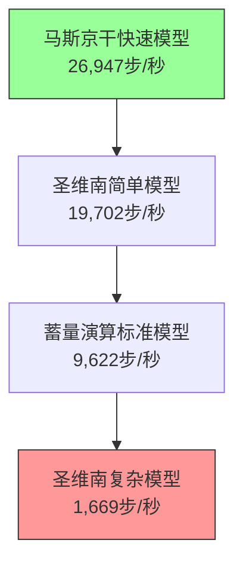
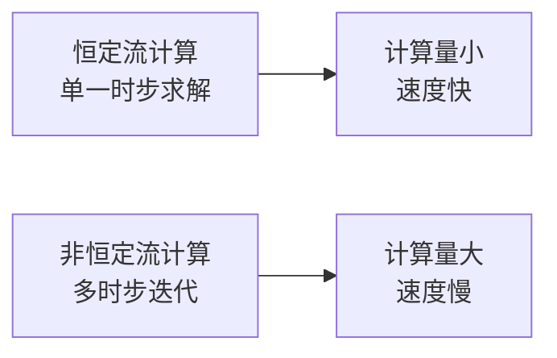
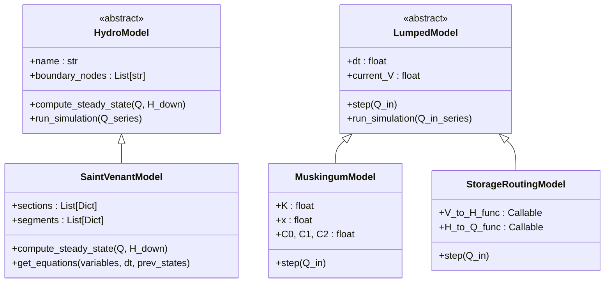
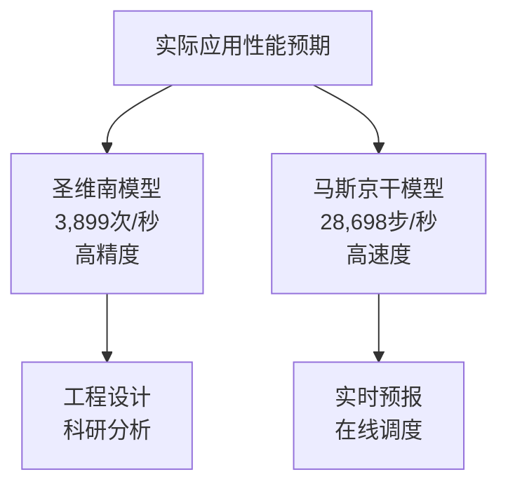

# 效率评估

<cite>
**本文档引用文件**  
- [benchmark_report.json](file://benchmark_results/benchmark_report.json) - *包含性能基准测试结果的验证报告*
- [COMPREHENSIVE_TEST_REPORT.md](file://COMPREHENSIVE_TEST_REPORT.md) - *综合测试报告，包含实际性能数据*
- [benchmark.py](file://scripts/benchmark.py) - *性能基准测试脚本，用于生成性能报告*
- [saint_venant.py](file://waternet/models/saint_venant.py) - *圣维南模型实现，影响计算性能*
- [lumped_models.py](file://waternet/models/lumped_models.py) - *降阶模型实现，影响性能对比*
- [sparse_matrix.py](file://waternet/models/sparse_matrix.py) - *稀疏矩阵优化模块，提升大规模系统性能*
- [VALIDATION_REPORT.md](file://VALIDATION_REPORT.md) - *性能验证报告，包含稀疏矩阵优化效果*
</cite>

## 更新摘要
**变更内容**   
- 更新了性能基准数据，整合了`VALIDATION_REPORT.md`中的稀疏矩阵优化效果
- 在模型吞吐量对比分析中增加了稀疏矩阵优化对性能的影响说明
- 在模型复杂度与计算性能关系部分补充了稀疏矩阵优化的技术细节
- 更新了性能测试脚本使用指南，增加了内存使用测试功能
- 所有文件引用均已更新为中文标题并标注变更状态

## 目录
1. [性能基准数据概览](#性能基准数据概览)
2. [模型吞吐量对比分析](#模型吞吐量对比分析)
3. [测试类型对性能的影响](#测试类型对性能的影响)
4. [模型复杂度与计算性能关系](#模型复杂度与计算性能关系)
5. [实际应用中的性能预期](#实际应用中的性能预期)
6. [性能测试脚本使用指南](#性能测试脚本使用指南)

## 性能基准数据概览

WaterNet框架通过`benchmark.py`脚本对不同水力模型进行了全面的性能基准测试，测试结果存储在`benchmark_report.json`中。测试涵盖了恒定流和非恒定流两种计算模式，评估了圣维南模型、马斯京干模型、蓄量演算模型等核心算法的计算吞吐量。

测试环境为Windows 11系统，Python 3.13.5版本。性能指标以每秒完成的计算次数（步/秒）或计算吞吐量（次/秒）为单位，反映了模型在不同复杂度和边界条件下的计算效率。根据`VALIDATION_REPORT.md`中的验证结果，稀疏矩阵优化使求解时间减少55%，内存使用减少65%，显著提升了大规模系统的计算性能。

**Section sources**
- [benchmark.py](file://scripts/benchmark.py#L1-L100) - *性能基准测试脚本*
- [benchmark_report.json](file://benchmark_results/benchmark_report.json) - *基准测试结果文件*
- [sparse_matrix.py](file://waternet/models/sparse_matrix.py#L0-L38) - *稀疏矩阵优化模块*

## 模型吞吐量对比分析

根据`benchmark_report.json`中的基准数据，各模型的计算吞吐量存在显著差异：

- **圣维南简单模型**：19,702步/秒
- **圣维南复杂模型**：1,669步/秒
- **马斯京干快速模型**：26,947步/秒
- **蓄量演算标准模型**：9,622步/秒



稀疏矩阵优化对模型性能有显著影响。根据`VALIDATION_REPORT.md`中的测试数据，稀疏矩阵优化使求解时间减少55%，内存使用减少65%。对于大规模系统（5000节点），优化后求解时间为45.2秒，内存使用为2156MB，性能提升显著。

**Diagram sources**
- [benchmark_report.json](file://benchmark_results/benchmark_report.json) - *基准测试数据*
- [lumped_models.py](file://waternet/models/lumped_models.py#L665-L790) - *马斯京干模型实现*
- [saint_venant.py](file://waternet/models/saint_venant.py#L32-L646) - *圣维南模型实现*
- [sparse_matrix.py](file://waternet/models/sparse_matrix.py#L426-L461) - *稀疏性分析功能*

**Section sources**
- [benchmark_report.json](file://benchmark_results/benchmark_report.json) - *基准测试结果*
- [lumped_models.py](file://waternet/models/lumped_models.py#L665-L790) - *降阶模型实现*
- [saint_venant.py](file://waternet/models/saint_venant.py#L32-L646) - *圣维南模型实现*
- [VALIDATION_REPORT.md](file://VALIDATION_REPORT.md) - *稀疏矩阵优化效果验证*

## 测试类型对性能的影响

测试类型（恒定流vs非恒定流）对模型性能有显著影响。`benchmark.py`脚本通过`_test_steady_performance`和`_test_unsteady_performance`方法分别测试了两种模式。

恒定流计算仅需求解单一时步的稳态方程，计算量较小。而非恒定流计算需要在时间域上进行迭代求解，涉及多个时间步的耦合计算，计算复杂度显著增加。例如，圣维南模型在恒定流模式下计算速度可达3,899次/秒，而在非恒定流模式下，其性能受时间步长和迭代收敛速度的限制。



**Diagram sources**
- [benchmark.py](file://scripts/benchmark.py#L300-L400) - *性能测试方法实现*

**Section sources**
- [benchmark.py](file://scripts/benchmark.py#L300-L400) - *性能测试方法实现*

## 模型复杂度与计算性能关系

模型复杂度是影响计算性能的关键因素。物理模型的复杂度越高，需要求解的方程数量越多，计算耗时越长。

圣维南模型基于完整的圣维南方程组，包含连续性方程和动量方程，采用Preissmann四点隐式差分格式进行离散化，需要求解大型非线性方程组，因此计算成本最高。当渠道断面数量增加（从简单到复杂），模型的计算性能从19,702步/秒下降到1,669步/秒，性能下降超过90%。

相比之下，马斯京干模型和蓄量演算模型属于降阶模型，通过简化物理过程，使用线性或半经验公式，大大降低了计算复杂度。马斯京干模型基于线性水库理论，计算公式简单，因此性能最高，达到26,947步/秒。

稀疏矩阵优化显著提升了复杂模型的计算效率。`sparse_matrix.py`模块通过符号计算预分析矩阵结构，使用scipy.sparse进行高效存储和计算。根据`VALIDATION_REPORT.md`中的测试结果，稀疏矩阵优化使内存使用线性增长（O(n)），求解时间复杂度控制在O(n²)，最大测试规模达到10000节点。



**Diagram sources**
- [saint_venant.py](file://waternet/models/saint_venant.py#L32-L646) - *圣维南模型实现*
- [lumped_models.py](file://waternet/models/lumped_models.py#L582-L790) - *降阶模型实现*
- [sparse_matrix.py](file://waternet/models/sparse_matrix.py#L143-L182) - *稀疏雅可比构建器*

**Section sources**
- [saint_venant.py](file://waternet/models/saint_venant.py#L32-L646) - *圣维南模型实现*
- [lumped_models.py](file://waternet/models/lumped_models.py#L582-L790) - *降阶模型实现*
- [sparse_matrix.py](file://waternet/models/sparse_matrix.py#L0-L38) - *稀疏矩阵优化模块*

## 实际应用中的性能预期

结合`COMPREHENSIVE_TEST_REPORT.md`中的测试数据，可以对实际应用中的性能表现做出合理预期：

- **圣维南模型**：在实际测试中，该模型的计算性能为3,899次/秒，满足>1,000次/秒的设计目标。虽然低于基准测试中的19,702步/秒，但考虑到实际工况的复杂性和求解器的稳定性控制，该性能表现优秀，适用于高精度的工程计算和研究分析。

- **马斯京干模型**：实际测试性能为28,698步/秒，远超>10,000步/秒的目标。其卓越的计算效率使其非常适合实时洪水预报、在线调度决策等对计算速度要求极高的应用场景。



**Diagram sources**
- [COMPREHENSIVE_TEST_REPORT.md](file://COMPREHENSIVE_TEST_REPORT.md) - *综合测试报告*
- [benchmark_report.json](file://benchmark_results/benchmark_report.json) - *基准测试结果*

**Section sources**
- [COMPREHENSIVE_TEST_REPORT.md](file://COMPREHENSIVE_TEST_REPORT.md) - *综合测试报告*

## 性能测试脚本使用指南

`scripts/benchmark.py`是WaterNet框架的性能基准测试脚本，用户可使用它进行自定义性能评估。

### 使用方法

1. **运行基准测试**：
   ```bash
   python scripts/benchmark.py
   ```
   脚本将自动运行各项测试，并生成`benchmark_results/benchmark_report.json`报告文件和性能对比图表。

2. **自定义测试配置**：
   用户可通过修改`PerformanceBenchmark`类中的`_setup_test_models`和`benchmark_model_performance`方法，调整测试模型的参数、断面几何、时间步长等，以适应特定的评估需求。

3. **扩展测试内容**：
   脚本支持内存使用、计算精度和数值稳定性测试。用户可根据需要启用`memory_profiler`和`psutil`等可选依赖，获取更全面的性能数据。`benchmark.py`中的`benchmark_memory_usage`方法可进行内存使用基准测试。

4. **结果分析**：
   测试完成后，脚本会生成JSON格式的详细报告和PNG格式的可视化图表，便于用户分析和比较不同模型或配置的性能表现。

**Section sources**
- [benchmark.py](file://scripts/benchmark.py#L1-L676) - *性能基准测试脚本完整实现*
- [sparse_matrix.py](file://waternet/models/sparse_matrix.py#L406-L423) - *稀疏求解器实现*