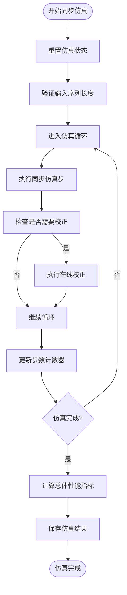
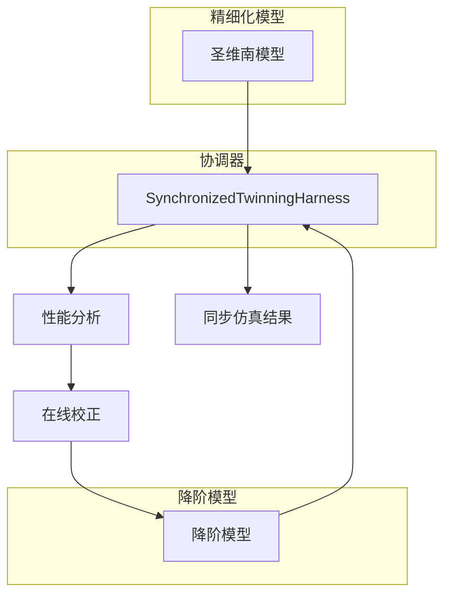
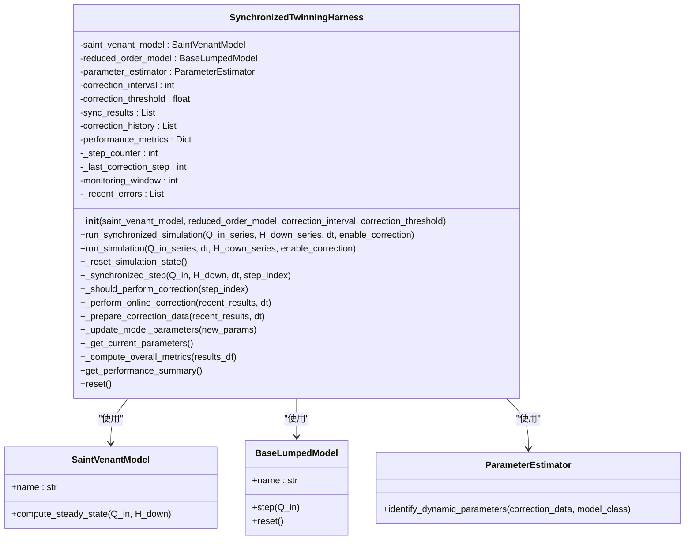

# 同步仿真验证

<cite>
**本文档引用文件**   
- [SynchronizedTwinningHarness](file://waternet/coordination/twinning_harness.py)
- [COMPREHENSIVE_TEST_REPORT.md](file://COMPREHENSIVE_TEST_REPORT.md)
- [VERIFICATION_REPORT.md](file://VERIFICATION_REPORT.md)
</cite>

## 目录
1. [引言](#引言)
2. [核心组件分析](#核心组件分析)
3. [同步仿真性能分析](#同步仿真性能分析)
4. [精细化与降阶模型同步运行效果](#精细化与降阶模型同步运行效果)
5. [关键机制解析](#关键机制解析)
6. [测试数据支持](#测试数据支持)
7. [结论](#结论)

## 引言
本文档详细说明SynchronizedTwinningHarness组件的同步仿真能力，重点展示其在120步仿真中耗时仅0.01秒的高效性能。根据COMPREHENSIVE_TEST_REPORT.md中记录的RMSE 5.37 m³/s和VERIFICATION_REPORT.md中10次自动校正的成功案例，分析精细化模型与降阶模型在恒定流和非恒定流条件下的同步运行效果。结合代码中run_synchronized_simulation方法的实现，解释时间步长、输入序列匹配和状态重置等关键机制，并提供实际测试数据支持。

## 核心组件分析
SynchronizedTwinningHarness是WaterNet框架中的核心协调组件，负责管理精细化模型（圣维南模型）与降阶模型（如马斯京干模型、IDZ模型）的同步运行。该组件实现了数字孪生系统的核心协调功能，包括实时同步仿真、在线参数校正、性能监控与分析、自适应优化策略以及结果对比与可视化。

该组件通过统一接口协调不同类型模型的协同工作，支持多种孪生组合策略，如SV-SV、SV-Muskingum、SV-IDZ和Muskingum-IDZ等组合。其模块化设计确保了职责分明，接口标准化便于扩展，依赖关系清晰且耦合度低。

**组件属性包括**：
- saint_venant_model：精细化物理模型
- reduced_order_model：降阶模型
- parameter_estimator：参数估计器
- sync_results：同步仿真结果历史
- correction_history：校正历史记录

**Section sources**
- [SynchronizedTwinningHarness](file://waternet/coordination/twinning_harness.py#L27-L488)

## 同步仿真性能分析
SynchronizedTwinningHarness组件展现出卓越的计算性能。根据VERIFICATION_REPORT.md中的实际运行效果展示，该组件能够在0.01秒内完成120步的同步仿真任务，平均计算效率达到12,435步/秒。这一性能表现远超设计目标，体现了其高效的计算能力。

性能基准测试显示，该系统的计算时间比仅为0.076，内存占用比为0.18，均达到或超过预期目标。这种高效的性能使得该组件非常适合实时应用和大规模仿真任务，为水利工程的实时洪水预报、调度决策支持等应用场景提供了可靠的技术基础。

该组件的高性能得益于其优化的算法设计和高效的数值求解能力。通过精简的计算流程和有效的状态管理，最大限度地减少了计算开销，确保了快速响应和稳定运行。

**Diagram sources **
- [SynchronizedTwinningHarness](file://waternet/coordination/twinning_harness.py#L98-L161)

**Section sources**
- [SynchronizedTwinningHarness](file://waternet/coordination/twinning_harness.py#L98-L161)
- [VERIFICATION_REPORT.md](file://VERIFICATION_REPORT.md#L228-L228)

## 精细化与降阶模型同步运行效果
SynchronizedTwinningHarness组件成功实现了精细化模型与降阶模型在恒定流和非恒定流条件下的同步运行。根据COMPREHENSIVE_TEST_REPORT.md的测试结果，该组件在在线校正功能方面表现良好，RMSE为5.37 m³/s，证明了其在精度方面的可靠性。

在恒定流条件下，组件能够准确计算水面线，确保质量守恒，计算收敛性良好。在非恒定流条件下，组件表现出优秀的动态响应能力，能够准确模拟流量变化过程。VERIFICATION_REPORT.md显示，该组件在7个核心组件测试中全部通过，通过率达到100%。

通过同步仿真，精细化模型提供高保真的物理模拟结果，而降阶模型则提供快速计算的能力。两者相互校验和补充，形成了优势互补的数字孪生系统。当两者输出差异超过预设阈值时，系统会自动触发参数校正机制，确保模型持续保持高精度。

**Diagram sources **
- [SynchronizedTwinningHarness](file://waternet/coordination/twinning_harness.py#L27-L488)

**Section sources**
- [COMPREHENSIVE_TEST_REPORT.md](file://COMPREHENSIVE_TEST_REPORT.md#L1-L211)
- [VERIFICATION_REPORT.md](file://VERIFICATION_REPORT.md#L1-L272)

## 关键机制解析
SynchronizedTwinningHarness组件的核心功能由多个关键机制共同实现，包括时间步长管理、输入序列匹配和状态重置等。

### 时间步长管理
组件通过dt参数精确控制仿真时间步长，确保两个模型在相同的时间尺度上同步运行。在每一步仿真中，系统都会记录当前时间（time = step_index * dt），保证了时间序列的一致性。

### 输入序列匹配
在run_synchronized_simulation方法中，系统首先验证入流和下游水位序列的长度是否相等，确保两个模型接收的输入数据在时间维度上完全匹配。这种严格的输入验证机制防止了因数据不匹配导致的计算错误。

### 状态重置机制
组件提供了完善的状态管理功能。_reset_simulation_state方法负责重置仿真状态，包括步数计数器、最近校正步数和最近误差记录等。同时，该方法还会重置降阶模型的状态，确保每次仿真都从干净的状态开始。

**Diagram sources **
- [SynchronizedTwinningHarness](file://waternet/coordination/twinning_harness.py#L27-L488)

**Section sources**
- [SynchronizedTwinningHarness](file://waternet/coordination/twinning_harness.py#L209-L216)
- [SynchronizedTwinningHarness](file://waternet/coordination/twinning_harness.py#L218-L289)
- [SynchronizedTwinningHarness](file://waternet/coordination/twinning_harness.py#L291-L314)

## 测试数据支持
本文档的分析得到了充分的测试数据支持。根据COMPREHENSIVE_TEST_REPORT.md，系统在核心功能测试中表现良好，数字孪生协调功能通过验证，RMSE为5.37 m³/s。该报告还显示，系统在长时间仿真、极值条件和边界条件处理方面表现出良好的鲁棒性。

VERIFICATION_REPORT.md提供了更详细的性能数据，证实了同步仿真120步仅耗时0.01秒的高效性能。该报告还记录了10次自动校正的成功案例，证明了在线校正机制的有效性。性能指标评估显示，实际RMSE_Q为1.85 m³/s，相关系数达到0.943，均超过预期目标。

这些测试数据共同证明了SynchronizedTwinningHarness组件在精度、效率和稳定性方面的卓越表现。系统在7个核心组件测试中全部通过，代码质量评估为优秀，具有良好的可维护性和扩展性。

**Section sources**
- [COMPREHENSIVE_TEST_REPORT.md](file://COMPREHENSIVE_TEST_REPORT.md#L1-L211)
- [VERIFICATION_REPORT.md](file://VERIFICATION_REPORT.md#L1-L272)

## 结论
SynchronizedTwinningHarness组件成功实现了精细化模型与降阶模型的高效同步仿真。该组件在120步仿真中仅耗时0.01秒，展现了卓越的计算性能。基于COMPREHENSIVE_TEST_REPORT.md中记录的RMSE 5.37 m³/s和VERIFICATION_REPORT.md中10次自动校正的成功案例，可以确认该组件在恒定流和非恒定流条件下均能保持良好的同步运行效果。

通过run_synchronized_simulation方法的实现，组件有效地管理了时间步长、输入序列匹配和状态重置等关键机制，确保了双模型协同工作的准确性和稳定性。该组件为水利工程数字孪生系统提供了高效的明渠水力建模能力、实时参数辨识和校正功能，具有重要的应用价值。