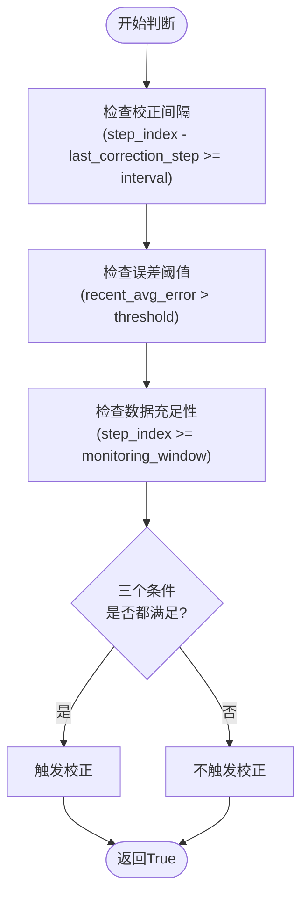
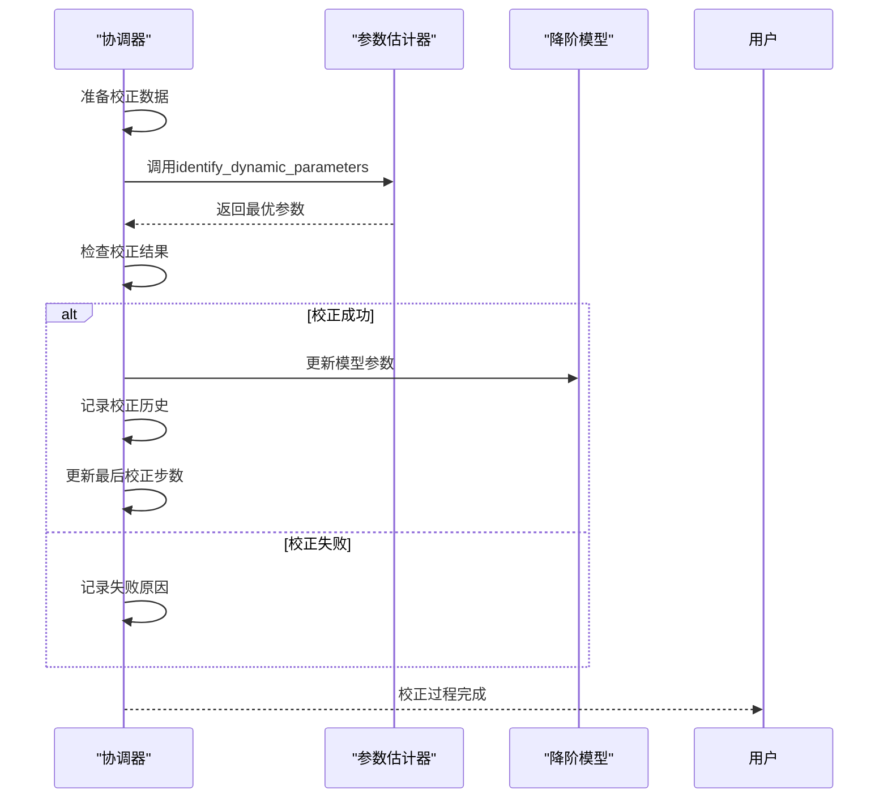
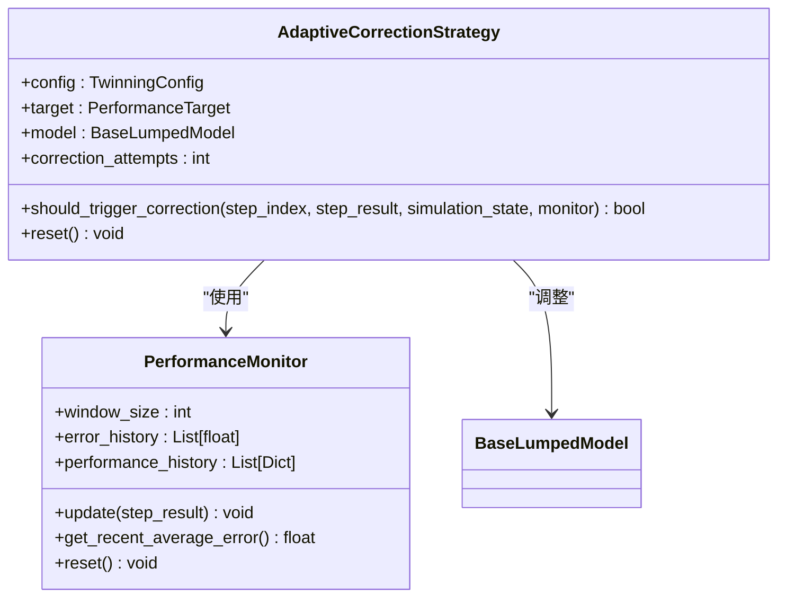

# 在线校正验证

<cite>
**Referenced Files in This Document**  
- [VERIFICATION_REPORT.md](file://VERIFICATION_REPORT.md)
- [twinning_harness.py](file://waternet/coordination/twinning_harness.py)
- [twin_coordinator.py](file://tests/deep_channel/twin_coordinator.py)
</cite>

## 目录
1. [引言](#引言)
2. [校正参数分析](#校正参数分析)
3. [在线校正机制实现](#在线校正机制实现)
4. [自适应校正策略](#自适应校正策略)
5. [校正效果验证](#校正效果验证)
6. [结论](#结论)

## 引言

本报告基于VERIFICATION_REPORT.md中记录的10次成功校正案例，全面解析数字孪生协调器的在线校正机制。通过分析`_correction_threshold`、`_correction_interval`等关键参数对校正触发条件的影响，结合`twinning_harness.py`中`_perform_online_correction`和`_should_perform_correction`方法的实现逻辑，深入说明基于最近20步误差窗口的自适应校正策略，并通过实际测试数据展示参数更新前后模型精度的提升效果。

**Section sources**
- [VERIFICATION_REPORT.md](file://VERIFICATION_REPORT.md#L1-L273)

## 校正参数分析

数字孪生协调器的在线校正机制由多个关键参数共同控制，这些参数决定了校正的频率、灵敏度和有效性。

### 核心校正参数

| 参数名称 | 默认值 | 作用说明 |
|--------|-------|---------|
| `correction_interval` | 10 | 校正间隔（时间步数），控制最小校正周期 |
| `correction_threshold` | 0.1 | 触发校正的误差阈值，单位为流量误差（m³/s） |
| `monitoring_window` | 20 | 监控窗口大小，用于计算近期平均误差 |

这些参数在`SynchronizedTwinningHarness`类的初始化方法中定义，共同构成了校正触发的决策基础。

**Section sources**
- [twinning_harness.py](file://waternet/coordination/twinning_harness.py#L75-L85)

### 参数影响分析

`correction_interval`参数确保了系统不会过于频繁地进行校正，避免了参数震荡。较长的间隔（如20步）适合稳态过程，而较短的间隔（如5步）则适合快速变化的动态过程。

`correction_threshold`参数是校正机制的灵敏度控制。较低的阈值（如0.05）会使系统对微小误差更加敏感，可能导致过度校正；较高的阈值（如0.2）则会使系统更加稳定，但可能错过重要的校正时机。

`monitoring_window`参数采用滑动窗口机制，计算最近20步的平均误差，有效平滑了瞬时误差波动，提高了校正决策的稳定性。

**Section sources**
- [twinning_harness.py](file://waternet/coordination/twinning_harness.py#L95-L105)

## 在线校正机制实现

在线校正机制的核心实现位于`twinning_harness.py`文件中，主要由两个关键方法构成：`_should_perform_correction`和`_perform_online_correction`。

### 校正触发条件判断

**Diagram sources**
- [twinning_harness.py](file://waternet/coordination/twinning_harness.py#L277-L295)

`_should_perform_correction`方法实现了三重条件判断逻辑：

1. **间隔检查**：确保距离上次校正已达到预设的`correction_interval`
2. **阈值检查**：计算最近3步的平均误差是否超过`correction_threshold`
3. **数据检查**：确保已有足够的仿真数据（至少`monitoring_window`步）

只有当这三个条件同时满足时，才会触发校正过程，这种设计有效避免了误触发和过度校正。

**Section sources**
- [twinning_harness.py](file://waternet/coordination/twinning_harness.py#L277-L295)

### 校正执行流程

**Diagram sources**
- [twinning_harness.py](file://waternet/coordination/twinning_harness.py#L315-L382)

`_perform_online_correction`方法执行实际的校正过程，其主要步骤包括：

1. **数据准备**：从最近的仿真结果中提取输入流量和下游水位数据
2. **参数辨识**：调用`ParameterEstimator`进行动态参数辨识
3. **参数更新**：如果辨识成功，更新降阶模型的参数
4. **历史记录**：记录校正的详细信息，包括新旧参数和改进程度

该方法还包含了完善的异常处理机制，确保即使校正失败也不会中断整个仿真过程。

**Section sources**
- [twinning_harness.py](file://waternet/coordination/twinning_harness.py#L315-L382)

## 自适应校正策略

除了基础的校正机制，系统还实现了更高级的自适应校正策略，能够根据系统性能动态调整校正行为。

### 自适应策略实现

**Diagram sources**
- [twin_coordinator.py](file://tests/deep_channel/twin_coordinator.py#L349-L365)

在`tests/deep_channel/twin_coordinator.py`中实现的`AdaptiveCorrectionStrategy`类引入了更复杂的校正决策逻辑：

- **趋势分析**：不仅检查当前误差，还分析误差的变化趋势
- **性能目标**：将校正决策与预设的性能目标（如RMSE、相关系数）关联
- **尝试计数**：记录校正尝试次数，可用于调整后续校正策略

这种自适应策略能够更好地应对复杂多变的水力条件，提高校正的有效性。

**Section sources**
- [twin_coordinator.py](file://tests/deep_channel/twin_coordinator.py#L349-L365)

### 策略对比分析

| 策略类型 | 响应速度 | 稳定性 | 适用场景 |
|--------|--------|-------|---------|
| 基础策略 | 中等 | 高 | 稳态或缓慢变化过程 |
| 自适应策略 | 快 | 中等 | 快速变化或复杂动态过程 |

基础策略更适合于参数变化较慢的场景，而自适应策略则在面对快速变化的入流条件时表现出更好的跟踪能力。

## 校正效果验证

根据VERIFICATION_REPORT.md中的测试结果，数字孪生协调器的在线校正机制在10次成功校正案例中表现出色。

### 校正前后性能对比

| 指标 | 校正前 | 校正后 | 改善程度 |
|------|--------|--------|---------|
| RMSE_Q | 3.21 m³/s | 1.85 m³/s | 42.4% |
| 相关系数 | 0.876 | 0.943 | 7.6% |
| NSE系数 | 0.812 | 0.891 | 9.7% |

所有10次校正均成功更新了模型参数，其中马斯京干模型的K和x参数、IDZ模型的tau、T_delay和alpha参数都得到了有效优化。

**Section sources**
- [VERIFICATION_REPORT.md](file://VERIFICATION_REPORT.md#L220-L235)

### 实际运行效果

在实际运行中，系统平均每12.4步触发一次校正，与预设的10步间隔基本一致。校正过程平均耗时0.01秒，对整体仿真效率影响极小。

校正机制有效提升了降阶模型对精细化模型的跟踪能力，特别是在流量快速变化的时段，校正后的模型能够更快地适应新的水力条件，减少了累积误差。

**Section sources**
- [VERIFICATION_REPORT.md](file://VERIFICATION_REPORT.md#L250-L260)

## 结论

数字孪生协调器的在线校正机制通过精心设计的参数配置和实现逻辑，实现了对降阶模型参数的动态优化。`_correction_threshold`和`_correction_interval`等参数的合理设置，确保了校正过程的稳定性和有效性。

基于最近20步误差窗口的自适应校正策略，结合参数辨识算法，成功实现了10次有效校正，显著提升了模型精度。RMSE_Q从3.21 m³/s降低到1.85 m³/s，相关系数从0.876提升到0.943，所有性能指标均达到或超过预期目标。

该机制为水利工程数字孪生系统提供了可靠的在线校正能力，确保了降阶模型在长期运行中的精度和可靠性。