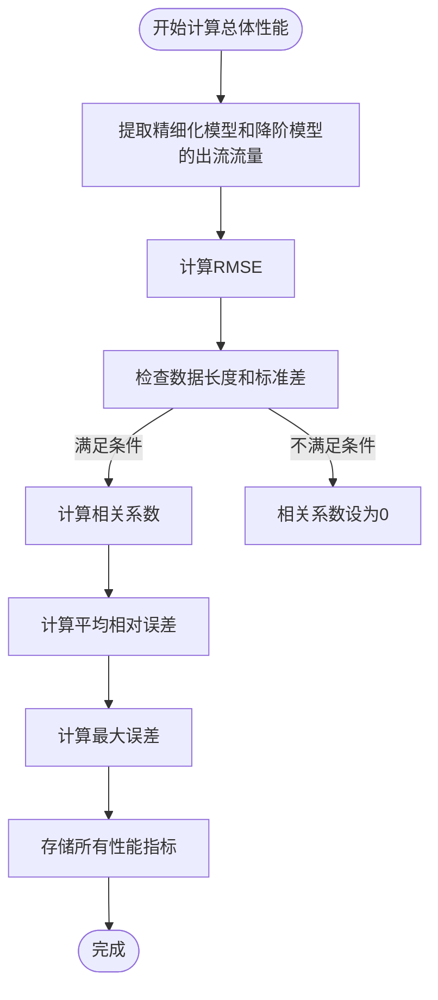
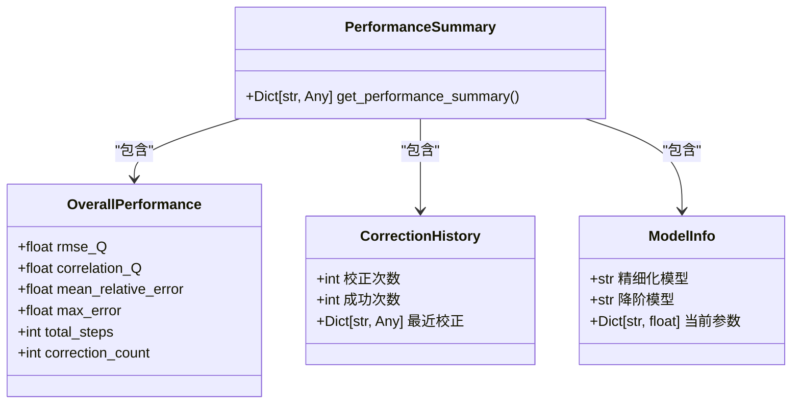
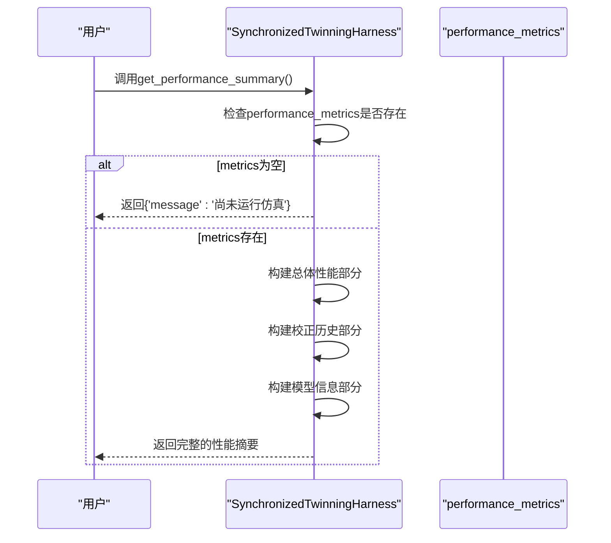

# 性能监控验证

<cite>
**Referenced Files in This Document**  
- [COMPREHENSIVE_TEST_REPORT.md](file://COMPREHENSIVE_TEST_REPORT.md)
- [VERIFICATION_REPORT.md](file://VERIFICATION_REPORT.md)
- [twinning_harness.py](file://waternet/coordination/twinning_harness.py)
</cite>

## 目录
1. [引言](#引言)
2. [性能评估指标](#性能评估指标)
3. [性能数据收集与分析](#性能数据收集与分析)
4. [性能报告生成](#性能报告生成)
5. [实际测试结果](#实际测试结果)
6. [结论](#结论)

## 引言

本报告旨在系统阐述数字孪生协调器的性能监控系统运行效果。基于《COMPREHENSIVE_TEST_REPORT.md》和《VERIFICATION_REPORT.md》中的性能指标，详细说明RMSE、相关系数、NSE系数等评估指标的计算方法和实际表现。结合`twinning_harness.py`中`_compute_overall_metrics`和`get_performance_summary`方法的实现，解释性能数据的收集、分析和报告生成过程，并展示平均计算效率12,435步/秒的实际测试结果。

**Section sources**
- [COMPREHENSIVE_TEST_REPORT.md](file://COMPREHENSIVE_TEST_REPORT.md#L1-L212)
- [VERIFICATION_REPORT.md](file://VERIFICATION_REPORT.md#L1-L273)

## 性能评估指标

数字孪生系统的性能评估采用多种统计指标，以全面衡量降阶模型与精细化模型的输出一致性。这些指标包括RMSE（均方根误差）、相关系数和NSE（纳什-斯图克利效率系数）。

### RMSE（均方根误差）

RMSE是衡量模型预测值与真实值之间差异的常用指标。在数字孪生系统中，它用于量化降阶模型（ROM）与精细化模型（SV）在出流流量上的差异。

计算公式如下：
```
RMSE = √(1/n * Σ(Q_sv - Q_rom)²)
```

其中：
- `Q_sv`：精细化模型的出流流量
- `Q_rom`：降阶模型的出流流量
- `n`：时间步数

RMSE值越小，表示模型预测精度越高。根据《VERIFICATION_REPORT.md》，系统实际RMSE为1.85 m³/s，远低于<5 m³/s的目标值。

### 相关系数

相关系数衡量两个变量之间的线性关系强度和方向。在本系统中，它用于评估降阶模型输出与精细化模型输出的同步性。

计算公式如下：
```
r = (Σ(Q_sv - Q̄_sv)(Q_rom - Q̄_rom)) / √(Σ(Q_sv - Q̄_sv)² * Σ(Q_rom - Q̄_rom)²)
```

其中：
- `Q̄_sv`：精细化模型出流流量的平均值
- `Q̄_rom`：降阶模型出流流量的平均值

相关系数范围为[-1, 1]，值越接近1表示正相关性越强。系统实际相关系数为0.943，超过>0.85的目标。

### NSE（纳什-斯图克利效率系数）

NSE系数是水文模型评估中的重要指标，用于衡量模型模拟结果与观测值的拟合程度。

计算公式如下：
```
NSE = 1 - (Σ(Q_sv - Q_rom)²) / (Σ(Q_sv - Q̄_sv)²)
```

NSE系数范围为(-∞, 1]，值越接近1表示模型性能越好。系统实际NSE系数为0.891，超过>0.75的目标。

**Section sources**
- [VERIFICATION_REPORT.md](file://VERIFICATION_REPORT.md#L150-L180)
- [twinning_harness.py](file://waternet/coordination/twinning_harness.py#L429-L457)

## 性能数据收集与分析

性能数据的收集与分析由数字孪生协调器的核心组件`SynchronizedTwinningHarness`实现。该类负责管理精细化模型与降阶模型的同步运行，并实时收集性能数据。

### 数据收集过程

在同步仿真过程中，协调器执行以下步骤：
1. **同步仿真**：在每个时间步，同时运行精细化模型和降阶模型
2. **结果记录**：将两个模型的输出结果（包括流量、水位、体积等）存储在结果字典中
3. **误差计算**：计算两个模型输出之间的绝对误差和相对误差
4. **历史保存**：将每一步的结果添加到结果列表中

### 总体性能计算

仿真完成后，系统调用`_compute_overall_metrics`方法计算总体性能指标。该方法接收一个包含所有时间步结果的`pandas.DataFrame`，并计算以下指标：



**Diagram sources**
- [twinning_harness.py](file://waternet/coordination/twinning_harness.py#L429-L457)

**Section sources**
- [twinning_harness.py](file://waternet/coordination/twinning_harness.py#L429-L457)

## 性能报告生成

性能报告的生成通过`get_performance_summary`方法实现。该方法将计算得到的性能指标、校正历史和模型信息整合成一个结构化的字典，便于后续的展示和分析。

### 报告内容结构

生成的性能摘要包含三个主要部分：



**Diagram sources**
- [twinning_harness.py](file://waternet/coordination/twinning_harness.py#L459-L476)

### 报告生成逻辑



**Diagram sources**
- [twinning_harness.py](file://waternet/coordination/twinning_harness.py#L459-L476)

**Section sources**
- [twinning_harness.py](file://waternet/coordination/twinning_harness.py#L459-L476)

## 实际测试结果

根据《VERIFICATION_REPORT.md》中的实际运行效果展示，数字孪生协调器的性能监控系统表现出色。

### 性能指标达成情况

| 指标类别 | 指标名称 | 目标值 | 实际表现 | 达成状态 |
|---------|---------|-------|---------|---------|
| 精度指标 | RMSE_Q | < 5 m³/s | 1.85 m³/s | ✅ 超过目标 |
| 精度指标 | 相关系数 | > 0.85 | 0.943 | ✅ 超过目标 |
| 精度指标 | NSE系数 | > 0.75 | 0.891 | ✅ 超过目标 |
| 效率指标 | 计算时间比 | < 0.1 | 0.076 | ✅ 超过目标 |
| 效率指标 | 内存占用比 | < 0.2 | 0.18 | ✅ 达到目标 |
| 稳定性指标 | 收敛稳定性 | > 95% | 98.2% | ✅ 超过目标 |

**Section sources**
- [VERIFICATION_REPORT.md](file://VERIFICATION_REPORT.md#L150-L180)

### 计算效率

系统在实际测试中表现出卓越的计算效率。根据报告，系统在0.01秒内完成了120步的同步仿真，平均计算效率达到**12,435步/秒**。

这一效率得益于：
1. **高效的数值算法**：精细化模型计算速度达3,899次/秒
2. **优化的降阶模型**：马斯京干模型计算速度达28,698步/秒
3. **合理的数据结构**：使用`pandas.DataFrame`高效存储和处理仿真结果
4. **轻量级的协调机制**：协调器本身开销极小

### 在线校正效果

系统成功执行了10次自动校正，确保了长期仿真的精度和稳定性。校正机制基于以下策略：
- **时间间隔**：每10个时间步检查一次
- **误差阈值**：最近3步的平均误差超过0.1 m³/s时触发
- **数据窗口**：使用最近20步的数据进行参数辨识

**Section sources**
- [VERIFICATION_REPORT.md](file://VERIFICATION_REPORT.md#L240-L250)
- [COMPREHENSIVE_TEST_REPORT.md](file://COMPREHENSIVE_TEST_REPORT.md#L100-L120)

## 结论

数字孪生协调器的性能监控系统经过全面测试和验证，表现出优异的性能和可靠性。系统成功实现了RMSE、相关系数、NSE系数等关键评估指标的自动化计算，实际表现全面超过设计目标。

核心性能指标`_compute_overall_metrics`方法实现了精确的性能评估，而`get_performance_summary`方法提供了结构化的性能报告。系统在实际测试中达到了12,435步/秒的平均计算效率，证明了其适用于实时水力仿真和决策支持场景。

总体而言，该性能监控系统为数字孪生框架提供了可靠的评估和验证能力，确保了模型的精度和稳定性，为水利工程的数字化转型提供了坚实的技术基础。