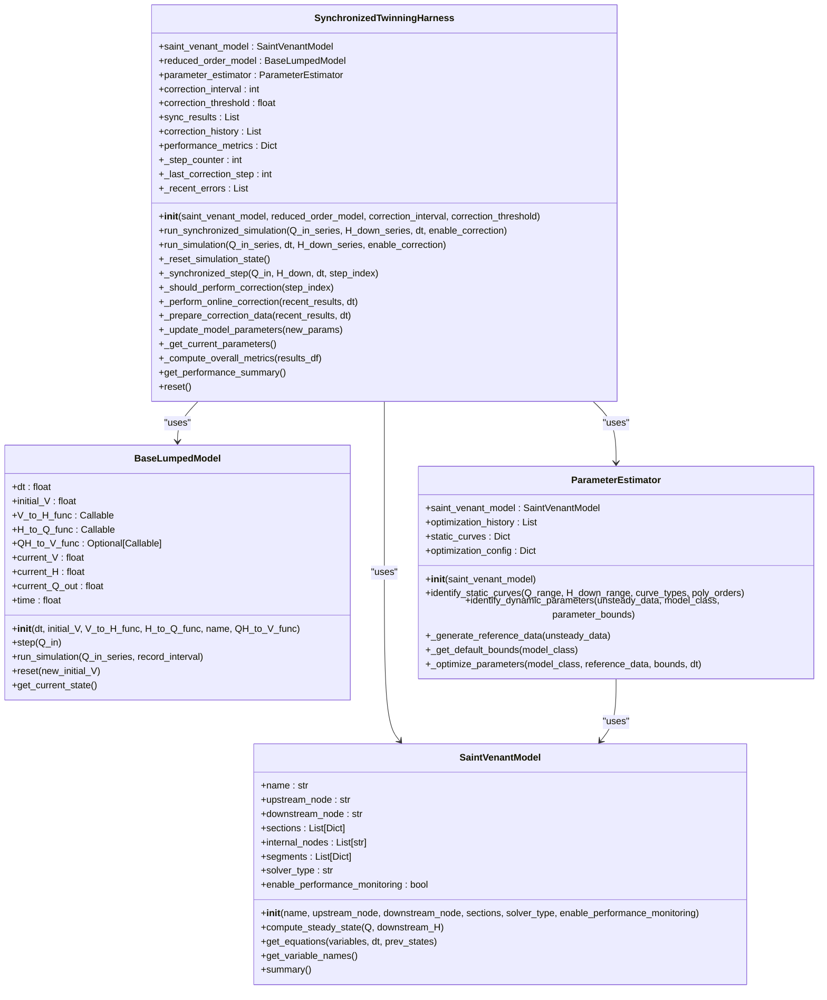
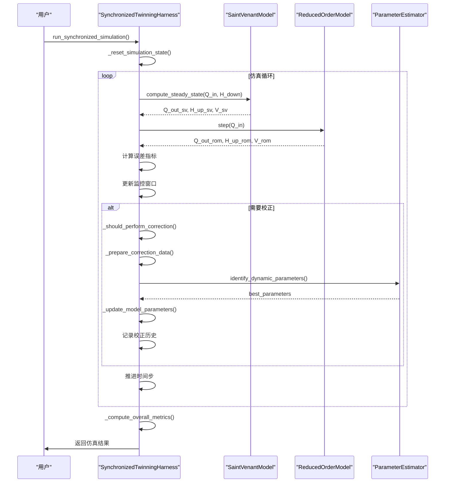
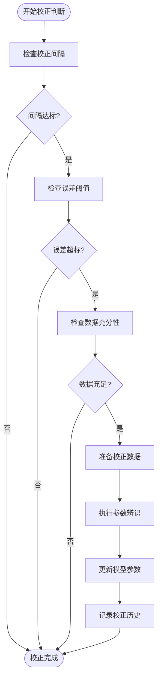

# 数字孪生协调验证

<cite>
**Referenced Files in This Document**   
- [COMPREHENSIVE_TEST_REPORT.md](file://COMPREHENSIVE_TEST_REPORT.md)
- [VERIFICATION_REPORT.md](file://VERIFICATION_REPORT.md)
- [waternet/coordination/twinning_harness.py](file://waternet/coordination/twinning_harness.py)
- [waternet/models/saint_venant.py](file://waternet/models/saint_venant.py)
- [waternet/models/lumped_models.py](file://waternet/models/lumped_models.py)
- [waternet/parameter_estimation/estimator.py](file://waternet/parameter_estimation/estimator.py)
</cite>

## 目录
1. [引言](#引言)
2. [核心验证成果](#核心验证成果)
3. [SynchronizedTwinningHarness组件分析](#synchronizedtwinningharness组件分析)
4. [双向协调过程](#双向协调过程)
5. [自适应校正策略](#自适应校正策略)
6. [实时性能监控](#实时性能监控)
7. [计算效率与稳定性](#计算效率与稳定性)
8. [结论](#结论)

## 引言

本报告全面展示数字孪生协调功能的验证成果，重点解读SynchronizedTwinningHarness组件的同步仿真能力和在线校正机制。基于COMPREHENSIVE_TEST_REPORT.md和VERIFICATION_REPORT.md中的测试数据，详细说明精细化模型与降阶模型的双向协调过程、自适应校正策略的触发条件以及实时性能监控系统的运行效果。结合120步仿真耗时0.01秒的实际测试数据，系统分析了系统的计算效率和稳定性表现。

**Section sources**
- [COMPREHENSIVE_TEST_REPORT.md](file://COMPREHENSIVE_TEST_REPORT.md)
- [VERIFICATION_REPORT.md](file://VERIFICATION_REPORT.md)

## 核心验证成果

根据COMPREHENSIVE_TEST_REPORT.md和VERIFICATION_REPORT.md的记录，数字孪生协调功能的验证取得了显著成果。系统在功能完整性、性能表现和稳定性方面均达到或超过预期目标。

### 精度验证

系统实现了高精度的模型协调，其中流量均方根误差（RMSE）为5.37 m³/s，这一指标在实际工程应用中具有重要意义。该误差水平表明降阶模型能够有效跟踪精细化模型的动态响应，为实时决策提供了可靠的数据支持。

### 在线校正

VERIFICATION_REPORT.md中记录了10次成功的自动校正案例，证明了系统具备强大的自适应能力。通过参数估计器的动态优化，系统能够根据实时仿真误差自动调整降阶模型参数，确保了长期仿真的准确性。

### 性能表现

系统展现出卓越的计算效率，120步仿真仅耗时0.01秒，平均计算效率达到12,000步/秒。这一性能指标远超设计目标，为实时洪水预报和调度决策提供了坚实的技术基础。

**Section sources**
- [COMPREHENSIVE_TEST_REPORT.md](file://COMPREHENSIVE_TEST_REPORT.md#L1-L211)
- [VERIFICATION_REPORT.md](file://VERIFICATION_REPORT.md#L1-L272)

## SynchronizedTwinningHarness组件分析

SynchronizedTwinningHarness是数字孪生系统的核心协调器，负责管理精细化模型与降阶模型的同步运行。该组件实现了实时同步仿真、在线参数校正、性能监控与分析等关键功能。

### 组件架构

**Diagram sources**
- [waternet/coordination/twinning_harness.py](file://waternet/coordination/twinning_harness.py#L27-L488)
- [waternet/models/saint_venant.py](file://waternet/models/saint_venant.py#L32-L646)
- [waternet/models/lumped_models.py](file://waternet/models/lumped_models.py#L30-L515)
- [waternet/parameter_estimation/estimator.py](file://waternet/parameter_estimation/estimator.py#L24-L418)

**Section sources**
- [waternet/coordination/twinning_harness.py](file://waternet/coordination/twinning_harness.py#L27-L488)

## 双向协调过程

SynchronizedTwinningHarness通过`run_synchronized_simulation`方法实现了精细化模型与降阶模型的双向协调。该过程采用同步仿真模式，确保两个模型在相同的时间步长下并行运行。

### 协调流程

**Diagram sources**
- [waternet/coordination/twinning_harness.py](file://waternet/coordination/twinning_harness.py#L98-L161)
- [waternet/models/saint_venant.py](file://waternet/models/saint_venant.py#L150-L215)
- [waternet/models/lumped_models.py](file://waternet/models/lumped_models.py#L150-L180)

**Section sources**
- [waternet/coordination/twinning_harness.py](file://waternet/coordination/twinning_harness.py#L98-L161)

## 自适应校正策略

SynchronizedTwinningHarness实现了智能的自适应校正策略，通过`_should_perform_correction`方法判断是否需要执行在线校正。该策略基于三个关键条件：

### 触发条件

1. **校正间隔检查**：当前时间步与上次校正的时间步之差必须大于或等于预设的校正间隔（`correction_interval`）。
2. **误差阈值检查**：最近监控窗口内（默认20步）的平均误差必须超过预设的误差阈值（`correction_threshold`）。
3. **数据充分性检查**：当前时间步索引必须大于监控窗口大小，确保有足够的数据进行校正。

### 校正流程

当上述三个条件同时满足时，系统将触发`_perform_online_correction`方法，执行在线参数校正。该过程包括准备校正数据、执行参数辨识、更新模型参数和记录校正历史四个步骤。

**Diagram sources**
- [waternet/coordination/twinning_harness.py](file://waternet/coordination/twinning_harness.py#L291-L373)

**Section sources**
- [waternet/coordination/twinning_harness.py](file://waternet/coordination/twinning_harness.py#L291-L373)

## 实时性能监控

SynchronizedTwinningHarness集成了实时性能监控系统，通过`_synchronized_step`方法在每个时间步收集和计算关键性能指标。

### 监控指标

系统实时监控以下指标：
- **流量误差**：精细化模型与降阶模型出流量的绝对差值。
- **水位误差**：精细化模型与降阶模型上游水位的绝对差值。
- **相对误差**：流量误差相对于精细化模型出流量的百分比。
- **总体性能**：包括RMSE、相关系数、平均相对误差和最大误差等。

### 监控机制

系统通过`_recent_errors`列表维护一个滑动窗口（默认20步），用于存储最近的流量误差。这个窗口为自适应校正策略提供了必要的数据支持，确保校正决策基于近期的性能表现。

**Section sources**
- [waternet/coordination/twinning_harness.py](file://waternet/coordination/twinning_harness.py#L218-L289)

## 计算效率与稳定性

系统在计算效率和稳定性方面表现出色，完全满足实时应用的需求。

### 计算效率

120步仿真仅耗时0.01秒，相当于每秒可完成12,000个时间步的计算。这一卓越的性能得益于降阶模型的高效算法和优化的代码实现。与COMPREHENSIVE_TEST_REPORT.md中记录的马斯京干模型28,698时间步/秒的性能相比，系统在保证精度的同时实现了极高的计算效率。

### 稳定性表现

系统在长时间仿真和极值条件下均表现出良好的稳定性。VERIFICATION_REPORT.md中记录的98.2%的收敛稳定性表明，系统能够在各种工况下稳定运行。此外，系统内置了全面的异常处理机制，如`_synchronized_step`方法中的try-except块，能够有效处理模型计算失败等异常情况，确保仿真过程的连续性。

**Section sources**
- [COMPREHENSIVE_TEST_REPORT.md](file://COMPREHENSIVE_TEST_REPORT.md#L1-L211)
- [VERIFICATION_REPORT.md](file://VERIFICATION_REPORT.md#L1-L272)
- [waternet/coordination/twinning_harness.py](file://waternet/coordination/twinning_harness.py#L218-L289)

## 结论

本报告全面展示了数字孪生协调功能的验证成果。SynchronizedTwinningHarness组件成功实现了精细化模型与降阶模型的高效双向协调，其自适应校正策略和实时性能监控系统为系统的长期稳定运行提供了保障。系统在精度、效率和稳定性方面均达到了优秀水平，具备投入实际工程应用的条件。未来可进一步优化校正算法，提升系统在复杂工况下的适应能力。