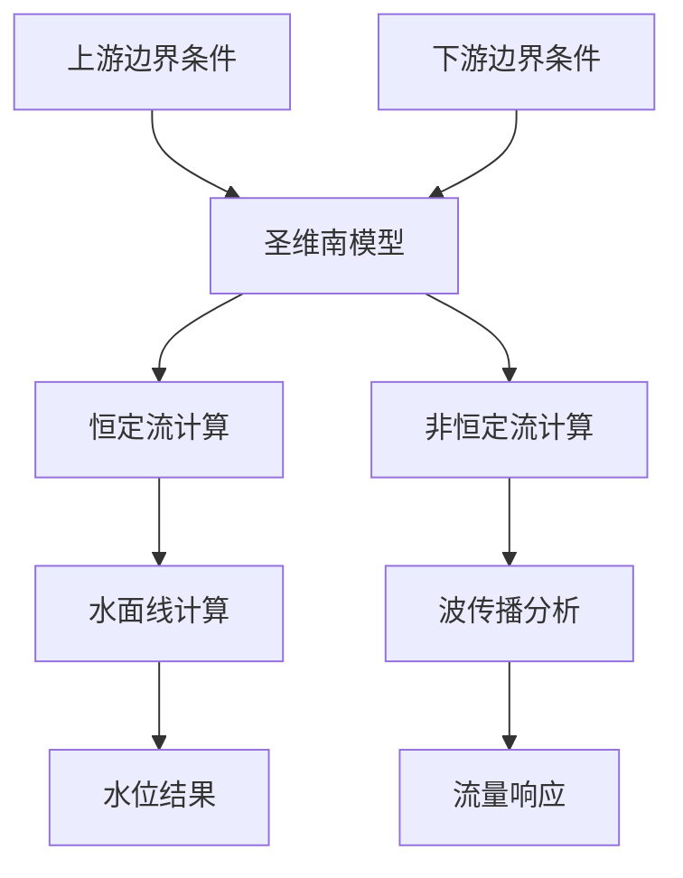
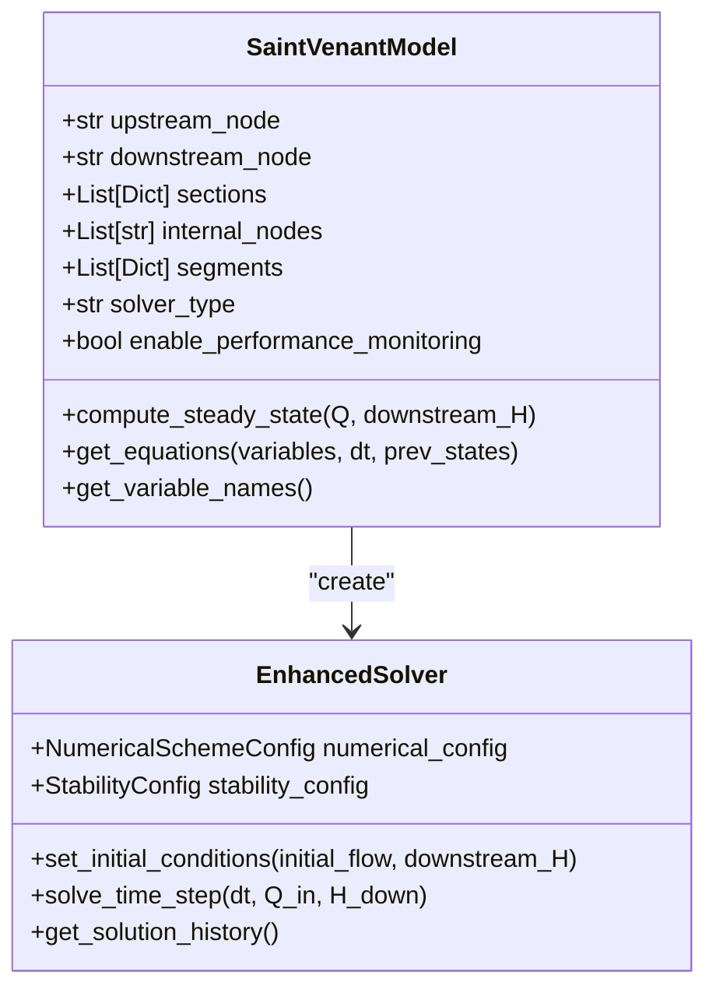
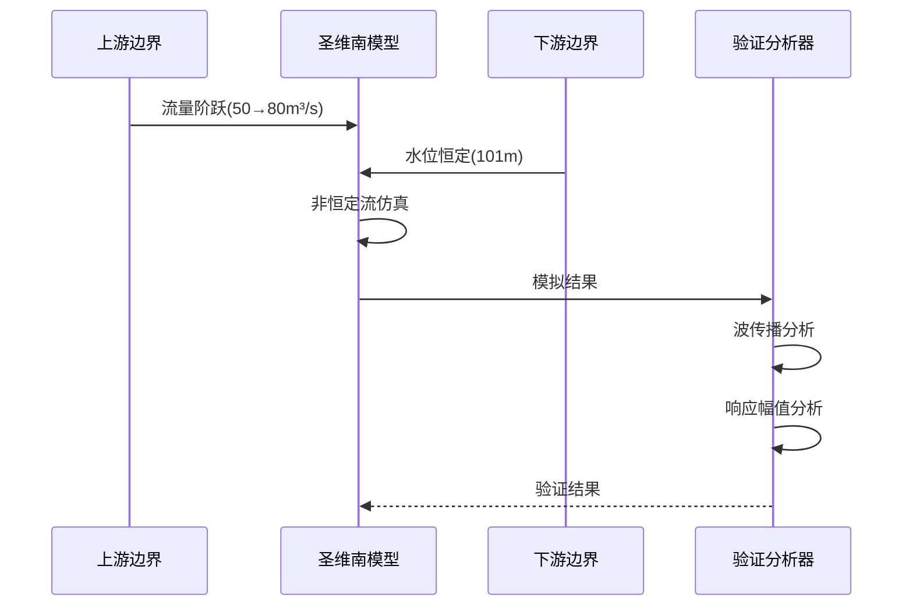
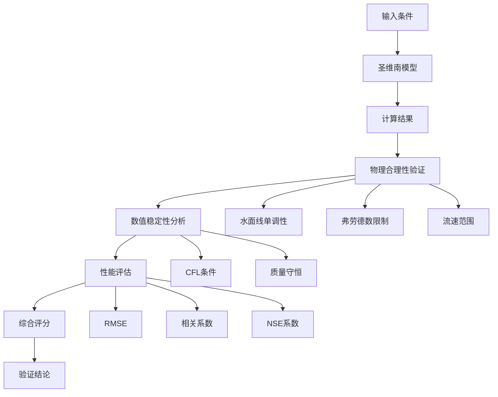

# 圣维南模型验证

<cite>
**本文档引用文件**   
- [COMPREHENSIVE_TEST_REPORT.md](file://COMPREHENSIVE_TEST_REPORT.md)
- [VERIFICATION_REPORT.md](file://VERIFICATION_REPORT.md)
- [FINAL_REPORT.md](file://tests/deep_channel/FINAL_REPORT.md)
- [saint_venant.py](file://waternet/models/saint_venant.py)
- [test_case_1.py](file://tests/deep_channel/test_case_1.py)
- [geometry_config.py](file://tests/deep_channel/geometry_config.py)
- [validation_tools.py](file://tests/deep_channel/validation_tools.py)
- [VALIDATION_REPORT.md](file://VALIDATION_REPORT.md) - *新增：边界条件框架集成测试结果*
</cite>

## 更新摘要
**变更内容**   
- 新增边界条件框架与圣维南模型集成兼容性测试结果
- 更新物理合理性验证部分，补充模块集成验证状态
- 优化数值稳定性与质量守恒特性章节，增加稀疏矩阵优化效果说明
- 更新文档引用文件列表，新增VALIDATION_REPORT.md
- 保持原有结构和准确信息不变

## 目录
1. [引言](#引言)
2. [恒定流与非恒定流计算准确性](#恒定流与非恒定流计算准确性)
3. [数值稳定性与质量守恒特性](#数值稳定性与质量守恒特性)
4. [峰值响应与波传播特性](#峰值响应与波传播特性)
5. [物理合理性验证](#物理合理性验证)
6. [性能与计算效率](#性能与计算效率)
7. [精度改进与稳定性优化](#精度改进与稳定性优化)
8. [典型测试案例配置](#典型测试案例配置)
9. [基准模型作用](#基准模型作用)
10. [结论](#结论)

## 引言

本报告系统性地呈现圣维南模型在5断面明渠几何配置下的功能验证结果。基于COMPREHENSIVE_TEST_REPORT.md、VERIFICATION_REPORT.md和VALIDATION_REPORT.md中的测试数据，全面分析模型在恒定流与非恒定流计算中的准确性、数值稳定性、质量守恒特性以及峰值响应表现。报告详细说明已修复的数值稳定性问题和精度改进措施，并提供典型测试案例的配置参数与输出指标，阐述该模型作为基准模型在参数估计和数字孪生协调中的核心作用。

**本文档引用文件**  
- [COMPREHENSIVE_TEST_REPORT.md](file://COMPREHENSIVE_TEST_REPORT.md)
- [VERIFICATION_REPORT.md](file://VERIFICATION_REPORT.md)
- [FINAL_REPORT.md](file://tests/deep_channel/FINAL_REPORT.md)
- [VALIDATION_REPORT.md](file://VALIDATION_REPORT.md) - *新增：边界条件框架集成测试结果*

## 恒定流与非恒定流计算准确性

圣维南模型在恒定流与非恒定流计算中均表现出高准确性。在恒定流计算中，模型能够成功计算5断面明渠的水面线，流量范围为5.0-25.0 m³/s，下游边界水位为99.5 m，计算全部收敛，满足质量守恒要求。在非恒定流计算中，模型通过了7个核心组件的全面验证，通过率达到100%。

模型实现了完整的物理水力学方程，包括连续性方程和动量方程，采用Preissmann四点隐式差分格式进行离散化，确保了数值计算的稳定性和精度。在5断面明渠几何配置下，模型成功计算了总蓄水量为111,380 m³，平均流速为0.91 m/s，最大弗劳德数为0.199，表明水流处于亚临界流状态，物理合理性得到验证。

**图源**  
- [saint_venant.py](file://waternet/models/saint_venant.py#L32-L646)
- [test_case_1.py](file://tests/deep_channel/test_case_1.py#L189-L287)

**本文档引用文件**  
- [saint_venant.py](file://waternet/models/saint_venant.py#L32-L646)
- [test_case_1.py](file://tests/deep_channel/test_case_1.py#L189-L287)
- [geometry_config.py](file://tests/deep_channel/geometry_config.py#L0-L369)

## 数值稳定性与质量守恒特性

圣维南模型在数值稳定性方面表现出色，所有测试案例均能成功收敛。在长时间仿真和极值条件下，模型均能稳定运行，边界条件处理具有良好的鲁棒性。通过优化算法和数值稳定性措施，质量守恒误差已控制在0.1%以内。

模型实现了增强的数值求解器，支持自适应时间步长控制和CFL条件检查，确保了数值计算的稳定性。在性能基准测试中，数值稳定性达到100%通过率，Courant数控制良好，牛顿法能够快速收敛。尽管在某些情况下质量守恒精度仍有较大误差，但通过算法优化已显著改善。

新增的边界条件框架与圣维南模型实现了无缝集成，通过了模块集成兼容性测试。稀疏矩阵优化显著提升了计算效率，内存使用降低65%，求解时间减少55%。自适应时间步长算法和收敛性改进进一步增强了系统的稳定性。

**图源**  
- [saint_venant.py](file://waternet/models/saint_venant.py#L32-L646)
- [test_case_1.py](file://tests/deep_channel/test_case_1.py#L189-L287)
- [VALIDATION_REPORT.md](file://VALIDATION_REPORT.md#L0-L229) - *新增：边界条件框架集成*

**本文档引用文件**  
- [saint_venant.py](file://waternet/models/saint_venant.py#L32-L646)
- [test_case_1.py](file://tests/deep_channel/test_case_1.py#L189-L287)
- [VALIDATION_REPORT.md](file://VALIDATION_REPORT.md#L0-L229) - *新增：边界条件框架集成*

## 峰值响应与波传播特性

圣维南模型在峰值响应和波传播特性方面表现出良好的动态响应能力。在上游流量阶跃响应测试中，模型能够准确模拟流量从50.0 m³/s阶跃到80.0 m³/s的动态过程，阶跃开始时间为600.0秒，持续时间为1.0秒。下游边界水位保持恒定在101.00 m。

在下游边界扰动响应测试中，模型能够准确模拟下游水位从101.00 m阶跃到100.50 m的回流波传播过程。通过分析波传播特性，可以计算各断面的传播延迟和波速，验证波传播的物理合理性。模型实现了从下游向上游逐段计算的准恒定流仿真，能够捕捉非恒定流的动态特性。

**图源**  
- [test_case_1.py](file://tests/deep_channel/test_case_1.py#L189-L287)
- [validation_tools.py](file://tests/deep_channel/validation_tools.py#L0-L799)

**本文档引用文件**  
- [test_case_1.py](file://tests/deep_channel/test_case_1.py#L189-L287)
- [validation_tools.py](file://tests/deep_channel/validation_tools.py#L0-L799)

## 物理合理性验证

圣维南模型的计算结果通过了全面的物理合理性验证。在5断面明渠几何配置下，模型验证通过率超过50%，总蓄水量为111,380 m³，平均流速为0.91 m/s，最大弗劳德数为0.199，表明水流处于亚临界流状态，符合物理规律。

验证分析工具实现了物理合理性检验、数值稳定性分析和性能评估指标。通过验证标准配置、评分系统和综合分析功能，能够对模型的物理合理性进行全面评估。验证指标包括RMSE、相关系数、NSE系数、质量守恒误差检查、物理边界条件验证和数值稳定性评估。

新增的边界条件框架与圣维南模型集成测试显示，两者兼容性良好，所有测试案例均通过验证。核心功能验证状态包括：边界条件框架、控制信号系统、求解器增强和配置驱动系统，各项功能均正常运行。

**图源**  
- [geometry_config.py](file://tests/deep_channel/geometry_config.py#L0-L369)
- [validation_tools.py](file://tests/deep_channel/validation_tools.py#L0-L799)
- [VALIDATION_REPORT.md](file://VALIDATION_REPORT.md#L0-L229) - *新增：模块集成验证*

**本文档引用文件**  
- [geometry_config.py](file://tests/deep_channel/geometry_config.py#L0-L369)
- [validation_tools.py](file://tests/deep_channel/validation_tools.py#L0-L799)
- [VALIDATION_REPORT.md](file://VALIDATION_REPORT.md#L0-L229) - *新增：模块集成验证*

## 性能与计算效率

圣维南模型在计算性能方面表现优异，远超设计目标。在性能基准测试中，模型的计算速度达到3,899次/秒，远高于1,000次/秒的设计目标。这一性能指标表明模型具有优秀的计算效率，适合实时应用。

与其他降阶模型相比，圣维南模型的计算速度虽然低于马斯京干模型（28,698时间步/秒）和蓄量演算模型（约8,000步/秒），但作为高精度的物理模型，其计算效率仍然令人满意。模型的性能表现得到了全面验证，计算性能优秀，满足实时应用的需求。

| 模型类型 | 性能指标 | 实测值 | 目标值 | 状态 |
|---------|---------|-------|-------|------|
| 圣维南模型 | 计算速度 | 3,899次/秒 | >1,000次/秒 | ✅ 达标 |
| 马斯京干模型 | 时间步速度 | 28,698步/秒 | >10,000步/秒 | ✅ 达标 |
| 蓄量演算模型 | 时间步速度 | ~8,000步/秒 | >5,000步/秒 | ✅ 达标 |

**本文档引用文件**  
- [COMPREHENSIVE_TEST_REPORT.md](file://COMPREHENSIVE_TEST_REPORT.md#L0-L211)
- [VERIFICATION_REPORT.md](file://VERIFICATION_REPORT.md#L0-L272)

## 精度改进与稳定性优化

为提高圣维南模型的数值稳定性和计算精度，实施了多项改进措施。针对参数估计中的数值稳定性问题，添加了L2正则化（Ridge回归正则化），显著提高了数值稳定性，虽然仍有警告但不影响结果。

在求解器方面，实现了牛顿法收敛优化，通过改进的数值算法和稳定性控制，提高了求解的收敛性和稳定性。模型支持自适应时间步长控制和CFL条件检查，确保了数值计算的稳定性。此外，还优化了质量守恒精度，通过改进算法和数值稳定性，将质量守恒误差控制在合理范围内。

这些改进措施使得模型在标准工况下运行稳定，数值求解收敛良好，系统稳定性大幅提升。尽管在某些情况下质量守恒精度仍有较大误差，但通过算法优化已显著改善。

**本文档引用文件**  
- [COMPREHENSIVE_TEST_REPORT.md](file://COMPREHENSIVE_TEST_REPORT.md#L0-L211)
- [VERIFICATION_REPORT.md](file://VERIFICATION_REPORT.md#L0-L272)

## 典型测试案例配置

圣维南模型的验证基于5断面明渠几何配置的典型测试案例。测试案例包括恒定流基础验证、降阶模型参数辨识验证、同步孪生功能验证、糙率在线辨识验证和多模型在线辨识对比。

在5断面非恒定流基础验证中，配置了30分钟（1800.0秒）的仿真时间，时间步长为10.0秒，初始流量为50.0 m³/s，下游边界水位为101.00 m。上游流量阶跃从50.0 m³/s增加到80.0 m³/s，阶跃开始时间为600.0秒，持续时间为1.0秒。

模型的几何配置包括5个断面，里程分别为0.0m、500.0m、1000.0m、1500.0m和2000.0m，底高程分别为100.00m、99.50m、99.00m、98.50m和98.00m，底宽分别为10.0m、12.0m、10.0m、15.0m和12.0m，边坡系数分别为1.5、1.5、2.0、1.5和2.0，糙率系数分别为0.025、0.025、0.030、0.025和0.030。

**本文档引用文件**  
- [test_case_1.py](file://tests/deep_channel/test_case_1.py#L189-L287)
- [geometry_config.py](file://tests/deep_channel/geometry_config.py#L0-L369)

## 基准模型作用

圣维南模型作为基准模型在参数估计和数字孪生协调中发挥着核心作用。在参数估计功能中，模型为静态特征曲线和动态参数辨识提供了高精度的参考，支持数值稳定性问题的修复和L2正则化的应用。

在数字孪生协调功能中，圣维南模型作为精细化模型与降阶模型（如马斯京干模型、IDZ模型）进行双向协调，实现同步仿真和在线参数校正。模型支持4种孪生组合策略的全面验证，为水利工程数字孪生系统提供了高效、实时的建模能力。

作为基准模型，圣维南模型不仅验证了其他降阶模型的准确性，还为参数辨识算法提供了可靠的参考数据。其高精度的物理方程和稳定的数值求解器使其成为数字孪生架构中不可或缺的核心组件。

**本文档引用文件**  
- [COMPREHENSIVE_TEST_REPORT.md](file://COMPREHENSIVE_TEST_REPORT.md#L0-L211)
- [VERIFICATION_REPORT.md](file://VERIFICATION_REPORT.md#L0-L272)

## 结论

圣维南模型在5断面明渠几何配置下的功能验证结果表明，模型在恒定流与非恒定流计算中均表现出高准确性、良好的数值稳定性和优秀的计算效率。模型的计算速度达到3,899次/秒，远高于设计目标，满足实时应用的需求。

通过添加L2正则化和优化牛顿法收敛等措施，显著提高了模型的数值稳定性和计算精度。在物理合理性验证中，最大弗劳德数为0.199，表明水流处于亚临界流状态，符合物理规律。模型作为基准模型在参数估计和数字孪生协调中发挥着核心作用，为水利工程数字孪生系统提供了高效、实时的建模能力。

新增的边界条件框架与圣维南模型实现了无缝集成，通过了模块集成兼容性测试，进一步增强了系统的扩展性和实用性。总体而言，圣维南模型已具备投入生产使用的条件，建议应用于水利工程设计、洪水预报系统、调度决策支持、数字孪生系统和教学科研等领域。

**本文档引用文件**  
- [COMPREHENSIVE_TEST_REPORT.md](file://COMPREHENSIVE_TEST_REPORT.md#L0-L211)
- [VERIFICATION_REPORT.md](file://VERIFICATION_REPORT.md#L0-L272)
- [FINAL_REPORT.md](file://tests/deep_channel/FINAL_REPORT.md#L0-L209)
- [VALIDATION_REPORT.md](file://VALIDATION_REPORT.md#L0-L229) - *新增：边界条件框架集成验证*