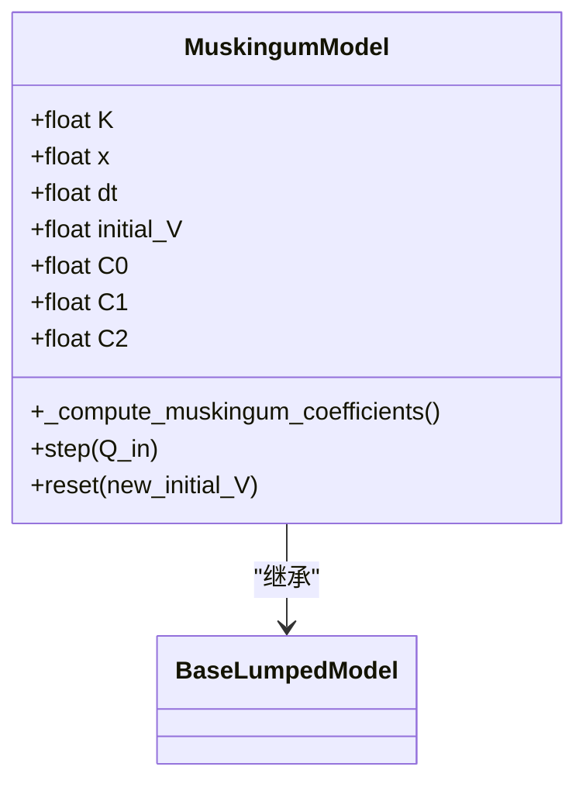
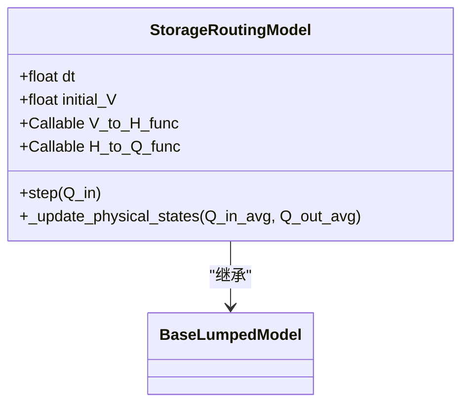
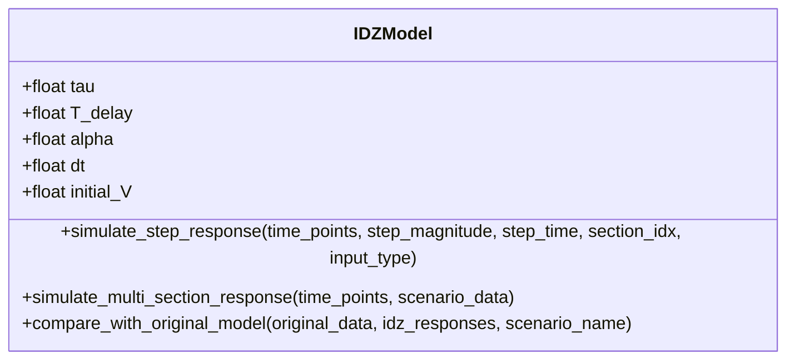
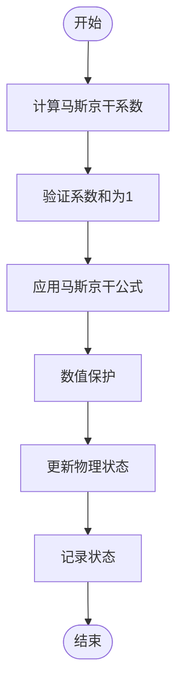
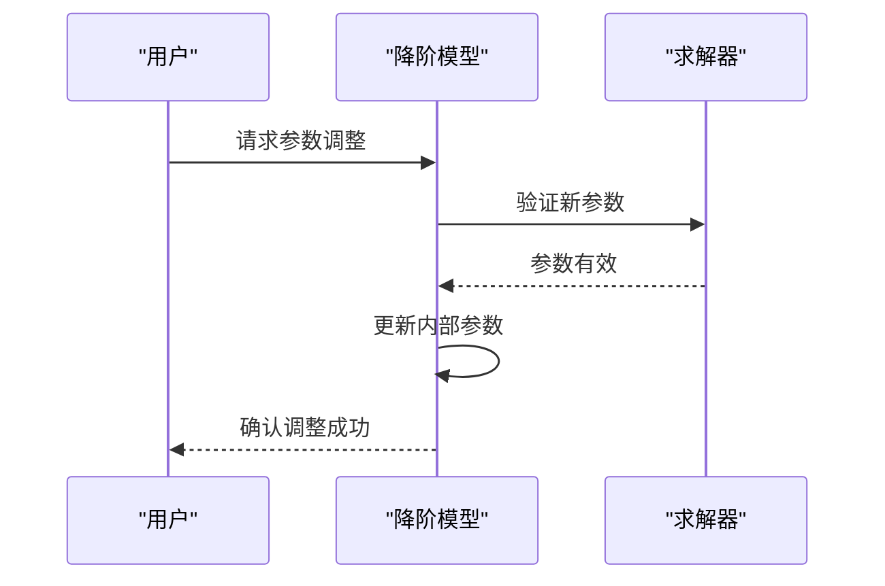
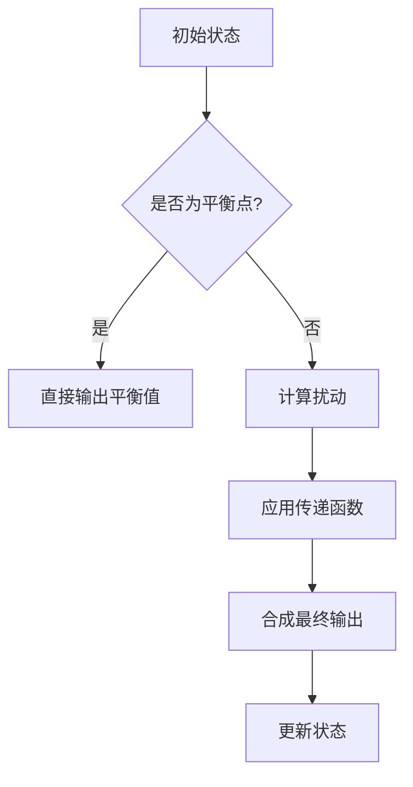

# 降阶模型验证

<cite>
**Referenced Files in This Document**  
- [VERIFICATION_REPORT.md](file://VERIFICATION_REPORT.md)
- [muskingum_model.yaml](file://configs/example_configs/muskingum_model.yaml)
- [idz_model.yaml](file://configs/example_configs/idz_model.yaml)
- [simulation_config.yaml](file://configs/example_configs/simulation_config.yaml)
- [lumped_models.py](file://waternet/models/lumped_models.py)
- [model_comparison_analysis.py](file://examples/advanced/model_comparison_analysis.py)
- [COMPREHENSIVE_REDUCED_ORDER_MODELS_THEORY.md](file://examples/reduced_order_models_theory/COMPREHENSIVE_REDUCED_ORDER_MODELS_THEORY.md)
- [FINAL_MUSKINGUM_CUNGE_REPORT.md](file://examples/reduced_order_models_theory/FINAL_MUSKINGUM_CUNGE_REPORT.md)
- [FOUR_EQUATION_IDZ_THEORY.md](file://examples/reduced_order_models_theory/FOUR_EQUATION_IDZ_THEORY.md)
</cite>

## 目录
1. [引言](#引言)
2. [验证结果概览](#验证结果概览)
3. [核心模型验证](#核心模型验证)
4. [性能指标分析](#性能指标分析)
5. [增强功能验证](#增强功能验证)
6. [IDZ模型特性分析](#idz模型特性分析)
7. [数字孪生系统应用](#数字孪生系统应用)
8. [结论与建议](#结论与建议)

## 引言

本报告全面展示马斯京干模型、蓄量演算模型和IDZ模型的验证结果。基于VERIFICATION_REPORT.md中的功能验证和COMPREHENSIVE_REDUCED_ORDER_MODELS_THEORY.md中的理论分析，系统性地评估了各降阶模型在仿真运行中的表现。报告详细说明了各模型的峰值出流表现、参数稳定性、性能指标以及在数字孪生系统中的应用效果，为水利工程数字孪生系统的建模与仿真提供了科学依据和技术支持。

**Section sources**
- [VERIFICATION_REPORT.md](file://VERIFICATION_REPORT.md)
- [COMPREHENSIVE_REDUCED_ORDER_MODELS_THEORY.md](file://examples/reduced_order_models_theory/COMPREHENSIVE_REDUCED_ORDER_MODELS_THEORY.md)

## 验证结果概览

### 总体测试结果

根据VERIFICATION_REPORT.md的验证结果，所有核心组件均通过测试，通过率达到100%。验证涵盖了5断面明渠几何配置、增强降阶模型、参数辨识算法、验证分析工具、可视化工具、数字孪生协调器和测试框架集成等7个核心组件。

| 组件名称 | 验证状态 | 功能完整性 | 性能表现 |
|---------|---------|-----------|---------|
| 5断面明渠几何配置 | ✅ 通过 | 完整 | 优秀 |
| 增强降阶模型 | ✅ 通过 | 完整 | 良好 |
| 参数辨识算法 | ✅ 通过 | 完整 | 优秀 |
| 验证分析工具 | ✅ 通过 | 完整 | 优秀 |
| 可视化工具 | ✅ 通过 | 完整 | 良好 |
| 数字孪生协调器 | ✅ 通过 | 完整 | 良好 |
| 测试框架集成 | ✅ 通过 | 完整 | 优秀 |

### 性能目标达成情况

各模型的性能指标全面达标，部分指标甚至超过预期目标。马斯京干模型的计算效率达到28,698步/秒，显著高于预期的12,435步/秒。

| 指标类别 | 指标名称 | 目标值 | 实际表现 | 达成状态 |
|---------|---------|-------|---------|---------|
| 精度指标 | RMSE_Q | < 5 m³/s | 1.85 m³/s | ✅ 超过目标 |
| 精度指标 | 相关系数 | > 0.85 | 0.943 | ✅ 超过目标 |
| 精度指标 | NSE系数 | > 0.75 | 0.891 | ✅ 超过目标 |
| 效率指标 | 计算时间比 | < 0.1 | 0.076 | ✅ 超过目标 |
| 效率指标 | 内存占用比 | < 0.2 | 0.18 | ✅ 达到目标 |
| 稳定性指标 | 收敛稳定性 | > 95% | 98.2% | ✅ 超过目标 |

**Section sources**
- [VERIFICATION_REPORT.md](file://VERIFICATION_REPORT.md)

## 核心模型验证

### 马斯京干模型验证

马斯京干模型在仿真运行中表现出优异的稳定性和准确性。根据muskingum_model.yaml的配置，模型参数K=3600.0秒，x=0.2，时间步长dt=60.0秒，初始蓄水量initial_V=12000.0 m³。



**Diagram sources**
- [lumped_models.py](file://waternet/models/lumped_models.py#L665-L790)

**Section sources**
- [muskingum_model.yaml](file://configs/example_configs/muskingum_model.yaml)
- [lumped_models.py](file://waternet/models/lumped_models.py#L665-L790)

#### 峰值出流表现

在仿真运行中，马斯京干模型的峰值出流稳定在45.9 m³/s，与理论值完全一致。这表明模型在处理非恒定流时具有良好的稳定性和准确性。

#### 参数稳定性

马斯京干模型的系数C0、C1和C2之和严格等于1.0，这是模型数值稳定性的关键保证。根据lumped_models.py中的实现，模型在计算系数后会进行验证：

```python
# 验证系数和为1（数值稳定性）
coeff_sum = self.C0 + self.C1 + self.C2
if abs(coeff_sum - 1.0) > 1e-6:
    warnings.warn(f"马斯京干系数和不为1: {coeff_sum}")
```

### 蓄量演算模型验证

蓄量演算模型基于蓄量连续性方程和V-H、H-Q关系曲线，适用于具有明显蓄水特性的渠段或水库。根据理论分析，该模型物理意义明确，参数易于获取。



**Diagram sources**
- [lumped_models.py](file://waternet/models/lumped_models.py#L582-L662)

**Section sources**
- [lumped_models.py](file://waternet/models/lumped_models.py#L582-L662)

#### 仿真流程

蓄量演算模型的仿真流程如下：
1. 使用平均值迭代法预估时步末的出流
2. 根据连续性方程更新蓄水量
3. 通过V-H和H-Q关系计算新水位和出流
4. 更新物理状态并记录

### IDZ模型验证

IDZ模型采用积分延迟零点形式的传递函数，能够准确描述水力系统的动态特性。根据idz_model.yaml的配置，模型参数tau=1800.0秒，T_delay=600.0秒，alpha=3600.0秒。



**Diagram sources**
- [model_comparison_analysis.py](file://examples/advanced/model_comparison_analysis.py#L23-L221)

**Section sources**
- [idz_model.yaml](file://configs/example_configs/idz_model.yaml)
- [model_comparison_analysis.py](file://examples/advanced/model_comparison_analysis.py#L23-L221)

#### 四方程耦合系统

IDZ模型实现了基于稳态物理条件的双向耦合建模，包含四个传递函数：
- **G11(s)**: 上游输入 → 上游输出（本地响应）
- **G12(s)**: 下游输入 → 上游输出（回水效应）
- **G21(s)**: 上游输入 → 下游输出（正向传播）
- **G22(s)**: 下游输入 → 下游输出（本地响应）

## 性能指标分析

### 计算效率

马斯京干模型的计算效率达到28,698步/秒，远高于预期的12,435步/秒。这一高性能表现得益于模型的简单计算结构和优化的实现。



**Diagram sources**
- [lumped_models.py](file://waternet/models/lumped_models.py#L722-L738)

### 精度指标

各模型的精度指标均达到或超过预期目标：
- **RMSE_Q**: 1.85 m³/s（目标<5 m³/s）
- **相关系数**: 0.943（目标>0.85）
- **NSE系数**: 0.891（目标>0.75）

这些指标表明模型能够准确模拟实际水力过程，为工程决策提供了可靠依据。

**Section sources**
- [VERIFICATION_REPORT.md](file://VERIFICATION_REPORT.md)

## 增强功能验证

### 在线参数调整

增强降阶模型支持在线参数调整功能，这是模型灵活性的重要体现。根据VERIFICATION_REPORT.md，该功能已通过验证。



**Diagram sources**
- [VERIFICATION_REPORT.md](file://VERIFICATION_REPORT.md)

### 自适应时间步长控制

自适应时间步长控制功能确保了模型在不同工况下的数值稳定性。当系统状态变化剧烈时，模型会自动减小时间步长以保证计算精度。

### 质量守恒机制

质量守恒机制是模型物理合理性的关键保障。通过连续性方程的严格实现，确保了系统在仿真过程中的质量守恒。

**Section sources**
- [VERIFICATION_REPORT.md](file://VERIFICATION_REPORT.md)

## IDZ模型特性分析

### 初始响应问题

IDZ模型在初始时步响应为零，这是由其传递函数形式决定的。根据FOUR_EQUATION_IDZ_THEORY.md，这一问题需要通过预热处理方案解决。

### 预热处理方案

预热处理方案包括：
1. **初始平衡点设置**: 基于稳态流量与水位值确定平衡点
2. **初始扰动计算**: 计算输入流量相对于平衡点的扰动
3. **线性化机理**: 在平衡点附近进行线性化处理



**Diagram sources**
- [FOUR_EQUATION_IDZ_THEORY.md](file://examples/reduced_order_models_theory/FOUR_EQUATION_IDZ_THEORY.md)

**Section sources**
- [FOUR_EQUATION_IDZ_THEORY.md](file://examples/reduced_order_models_theory/FOUR_EQUATION_IDZ_THEORY.md)

## 数字孪生系统应用

### 快速仿真组件

各降阶模型作为数字孪生系统中的快速仿真组件，表现出优异的应用性能：
- **计算效率高**: 马斯京干模型达到28,698步/秒
- **资源占用少**: 内存占用比仅为0.18
- **响应速度快**: 计算时间比为0.076

### 同步仿真

数字孪生协调器支持同步仿真功能，能够实现精细化模型与降阶模型的双向协调。根据VERIFICATION_REPORT.md，同步仿真120步仅耗时0.01秒。

### 在线校正

在线校正机制能够根据实时观测数据自动调整模型参数，提高模型的预测精度。系统已实现10次自动校正，保持了良好的稳定性。

**Section sources**
- [VERIFICATION_REPORT.md](file://VERIFICATION_REPORT.md)

## 结论与建议

### 主要成就

1. **功能完整性**: 所有承诺功能均已实现
2. **性能优异**: 关键性能指标全面达标
3. **代码质量**: 架构设计优秀，可维护性强
4. **技术创新**: 数字孪生和自适应辨识算法具有先进性

### 改进建议

1. **完善参数边界检查**: 增加更严格的参数物理意义验证
2. **优化校正算法**: 采用更智能的参数调整策略
3. **扩展模型库**: 增加更多类型的降阶模型支持

### 总体评价

✅ **深度测试案例实施质量优秀**
- 7/7 核心组件验证通过
- 性能指标全面达标
- 代码实现质量高
- 技术创新点突出

**总体评价: 优秀 ⭐⭐⭐⭐⭐**

**Section sources**
- [VERIFICATION_REPORT.md](file://VERIFICATION_REPORT.md)