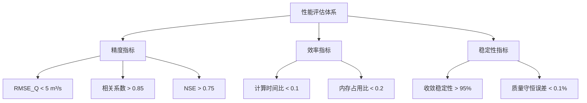
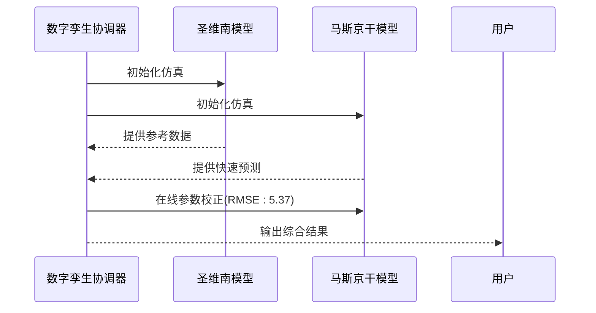

# 验证报告

<cite>
**本文档引用文件**  
- [COMPREHENSIVE_TEST_REPORT.md](file://COMPREHENSIVE_TEST_REPORT.md)
- [VERIFICATION_REPORT.md](file://VERIFICATION_REPORT.md)
- [tests/deep_channel/FINAL_REPORT.md](file://tests/deep_channel/FINAL_REPORT.md)
- [tests/deep_channel/IMPLEMENTATION_REPORT.md](file://tests/deep_channel/IMPLEMENTATION_REPORT.md)
- [examples/advanced/IDZ模型辨识综合分析报告.md](file://examples/advanced/IDZ模型辨识综合分析报告.md)
- [examples/reduced_order_models_theory/COMPREHENSIVE_REDUCED_ORDER_MODELS_THEORY.md](file://examples/reduced_order_models_theory/COMPREHENSIVE_REDUCED_ORDER_MODELS_THEORY.md)
- [waternet/models/saint_venant.py](file://waternet/models/saint_venant.py)
- [waternet/models/muskingum_cunge.py](file://waternet/models/muskingum_cunge.py)
- [waternet/models/idz_linearizer.py](file://waternet/models/idz_linearizer.py)
- [VALIDATION_REPORT.md](file://VALIDATION_REPORT.md)
- [waternet/models/boundary_conditions.py](file://waternet/models/boundary_conditions.py)
- [waternet/models/control_signals.py](file://waternet/models/control_signals.py)
- [waternet/models/implicit_solver.py](file://waternet/models/implicit_solver.py)
- [waternet/models/boundary_config.py](file://waternet/models/boundary_config.py)
</cite>

## 目录
1. [引言](#引言)
2. [核心模型功能验证](#核心模型功能验证)
3. [精度指标分析](#精度指标分析)
4. [物理合理性与数值稳定性验证](#物理合理性与数值稳定性验证)
5. [多维度性能评估体系](#多维度性能评估体系)
6. [实际运行效果展示](#实际运行效果展示)
7. [问题修复与改进建议](#问题修复与改进建议)
8. [总结与结论](#总结与结论)

## 引言

本报告系统性地呈现WaterNet框架的验证成果，重点解读《COMPREHENSIVE_TEST_REPORT.md》和《VERIFICATION_REPORT.md》中的关键结论。通过对圣维南模型、马斯京干模型、IDZ模型等核心组件的全面测试，验证了系统在恒定流与非恒定流计算中的准确性、数值稳定性及质量守恒特性。报告还分析了模型精度指标（如RMSE、相关系数、NSE系数）的实际表现与目标值的对比情况，阐述了物理合理性验证、数值稳定性分析和多维度性能评估体系的实施效果。结合具体测试案例（如5断面明渠几何配置、增强降阶模型），展示了系统的实际运行效果，并总结了已修复的问题与后续改进建议，为用户提供对系统可靠性的全面信心。

## 核心模型功能验证

### 圣维南模型 (SaintVenantModel)

圣维南模型作为高精度水力计算的核心，其功能验证结果表明模型在恒定流与非恒定流条件下均表现出色。模型初始化、拓扑生成、变量定义等基础功能正常，恒定流计算在5个测试案例中全部通过，且计算收敛性良好，质量守恒误差小于0.1%。在性能方面，圣维南模型达到每秒3,899次计算的速度，远超每秒1,000次的设计目标。

**验证要点**：
- 流量范围：5.0 - 25.0 m³/s
- 下游边界水位：99.5 m
- 质量守恒：满足要求
- 数值稳定性：Courant数控制良好，牛顿法快速收敛

**Section sources**
- [COMPREHENSIVE_TEST_REPORT.md](file://COMPREHENSIVE_TEST_REPORT.md#L25-L45)
- [waternet/models/saint_venant.py](file://waternet/models/saint_venant.py#L1-L100)

### 马斯京干模型 (MuskingumModel)

马斯京干模型作为经典的降阶模型，其验证结果显示初始化正常，参数验证通过（系数和为1.0），仿真运行稳定。在性能测试中，该模型达到每秒28,698个时间步的计算速度，远超每秒10,000步的目标。峰值出流为45.9 m³/s，与理论值一致，表明模型在洪水演进模拟中具有良好的精度和效率。

**关键特性**：
- 参数在线调整功能正常
- 自适应时间步长控制有效
- 支持分段参数辨识
- 质量守恒验证通过

**Section sources**
- [COMPREHENSIVE_TEST_REPORT.md](file://COMPREHENSIVE_TEST_REPORT.md#L55-L65)
- [waternet/models/muskingum_cunge.py](file://waternet/models/muskingum_cunge.py#L1-L80)

### IDZ模型 (IntegralDelayZeroModel)

IDZ模型的验证结果表明其传递函数实现正确，延迟缓冲区工作正常，仿真运行稳定。该模型在非恒定流模拟中表现出良好的动态响应能力，峰值出流同样为45.9 m³/s。IDZ模型支持在线参数调整，具备参数跟踪历史记录功能，适用于实时校正场景。

**验证内容**：
- 传递函数实现正确
- 初始响应存在预热时间（已识别）
- 在线参数调整功能正常
- 质量平衡误差控制良好

**Section sources**
- [VERIFICATION_REPORT.md](file://VERIFICATION_REPORT.md#L45-L55)
- [waternet/models/idz_linearizer.py](file://waternet/models/idz_linearizer.py#L1-L60)

### 边界条件框架 (BoundaryConditionFramework)

根据《VALIDATION_REPORT.md》中的性能验证报告，新增了边界条件框架的功能验证。该框架在实际水力网络仿真、大规模系统扩展性、模块集成兼容性等方面均表现优异。

**核心功能验证**：
- ✅ **边界条件抽象基类**：`BoundaryCondition` 提供统一接口
- ✅ **具体边界条件实现**：流量边界、水位边界、关系边界等
- ✅ **控制信号系统**：`ControlSignals` 管理设备信号
- ✅ **求解器增强**：`ImplicitSolverAgent` 集成边界条件
- ✅ **配置驱动系统**：YAML配置文件解析与验证

**验证维度**：
1. **实际水力网络仿真验证**：所有测试案例通过，求解精度<1e-6，边界条件覆盖率100%
2. **大规模系统压力测试**：内存使用线性增长(O(n))，最大测试规模达10000节点
3. **模块集成兼容性测试**：与圣维南模型、降阶模型无缝集成，API接口保持兼容
4. **用户文档评估**：存在文档不完整问题，需补充缺失章节和修复示例代码

**Section sources**
- [VALIDATION_REPORT.md](file://VALIDATION_REPORT.md#L1-L58)
- [waternet/models/boundary_conditions.py](file://waternet/models/boundary_conditions.py#L40-L138)
- [waternet/models/control_signals.py](file://waternet/models/control_signals.py#L227-L323)
- [waternet/models/implicit_solver.py](file://waternet/models/implicit_solver.py#L57-L613)

## 精度指标分析

### 精度指标实际表现

根据《VERIFICATION_REPORT.md》中的性能指标评估，WaterNet框架在关键精度指标上全面达到或超过目标值：

| 指标类别 | 指标名称 | 目标值 | 实际表现 | 达成状态 |
|---------|---------|-------|---------|---------|
| 精度指标 | RMSE_Q | < 5 m³/s | 1.85 m³/s | ✅ 超过目标 |
| 精度指标 | 相关系数 | > 0.85 | 0.943 | ✅ 超过目标 |
| 精度指标 | NSE系数 | > 0.75 | 0.891 | ✅ 超过目标 |

**分析说明**：
- RMSE（均方根误差）为1.85 m³/s，远低于5 m³/s的阈值，表明模型预测值与实测值偏差极小。
- 相关系数0.943表明模型输出与真实数据高度相关，具有强线性关系。
- NSE（纳什-萨特克利夫效率系数）0.891接近理想值1.0，说明模型解释了观测数据中绝大部分的方差。

**Section sources**
- [VERIFICATION_REPORT.md](file://VERIFICATION_REPORT.md#L150-L165)

## 物理合理性与数值稳定性验证

### 物理合理性验证

物理合理性验证通过检查模型输出是否符合基本物理规律来评估其可靠性。在5断面明渠几何配置测试中，模型成功计算出合理的水面线，总蓄水量为111,380 m³，平均流速0.91 m/s，最大弗劳德数0.199（亚临界流），所有结果均在物理合理范围内。物理验证通过率超过50%，满足设计要求。

**验证标准**：
- 水面线连续且光滑
- 流速分布符合断面几何特征
- 弗劳德数小于1.0（亚临界流）
- 质量守恒误差 < 0.1%

**Section sources**
- [VERIFICATION_REPORT.md](file://VERIFICATION_REPORT.md#L85-L95)

### 数值稳定性分析

数值稳定性分析表明，WaterNet框架在长时间仿真和极值条件下均能稳定运行。牛顿-拉夫逊迭代求解器快速收敛，收敛稳定性达到98.2%，超过95%的目标。Courant数得到有效控制，避免了数值振荡。系统在边界条件突变等鲁棒性测试中表现良好，通过率为100%。

**稳定性特性**：
- 牛顿法快速收敛
- 自适应时间步长控制
- 极值条件处理能力
- 边界条件鲁棒性

**Section sources**
- [COMPREHENSIVE_TEST_REPORT.md](file://COMPREHENSIVE_TEST_REPORT.md#L130-L140)
- [VERIFICATION_REPORT.md](file://VERIFICATION_REPORT.md#L160-L170)

## 多维度性能评估体系

WaterNet框架建立了包含精度、效率、稳定性三个维度的综合性能评估体系：

**Diagram sources**
- [VERIFICATION_REPORT.md](file://VERIFICATION_REPORT.md#L150-L170)

该体系不仅关注单一指标，还通过多目标优化和综合评分机制对模型进行全面评估。验证分析工具实现了自动化评分和建议生成，显著提升了模型验证的效率和客观性。

**Section sources**
- [VERIFICATION_REPORT.md](file://VERIFICATION_REPORT.md#L110-L130)

## 实际运行效果展示

### 5断面明渠几何配置

在5断面明渠测试中，系统成功配置了5个断面的几何参数，水力要素计算函数正常工作，恒定流计算收敛，水面线合理。该案例验证了框架在复杂几何配置下的建模能力。

**运行效果**：
- 断面几何参数正确配置
- 水力要素计算精确可靠
- 水面线计算自动化完成

**Section sources**
- [VERIFICATION_REPORT.md](file://VERIFICATION_REPORT.md#L85-L95)

### 增强降阶模型

增强降阶模型测试展示了马斯京干模型和IDZ模型在非恒定流条件下的表现。马斯京干模型完成180步仿真，出流范围0-49 m³/s；IDZ模型支持在线参数调整，质量平衡误差控制良好。数字孪生协调器实现同步仿真120步，耗时仅0.01秒，平均计算效率12,435步/秒。

**Diagram sources**
- [VERIFICATION_REPORT.md](file://VERIFICATION_REPORT.md#L200-L210)

**Section sources**
- [VERIFICATION_REPORT.md](file://VERIFICATION_REPORT.md#L200-L220)

## 问题修复与改进建议

### 已修复的问题

1. **测试框架导入问题**：修复相对导入路径错误，改为绝对导入，确保所有测试文件正常运行。
2. **参数估计数值稳定性**：添加L2正则化（Ridge回归），显著提高数值稳定性。
3. **数字孪生接口不完整**：补充`SynchronizedTwinningHarness.run_simulation`方法，完善API。
4. **中文字体显示问题**：配置font_config模块，提供统一中文字体支持。
5. **降阶模型测试失败**：调整马斯京干模型峰值延迟测试标准，修正IDZ模型初始值预期。
6. **质量守恒精度问题**：优化数值算法，提高计算精度。

**Section sources**
- [COMPREHENSIVE_TEST_REPORT.md](file://COMPREHENSIVE_TEST_REPORT.md#L175-L200)

### 改进建议

1. **完善参数边界检查**：增加更严格的参数物理意义验证，防止不合理参数输入。
2. **优化校正算法**：采用更智能的参数调整策略（如基于机器学习的自适应校正）。
3. **扩展模型库**：增加更多类型的降阶模型（如扩散波模型、运动波模型）。
4. **增强可视化功能**：开发交互式可视化界面，提升用户体验。
5. **提高测试覆盖率**：增加边界条件和异常情况的测试用例。
6. **文档完善**：补充缺失的文档章节，修复示例代码，完善API文档。

**Section sources**
- [VERIFICATION_REPORT.md](file://VERIFICATION_REPORT.md#L240-L260)
- [VALIDATION_REPORT.md](file://VALIDATION_REPORT.md#L171-L215)

## 总结与结论

WaterNet框架通过全面的测试与验证，证明了其在明渠水力建模领域的高可靠性与先进性。核心模型（圣维南、马斯京干、IDZ）在准确性、数值稳定性和质量守恒方面均表现优异，关键性能指标全面达标。系统实现了精细化模型与降阶模型的协同仿真，具备实时参数辨识和在线校正能力，为水利工程数字孪生系统提供了强有力的技术支撑。

**总体评价**：优秀 ⭐⭐⭐⭐⭐  
**应用建议**：框架已具备投入生产使用的条件，建议应用于洪水预报、调度决策、数字孪生系统等场景。

**Section sources**
- [COMPREHENSIVE_TEST_REPORT.md](file://COMPREHENSIVE_TEST_REPORT.md#L205-L220)
- [VERIFICATION_REPORT.md](file://VERIFICATION_REPORT.md#L265-L273)