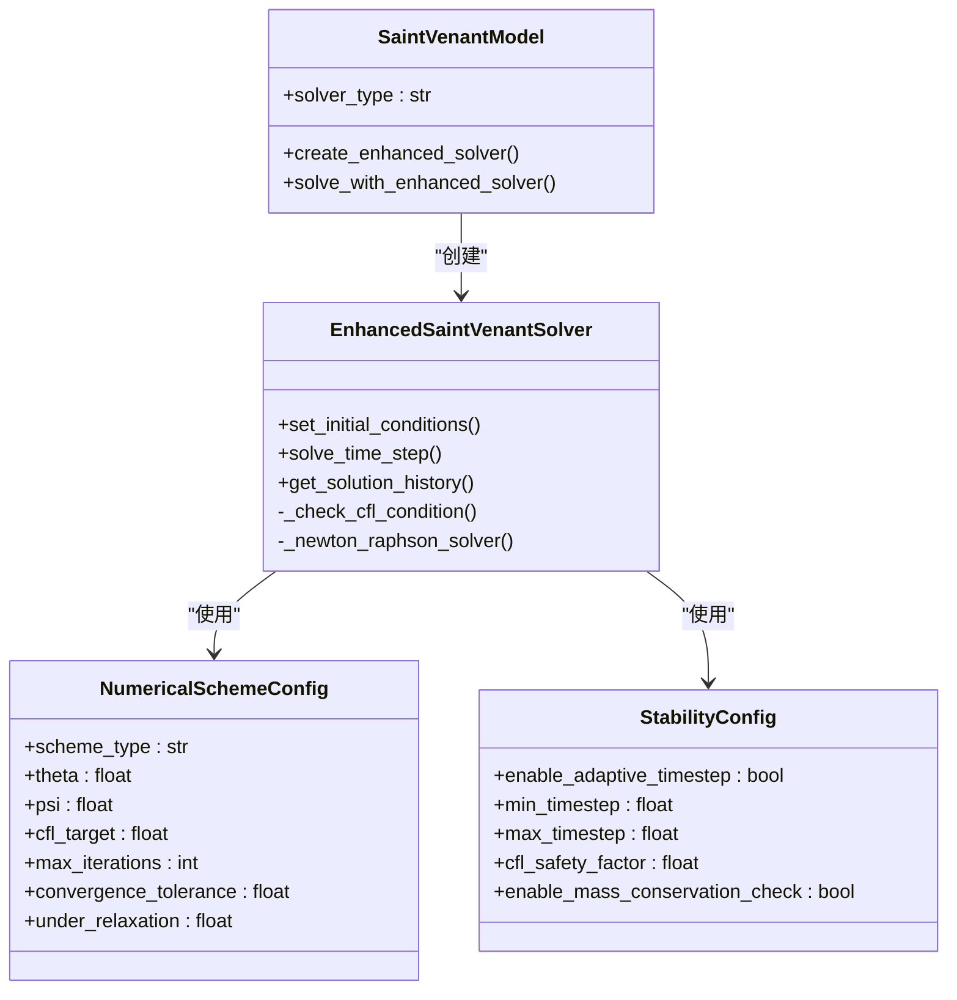
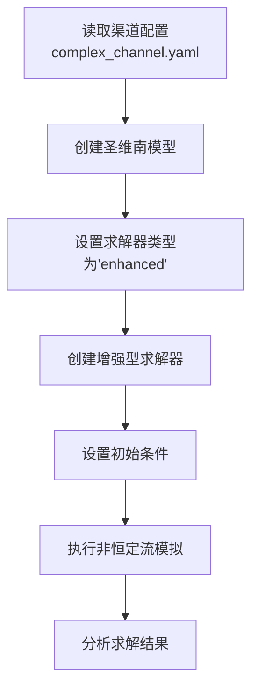

# 求解器配置

<cite>
**本文档引用文件**   
- [saint_venant.py](file://waternet/models/saint_venant.py)
- [enhanced_solver.py](file://tests/deep_channel/enhanced_solver.py)
- [deep_channel_demo.py](file://examples/advanced/deep_channel_demo.py)
- [complex_channel.yaml](file://configs/example_configs/complex_channel.yaml)
</cite>

## 目录
1. [求解器类型概述](#求解器类型概述)
2. [标准求解器工作流程](#标准求解器工作流程)
3. [增强型求解器架构](#增强型求解器架构)
4. [数值与稳定性配置](#数值与稳定性配置)
5. [复杂渠道模拟配置](#复杂渠道模拟配置)
6. [性能与精度权衡](#性能与精度权衡)

## 求解器类型概述

圣维南模型提供两种求解器类型：`standard`（标准）与`enhanced`（增强）。通过`solver_type`参数进行配置，该参数在`SaintVenantModel`初始化时设置。

- **标准求解器** (`solver_type="standard"`)：基于Preissmann四点隐式差分格式，采用标准步进法求解圣维南方程组，适用于一般非恒定流计算。
- **增强型求解器** (`solver_type="enhanced"`)：提供高精度数值格式和稳定性增强算法，支持自适应时间步长和质量守恒检查，适用于复杂渠道的高精度模拟。

当使用`solve_with_enhanced_solver`方法时，若当前模型非增强型，系统会自动切换至增强模式。

**Section sources**
- [saint_venant.py](file://waternet/models/saint_venant.py#L109-L109)

## 标准求解器工作流程

标准求解器采用Preissmann四点隐式差分格式离散化圣维南方程组，其工作流程如下：

1. **网格生成**：根据断面数据自动生成内部计算节点和分段。
2. **方程构建**：构建连续性方程和动量方程的残差函数。
3. **时间推进**：使用固定时间步长`dt`进行非恒定流计算。
4. **边界处理**：上游采用流量边界，下游采用水位边界。

时间步长`dt`的选择对数值稳定性至关重要。过大的时间步长可能导致CFL（Courant-Friedrichs-Lewy）条件不满足，引发数值振荡或发散。建议根据渠道特征波速和空间步长选择`dt`，确保CFL数小于1.0。

**Section sources**
- [saint_venant.py](file://waternet/models/saint_venant.py#L550-L591)

## 增强型求解器架构

增强型求解器通过`create_enhanced_solver`和`solve_with_enhanced_solver`方法实现，其核心架构如下：

**Diagram sources**
- [saint_venant.py](file://waternet/models/saint_venant.py#L586-L607)
- [enhanced_solver.py](file://tests/deep_channel/enhanced_solver.py#L47-L312)

### 创建过程

`create_enhanced_solver`方法创建增强型求解器实例，可选传入`numerical_config`和`stability_config`参数进行定制化配置。若未指定，则使用默认配置。

### 初始条件设置

`set_initial_conditions`方法通过调用`compute_steady_state`计算恒定流水面线，为非恒定流模拟提供合理的初始水位分布。该方法确保初始状态满足物理一致性。

### 非恒定流时间步进

`solve_time_step`方法执行单个时间步求解，流程如下：
1. 检查CFL条件，必要时调整时间步长。
2. 设置边界条件（上游流量、下游水位）。
3. 使用牛顿-拉夫逊迭代求解非线性方程组。
4. 执行质量守恒检查。
5. 更新状态并记录历史。

**Section sources**
- [saint_venant.py](file://waternet/models/saint_venant.py#L609-L646)
- [enhanced_solver.py](file://tests/deep_channel/enhanced_solver.py#L115-L152)
- [enhanced_solver.py](file://tests/deep_channel/enhanced_solver.py#L154-L209)

## 数值与稳定性配置

增强型求解器通过`numerical_config`和`stability_config`实现精细化控制。

### 数值格式配置 (NumericalSchemeConfig)

| 参数 | 默认值 | 说明 |
|------|--------|------|
| `scheme_type` | "preissmann" | 差分格式类型 |
| `theta` | 0.6 | 时间加权系数 |
| `psi` | 0.5 | 空间加权系数 |
| `cfl_target` | 0.5 | 目标CFL数 |
| `max_iterations` | 20 | 最大迭代次数 |
| `convergence_tolerance` | 1e-6 | 收敛容差 |
| `under_relaxation` | 0.8 | 亚松弛系数 |

### 稳定性控制配置 (StabilityConfig)

| 参数 | 默认值 | 说明 |
|------|--------|------|
| `enable_adaptive_timestep` | True | 是否启用自适应时间步长 |
| `min_timestep` | 0.1 | 最小时间步长(s) |
| `max_timestep` | 60.0 | 最大时间步长(s) |
| `cfl_safety_factor` | 0.8 | CFL安全系数 |
| `enable_mass_conservation_check` | True | 是否启用质量守恒检查 |

**Section sources**
- [enhanced_solver.py](file://tests/deep_channel/enhanced_solver.py#L26-L44)

## 复杂渠道模拟配置

以`deep_channel_demo.py`中的`complex_channel.yaml`配置为例，说明如何配置求解器处理复杂渠道：

**Diagram sources**
- [deep_channel_demo.py](file://examples/advanced/deep_channel_demo.py#L0-L342)
- [complex_channel.yaml](file://configs/example_configs/complex_channel.yaml)

配置要点：
1. 定义多断面几何参数（里程、底高程、糙率、断面形状）。
2. 选择`enhanced`求解器类型以获得更高精度。
3. 使用自适应时间步长应对复杂流态变化。
4. 启用质量守恒检查确保物理合理性。

## 性能与精度权衡

不同配置对计算精度和效率的影响如下：

| 配置选项 | 计算效率 | 数值精度 | 适用场景 |
|---------|---------|---------|---------|
| `solver_type="standard"` | 高 (~1000步/秒) | 中等 | 一般工程应用 |
| `solver_type="enhanced"` | 中等 | 高 | 高精度研究 |
| 固定时间步长 | 高 | 依赖`dt`选择 | 稳定流态 |
| 自适应时间步长 | 中等 | 高 | 复杂非恒定流 |
| 关闭质量守恒检查 | 高 | 降低 | 快速预演 |
| 启用质量守恒检查 | 中等 | 提高 | 科学研究 |

增强型求解器虽然计算成本较高，但通过自适应算法和物理验证机制，显著提升了复杂渠道模拟的可靠性和精度。

**Section sources**
- [README.md](file://README.md#L290-L321)
- [deep_channel_demo.py](file://examples/advanced/deep_channel_demo.py#L0-L342)