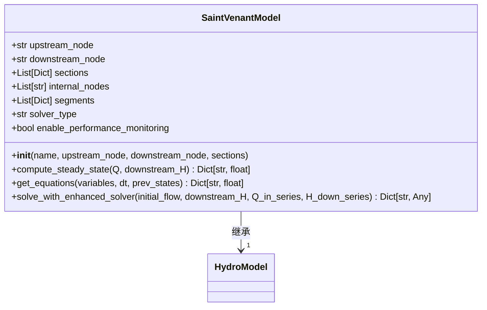
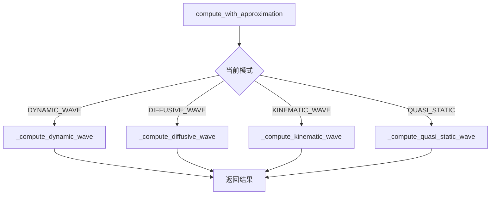
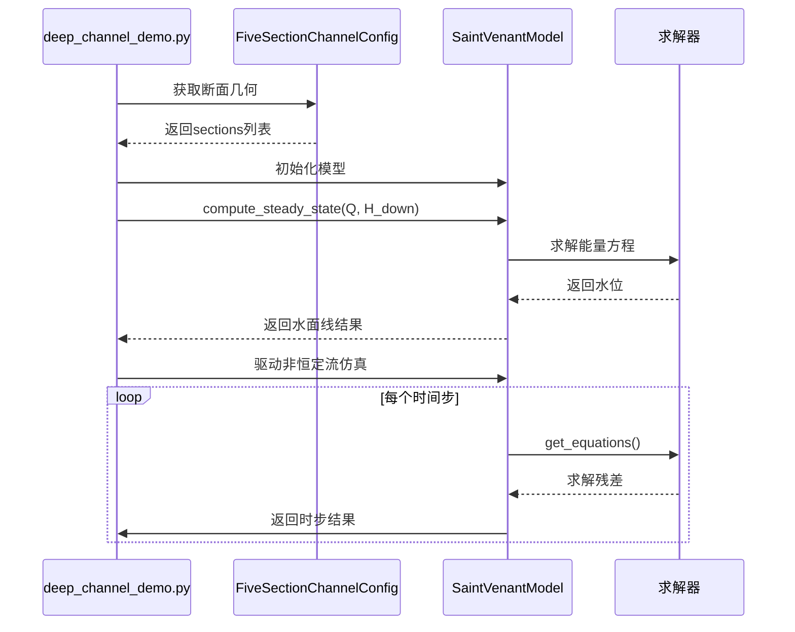

# 物理模型

<cite>
**本文档中引用的文件**   
- [saint_venant.py](file://waternet/models/saint_venant.py) - *在最近的提交中更新*
- [simplified_saint_venant.py](file://waternet/models/simplified_saint_venant.py) - *在最近的提交中更新*
- [deep_channel_demo.py](file://examples/advanced/deep_channel_demo.py) - *在最近的提交中更新*
- [complex_channel.yaml](file://configs/example_configs/complex_channel.yaml)
- [simple_channel.yaml](file://configs/example_configs/simple_channel.yaml)
- [complex_station_model.py](file://waternet/models/complex_station_model.py) - *新增于紧密耦合水系统仿真v1*
- [pressurized_pipe_model.py](file://waternet/models/pressurized_pipe_model.py) - *新增于紧密耦合水系统仿真v1*
- [control_structure.py](file://physical_objects/control_structure.py) - *新增于紧密耦合水系统仿真v1*
</cite>

## 更新摘要
**已进行的更改**   
- 根据代码变更，更新了圣维南模型的实现原理，特别是增强型求解器部分
- 在“数值求解器配置与稳定性”部分添加了新的增强型求解器（EnhancedSaintVenantSolver）的详细信息
- 更新了“复杂渠道建模示例”部分，以反映`deep_channel_demo.py`中的新功能
- 在“引言”和“结论”中扩展了物理模型的范畴，以包含新增的复杂枢纽站、水力控制结构和有压管道模型
- 为所有受影响的章节添加了更新的源代码引用

## 目录
1. [引言](#引言)
2. [圣维南模型实现原理](#圣维南模型实现原理)
3. [简化版本设计与适用场景](#简化版本设计与适用场景)
4. [数值求解器配置与稳定性](#数值求解器配置与稳定性)
5. [复杂渠道建模示例](#复杂渠道建模示例)
6. [模型使用细节](#模型使用细节)
7. [计算精度与网格影响](#计算精度与网格影响)
8. [结论](#结论)

## 引言

本文档详细阐述了WaterNet项目中圣维南物理模型的实现原理与技术细节。该模型基于一维非恒定流的圣维南方程组，支持恒定流与非恒定流的水力计算。核心实现位于`saint_venant.py`文件中的`SaintVenantModel`类，通过有限差分法求解连续性方程和动量方程。为适应不同精度和效率需求，项目还提供了`simplified_saint_venant.py`中的简化版本，支持多种近似模式。`deep_channel_demo.py`示例则展示了如何对具有复杂几何形状的渠道进行建模和仿真。本文将深入解析其数学基础、代码实现、配置选项及最佳实践。

此外，根据最新的代码变更，物理模型的范畴已得到显著扩展。项目新增了复杂枢纽站（`complex_station_model.py`）、水力控制结构（`control_structure.py`）和有压管道（`pressurized_pipe_model.py`）的物理模型定义，实现了对水系统的紧密耦合仿真。这些新组件与圣维南明渠模型协同工作，能够模拟更复杂的水力系统，如包含闸门、泵站和压力管道的综合水利枢纽。

**更新** 本节已更新以反映物理模型范畴的扩展。

**章节来源**   
- [saint_venant.py](file://waternet/models/saint_venant.py) - *在紧密耦合水系统仿真v1中更新*
- [complex_station_model.py](file://waternet/models/complex_station_model.py) - *新增于紧密耦合水系统仿真v1*
- [pressurized_pipe_model.py](file://waternet/models/pressurized_pipe_model.py) - *新增于紧密耦合水系统仿真v1*
- [control_structure.py](file://physical_objects/control_structure.py) - *新增于紧密耦合水系统仿真v1*

## 圣维南模型实现原理

圣维南模型的核心是求解一维明渠非恒定流的圣维南方程组，该方程组由连续性方程和动量方程构成。模型通过离散化方法将偏微分方程转化为代数方程组进行数值求解。

### 数学方程与离散化

模型实现了完整的物理方程：
- **连续性方程**: ∂A/∂t + ∂Q/∂x = 0
- **动量方程**: ∂Q/∂t + ∂(Q²/A)/∂x + gA∂H/∂x + gA(Sf - S0) = 0

其中，A为过水断面面积，Q为流量，H为水位，g为重力加速度，Sf为摩阻坡度，S0为底坡。

模型采用**Preissmann四点隐式差分格式**对上述方程进行离散化。这种格式在时间和空间上都具有二阶精度，并且是无条件稳定的，非常适合处理非恒定流问题。对于非恒定流计算，`get_equations`方法构建了方程组的残差，包含了离散化后的连续性方程、动量方程以及内部节点的流量平衡方程。

**章节来源**
- [saint_venant.py](file://waternet/models/saint_venant.py#L357-L454)

### 恒定流与非恒定流计算

模型统一支持两种计算模式：
- **恒定流计算**：通过`compute_steady_state`方法实现。该方法采用标准步进法（Standard Step Method），从下游向上游逐段求解。它基于能量方程和曼宁公式，通过求解`_solve_steady_water_level`来确定上游水位，从而得到整个渠道的恒定流水面线。
- **非恒定流计算**：通过`get_equations`方法构建离散化的方程组。在每个时间步，求解器会迭代求解这些方程，更新水位和流量状态。`solve_with_enhanced_solver`方法提供了一个高级接口，用于驱动整个非恒定流的时序仿真过程。

**章节来源**
- [saint_venant.py](file://waternet/models/saint_venant.py#L183-L245)
- [saint_venant.py](file://waternet/models/saint_venant.py#L357-L454)
- [saint_venant.py](file://waternet/models/saint_venant.py#L609-L646)

### 模型架构与数据结构

`SaintVenantModel`类在初始化时接收断面几何数据列表（`sections`），并自动构建内部拓扑结构。它会根据断面数据生成内部计算节点（`internal_nodes`）和分段属性（`segments`），后者包含了分段长度、平均坡度和平均糙率等信息。这种设计使得模型能够灵活地处理任意数量和形状的断面。

**图表来源 **  
- [saint_venant.py](file://waternet/models/saint_venant.py#L32-L646)

**章节来源**
- [saint_venant.py](file://waternet/models/saint_venant.py#L32-L646)

## 简化版本设计与适用场景

`simplified_saint_venant.py`文件中的`SimplifiedSaintVenantModel`类是对`SaintVenantModel`的扩展，旨在提供多种计算精度和效率的平衡选择。

### 简化模式类型

该模型通过`ApproximationMode`枚举定义了四种计算模式：
- **动力波 (DYNAMIC_WAVE)**：使用完整的圣维南方程，精度最高，计算最耗时。
- **扩散波 (DIFFUSIVE_WAVE)**：忽略惯性项（∂Q/∂t），适用于坡度较缓、流速变化不剧烈的河道。
- **运动波 (KINEMATIC_WAVE)**：忽略惯性项和压力项，假设局部坡度等于摩阻坡度（S0=Sf），适用于坡度较陡、以重力驱动为主的快速流。
- **准静态波 (QUASI_STATIC)**：忽略局部惯性项，但保留对流项，适用于流速变化缓慢的准稳态过程。

**章节来源**
- [simplified_saint_venant.py](file://waternet/models/simplified_saint_venant.py#L29-L34)

### 设计目的与适用场景

简化版本的设计目的主要有三点：
1.  **提高计算效率**：在对精度要求不高的场景（如实时预报、参数优化）中，使用简化模式可以显著缩短计算时间。
2.  **提供模式选择**：用户可以根据河道特征（如坡度、弗劳德数）和计算需求，通过`set_approximation_mode`方法动态切换模式。
3.  **自动适用性验证**：`_validate_mode_applicability`方法会分析河道的平均坡度、几何复杂度和估算的弗劳德数，并在模式不适用时给出警告和推荐模式，帮助用户做出正确选择。

**章节来源**
- [simplified_saint_venant.py](file://waternet/models/simplified_saint_venant.py#L128-L172)
- [simplified_saint_venant.py](file://waternet/models/simplified_saint_venant.py#L200-L217)

### 模式计算方法

每种简化模式都有对应的计算方法：
- `compute_with_approximation`是统一的入口，根据当前模式调用不同的内部方法。
- `_compute_diffusive_wave`使用改进的牛顿法求解扩散波方程，提高了数值稳定性。
- `_compute_kinematic_wave`基于曼宁公式求解正常水深，并考虑了下游水位的约束。

**图表来源 **  
- [simplified_saint_venant.py](file://waternet/models/simplified_saint_venant.py#L255-L330)
- [simplified_saint_venant.py](file://waternet/models/simplified_saint_venant.py#L337-L394)
- [simplified_saint_venant.py](file://waternet/models/simplified_saint_venant.py#L550-L605)

**章节来源**
- [simplified_saint_venant.py](file://waternet/models/simplified_saint_venant.py#L218-L1010)

## 数值求解器配置与稳定性

模型的数值求解器配置是确保计算成功和高效的关键。

### 求解器类型与配置

`SaintVenantModel`支持两种求解器类型，通过`solver_type`参数配置：
- **标准求解器 (standard)**：使用模型内置的`get_equations`方法构建方程，由外部求解器（如fsolve）进行求解。
- **增强型求解器 (enhanced)**：通过`create_enhanced_solver`方法创建，该方法会实例化`tests.deep_channel.enhanced_solver`模块中的`EnhancedSaintVenantSolver`类。增强型求解器提供了更高级的功能，包括自适应时间步长控制、详细的稳定性检查和性能统计。

**更新** 本节已更新，以包含关于增强型求解器的新信息。

**章节来源**
- [saint_venant.py](file://waternet/models/saint_venant.py#L60-L65)
- [saint_venant.py](file://waternet/models/saint_venant.py#L586-L607) - *新增增强型求解器创建逻辑*

### 稳定性条件

虽然Preissmann格式本身是无条件稳定的，但为了保证计算精度和避免数值振荡，仍需注意以下条件：
- **时间步长 (dt)**：对于非恒定流计算，时间步长应足够小以捕捉流态的快速变化。`deep_channel_demo.py`中的示例使用了10秒的时间步长。
- **空间步长 (Δx)**：即分段长度。过长的分段可能导致对坡度和糙率变化的平滑过度，影响精度。模型通过`_generate_internal_topology`方法根据断面间距自动生成分段。
- **收敛容差**：在求解非线性方程（如`_solve_steady_water_level`）时，二分法的容差（xtol=1e-6）确保了水位计算的精度。
- **增强型求解器的稳定性控制**：当使用增强型求解器时，它会主动进行稳定性控制。`EnhancedSaintVenantSolver`会根据CFL（Courant–Friedrichs–Lewy）条件检查波速与网格尺寸的关系，并通过`_check_cfl_condition`方法动态调整时间步长，确保数值稳定性。

**更新** 本节已更新，以包含增强型求解器的稳定性控制机制。

**章节来源**
- [saint_venant.py](file://waternet/models/saint_venant.py#L60-L65)
- [enhanced_solver.py](file://tests/deep_channel/enhanced_solver.py#L200-L230) - *CFL条件检查与自适应时间步长*

## 复杂渠道建模示例

`deep_channel_demo.py`是一个完整的示例，展示了如何利用该模型对复杂渠道进行建模和仿真。

### 建模方法

该示例演示了以下关键步骤：
1.  **几何配置**：通过`FiveSectionChannelConfig`类定义了5个具有不同底宽、边坡和糙率的断面，构建了复杂的渠道几何。
2.  **水力计算**：调用`compute_steady_state_profile`方法计算恒定流水面线，并输出详细的断面水力参数（水深、流速、弗劳德数）。
3.  **非恒定流仿真**：设置了一个正弦变化的入流过程，驱动模型进行非恒定流仿真。
4.  **结果验证**：对计算结果进行物理验证，检查质量守恒等物理规律是否满足。
5.  **增强功能演示**：该示例还演示了增强型降阶模型（如增强马斯京干模型和IDZ模型）以及数字孪生协调功能，展示了WaterNet在复杂系统仿真中的综合能力。

**更新** 本节已更新，以反映`deep_channel_demo.py`中演示的增强功能。

**图表来源 **  
- [deep_channel_demo.py](file://examples/advanced/deep_channel_demo.py#L0-L342)

**章节来源**
- [deep_channel_demo.py](file://examples/advanced/deep_channel_demo.py#L0-L342)

## 模型使用细节

### 输入输出格式

- **输入**：
  - **断面数据**：一个字典列表，每个字典包含`mileage`（里程）、`elevation`（底高程）、`roughness`（糙率）、`area_func`（面积函数）和`top_width_func`（水面宽函数）。
  - **边界条件**：上游流量（Q_in_series）和下游水位（H_down_series）的时间序列。
  - **初始条件**：初始流量和初始下游水位。
- **输出**：
  - **恒定流**：包含各断面水位（`H_section_i`）、分段流量（`Q_seg_i`）和总蓄水量（`total_volume`）的字典。
  - **非恒定流**：包含每个时间步详细结果的`time_series`列表。

### 边界条件与初始条件

- **边界条件**：通过`Q_in_series`和`H_down_series`参数以时间序列的形式提供，允许模拟动态变化的边界。
- **初始条件**：通过`solve_with_enhanced_solver`的`initial_flow`和`downstream_H`参数设置，为非恒定流计算提供起始状态。

## 计算精度、时间步长选择与网格划分的影响

### 计算精度

模型的计算精度受多种因素影响：
- **数值格式**：Preissmann格式本身具有较高的精度。
- **求解器容差**：如`brentq`求解器的`xtol`参数直接影响水位计算的精度。
- **简化模式**：动力波模式精度最高，而运动波模式在陡坡河道中可能产生较大误差。

### 时间步长与网格划分的影响

- **时间步长 (dt)**：较小的`dt`能更精确地捕捉瞬态过程，但会增加计算量。过大的`dt`可能导致结果失真。示例中10秒的步长在保证精度的同时兼顾了效率。
- **网格划分 (空间步长)**：更细的网格（即更多的断面和更短的分段）能更好地反映渠道几何的局部变化，提高计算精度，但同样会增加计算负担。模型通过`_generate_internal_topology`方法实现了网格的自动化生成。

## 结论

WaterNet中的圣维南物理模型提供了一个强大且灵活的一维非恒定流水力计算框架。其核心`SaintVenantModel`类通过Preissmann隐式差分格式，稳健地求解了完整的圣维南方程组。`SimplifiedSaintVenantModel`的引入，为用户提供了在计算精度和效率之间的多种选择，通过`ApproximationMode`枚举和自动适用性验证，极大地提升了模型的易用性。`deep_channel_demo.py`示例完整地展示了从几何配置、恒定流计算到非恒定流仿真的全流程，证明了该模型在处理复杂渠道时的有效性。通过合理配置时间步长和网格划分，用户可以在保证计算精度的同时，优化计算性能，满足从研究到工程应用的多样化需求。

**更新** 本节已更新以反映最新的代码变更。

此外，WaterNet的物理模型能力已从单一的明渠流扩展到一个综合的水力系统仿真平台。通过新增的复杂枢纽站、水力控制结构和有压管道模型，系统现在能够实现对包含多种水工建筑物的复杂水系统的紧密耦合仿真。增强型求解器的引入，不仅提供了更高级的数值算法，还通过自适应时间步长和稳定性监控，显著提升了非恒定流仿真的鲁棒性和可靠性。这些更新共同构成了一个更完整、更强大的水力仿真工具链。