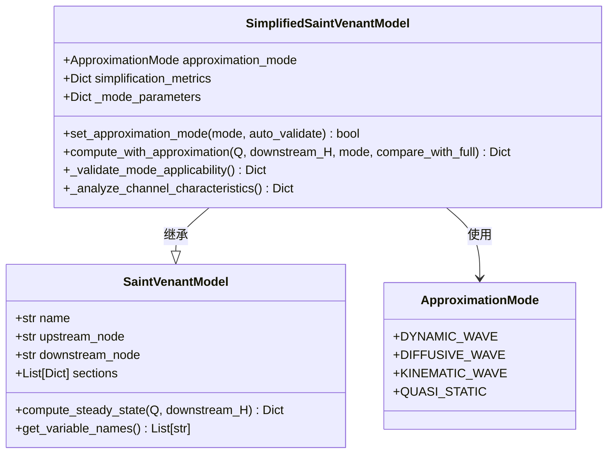
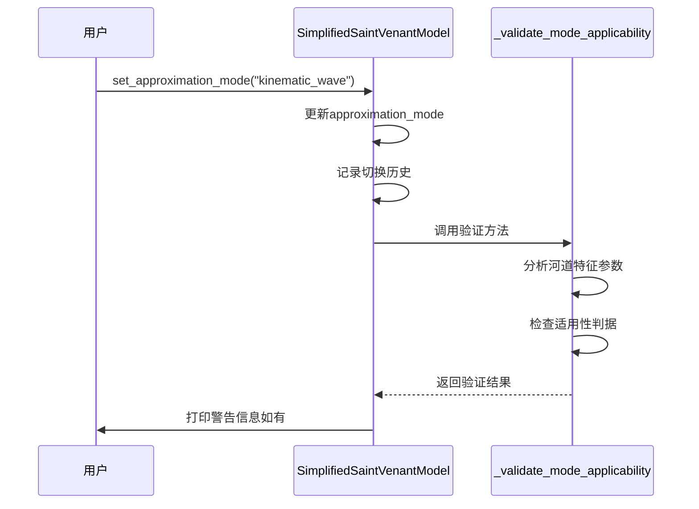
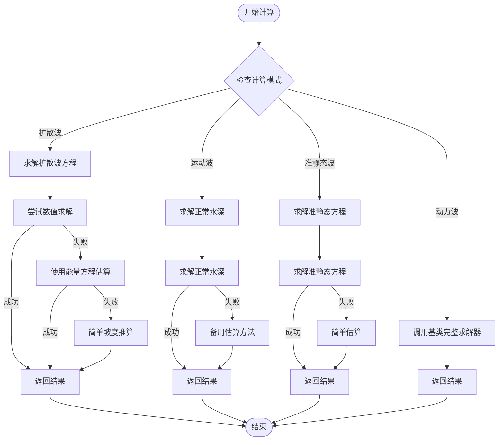

# 简化圣维南模型

<cite>
**本文档引用文件**   
- [simplified_saint_venant.py](file://waternet/models/simplified_saint_venant.py)
- [saint_venant.py](file://waternet/models/saint_venant.py)
- [approximation_selector.py](file://waternet/models/approximation_selector.py)
- [SIMPLIFICATION_MODES_IMPLEMENTATION_REPORT.md](file://SIMPLIFICATION_MODES_IMPLEMENTATION_REPORT.md)
</cite>

## 目录
1. [简介](#简介)
2. [核心架构与继承关系](#核心架构与继承关系)
3. [ApproximationMode枚举类型](#approximationmode枚举类型)
4. [模式切换与自动验证机制](#模式切换与自动验证机制)
5. [简化计算方法实现](#简化计算方法实现)
6. [性能与精度对比分析](#性能与精度对比分析)
7. [代码示例与使用方法](#代码示例与使用方法)
8. [结论](#结论)

## 简介
简化圣维南模型（SimplifiedSaintVenantModel）是基于完整圣维南方程组的扩展实现，旨在提供多种简化计算模式以适应不同工程需求。该模型在继承原有SaintVenantModel功能的基础上，引入了四种简化模式：动力波、扩散波、运动波和准静态波。每种模式通过不同程度的物理假设简化方程复杂度，在保证合理精度的同时显著提升计算效率。系统还集成了智能模式选择器（ApproximationSelector），可根据河道特征参数自动推荐最优计算模式，并提供适用性判据和性能监控功能。

**Section sources**
- [simplified_saint_venant.py](file://waternet/models/simplified_saint_venant.py#L1-L50)
- [SIMPLIFICATION_MODES_IMPLEMENTATION_REPORT.md](file://SIMPLIFICATION_MODES_IMPLEMENTATION_REPORT.md#L1-L30)

## 核心架构与继承关系
简化圣维南模型采用面向对象的继承架构，直接继承自基础的SaintVenantModel类。这种设计确保了API接口的向后兼容性，同时允许扩展新的简化功能。模型通过ApproximationMode枚举类型管理四种计算模式，并为每种模式配置特定的物理项开关参数。系统支持性能监控功能，可记录模式切换历史、计算耗时和精度指标。整体架构保持模块化和可扩展性，便于未来添加更多简化模式或优化现有算法。



**Diagram sources **
- [simplified_saint_venant.py](file://waternet/models/simplified_saint_venant.py#L37-L100)
- [saint_venant.py](file://waternet/models/saint_venant.py#L50-L100)

## ApproximationMode枚举类型
ApproximationMode枚举类型定义了四种圣维南方程的简化模式，每种模式对应不同的物理假设和适用场景。动力波模式（DYNAMIC_WAVE）保留完整方程的所有项，适用于高精度计算；扩散波模式（DIFFUSIVE_WAVE）忽略惯性项，适用于中等坡度河道；运动波模式（KINEMATIC_WAVE）仅保留摩阻项，适用于陡坡急流条件；准静态波模式（QUASI_STATIC）忽略局部惯性项但保留对流效应，适用于缓变流分析。该枚举类型作为模式选择的核心标识，确保类型安全和代码可读性。

**Section sources**
- [simplified_saint_venant.py](file://waternet/models/simplified_saint_venant.py#L29-L34)

## 模式切换与自动验证机制
模型通过set_approximation_mode方法实现模式切换功能，支持字符串或枚举类型输入。切换时会记录历史信息并打印详细日志。系统内置自动验证机制，通过_analyze_channel_characteristics方法分析河道特征参数，包括平均坡度、弗劳德数和几何复杂度。基于这些参数，_validate_mode_applicability方法根据预设判据评估当前模式的适用性。例如，当选择运动波模式但坡度小于0.002时，系统会发出警告并推荐扩散波模式。这种机制确保用户在选择不合适的模式时能及时获得反馈和改进建议。



**Diagram sources **
- [simplified_saint_venant.py](file://waternet/models/simplified_saint_venant.py#L128-L172)
- [simplified_saint_venant.py](file://waternet/models/simplified_saint_venant.py#L173-L254)

## 简化计算方法实现
compute_with_approximation方法根据当前模式选择不同的计算路径。动力波模式复用基类的完整求解器；扩散波模式基于∂H/∂x = S0 - Sf方程，结合曼宁公式迭代求解水位；运动波模式假设S0 = Sf，通过求解正常水深获得结果；准静态波模式保留对流项，使用改进的能量方程进行计算。各模式均采用从下游向上游逐段计算的策略，确保边界条件正确传递。系统实现了多重备用方案，当主求解器失败时可自动切换到能量方程估算或简单坡度推算，保证计算的鲁棒性。



**Diagram sources **
- [simplified_saint_venant.py](file://waternet/models/simplified_saint_venant.py#L255-L330)
- [simplified_saint_venant.py](file://waternet/models/simplified_saint_venant.py#L337-L394)
- [simplified_saint_venant.py](file://waternet/models/simplified_saint_venant.py#L550-L605)
- [simplified_saint_venant.py](file://waternet/models/simplified_saint_venant.py#L778-L823)

## 性能与精度对比分析
不同简化模式在计算精度和性能方面表现出显著差异。根据实施报告中的性能验证结果，扩散波模式相比完整动力波模式可获得1.23倍的加速比，同时保持较高的计算精度；运动波模式适用于陡坡河道的快速评估；准静态波模式在缓变流分析中表现良好。系统提供了AccuracyComparator组件，可量化分析各模式与完整模型之间的RMSE、R²等误差指标。用户可根据具体应用场景，在计算效率和物理准确性之间做出权衡选择。

**Section sources**
- [SIMPLIFICATION_MODES_IMPLEMENTATION_REPORT.md](file://SIMPLIFICATION_MODES_IMPLEMENTATION_REPORT.md#L100-L150)

## 代码示例与使用方法
以下代码示例展示了如何初始化简化圣维南模型、切换计算模式并执行简化计算：

```python
# 初始化模型
model = SimplifiedSaintVenantModel(
    name="DemoChannel",
    upstream_node="upstream",
    downstream_node="downstream",
    sections=sections_data,
    approximation_mode="dynamic_wave",
    enable_performance_monitoring=True
)

# 切换到扩散波模式
model.set_approximation_mode("diffusive_wave", auto_validate=True)

# 执行简化计算
result = model.compute_with_approximation(
    Q=50.0,
    downstream_H=101.0,
    mode="kinematic_wave",
    compare_with_full=True
)

# 获取性能指标
print(f"计算耗时: {result['computation_time']:.6f} 秒")
if 'accuracy_comparison' in result:
    print(f"体积相对误差: {result['accuracy_comparison']['volume_error']['relative']:.6f}")
```

**Section sources**
- [simplified_saint_venant.py](file://waternet/models/simplified_saint_venant.py#L255-L330)
- [SIMPLIFICATION_MODES_IMPLEMENTATION_REPORT.md](file://SIMPLIFICATION_MODES_IMPLEMENTATION_REPORT.md#L200-L250)

## 结论
简化圣维南模型成功实现了四种圣维南方程的简化计算模式，为不同工程应用场景提供了灵活的选择。系统通过智能验证机制确保模式选择的科学性，同时保持了与原有API的完全兼容。各简化模式在特定条件下能够显著提升计算效率，而精度对比分析功能则为用户提供了决策支持。该实现不仅增强了WaterNet的技术能力，也为水力学数值仿真领域提供了一个完整的简化模式解决方案，具有重要的学术价值和工程应用价值。