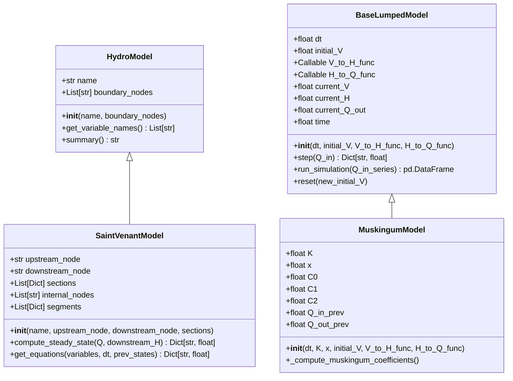
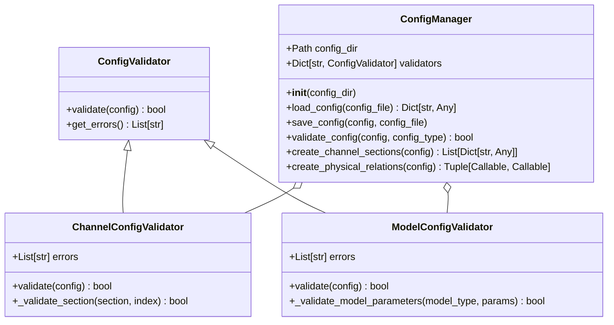
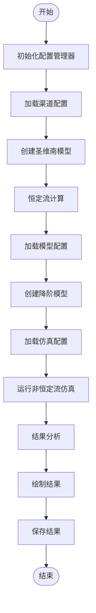
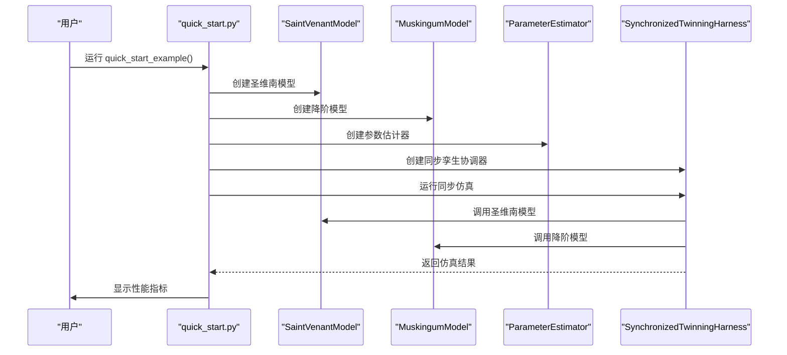
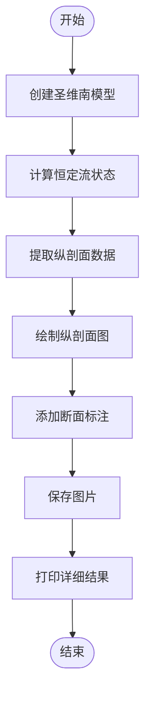

# 基础示例

<cite>
**本文档引用的文件**   
- [basic_usage.py](file://examples/basic_usage.py)
- [quick_start.py](file://examples/quick_start.py)
- [profile_visualization.py](file://examples/basic/profile_visualization.py)
- [simple_channel.yaml](file://configs/example_configs/simple_channel.yaml)
- [saint_venant.py](file://waternet/models/saint_venant.py)
- [lumped_models.py](file://waternet/models/lumped_models.py)
- [config.py](file://waternet/config/__init__.py)
</cite>

## 目录
1. [简介](#简介)
2. [项目结构概览](#项目结构概览)
3. [核心组件解析](#核心组件解析)
4. [基础使用示例详解](#基础使用示例详解)
5. [快速开始示例](#快速开始示例)
6. [断面可视化分析](#断面可视化分析)
7. [配置文件详解](#配置文件详解)
8. [常见问题与调试建议](#常见问题与调试建议)
9. [总结](#总结)

## 简介

本教程旨在为初学者提供一个清晰、可运行的WaterNet框架基础使用指南。通过`basic_usage.py`、`quick_start.py`和`profile_visualization.py`三个核心示例，您将学习如何快速创建水力模型、加载配置文件、执行仿真并可视化结果。教程内容涵盖了模型初始化、仿真运行和结果输出的关键步骤，特别适合水力学背景较弱的开发者快速上手。

**本文档来源**
- [basic_usage.py](file://examples/basic_usage.py#L1-L607)
- [quick_start.py](file://examples/quick_start.py#L1-L105)
- [profile_visualization.py](file://examples/basic/profile_visualization.py#L1-L294)

## 项目结构概览

WaterNet项目采用模块化设计，主要目录结构如下：

```
WaterNet/
├── configs/                  # 配置文件目录
├── examples/                 # 示例代码目录
│   ├── basic/                # 基础示例
│   ├── advanced/             # 高级示例
│   └── configs/              # 示例配置文件
├── waternet/                 # 核心库代码
│   ├── models/               # 水力模型实现
│   ├── config/               # 配置管理
│   └── interfaces/           # 接口定义
└── scripts/                  # 脚本工具
```

关键文件包括：
- `examples/basic_usage.py`: 基础使用示例，展示完整工作流程
- `examples/quick_start.py`: 快速开始示例，最简化的使用方式
- `examples/basic/profile_visualization.py`: 断面数据可视化示例
- `configs/example_configs/`: 包含各种配置文件模板

**本文档来源**
- [basic_usage.py](file://examples/basic_usage.py#L1-L607)
- [quick_start.py](file://examples/quick_start.py#L1-L105)

## 核心组件解析

WaterNet框架的核心组件包括水力模型、配置管理器和仿真流程。这些组件协同工作，实现了从模型创建到结果可视化的完整流程。

### 水力模型

框架提供了两种主要的水力模型：

1. **圣维南模型 (SaintVenantModel)**: 基于完整的圣维南方程组，适用于高精度的非恒定流计算。
2. **降阶模型 (Reduced Order Models)**: 包括马斯京干模型等，计算效率高，适用于实时仿真。



**图示来源**
- [saint_venant.py](file://waternet/models/saint_venant.py#L32-L646)
- [lumped_models.py](file://waternet/models/lumped_models.py#L665-L790)

### 配置管理器

配置管理器负责加载和管理各种配置文件，是连接模型与配置的桥梁。



**图示来源**
- [config.py](file://waternet/config/__init__.py#L237-L520)

## 基础使用示例详解

`basic_usage.py`是WaterNet框架的完整使用示例，展示了从配置加载到结果可视化的完整工作流程。

### 主要流程

1. **初始化配置管理器**
2. **加载渠道配置并创建圣维南模型**
3. **执行恒定流计算**
4. **创建降阶模型**
5. **运行非恒定流仿真**
6. **结果分析和可视化**



**图示来源**
- [basic_usage.py](file://examples/basic_usage.py#L1-L607)

### 关键代码结构

`basic_usage.py`中的`main()`函数是整个示例的核心，它按照以下步骤执行：

1. **配置管理器初始化**: 创建`ConfigManager`实例，指定配置文件目录。
2. **渠道模型创建**: 加载`simple_channel.yaml`配置，创建圣维南模型。
3. **恒定流计算**: 使用`compute_steady_state()`方法计算恒定流水面线。
4. **降阶模型创建**: 加载`muskingum_model.yaml`配置，创建马斯京干模型。
5. **仿真运行**: 加载`simulation_config.yaml`配置，运行非恒定流仿真。
6. **结果处理**: 分析仿真结果，生成图表并保存数据。

**本文档来源**
- [basic_usage.py](file://examples/basic_usage.py#L1-L607)

## 快速开始示例

`quick_start.py`提供了最简化的使用方式，适合快速验证框架功能。

### 最简使用流程

```python
from waternet import SaintVenantModel, MuskingumModel

# 1. 创建简单明渠模型
sections = [
    {
        'mileage': 0.0, 'elevation': 100.0, 'roughness': 0.025,
        'area_func': lambda h: max(0, h - 100) * 10,
        'top_width_func': lambda h: 10 if h > 100 else 0
    },
    {
        'mileage': 1000.0, 'elevation': 99.0, 'roughness': 0.025,
        'area_func': lambda h: max(0, h - 99) * 10,
        'top_width_func': lambda h: 10 if h > 99 else 0
    }
]

sv_model = SaintVenantModel("TestChannel", "upstream", "downstream", sections)

# 2. 创建降阶模型
def V_to_H(V):
    return 99 + V / 10000

def H_to_Q(H):
    return max(0, (H - 99) * 20)

rom_model = MuskingumModel(
    dt=60.0, K=3600.0, x=0.2, initial_V=10000.0,
    V_to_H_func=V_to_H, H_to_Q_func=H_to_Q
)
```

### 代码执行流程



**图示来源**
- [quick_start.py](file://examples/quick_start.py#L1-L105)

## 断面可视化分析

`profile_visualization.py`展示了如何对水力模型的断面数据进行详细可视化分析。

### 可视化内容

该脚本生成了包含五个子图的综合图表，全面展示水力特性：

1. **水位纵剖面图**: 显示河底高程和水面线
2. **水深分布**: 显示各断面的水深变化
3. **流速分布**: 显示各断面的流速变化
4. **流量分布**: 显示恒定流条件下的流量沿程分布
5. **过水断面面积**: 显示各断面的过水面积



**图示来源**
- [profile_visualization.py](file://examples/basic/profile_visualization.py#L1-L294)

### 详细结果输出

脚本不仅生成图表，还输出详细的计算结果，包括：

- 边界条件
- 水位纵剖面详情
- 整体水力特性
- 物理合理性验证
- 圣维南模型对比

这些信息有助于深入理解模型的计算过程和结果可靠性。

**本文档来源**
- [profile_visualization.py](file://examples/basic/profile_visualization.py#L1-L294)

## 配置文件详解

WaterNet框架使用YAML格式的配置文件来定义模型参数和仿真设置。

### simple_channel.yaml

该文件定义了简单矩形明渠的几何参数：

```yaml
name: simple_rectangular_channel
description: 简单矩形明渠示例
sections:
  - mileage: 0.0
    elevation: 100.0
    roughness: 0.025
    cross_section:
      type: rectangular
      width: 10.0
  - mileage: 500.0
    elevation: 99.5
    roughness: 0.025
    cross_section:
      type: rectangular
      width: 10.0
  - mileage: 1000.0
    elevation: 99.0
    roughness: 0.025
    cross_section:
      type: rectangular
      width: 10.0
```

### muskingum_model.yaml

该文件定义了马斯京干模型的参数：

```yaml
model_type: muskingum
parameters:
  K: 3600.0
  x: 0.2
  dt: 60.0
  initial_V: 12000.0

physical_relations:
  V_to_H:
    type: linear
    base_level: 99.0
    coefficient: 0.000125
  H_to_Q:
    type: weir
    threshold: 99.0
    coefficient: 25.0
    exponent: 1.5
```

### simulation_config.yaml

该文件定义了仿真设置：

```yaml
simulation_type: unsteady
time_step: 60.0
total_time: 7200.0  # 2 hours
output_interval: 60.0

boundary_conditions:
  upstream_type: flow
  downstream_type: level
  upstream_values: [8.0, 10.0, 12.0, 15.0, 18.0, 15.0, 12.0, 10.0, 8.0]
  downstream_values: 99.4

output:
  save_results: true
  output_format: csv
  plot_results: true
```

**本文档来源**
- [simple_channel.yaml](file://configs/example_configs/simple_channel.yaml#L1-L21)
- [muskingum_model.yaml](file://examples/configs/muskingum_model.yaml#L1-L17)
- [simulation_config.yaml](file://examples/configs/simulation_config.yaml#L1-L15)

## 常见问题与调试建议

在使用WaterNet框架时，可能会遇到一些常见问题。以下是排查和解决这些问题的建议。

### 配置路径错误

**问题**: 配置文件无法找到。

**解决方案**:
1. 确认配置文件路径是否正确
2. 检查文件名拼写
3. 确保配置文件目录存在

```python
# 检查配置目录
config_dir = Path(__file__).parent / 'configs'
if not config_dir.exists():
    print(f"配置目录不存在: {config_dir}")
```

### 依赖缺失

**问题**: 导入模块时出现ImportError。

**解决方案**:
1. 确认已安装所有依赖包
2. 检查Python环境
3. 验证模块路径

```bash
pip install -r requirements.txt
```

### 模型参数不合理

**问题**: 模型计算不收敛或结果异常。

**解决方案**:
1. 检查参数范围是否合理
2. 验证初始条件
3. 调整时间步长

```python
# 参数验证
if K <= 0:
    raise ValueError(f"滞时常数K必须为正值，得到: {K}")
if not 0 <= x <= 0.5:
    raise ValueError(f"权重系数x必须在[0, 0.5]范围内，得到: {x}")
```

### 调试建议

1. **启用详细日志**: 在关键步骤添加打印语句
2. **分步执行**: 逐步执行代码，观察每一步的输出
3. **使用调试器**: 利用IDE的调试功能逐行执行
4. **验证中间结果**: 检查每个计算步骤的结果是否合理

**本文档来源**
- [basic_usage.py](file://examples/basic_usage.py#L1-L607)
- [quick_start.py](file://examples/quick_start.py#L1-L105)

## 总结

本教程详细介绍了WaterNet框架的基础使用方法，通过`basic_usage.py`、`quick_start.py`和`profile_visualization.py`三个示例，展示了从模型创建到结果可视化的完整流程。我们解析了核心组件的结构和功能，详细说明了配置文件的使用方法，并提供了常见问题的排查建议。

通过本教程，初学者可以快速掌握WaterNet框架的基本用法，为进一步的深入学习和应用打下坚实基础。记住，最好的学习方式是动手实践，建议您在理解示例代码的基础上，尝试修改参数和配置，观察结果的变化，从而加深对水力模型的理解。

**本文档来源**
- [basic_usage.py](file://examples/basic_usage.py#L1-L607)
- [quick_start.py](file://examples/quick_start.py#L1-L105)
- [profile_visualization.py](file://examples/basic/profile_visualization.py#L1-L294)