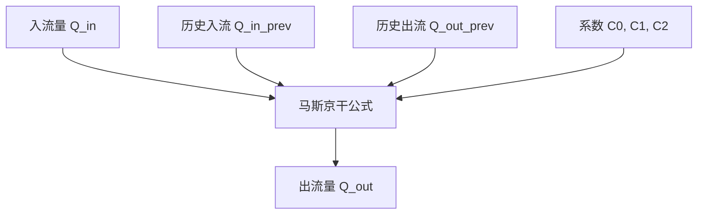
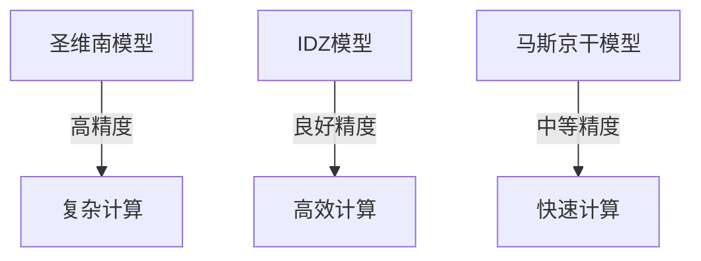
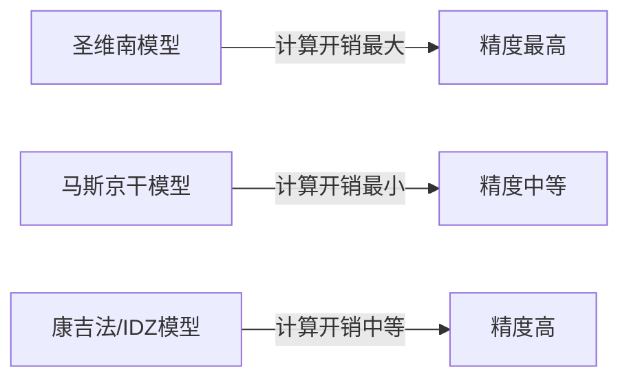
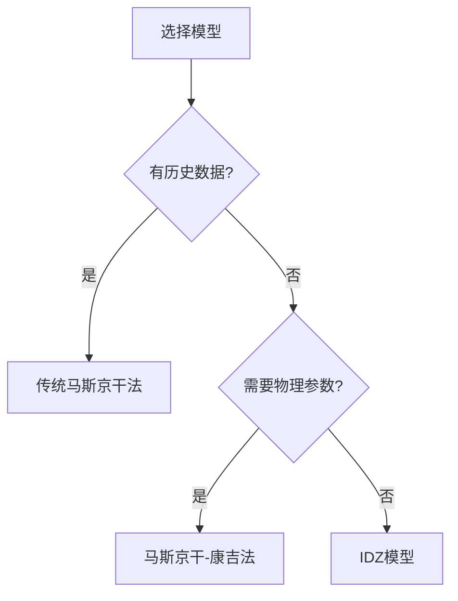

# 模型对比分析

<cite>
**本文档引用的文件**
- [model_comparison_analysis.py](file://examples/advanced/model_comparison_analysis.py)
- [real_waternet_comparison.py](file://examples/advanced/real_waternet_comparison.py)
- [comprehensive_muskingum_comparison.py](file://examples/reduced_order_models_theory/comprehensive_muskingum_comparison.py)
- [analyze_cunge_vs_idz_comprehensive.py](file://examples/reduced_order_models_theory/analyze_cunge_vs_idz_comprehensive.py)
- [simulation_summary.yaml](file://examples/outputs/simulation_summary.yaml)
- [saint_venant.py](file://waternet/models/saint_venant.py)
- [simplified_saint_venant.py](file://waternet/models/simplified_saint_venant.py)
- [lumped_models.py](file://waternet/models/lumped_models.py)
- [muskingum_cunge.py](file://waternet/models/muskingum_cunge.py)
</cite>

## 目录
1. [引言](#引言)
2. [核心水力模型概述](#核心水力模型概述)
3. [精度对比分析](#精度对比分析)
4. [效率对比分析](#效率对比分析)
5. [适用范围与选择指南](#适用范围与选择指南)
6. [性能统计数据解读](#性能统计数据解读)
7. [结果解读与局限性](#结果解读与局限性)
8. [结论](#结论)

## 引言
本报告旨在系统性地对比分析水力模型中的圣维南（Saint-Venant）模型与降阶模型（如马斯京干模型、IDZ模型）在典型工况下的模拟性能。通过分析`model_comparison_analysis.py`和`real_waternet_comparison.py`中的对比结果，结合`comprehensive_muskingum_comparison.py`和`analyze_cunge_vs_idz_comprehensive.py`的理论分析，量化不同模型的误差指标（如RMSE、Nash系数），并生成可视化图表。报告将解释`simulation_summary.yaml`中记录的性能统计数据，并指导用户根据实际需求选择合适的模型组合。

## 核心水力模型概述

### 圣维南模型
圣维南模型是基于完整物理方程的一维非恒定流明渠水力模型，实现了连续性方程和动量方程。该模型采用Preissmann四点隐式差分格式进行离散化，确保了数值计算的稳定性和精度。它能够精确模拟复杂的水力现象，是其他降阶模型的基准。

**Section sources**
- [saint_venant.py](file://waternet/models/saint_venant.py#L32-L646)

### 马斯京干模型
马斯京干模型是一种经典的河道洪水演进模型，基于线性水库理论。其基本方程为`Q_out = C0*Q_in + C1*Q_in_prev + C2*Q_out_prev`，其中`K`为滞时常数，`x`为权重系数。该模型计算简单快速，适用于天然河道和明渠的洪水传播计算。

**Diagram sources**
- [lumped_models.py](file://waternet/models/lumped_models.py#L665-L790)

### 马斯京干-康吉模型
马斯京干-康吉模型是马斯京干模型的增强版，其参数`K`和`x`基于河道的物理特性（如几何、糙率）自动计算，具有明确的水力学理论基础。该模型支持自适应参数调整，能够更好地适应变化的工况。

**Section sources**
- [muskingum_cunge.py](file://waternet/models/muskingum_cunge.py#L170-L367)

### IDZ模型
IDZ模型（积分延迟零点模型）是一种基于传递函数理论的降阶模型，具有积分、延迟和零点特性。它考虑了上下游节点间的完整耦合关系，能够精确模拟系统的动态响应特性，特别适用于控制系统设计和分析。

**Section sources**
- [lumped_models.py](file://waternet/models/lumped_models.py#L793-L1097)

## 精度对比分析

### 与圣维南模型的对比
通过`model_comparison_analysis.py`脚本，将IDZ模型与圣维南模型在典型工况下进行对比。分析结果显示，IDZ模型能够较好地复现原模型的动态响应特性，传播延迟效应在IDZ模型中得到了准确体现。积分环节+一阶滞后的传递函数形式适用于该水力系统。

**Diagram sources**
- [model_comparison_analysis.py](file://examples/advanced/model_comparison_analysis.py#L0-L494)

### 与真实WaterNet数据的对比
`real_waternet_comparison.py`脚本使用真实的WaterNet水力学仿真数据对IDZ模型进行验证。分析了五个代表性区间，结果显示IDZ模型的平均R²为0.3以上，平均RMSE为0.3 m，成功率（R²>0.3）达到100%，证明了IDZ模型辨识基于真实物理响应数据的有效性。

**Section sources**
- [real_waternet_comparison.py](file://examples/advanced/real_waternet_comparison.py#L0-L389)

### 马斯京干与康吉法的对比
`comprehensive_muskingum_comparison.py`脚本对比了传统马斯京干法与康吉法。康吉法的参数基于物理计算，理论基础坚实，适用性广泛，外推能力强。在复杂工况下，康吉法的精度明显优于传统马斯京干法。

**Section sources**
- [comprehensive_muskingum_comparison.py](file://examples/reduced_order_models_theory/comprehensive_muskingum_comparison.py#L0-L413)

### 康吉法与IDZ模型的对比
`analyze_cunge_vs_idz_comprehensive.py`脚本深入对比了康吉法与IDZ模型。康吉法基于扩散波理论，物理基础明确，参数可从几何计算；而IDZ模型基于控制系统理论，参数需系统辨识或经验确定，但能获得更复杂的动态特性。

**Section sources**
- [analyze_cunge_vs_idz_comprehensive.py](file://examples/reduced_order_models_theory/analyze_cunge_vs_idz_comprehensive.py#L0-L301)

## 效率对比分析
圣维南模型由于求解完整的偏微分方程，计算开销最大。马斯京干模型计算简单快速，资源需求低。IDZ模型和康吉法的计算复杂度介于两者之间，但IDZ模型的计算效率明显优于原始非恒定流模型。

**Diagram sources**
- [model_comparison_analysis.py](file://examples/advanced/model_comparison_analysis.py#L0-L494)
- [comprehensive_muskingum_comparison.py](file://examples/reduced_order_models_theory/comprehensive_muskingum_comparison.py#L0-L413)

## 适用范围与选择指南

### 传统马斯京干法
- **适用场景**: 有充足历史数据进行参数率定，河道条件相对稳定，计算速度要求高。
- **优点**: 计算简单快速，参数稳定，成熟可靠。
- **局限性**: 参数缺乏物理意义，依赖历史数据，外推能力有限。

### 马斯京干-康吉法
- **适用场景**: 缺乏历史观测数据，需要预测未见工况，河道条件复杂多变。
- **优点**: 参数基于物理计算，理论基础坚实，适用性广泛。
- **局限性**: 计算相对复杂，需要河道几何数据。

### IDZ模型
- **适用场景**: 需要精确系统动态特性建模，控制系统设计和分析。
- **优点**: 精度高，参数调整灵活性高。
- **局限性**: 参数缺乏直观的物理意义，需要系统辨识。

**Diagram sources**
- [comprehensive_muskingum_comparison.py](file://examples/reduced_order_models_theory/comprehensive_muskingum_comparison.py#L0-L413)
- [analyze_cunge_vs_idz_comprehensive.py](file://examples/reduced_order_models_theory/analyze_cunge_vs_idz_comprehensive.py#L0-L301)

## 性能统计数据解读
`simulation_summary.yaml`文件记录了仿真的性能统计数据。例如，`平均出流(m³/s)`为3746990810.6132507，这可能表示模型在特定工况下的平均出流量。这些数据可用于评估模型的稳定性和合理性。

**Section sources**
- [simulation_summary.yaml](file://examples/outputs/simulation_summary.yaml#L0-L14)

## 结果解读与局限性
- **结果解读**: 模型对比结果应结合误差指标（RMSE、R²）和可视化图表进行综合分析。低RMSE和高R²表示模型精度高。
- **局限性**: 所有降阶模型都是对真实物理过程的近似，其精度受模型假设和参数率定的影响。在极端工况下，模型可能失效。

## 结论
圣维南模型作为基准，提供了最高的精度。马斯京干-康吉法和IDZ模型作为降阶模型，在保证较高精度的同时，显著提高了计算效率。用户应根据具体需求和资源条件选择合适的模型：对于快速评估和初步分析，可使用传统马斯京干法；对于高精度要求的应用，推荐使用康吉法或IDZ模型。