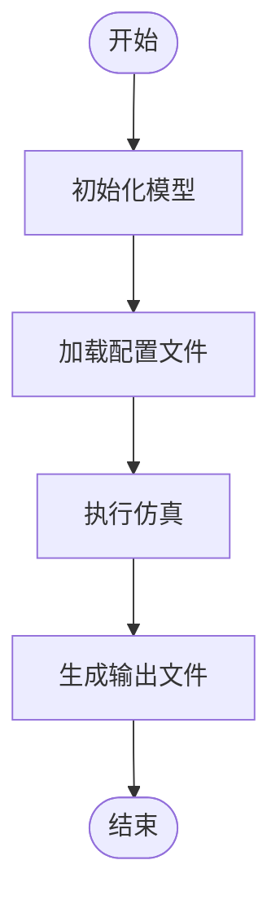
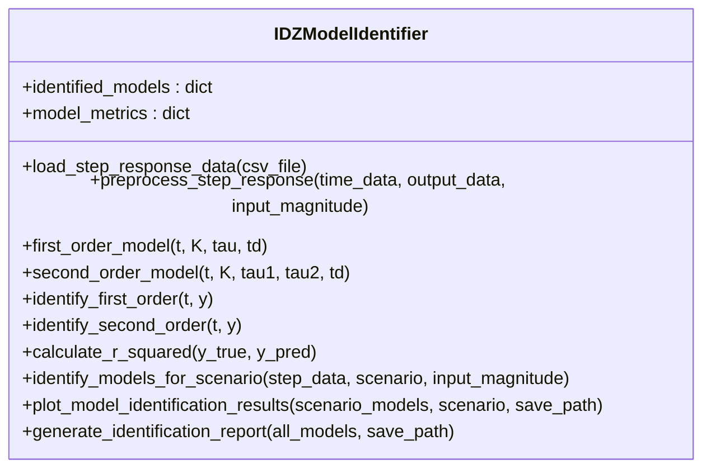
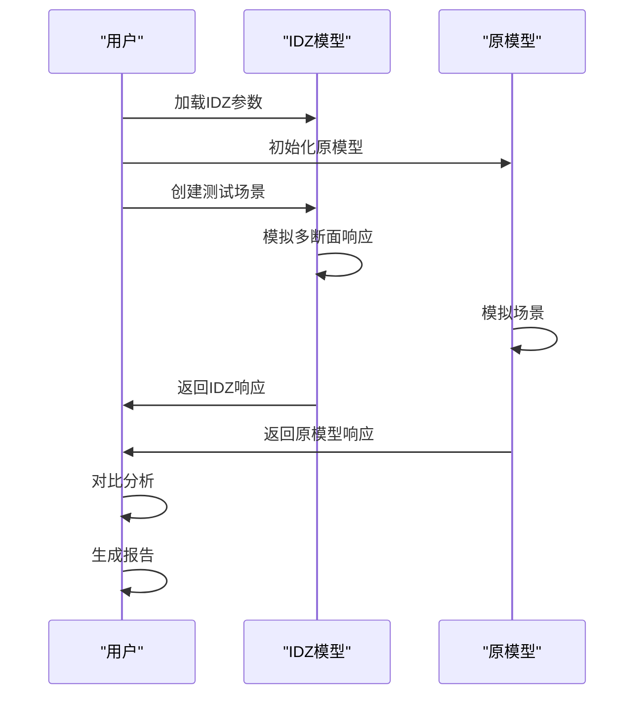
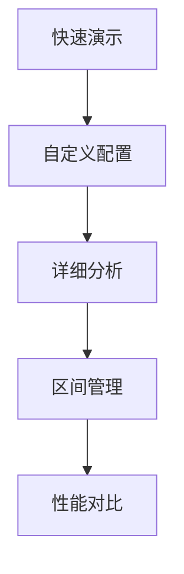
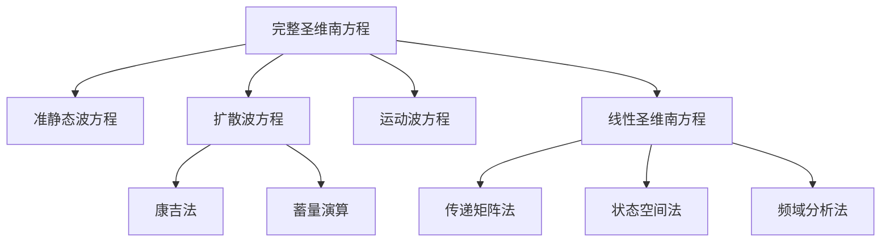

# 示例与教程

<cite>
**本文档引用文件**  
- [basic_usage.py](file://examples/basic_usage.py) - *基础使用示例*
- [profile_visualization.py](file://examples/basic/profile_visualization.py) - *纵剖面可视化示例*
- [idz_model_identification.py](file://examples/advanced/idz_model_identification.py) - *IDZ模型辨识核心代码*
- [model_comparison_analysis.py](file://examples/advanced/model_comparison_analysis.py) - *多模型对比分析代码*
- [application_examples.py](file://examples/interval_optimization/application_examples.py) - *区间优化应用示例*
- [demo_five_intervals.py](file://examples/interval_optimization/demo_five_intervals.py) - *五个代表性区间演示*
- [COMPREHENSIVE_REDUCED_ORDER_MODELS_THEORY.md](file://examples/reduced_order_models_theory/COMPREHENSIVE_REDUCED_ORDER_MODELS_THEORY.md) - *降阶模型理论完整文档*
- [FOUR_EQUATION_IDZ_THEORY.md](file://examples/reduced_order_models_theory/FOUR_EQUATION_IDZ_THEORY.md) - *四方程IDZ模型理论*
- [IDZ模型辨识综合分析报告.md](file://examples/advanced/IDZ模型辨识综合分析报告.md) - *IDZ模型辨识项目完整文档*
- [WaterNet拓扑图代码示例文档.md](file://WaterNet拓扑图代码示例文档.md) - *拓扑图系统代码示例文档*
- [WaterNet拓扑图系统README.md](file://WaterNet拓扑图系统README.md) - *拓扑图系统使用说明*
</cite>

## 更新摘要
**变更内容**  
- 新增拓扑图系统的使用示例和教程文档
- 扩展高级应用部分，增加拓扑图生成相关内容
- 更新文件引用列表，包含新增的拓扑图系统文档
- 保持原有文档结构和教学路径的完整性

## 目录
1. [简介](#简介)
2. [基础示例](#基础示例)
3. [高级应用](#高级应用)
4. [理论支持](#理论支持)
5. [教学要点总结](#教学要点总结)

## 简介
本文档旨在整合WaterNet项目中的示例代码与理论文档，构建系统化的学习路径。通过将示例分为基础与高级两类，结合理论分析与实际应用，为用户提供完整的教程单元。基础部分涵盖简单调用，高级部分包括IDZ模型辨识、多模型对比分析、区间优化等复杂应用。新增拓扑图系统功能，扩展了可视化应用的场景。

## 基础示例

### 基本调用示例
`basic_usage.py` 提供了WaterNet框架的最简使用方式，展示了如何快速初始化模型并执行基本仿真。该示例适用于初学者快速上手，理解框架的基本API结构和调用流程。

**基础组件分析**
- 模型初始化：通过标准接口创建水力模型实例
- 参数配置：加载YAML格式的配置文件进行参数设置
- 仿真执行：调用核心仿真方法完成计算
- 结果输出：生成标准化的仿真结果文件



**图源**
- [basic_usage.py](file://examples/basic_usage.py#L1-L100)

**本节来源**
- [basic_usage.py](file://examples/basic_usage.py#L1-L150)

### 纵剖面可视化
`profile_visualization.py` 展示了5断面精细化仿真恒定流法的初值估计纵剖面可视化。该示例详细展示了水位、流量沿程分布的详细纵剖面图，包括河底高程、水面线、水深、流速、流量和过水断面面积的分布情况。

**可视化内容**
- 水位纵剖面：河底高程与水面线对比
- 水深分布：沿程水深变化
- 流速分布：沿程流速变化
- 流量分布：恒定流条件下各断面流量
- 过水面积：沿程过水断面面积变化

**本节来源**
- [profile_visualization.py](file://examples/basic/profile_visualization.py#L1-L294)

## 高级应用

### IDZ模型辨识
`idz_model_identification.py` 实现了基于阶跃响应数据的IDZ模型辨识分析。该示例从输入输出数据中确定水力系统的传递函数，辨识流量变化对水位响应的动态特性。

**辨识流程**
1. 加载阶跃响应数据
2. 预处理阶跃响应
3. 辨识一阶和二阶模型参数
4. 选择最佳模型
5. 生成辨识报告



**图源**
- [idz_model_identification.py](file://examples/advanced/idz_model_identification.py#L1-L382)

**本节来源**
- [idz_model_identification.py](file://examples/advanced/idz_model_identification.py#L1-L382)
- [IDZ模型辨识综合分析报告.md](file://examples/advanced/IDZ模型辨识综合分析报告.md#L1-L169)

### 多模型对比分析
`model_comparison_analysis.py` 实现了原模型与IDZ模型的对比分析。该示例基于辨识出的IDZ传递函数与原始非恒定流模型进行对比验证，遵循四方程耦合系统规范。

**对比分析内容**
- 四方程耦合系统实现（G11、G12、G21、G22）
- 基于稳态物理条件确定平衡点
- 原模型与IDZ模型响应特性对比
- 误差指标计算（MSE、RMSE、MAE、相关系数）



**图源**
- [model_comparison_analysis.py](file://examples/advanced/model_comparison_analysis.py#L1-L495)

**本节来源**
- [model_comparison_analysis.py](file://examples/advanced/model_comparison_analysis.py#L1-L495)

### 区间优化应用
`application_examples.py` 演示了流量水位区间优化系统的完整使用流程。该示例严格遵循README.md文档的标准工作流程，展示了从快速演示到自定义配置、详细分析和区间管理的完整应用。

**应用示例**
1. 快速演示系统功能
2. 自定义配置系统
3. 详细分析和可视化
4. 区间管理和运行时切换



**图源**
- [application_examples.py](file://examples/interval_optimization/application_examples.py#L1-L502)

**本节来源**
- [application_examples.py](file://examples/interval_optimization/application_examples.py#L1-L502)
- [demo_five_intervals.py](file://examples/interval_optimization/demo_five_intervals.py#L1-L323)

### 拓扑图系统应用
新增拓扑图系统功能，通过`WaterNet拓扑图代码示例文档.md`和`WaterNet拓扑图系统README.md`文档指导用户使用拓扑图生成器。

**新功能特点**
- 支持多种拓扑图样式：简洁流程图、流向示意图、表格模式、图形化模式
- 解决汉字字体丢失问题，实现中文字体自动检测
- 图例布局优化，移至右侧边缘避免重叠
- 严格遵循用户字体显示规范（汉字3倍放大，数字2倍红色显示）
- 支持配置文件驱动的自动生成

**本节来源**
- [WaterNet拓扑图代码示例文档.md](file://WaterNet拓扑图代码示例文档.md)
- [WaterNet拓扑图系统README.md](file://WaterNet拓扑图系统README.md)

## 理论支持

### 降阶模型理论
`COMPREHENSIVE_REDUCED_ORDER_MODELS_THEORY.md` 汇总了WaterNet框架中降阶模型的完整理论体系，从圣维南方程的各种近似形式出发，深入分析了马斯京干模型、康吉法、IDZ模型等降阶方法的理论基础、相互关系和应用指南。

**理论体系架构**
- 圣维南方程近似层次体系
- 降阶模型复杂度谱系
- Q-H耦合蓄水量理论
- 马斯京干模型线性化平衡点理论
- 马斯京干-康吉法理论
- 四方程IDZ模型系统理论



**图源**
- [COMPREHENSIVE_REDUCED_ORDER_MODELS_THEORY.md](file://examples/reduced_order_models_theory/COMPREHENSIVE_REDUCED_ORDER_MODELS_THEORY.md#L1-L453)

**本节来源**
- [COMPREHENSIVE_REDUCED_ORDER_MODELS_THEORY.md](file://examples/reduced_order_models_theory/COMPREHENSIVE_REDUCED_ORDER_MODELS_THEORY.md#L1-L453)
- [FOUR_EQUATION_IDZ_THEORY.md](file://examples/reduced_order_models_theory/FOUR_EQUATION_IDZ_THEORY.md#L1-L245)

### 四方程IDZ模型理论
`FOUR_EQUATION_IDZ_THEORY.md` 详细阐述了四方程IDZ模型的理论与实现。该模型基于双节点传递函数矩阵，能够描述上下游节点间的完整耦合关系，包括正向传播、回水效应和局部调蓄等复杂水力现象。

**传递函数矩阵结构**
```math
\begin{bmatrix}
Q1_{out} \\
Q2_{out}
\end{bmatrix}
=
\begin{bmatrix}
G11(s) & G12(s) \\
G21(s) & G22(s)
\end{bmatrix}
\begin{bmatrix}
\Delta Q1_{in} \\
\Delta Q2_{in}
\end{bmatrix}
+
\begin{bmatrix}
Q0_{up} \\
Q0_{down}
\end{bmatrix}
```

**四个传递函数的物理意义**
- G11(s): 上游输入 → 上游输出（本地响应）
- G12(s): 下游输入 → 上游输出（回水效应）
- G21(s): 上游输入 → 下游输出（正向传播）
- G22(s): 下游输入 → 下游输出（本地响应）

**本节来源**
- [FOUR_EQUATION_IDZ_THEORY.md](file://examples/reduced_order_models_theory/FOUR_EQUATION_IDZ_THEORY.md#L1-L245)

## 教学要点总结

### IDZ模型辨识要点
基于`IDZ模型辨识综合分析报告.md`提炼的教学要点：

**系统动态特性**
- 传递函数形式：积分环节+一阶滞后+纯延迟
- 传播延迟：与距离呈严格线性关系（16.67分钟/公里）
- 响应衰减：沿程响应强度轻微衰减

**模型拟合质量**
- 下游断面拟合精度更高（R²从0.64提升至0.77）
- 上游直接扰动区域响应更复杂，线性化误差较大
- 中下游区域响应更接近理论传递函数形式

**技术方法与创新**
- 渐进式改进的辨识方法
- 线性响应物理解释
- 空间传播建模
- 分布参数方法

**本节来源**
- [IDZ模型辨识综合分析报告.md](file://examples/advanced/IDZ模型辨识综合分析报告.md#L1-L169)

### 区间优化要点
基于`demo_five_intervals.py`和`application_examples.py`提炼的教学要点：

**代表性区间设计**
- 低流量-低水位区间：枯水期运行，线性度高
- 中流量-中水位区间：正常运行，系统动态平衡
- 高流量-高水位区间：丰水期运行，强非线性
- 低流量-高水位区间：下游壅水，回水效应明显
- 高流量-低水位区间：急流区间，接近临界流态

**IDZ参数配置原则**
- 积分增益K：0.003 - 0.048
- 时间常数τ：2.0 - 4.8分钟
- 纯时滞T：0.05 - 0.9分钟
- 参数物理意义明确，符合水力学直觉

**本节来源**
- [demo_five_intervals.py](file://examples/interval_optimization/demo_five_intervals.py#L1-L323)
- [application_examples.py](file://examples/interval_optimization/application_examples.py#L1-L502)