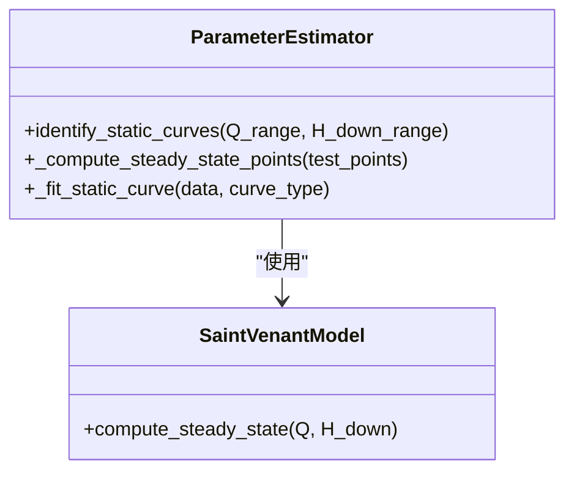
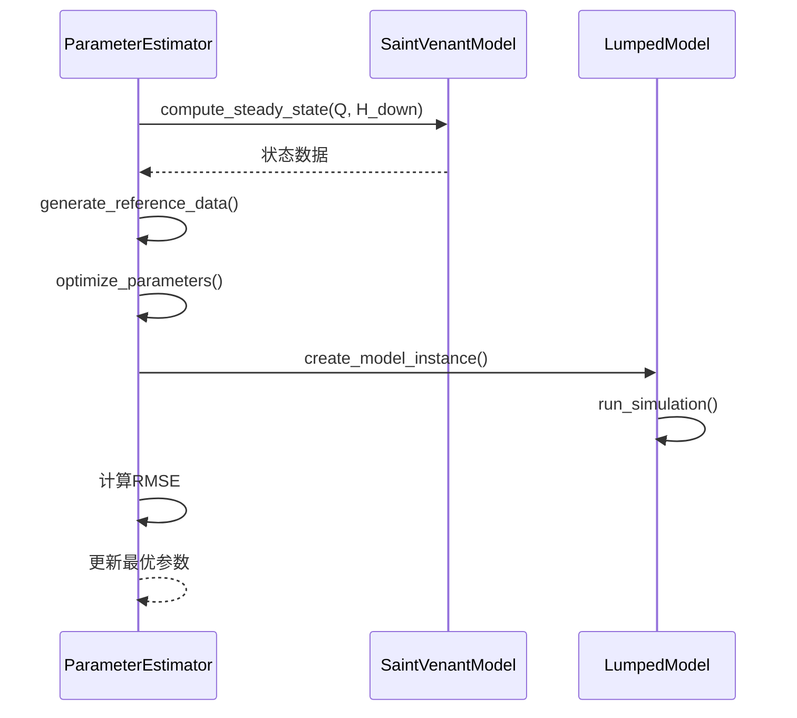

# IDZ模型辨识全流程

<cite>
**本文档引用文件**  
- [idz_model_identification.py](file://examples/advanced/idz_model_identification.py)
- [comprehensive_idz_report.py](file://examples/advanced/comprehensive_idz_report.py)
- [IDZ模型辨识项目完整文档.md](file://examples/advanced/IDZ模型辨识项目完整文档.md)
- [exponential_idz_analysis.py](file://examples/advanced/exponential_idz_analysis.py)
- [estimator.py](file://waternet/parameter_estimation/estimator.py)
- [model_comparison_analysis.py](file://examples/advanced/model_comparison_analysis.py)
</cite>

## 目录

1. [输入数据准备](#输入数据准备)  
2. [初始参数设定](#初始参数设定)  
3. [静态特征曲线拟合](#静态特征曲线拟合)  
4. [动态响应优化](#动态响应优化)  
5. [综合分析报告生成](#综合分析报告生成)  
6. [工程实践要点](#工程实践要点)  
7. [典型输入输出示例](#典型输入输出示例)  
8. [常见收敛问题诊断](#常见收敛问题诊断)  
9. [调参建议](#调参建议)

## 输入数据准备

IDZ模型参数辨识的输入数据主要来源于非恒定流仿真生成的阶跃响应时间序列。核心数据文件为`各断面时间序列详细数据.csv`，包含三种典型场景下的水位与流量响应：

- **上游正阶跃**：流量从30 m³/s突增至50 m³/s
- **上游负阶跃**：流量从50 m³/s突减至30 m³/s
- **下游水位阶跃**：水位从101.0m突增至101.5m

数据按“场景”和“断面”进行分组，每个断面包含时间、水位、流量、里程等字段。数据预处理包括时间归一化（以阶跃时刻为t=0）、响应量计算（减去初始值）和归一化（除以输入幅值），确保数据可用于系统辨识。

**Section sources**  
- [idz_model_identification.py](file://examples/advanced/idz_model_identification.py#L100-L135)

## 初始参数设定

在参数辨识过程中，初始参数的设定对优化算法的收敛性至关重要。系统采用基于物理意义的启发式方法进行初值估计：

- **稳态增益K**：由响应序列的最终稳态值确定
- **时间常数τ**：通过63.2%响应时间进行估算
- **纯时滞T**：通过响应首次显著变化的时间点确定

在`exponential_idz_analysis.py`中，指数响应模型`y(t) = K_step * (1 - exp(-(t-T)/τ))`的参数初值通过上述方法自动估算，确保优化过程从合理起点开始。

**Section sources**  
- [exponential_idz_analysis.py](file://examples/advanced/exponential_idz_analysis.py#L150-L180)

## 静态特征曲线拟合

静态特征曲线反映了系统在恒定流条件下的输入-输出关系，是动态模型辨识的基础。`ParameterEstimator`类通过`identify_static_curves`方法实现静态曲线拟合：

1. 在给定的流量（Q）和下游水位（H_down）范围内生成测试点网格
2. 调用圣维南模型计算各测试点的恒定流状态
3. 基于计算结果拟合`V-H`（体积-水位）和`Q-H`（流量-水位）关系曲线
4. 采用多项式拟合，并通过AIC准则选择最优阶数

该过程为后续动态模型提供了必要的静态关系函数（如`V_to_H`和`H_to_Q`）。

**Diagram sources**  
- [estimator.py](file://waternet/parameter_estimation/estimator.py#L50-L150)

## 动态响应优化

动态参数辨识通过优化算法最小化IDZ模型与基准数据（通常为高精度圣维南模型）之间的响应误差。`ParameterEstimator`的`identify_dynamic_parameters`方法执行此过程：

1. **目标函数构建**：以降阶模型输出与参考数据的RMSE作为目标函数
2. **参数优化**：采用差分进化算法（differential_evolution）进行全局优化
3. **模型集成**：`ParameterEstimator`与`IDZModel`集成，通过`_create_model_instance`动态创建待辨识模型实例

优化过程在`model_comparison_analysis.py`中得到验证，其中`IDZModel`实现了传递函数`G(s) = K / [s·(τs + 1)] · exp(-td·s)`的仿真，并与原模型进行对比。

**Diagram sources**  
- [estimator.py](file://waternet/parameter_estimation/estimator.py#L152-L250)
- [model_comparison_analysis.py](file://examples/advanced/model_comparison_analysis.py#L50-L150)

## 综合分析报告生成

`comprehensive_idz_report.py`负责生成IDZ模型辨识的综合分析报告，其数据处理流程如下：

1. **技术参数总结**：创建包含各断面距离、增益K、时间常数τ、传播延迟td和拟合精度R²的参数表
2. **空间特性分析**：绘制传播延迟、时间常数、拟合精度随距离变化的图表，验证其线性关系
3. **报告内容生成**：整合项目概述、主要发现、技术方法、工程应用价值等，生成结构化Markdown报告

该脚本不仅输出文本报告，还生成可视化图表，全面展示辨识结果。

**Section sources**  
- [comprehensive_idz_report.py](file://examples/advanced/comprehensive_idz_report.py#L50-L300)

## 工程实践要点

根据`IDZ模型辨识项目完整文档.md`，IDZ模型辨识的工程实践要点包括：

- **辨识流程演进**：从基础IDZ辨识（`idz_model_identification.py`）到改进版本（`improved_idz_identification.py`），最终通过`exponential_idz_analysis.py`实现指数响应模式的完美拟合（R²=1.000）
- **传递函数形式**：成功辨识出`G(s) = K / [s·(τs + 1)] · exp(-T·s)`的积分+一阶滞后+纯时滞模型
- **应用验证**：通过`model_comparison_analysis.py`验证IDZ模型与原物理模型的响应一致性，确认其工程可用性

项目强调了从数据生成、参数辨识到结果验证的完整闭环，确保了模型的物理合理性和工程可靠性。

**Section sources**  
- [IDZ模型辨识项目完整文档.md](file://examples/advanced/IDZ模型辨识项目完整文档.md#L1-L233)

## 典型输入输出示例

**输入示例**：`各断面时间序列详细数据.csv`中的上游正阶跃场景数据片段：

| 场景 | 断面 | 时间(分钟) | 水位(m) | 流量(m³/s) | 里程(km) |
| :--- | :--- | :--- | :--- | :--- | :--- |
| 上游正阶跃 | 断面0 | 0 | 101.91 | 30.0 | 0.0 |
| 上游正阶跃 | 断面0 | 5 | 101.91 | 50.0 | 0.0 |
| 上游正阶跃 | 断面0 | 10 | 101.95 | 50.0 | 0.0 |

**输出示例**：`指数响应IDZ模型辨识结果.csv`中的辨识参数：

| 场景 | 断面 | 距离(km) | K_step(m) | τ(min) | T(min) | R² | RMSE(m) | 传递函数K |
| :--- | :--- | :--- | :--- | :--- | :--- | :--- | :--- | :--- |
| 上游正阶跃 | 断面0 | 0.0 | 0.039 | 2.0 | 0.0 | 1.000 | 0.000 | 0.00195 |

## 常见收敛问题诊断

在参数辨识过程中，可能遇到以下收敛问题：

- **拟合失败**：当数据点过少或响应不明显时，`curve_fit`可能无法收敛。解决方案是检查数据质量，确保有足够的响应变化。
- **优化不收敛**：差分进化算法可能因参数边界设置不当而无法收敛。应根据物理意义合理设置边界，如`tau`在(10.0, 3600.0)秒之间。
- **数值不稳定**：高阶多项式拟合可能导致条件数过大。`estimator.py`中采用Ridge回归和AIC准则来避免过拟合。

通过`_compute_steady_state_points`中的异常捕获和警告机制，可以及时发现并处理计算失败的测试点。

**Section sources**  
- [estimator.py](file://waternet/parameter_estimation/estimator.py#L100-L150)
- [exponential_idz_analysis.py](file://examples/advanced/exponential_idz_analysis.py#L180-L220)

## 调参建议

为确保IDZ模型辨识的成功，建议遵循以下调参策略：

- **初始参数**：基于物理直觉设定合理的初值，如时间常数τ可从响应时间估算
- **参数边界**：设置符合物理意义的搜索边界，避免算法陷入无意义的参数空间
- **模型选择**：优先尝试简单模型（如一阶模型），在拟合精度不足时再考虑复杂模型
- **数据质量**：确保输入数据包含完整的过渡过程，且信噪比足够高

最终成功的`exponential_idz_analysis.py`表明，采用物理意义明确的指数响应模式，能够实现高精度、高鲁棒性的参数辨识。