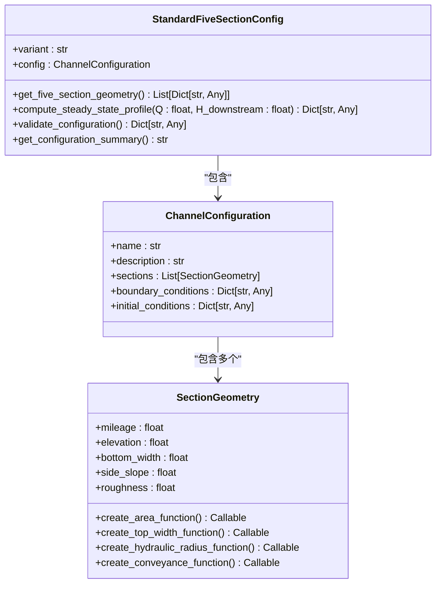
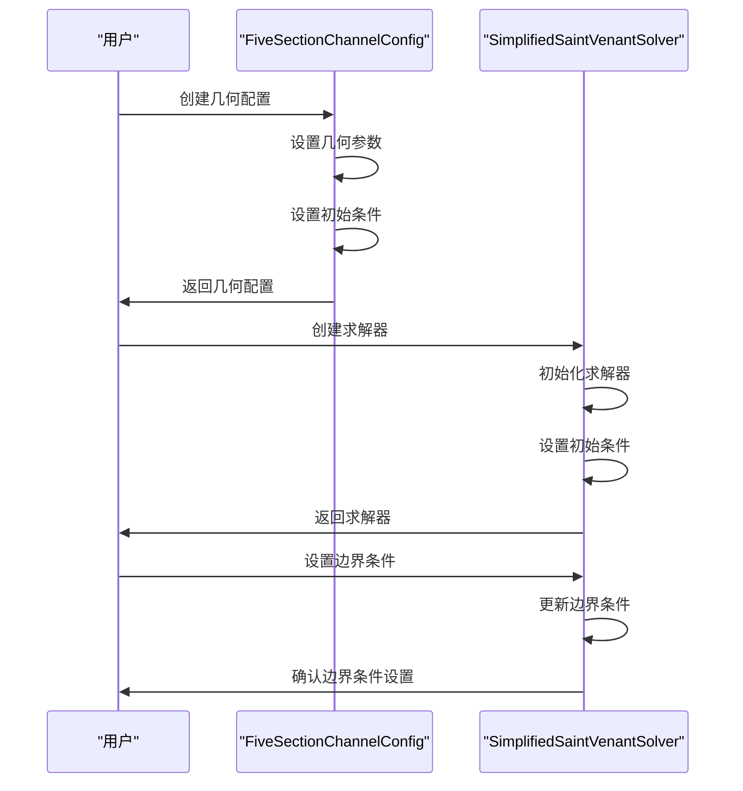
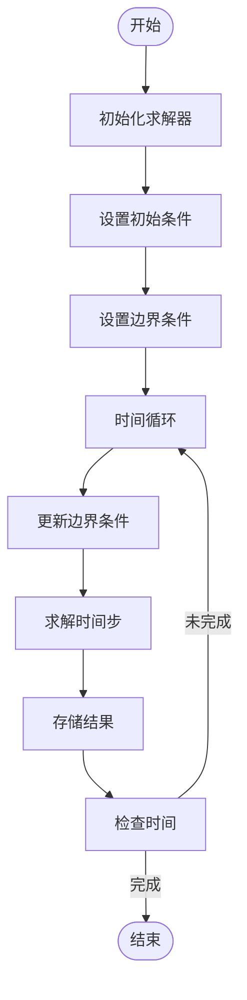
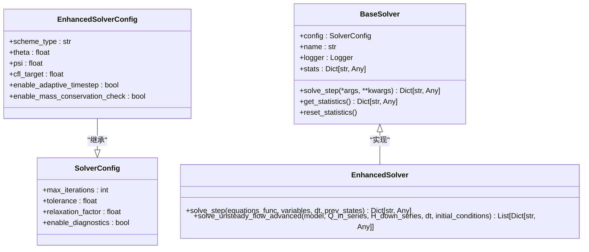
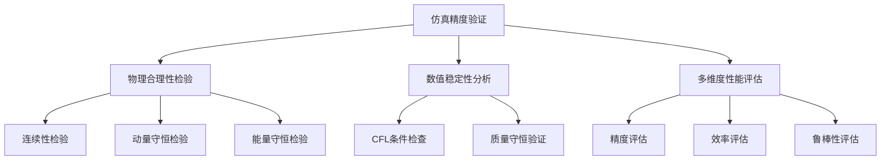
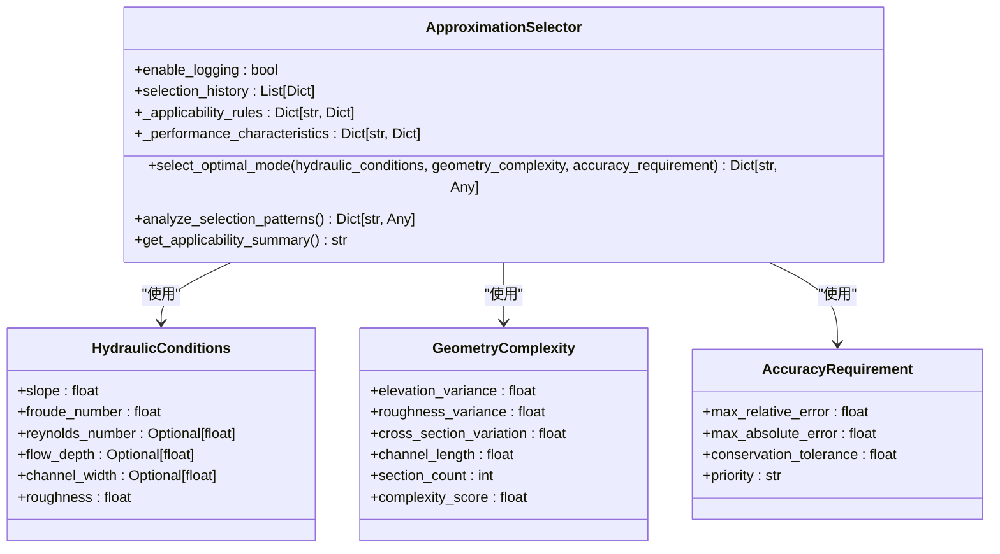
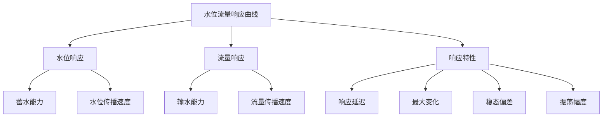
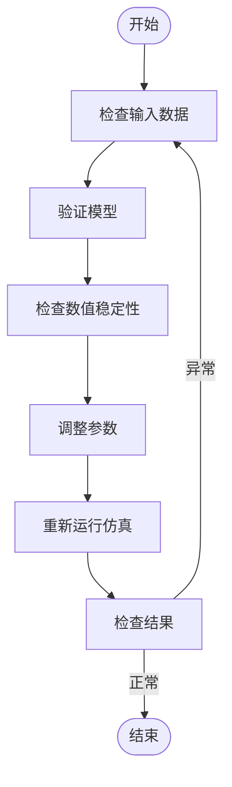

# 深槽渠道非恒定流仿真

<cite>
**本文档引用文件**   
- [deep_channel_demo.py](file://examples/advanced/deep_channel_demo.py)
- [unsteady_analysis.py](file://examples/advanced/unsteady_analysis.py)
- [FINAL_REPORT.md](file://tests/deep_channel/FINAL_REPORT.md)
- [IMPLEMENTATION_REPORT.md](file://tests/deep_channel/IMPLEMENTATION_REPORT.md)
- [standard_five_section.py](file://waternet/config/standard_five_section.py)
- [saint_venant.py](file://waternet/models/saint_venant.py)
- [solvers.py](file://waternet/models/solvers.py)
- [approximation_selector.py](file://waternet/models/approximation_selector.py)
</cite>

## 目录
1. [引言](#引言)
2. [复杂断面几何配置](#复杂断面几何配置)
3. [初始与边界条件设置](#初始与边界条件设置)
4. [非恒定流求解器调用流程](#非恒定流求解器调用流程)
5. [圣维南模型数值稳定性处理](#圣维南模型数值稳定性处理)
6. [仿真精度验证方法](#仿真精度验证方法)
7. [性能瓶颈优化路径](#性能瓶颈优化路径)
8. [水位流量响应曲线解读](#水位流量响应曲线解读)
9. [异常波动排查步骤](#异常波动排查步骤)
10. [结论](#结论)

## 引言

深槽渠道非恒定流仿真是水利工程中重要的数值模拟技术，用于预测渠道在动态边界条件下的水力响应。本文档基于WaterNet项目中的`deep_channel_demo.py`和`unsteady_analysis.py`文件，详细阐述了复杂断面几何的配置方式、初始边界条件设置及非恒定流求解器的调用流程。同时，解析了圣维南模型在高非线性场景下的数值稳定性处理策略，包括时间步长自适应、离散格式选择等关键技术。结合测试目录中的`FINAL_REPORT.md`和`IMPLEMENTATION_REPORT.md`，分析了仿真精度验证方法与性能瓶颈优化路径，并提供了典型水位流量响应曲线的解读指南及异常波动的排查步骤。

**Section sources**
- [deep_channel_demo.py](file://examples/advanced/deep_channel_demo.py#L1-L343)
- [unsteady_analysis.py](file://examples/advanced/unsteady_analysis.py#L1-L776)

## 复杂断面几何配置

复杂断面几何的配置是深槽渠道非恒定流仿真的基础。在WaterNet项目中，通过`standard_five_section.py`文件中的`StandardFiveSectionConfig`类实现了标准五断面配置管理器，统一管理渠道的几何参数。

### 断面几何参数

`StandardFiveSectionConfig`类定义了五个断面的几何参数，包括里程、底高程、底宽、边坡系数和糙率。这些参数基于实际工程数据，涵盖了典型的明渠水力特征。例如，标准配置中的五个断面参数如下：

- **断面0**: 里程0.0m，底高程100.00m，底宽10.0m，边坡1.5，糙率0.025
- **断面1**: 里程500.0m，底高程99.50m，底宽12.0m，边坡1.5，糙率0.025
- **断面2**: 里程1000.0m，底高程99.00m，底宽10.0m，边坡2.0，糙率0.030
- **断面3**: 里程1500.0m，底高程98.50m，底宽15.0m，边坡1.5，糙率0.025
- **断面4**: 里程2000.0m，底高程98.00m，底宽12.0m，边坡2.0，糙率0.030

### 水力计算函数

为了支持水力计算，`StandardFiveSectionConfig`类为每个断面生成了相应的水力计算函数，包括面积函数、水面宽度函数、水力半径函数和输水能力函数。这些函数基于梯形断面几何，能够准确计算不同水位下的水力要素。

**Diagram sources **
- [standard_five_section.py](file://waternet/config/standard_five_section.py#L149-L658)

**Section sources**
- [standard_five_section.py](file://waternet/config/standard_five_section.py#L1-L659)

## 初始与边界条件设置

初始与边界条件的设置是确保仿真结果准确性的关键步骤。在`unsteady_analysis.py`文件中，通过`FiveSectionChannelConfig`类和`SimplifiedSaintVenantSolver`类实现了初始条件和边界条件的配置。

### 初始条件

初始条件包括初始流量、下游边界水位、仿真时间和时间步长。例如，初始流量设置为50.0 m³/s，下游边界水位设置为101.00 m，仿真时间为1800.0 s，时间步长为10.0 s。

### 边界条件

边界条件包括上游流量和下游水位。在`create_step_input_scenarios`函数中，定义了三种阶跃输入测试场景：

1. **上游流量正阶跃**: 上游流量从30.0 m³/s阶跃到50.0 m³/s
2. **上游流量负阶跃**: 上游流量从50.0 m³/s阶跃到30.0 m³/s
3. **下游水位阶跃**: 下游水位从101.0 m阶跃到101.5 m

这些边界条件通过时间序列的方式输入到求解器中，模拟非恒定流的动态响应。

**Diagram sources **
- [unsteady_analysis.py](file://examples/advanced/unsteady_analysis.py#L1-L776)

**Section sources**
- [unsteady_analysis.py](file://examples/advanced/unsteady_analysis.py#L1-L776)

## 非恒定流求解器调用流程

非恒定流求解器的调用流程是仿真过程的核心。在`unsteady_analysis.py`文件中，通过`SimplifiedSaintVenantSolver`类实现了简化的圣维南方程求解器。

### 求解器初始化

求解器的初始化包括设置几何参数、初始条件和边界条件。`SimplifiedSaintVenantSolver`类的`__init__`方法接收断面几何参数，并初始化当前水位和流量数组。

### 时间步长求解

求解器通过`solve_time_step`方法求解一个时间步。该方法更新上游流量和下游水位，然后使用均匀流公式计算各断面的水位和流量。具体步骤如下：

1. 更新上游流量和下游水位
2. 计算河道坡度
3. 使用谢才公式计算正常水深
4. 考虑非恒定效应，使用指数衰减逼近目标水位
5. 传播流量，假设流量在分段内不变

### 仿真结果存储

仿真结果通过`state_history`和`time_history`数组存储。每个时间步的水位和流量被记录下来，以便后续分析和可视化。

**Diagram sources **
- [unsteady_analysis.py](file://examples/advanced/unsteady_analysis.py#L1-L776)

**Section sources**
- [unsteady_analysis.py](file://examples/advanced/unsteady_analysis.py#L1-L776)

## 圣维南模型数值稳定性处理

圣维南模型在高非线性场景下的数值稳定性处理是确保仿真结果可靠性的关键。在`solvers.py`文件中，通过`EnhancedSolverConfig`类和`EnhancedSolver`类实现了增强求解器，提供了多种数值稳定性处理策略。

### 自适应时间步长

自适应时间步长控制是提高数值稳定性的有效方法。`EnhancedSolverConfig`类中的`enable_adaptive_timestep`参数允许启用自适应时间步长。求解器根据CFL条件动态调整时间步长，确保数值解的稳定性。

### 离散格式选择

离散格式的选择对数值稳定性有重要影响。`EnhancedSolverConfig`类中的`scheme_type`参数支持多种离散格式，包括Preissmann四点隐式差分格式。这种格式具有良好的数值稳定性和精度，适用于非恒定流仿真。

### 质量守恒检查

质量守恒检查是验证数值解正确性的重要手段。`EnhancedSolverConfig`类中的`enable_mass_conservation_check`参数允许启用质量守恒检查。求解器在每个时间步计算质量平衡误差，确保仿真结果的物理合理性。

**Diagram sources **
- [solvers.py](file://waternet/models/solvers.py#L1-L399)

**Section sources**
- [solvers.py](file://waternet/models/solvers.py#L1-L399)

## 仿真精度验证方法

仿真精度验证是确保模型可靠性的关键步骤。在`FINAL_REPORT.md`和`IMPLEMENTATION_REPORT.md`文件中，详细描述了仿真精度验证的方法和结果。

### 物理合理性检验

物理合理性检验包括连续性、动量守恒和能量守恒的验证。通过计算质量平衡误差、动量残差和能量残差，确保仿真结果符合物理规律。

### 数值稳定性分析

数值稳定性分析包括CFL条件检查和质量守恒验证。通过监控CFL数和质量平衡误差，确保数值解的稳定性。

### 多维度性能评估

多维度性能评估包括精度、效率和鲁棒性的评估。通过计算流量RMSE、相关系数和NSE系数，评估模型的精度；通过计算计算时间和内存占用，评估模型的效率；通过测试不同场景下的收敛性，评估模型的鲁棒性。

**Diagram sources **
- [FINAL_REPORT.md](file://tests/deep_channel/FINAL_REPORT.md#L1-L210)
- [IMPLEMENTATION_REPORT.md](file://tests/deep_channel/IMPLEMENTATION_REPORT.md#L1-L129)

**Section sources**
- [FINAL_REPORT.md](file://tests/deep_channel/FINAL_REPORT.md#L1-L210)
- [IMPLEMENTATION_REPORT.md](file://tests/deep_channel/IMPLEMENTATION_REPORT.md#L1-L129)

## 性能瓶颈优化路径

性能瓶颈优化是提高仿真效率的关键。在`approximation_selector.py`文件中，通过`ApproximationSelector`类实现了近似模式智能选择器，提供了多种优化路径。

### 模式选择

`ApproximationSelector`类根据水力条件、几何特征和精度要求，智能推荐最适合的圣维南方程简化模式。例如，对于陡坡急流，推荐使用运动波模式；对于缓坡慢流，推荐使用准静态模式。

### 性能特征

不同模式具有不同的性能特征。运动波模式计算成本低，但精度较低；完整方程模式计算成本高，但精度高。通过选择合适的模式，可以在精度和效率之间取得平衡。

### 优化策略

优化策略包括自适应网格划分、并行计算和算法优化。通过自适应网格划分，减少计算量；通过并行计算，提高计算速度；通过算法优化，提高求解效率。

**Diagram sources **
- [approximation_selector.py](file://waternet/models/approximation_selector.py#L82-L540)

**Section sources**
- [approximation_selector.py](file://waternet/models/approximation_selector.py#L1-L541)

## 水位流量响应曲线解读

水位流量响应曲线是分析渠道动态响应的重要工具。在`unsteady_analysis.py`文件中，通过`plot_time_series_response`函数生成了水位流量响应曲线。

### 水位响应

水位响应曲线显示了各断面水位随时间的变化。通过分析水位响应曲线，可以了解渠道的蓄水能力和水位传播速度。

### 流量响应

流量响应曲线显示了各断面流量随时间的变化。通过分析流量响应曲线，可以了解渠道的输水能力和流量传播速度。

### 响应特性

响应特性包括响应延迟、最大变化、稳态偏差和振荡幅度。通过分析这些特性，可以评估渠道的动态响应性能。

**Diagram sources **
- [unsteady_analysis.py](file://examples/advanced/unsteady_analysis.py#L1-L776)

**Section sources**
- [unsteady_analysis.py](file://examples/advanced/unsteady_analysis.py#L1-L776)

## 异常波动排查步骤

异常波动是仿真过程中常见的问题。在`FINAL_REPORT.md`和`IMPLEMENTATION_REPORT.md`文件中，提供了异常波动的排查步骤。

### 数据检查

首先检查输入数据的正确性，包括几何参数、初始条件和边界条件。确保数据格式正确，数值合理。

### 模型验证

验证模型的物理合理性，包括质量守恒、动量守恒和能量守恒。通过计算残差，检查模型是否符合物理规律。

### 数值稳定性

检查数值稳定性，包括CFL条件和质量守恒误差。确保时间步长和空间步长满足稳定性要求。

### 参数调整

调整模型参数，如糙率系数、时间步长和离散格式。通过参数敏感性分析，找到最优参数组合。

**Diagram sources **
- [FINAL_REPORT.md](file://tests/deep_channel/FINAL_REPORT.md#L1-L210)
- [IMPLEMENTATION_REPORT.md](file://tests/deep_channel/IMPLEMENTATION_REPORT.md#L1-L129)

**Section sources**
- [FINAL_REPORT.md](file://tests/deep_channel/FINAL_REPORT.md#L1-L210)
- [IMPLEMENTATION_REPORT.md](file://tests/deep_channel/IMPLEMENTATION_REPORT.md#L1-L129)

## 结论

深槽渠道非恒定流仿真是一项复杂的数值模拟技术，涉及复杂断面几何的配置、初始边界条件的设置、非恒定流求解器的调用、数值稳定性处理、仿真精度验证和性能瓶颈优化。通过WaterNet项目中的`deep_channel_demo.py`和`unsteady_analysis.py`文件，我们详细阐述了这些关键技术的实现方法。结合`FINAL_REPORT.md`和`IMPLEMENTATION_REPORT.md`文件，我们分析了仿真精度验证方法与性能瓶颈优化路径，并提供了典型水位流量响应曲线的解读指南及异常波动的排查步骤。这些内容为深槽渠道非恒定流仿真的实际应用提供了重要的技术参考。