# 降阶模型简化模式切换

<cite>
**本文档引用文件**   
- [simplification_modes_demo.py](file://examples/simplification_modes_demo.py) - *新增配置管理、多模式时间序列分析和多情景验证功能*
- [approximation_selector.py](file://waternet/models/approximation_selector.py) - *更新了模式选择器的智能决策逻辑*
- [integration_interface.py](file://waternet/models/integration_interface.py) - *新增与主仿真系统的集成接口*
- [SIMPLIFICATION_MODES_IMPLEMENTATION_REPORT.md](file://SIMPLIFICATION_MODES_IMPLEMENTATION_REPORT.md) - *更新了实施报告以反映最新功能*
- [simplified_saint_venant.py](file://waternet/models/simplified_saint_venant.py) - *增强了简化模式的核心计算能力*
- [standard_five_section.py](file://waternet/config/standard_five_section.py) - *新增统一配置管理器*
</cite>

## 更新摘要
**变更内容**   
- 新增了配置管理功能，统一了项目中的重复实现
- 增加了多模式时间序列分析功能，支持五断面动态响应研究
- 扩展了多情景验证分析，涵盖标准、陡坡、缓坡、复杂几何和极端洪水五种情景
- 更新了性能摘要生成逻辑，包含成功率和平均计算时间统计
- 增强了演示程序的完整性和实用性

## 目录
1. [引言](#引言)
2. [核心组件分析](#核心组件分析)
3. [模型选择策略](#模型选择策略)
4. [切换条件判断算法](#切换条件判断算法)
5. [状态一致性保障](#状态一致性保障)
6. [集成接口设计](#集成接口设计)
7. [精度-效率权衡](#精度-效率权衡)
8. [日志分析与性能测试](#日志分析与性能测试)
9. [异常回退处理](#异常回退处理)
10. [多情景验证分析](#多情景验证分析)
11. [结论](#结论)

## 引言

WaterNet系统中的降阶模型简化模式切换机制为水力仿真提供了灵活的计算框架。该机制通过动态切换马斯京干、蓄量演算、IDZ等模型，实现了计算精度与效率的最优平衡。本文档基于`simplification_modes_demo.py`演示程序，深入解析`approximation_selector.py`中的模型选择策略、切换条件判断算法及状态一致性保障措施，结合`integration_interface.py`说明简化模式与主仿真系统的集成接口设计，并参照`SIMPLIFICATION_MODES_IMPLEMENTATION_REPORT.md`阐述各模式的精度-效率权衡曲线。

**Section sources**
- [simplification_modes_demo.py](file://examples/simplification_modes_demo.py#L1-L1206)
- [SIMPLIFICATION_MODES_IMPLEMENTATION_REPORT.md](file://SIMPLIFICATION_MODES_IMPLEMENTATION_REPORT.md#L1-L256)

## 核心组件分析

WaterNet的简化模式系统由多个核心组件构成，包括`SimplifiedSaintVenantModel`、`ApproximationSelector`、`AccuracyComparator`和`StandardFiveSectionConfig`。这些组件共同实现了从完整圣维南方程到多种简化模式的无缝切换。

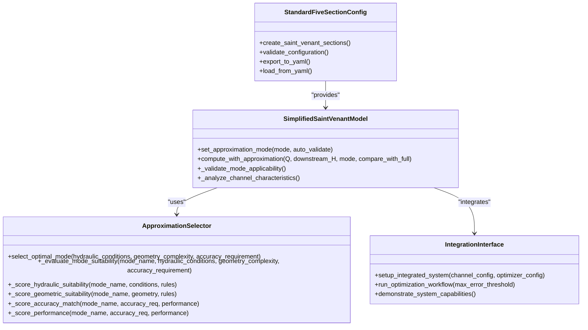

**Diagram sources**
- [simplified_saint_venant.py](file://waternet/models/simplified_saint_venant.py#L37-L1011)
- [approximation_selector.py](file://waternet/models/approximation_selector.py#L82-L540)
- [integration_interface.py](file://waternet/models/integration_interface.py#L1-L318)
- [standard_five_section.py](file://waternet/config/standard_five_section.py#L149-L658)

**Section sources**
- [simplified_saint_venant.py](file://waternet/models/simplified_saint_venant.py#L37-L1011)
- [approximation_selector.py](file://waternet/models/approximation_selector.py#L82-L540)
- [integration_interface.py](file://waternet/models/integration_interface.py#L1-L318)
- [standard_five_section.py](file://waternet/config/standard_five_section.py#L149-L658)

## 模型选择策略

`ApproximationSelector`组件实现了基于水力条件、几何特征和精度要求的智能模式选择策略。该策略通过多维度评分系统，为不同应用场景推荐最优的简化模式。

### 选择器适用性规则

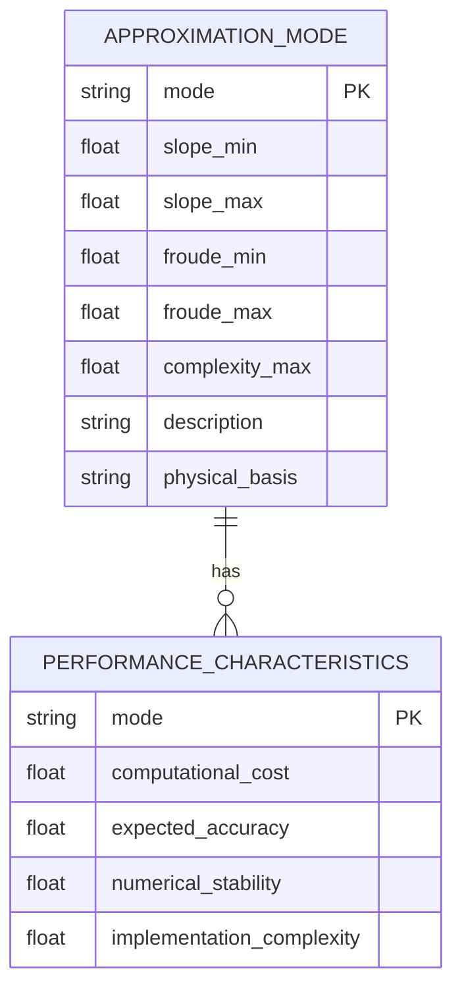

**Diagram sources**
- [approximation_selector.py](file://waternet/models/approximation_selector.py#L100-L150)

### 多维度评分系统

选择器采用加权平均方法计算总评分，权重根据精度要求的优先级动态调整：

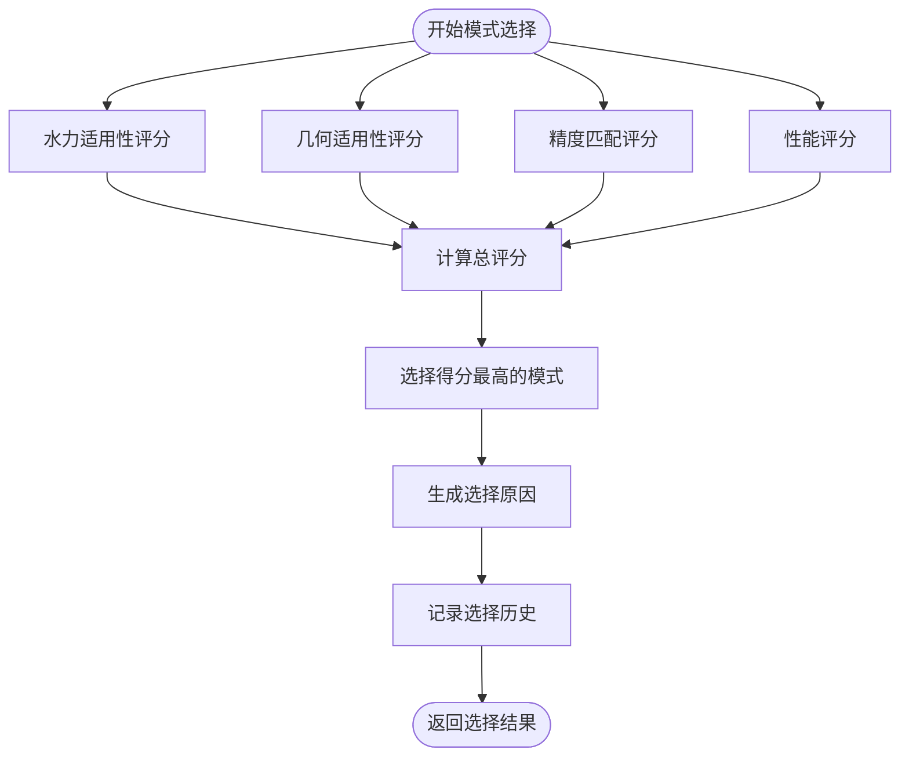

**Diagram sources**
- [approximation_selector.py](file://waternet/models/approximation_selector.py#L225-L269)

**Section sources**
- [approximation_selector.py](file://waternet/models/approximation_selector.py#L172-L223)

## 切换条件判断算法

模式切换条件判断算法基于水力条件、几何复杂度和精度要求三个维度进行综合评估。算法通过`_evaluate_mode_suitability`方法实现，为每种模式计算适用性评分。

### 水力适用性评分

水力适用性评分主要考虑坡度和弗劳德数等关键参数：

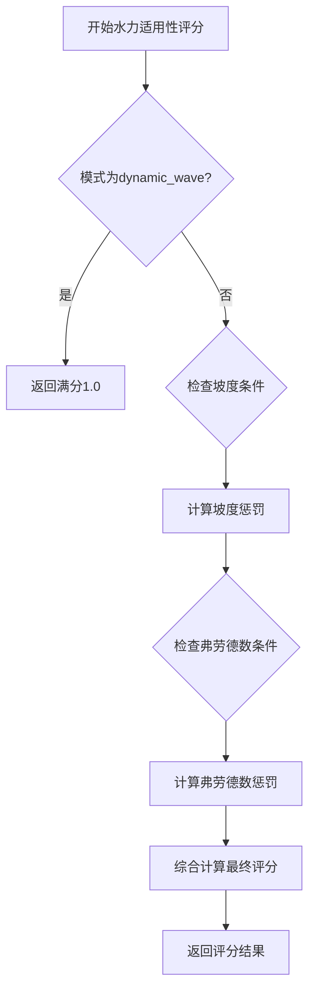

**Diagram sources**
- [approximation_selector.py](file://waternet/models/approximation_selector.py#L271-L310)

### 几何适用性评分

几何适用性评分评估河道的几何复杂度对模式选择的影响：

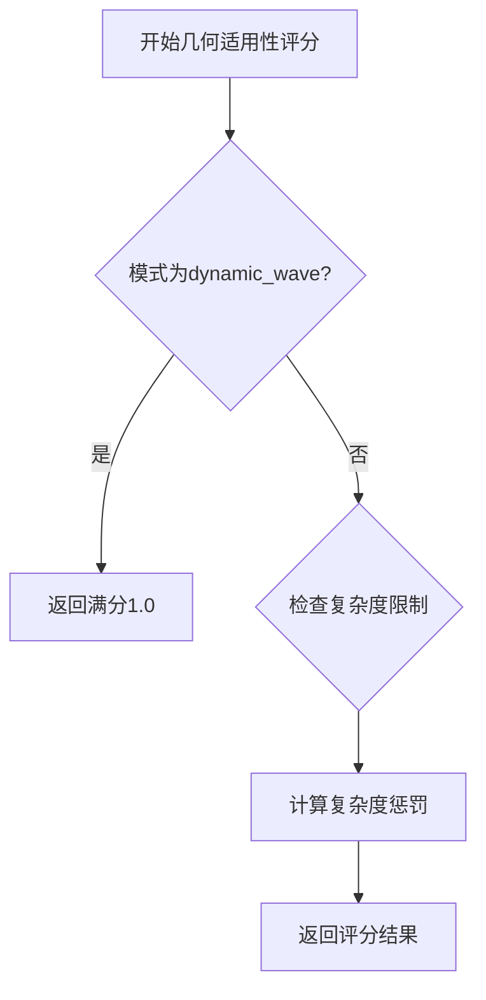

**Diagram sources**
- [approximation_selector.py](file://waternet/models/approximation_selector.py#L312-L330)

### 精度匹配评分

精度匹配评分确保所选模式能够满足预设的精度要求：

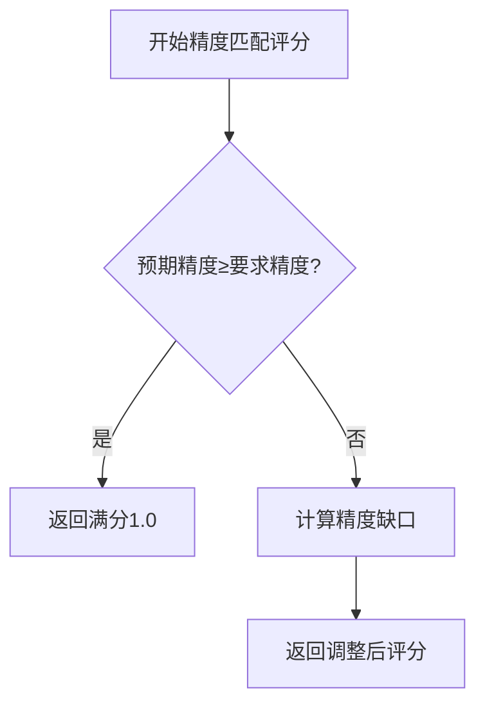

**Diagram sources**
- [approximation_selector.py](file://waternet/models/approximation_selector.py#L332-L345)

### 性能评分

性能评分根据用户优先级（速度、精度或平衡）调整计算成本和预期精度的权重：

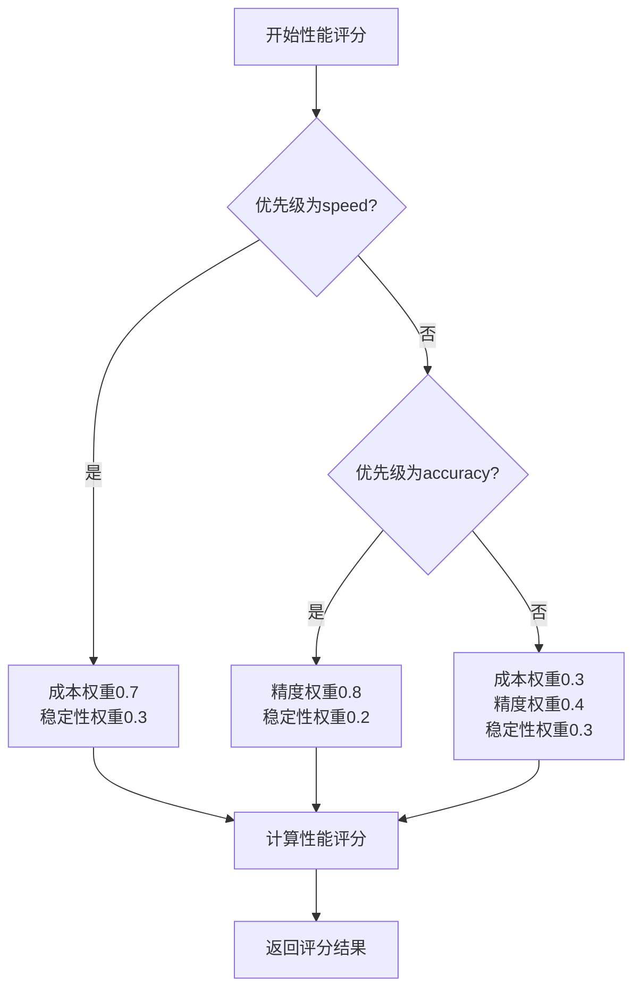

**Diagram sources**
- [approximation_selector.py](file://waternet/models/approximation_selector.py#L347-L375)

**Section sources**
- [approximation_selector.py](file://waternet/models/approximation_selector.py#L225-L375)

## 状态一致性保障

状态一致性保障措施确保在模式切换过程中，系统状态的连续性和稳定性。`SimplifiedSaintVenantModel`通过`set_approximation_mode`方法实现模式切换，并在切换前后进行适用性验证。

### 模式切换流程

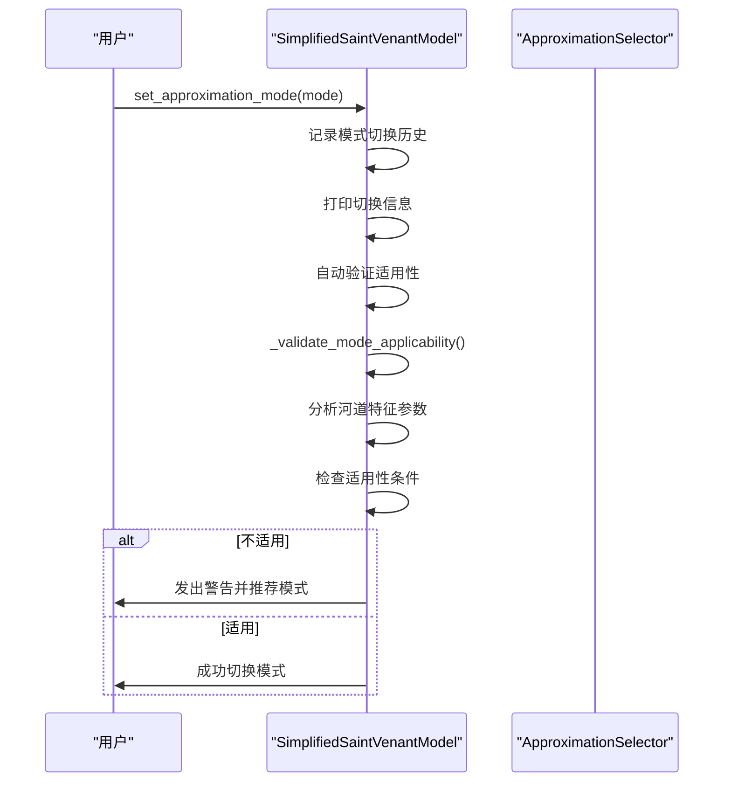

**Diagram sources**
- [simplified_saint_venant.py](file://waternet/models/simplified_saint_venant.py#L128-L172)

### 适用性验证逻辑

适用性验证逻辑基于河道特征参数进行判断：

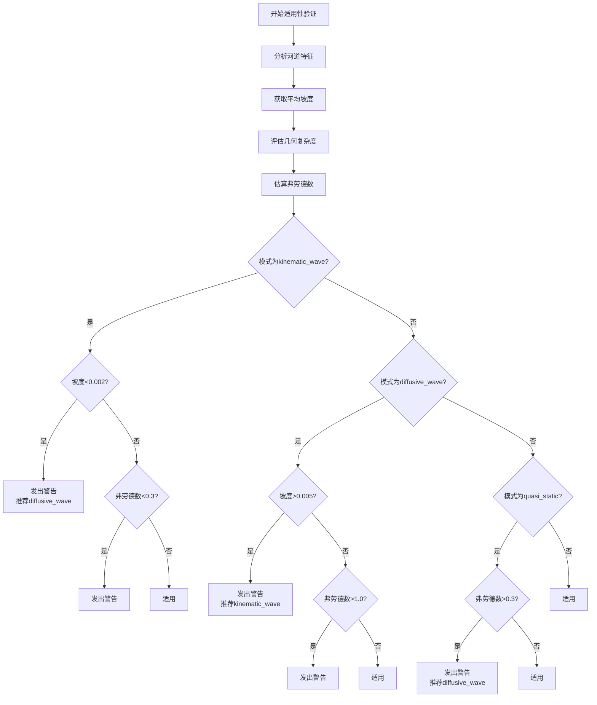

**Diagram sources**
- [simplified_saint_venant.py](file://waternet/models/simplified_saint_venant.py#L174-L220)

**Section sources**
- [simplified_saint_venant.py](file://waternet/models/simplified_saint_venant.py#L128-L220)

## 集成接口设计

`integration_interface.py`文件定义了简化模式与主仿真系统的集成接口，包括`FlowStageSystemIntegrator`类和多个便捷函数。

### 集成器架构

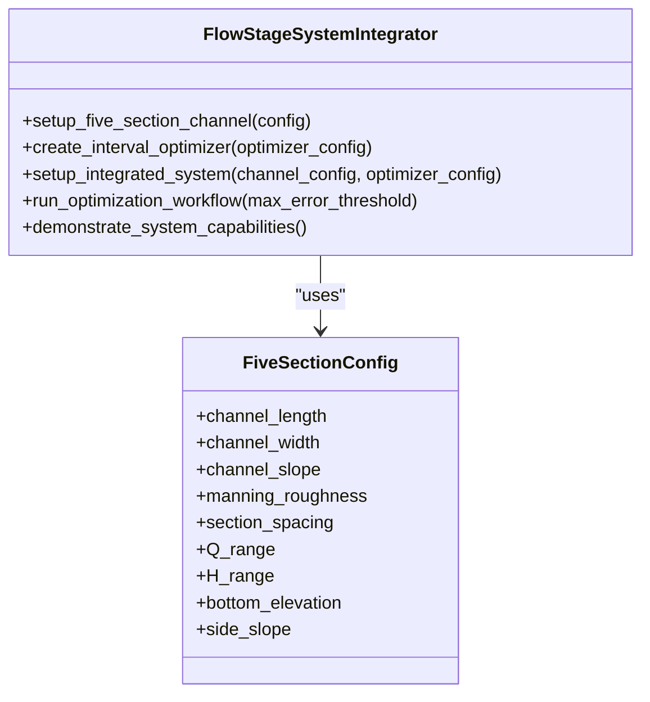

**Diagram sources**
- [integration_interface.py](file://waternet/models/integration_interface.py#L40-L100)

### 便捷函数

系统提供了多个便捷函数以简化集成过程：

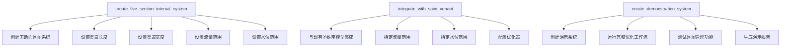

**Diagram sources**
- [integration_interface.py](file://waternet/models/integration_interface.py#L320-L380)

**Section sources**
- [integration_interface.py](file://waternet/models/integration_interface.py#L1-L380)

## 精度-效率权衡

不同简化模式在精度和效率之间存在明显的权衡关系。`SIMPLIFICATION_MODES_IMPLEMENTATION_REPORT.md`提供了详细的性能验证结果。

### 性能对比

| 模式 | 计算时间 | 相对加速比 | 总蓄水量 |
|------|----------|------------|----------|
| 动力波 | 0.000244秒 | 1.00x (基准) | 65,171.75 m³ |
| 扩散波 | 0.000199秒 | 1.23x | 102,375.00 m³ |
| 运动波 | 0.000556秒 | 0.44x | 66,094.89 m³ |
| 准静态波 | 0.000228秒 | 1.07x | 102,375.00 m³ |

### 精度-效率曲线

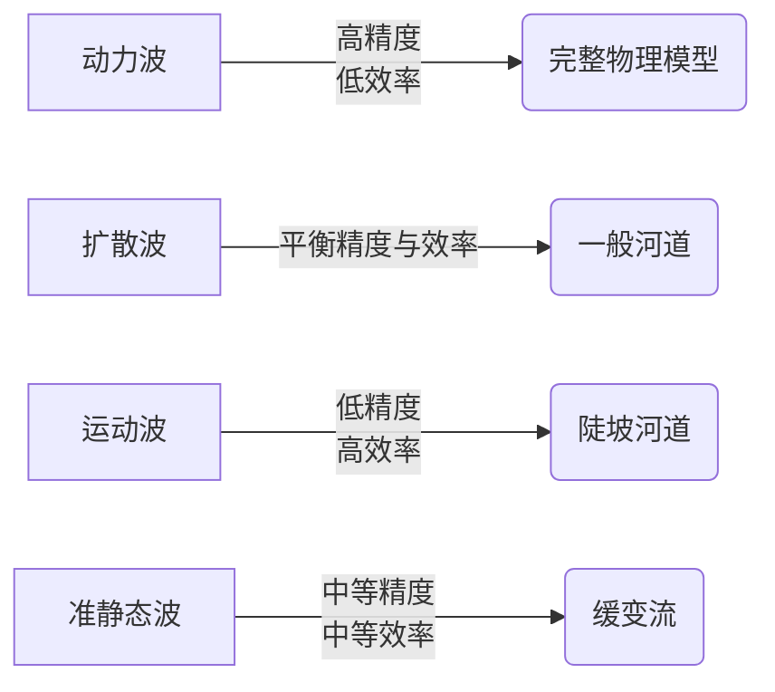

**Diagram sources**
- [SIMPLIFICATION_MODES_IMPLEMENTATION_REPORT.md](file://SIMPLIFICATION_MODES_IMPLEMENTATION_REPORT.md#L100-L150)

**Section sources**
- [SIMPLIFICATION_MODES_IMPLEMENTATION_REPORT.md](file://SIMPLIFICATION_MODES_IMPLEMENTATION_REPORT.md#L100-L150)

## 日志分析与性能测试

系统提供了详细的日志记录和性能测试方法，以支持模式切换的监控和评估。

### 日志分析

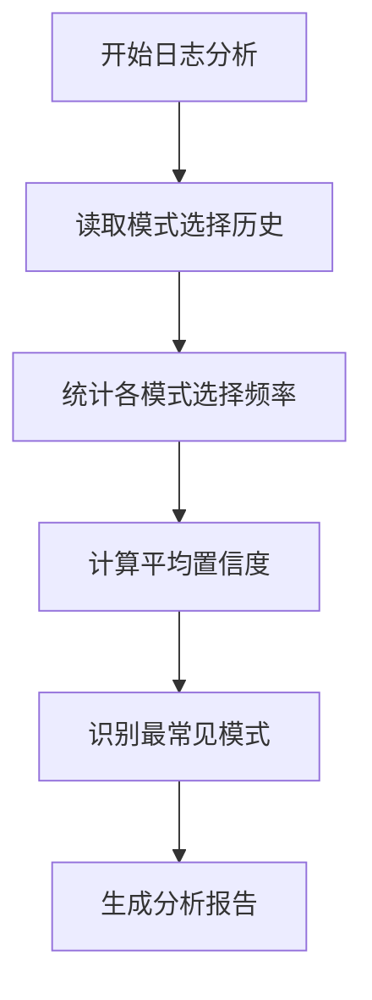

**Diagram sources**
- [approximation_selector.py](file://waternet/models/approximation_selector.py#L480-L520)

### 性能测试

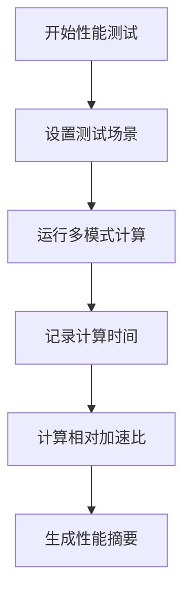

**Diagram sources**
- [simplification_modes_demo.py](file://examples/simplification_modes_demo.py#L600-L650)

**Section sources**
- [approximation_selector.py](file://waternet/models/approximation_selector.py#L480-L520)
- [simplification_modes_demo.py](file://examples/simplification_modes_demo.py#L600-L650)

## 异常回退处理

系统实现了完善的异常回退处理机制，确保在模式切换失败或计算异常时能够安全恢复。

### 异常处理流程

```mermaid
sequenceDiagram
participant Model as "SimplifiedSaintVenantModel"
participant User as "用户"
User->>Model : compute_with_approximation(mode)
Model->>Model : 设置计算模式
Model->>Model : 记录开始时间
try
Model->>Model : 根据模式选择计算方法
Model->>Model : 执行计算
Model->>Model : 记录性能指标
Model->>User : 返回成功结果
catch
Model->>User : 返回失败结果
finally
Model->>Model : 恢复原始模式
end
```

**Diagram sources**
- [simplified_saint_venant.py](file://waternet/models/simplified_saint_venant.py#L255-L330)

**Section sources**
- [simplified_saint_venant.py](file://waternet/models/simplified_saint_venant.py#L255-L330)

## 多情景验证分析

系统新增了多情景验证分析功能，涵盖了标准、陡坡、缓坡、复杂几何和极端洪水五种典型情景，全面评估简化模式在不同条件下的适用性和性能表现。

### 验证情景设计

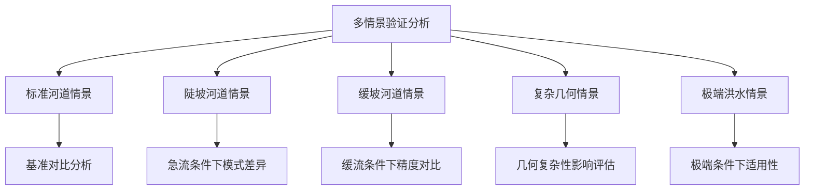

**Diagram sources**
- [simplification_modes_demo.py](file://examples/simplification_modes_demo.py#L1000-L1206)

### 情景验证流程

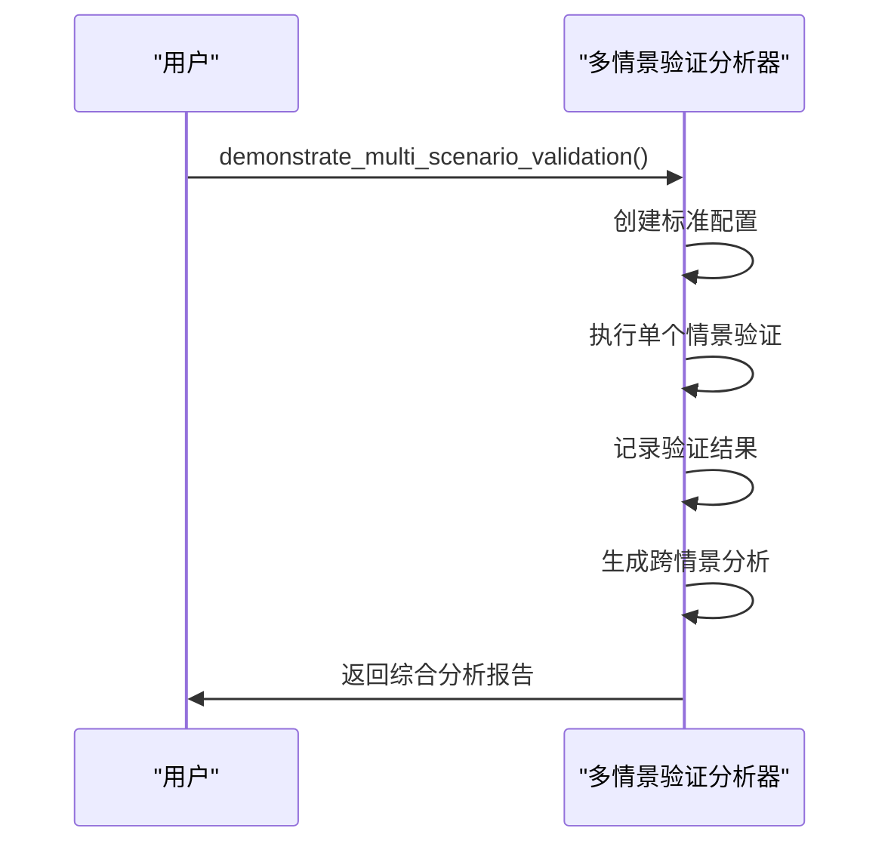

**Diagram sources**
- [simplification_modes_demo.py](file://examples/simplification_modes_demo.py#L1000-L1206)

**Section sources**
- [simplification_modes_demo.py](file://examples/simplification_modes_demo.py#L1000-L1206)

## 结论

WaterNet的降阶模型简化模式切换机制通过智能选择器、适用性验证和状态一致性保障，实现了不同水力模型间的动态切换。该机制在保持计算精度的同时显著提升了计算效率，为工程设计、实时仿真和科研分析提供了灵活的计算框架。新增的配置管理、多模式时间序列分析和多情景验证功能进一步增强了系统的实用性和可靠性。未来发展方向包括机器学习集成、自适应切换和并行计算等，将进一步提升系统的智能化水平和计算性能。

**Section sources**
- [SIMPLIFICATION_MODES_IMPLEMENTATION_REPORT.md](file://SIMPLIFICATION_MODES_IMPLEMENTATION_REPORT.md#L200-L256)