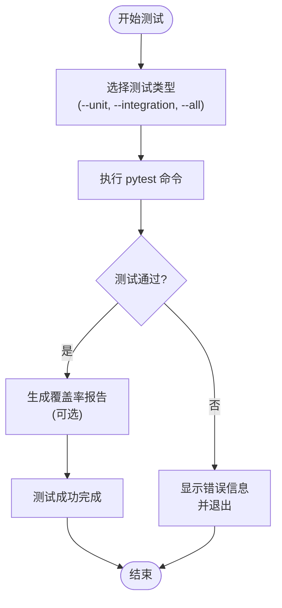

# 贡献指南

<cite>
**本文档中引用的文件**  
- [run_tests.py](file://scripts/run_tests.py)
- [test_runner.py](file://scripts/test_runner.py)
- [pytest.ini](file://pytest.ini)
- [pyproject.toml](file://pyproject.toml)
- [README.md](file://README.md)
- [conftest.py](file://tests/conftest.py)
- [waternet/\_\_init\_\_.py](file://waternet/__init__.py)
</cite>

## 目录
1. [简介](#简介)
2. [代码风格与文档标准](#代码风格与文档标准)
3. [测试规范与执行流程](#测试规范与执行流程)
4. [调试与性能分析](#调试与性能分析)
5. [代码审查与版本发布](#代码审查与版本发布)
6. [附录](#附录)

## 简介
本指南旨在为 WaterNet 项目建立清晰、透明的贡献流程，鼓励社区成员积极参与开发。WaterNet 是一个基于圣维南方程组的明渠水力模型数字孪生建模框架，致力于提供高精度物理模型与多种降阶模型的统一建模工具链。为确保代码质量与项目稳定性，所有贡献必须遵循严格的代码规范、文档标准和测试要求。

**Section sources**
- [README.md](file://README.md#L0-L484)

## 代码风格与文档标准
所有贡献的代码必须严格遵守 PEP 8 编码规范。建议使用 `black` 工具进行代码格式化，其配置已在 `pyproject.toml` 文件中定义。代码应具备良好的可读性，包括清晰的变量命名、适当的空行分隔以及符合逻辑的代码结构。

文档编写是贡献的重要组成部分。所有公共接口、类和函数必须包含符合 NumPy 风格的文档字符串（docstring），明确说明参数类型、返回值及功能描述。项目文档（如 `README.md`）应保持最新，清晰地阐述项目特性、安装步骤和使用示例。

**Section sources**
- [pyproject.toml](file://pyproject.toml#L0-L70)
- [README.md](file://README.md#L0-L484)

## 测试规范与执行流程
### 测试要求
所有新的功能或代码修改**必须包含相应的单元测试**。测试用例应覆盖正常流程、边界条件和异常处理。测试代码应放置在 `tests/` 目录下的相应子目录中（如 `unit/`、`integration/`）。

### 测试配置
项目的测试配置由 `pytest.ini` 文件统一管理。该文件定义了测试发现规则、输出格式和自定义标记（如 `unit`、`integration`、`slow`）。`pyproject.toml` 文件中的 `[tool.pytest.ini_options]` 部分也提供了额外的配置，确保测试环境的一致性。

### 测试执行
项目提供两个主要的自动化测试入口脚本：

1.  **`scripts/run_tests.py`**: 这是一个功能丰富的测试运行器，支持运行单元测试、集成测试、性能测试，并可生成覆盖率报告和HTML测试报告。
2.  **`scripts/test_runner.py`**: 这是一个更简洁的统一测试入口，支持通过命令行参数选择运行特定类型的测试（如 `--unit`、`--integration`、`--deep-channel`），并支持生成覆盖率报告。

**Diagram sources**
- [run_tests.py](file://scripts/run_tests.py#L0-L302)
- [test_runner.py](file://scripts/test_runner.py#L0-L237)
- [pytest.ini](file://pytest.ini#L0-L30)

**Section sources**
- [run_tests.py](file://scripts/run_tests.py#L0-L302)
- [test_runner.py](file://scripts/test_runner.py#L0-L237)
- [pytest.ini](file://pytest.ini#L0-L30)
- [conftest.py](file://tests/conftest.py#L0-L227)

## 调试与性能分析
### 调试技巧
在开发和测试过程中，可以利用 `tests/conftest.py` 文件中定义的 `fixtures` 来快速构建测试环境。这些 `fixtures` 提供了预定义的模型实例（如 `saint_venant_model`、`muskingum_model`）和测试数据，有助于隔离问题。对于复杂的逻辑，建议使用 `print` 语句或 Python 调试器（`pdb`）进行逐步调试。

### 性能分析工具
项目内置了性能分析机制。`scripts/health_checker.py` 脚本可用于评估系统的计算性能和资源使用情况。对于模型本身的性能瓶颈，可以使用 Python 的 `cProfile` 模块进行分析。此外，`pytest` 配合 `pytest-cov` 插件生成的覆盖率报告（`htmlcov/` 目录）不仅能衡量测试完整性，也能帮助识别未被测试到的潜在问题区域。

**Section sources**
- [health_checker.py](file://scripts/health_checker.py#L0-L689)
- [conftest.py](file://tests/conftest.py#L0-L227)

## 代码审查与版本发布
### 代码审查流程
所有贡献都应通过 GitHub Pull Request (PR) 的形式提交。PR 提交后，将触发自动化测试流程。审查者将重点关注以下几点：
- 代码是否符合 PEP 8 规范。
- 是否包含充分且有效的测试用例。
- 文档字符串和项目文档是否完整、准确。
- 代码逻辑是否清晰、高效，是否引入了不必要的复杂性。
- 是否与现有架构和设计模式保持一致。

审查过程应是建设性的，鼓励提出改进建议和讨论。

### 版本发布周期
项目采用语义化版本控制（Semantic Versioning）。版本发布周期将保持透明，主要版本（如 v1.0.0）和次要版本（如 v1.1.0）的发布计划将在项目讨论区或里程碑（Milestones）中提前公布。补丁版本（如 v1.0.1）将用于修复关键 bug。发布前，所有测试必须通过，并且需要经过核心维护团队的最终审核。

**Section sources**
- [README.md](file://README.md#L0-L484)
- [pyproject.toml](file://pyproject.toml#L0-L70)

## 附录
### 贡献步骤总结
1.  Fork 仓库并创建特性分支。
2.  编写代码并遵循 PEP 8 规范。
3.  编写相应的单元测试和文档。
4.  使用 `scripts/test_runner.py` 或 `scripts/run_tests.py` 运行测试，确保所有测试通过。
5.  提交更改并推送至您的分支。
6.  在 GitHub 上创建 Pull Request。