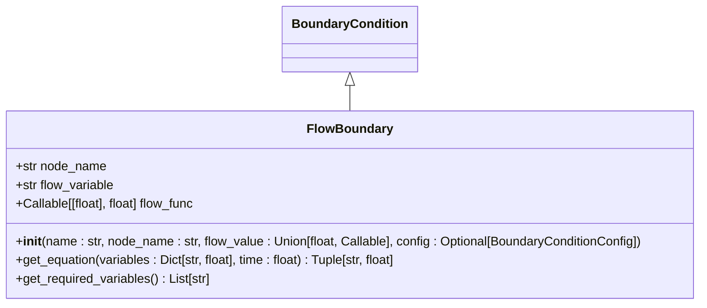
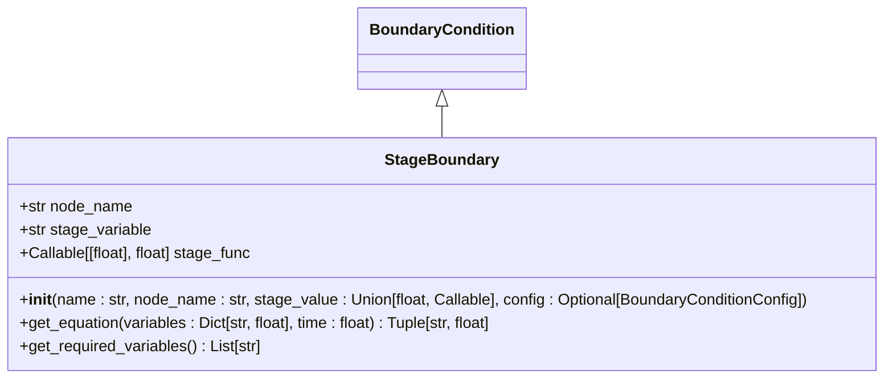
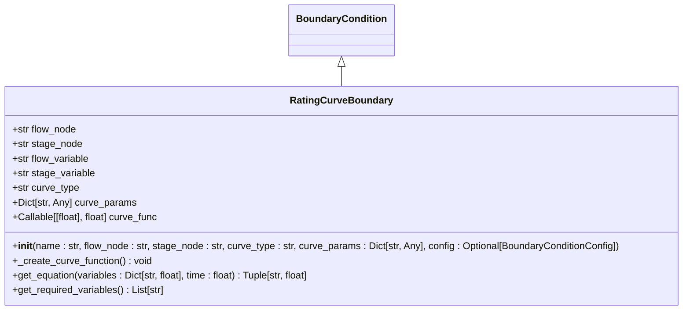
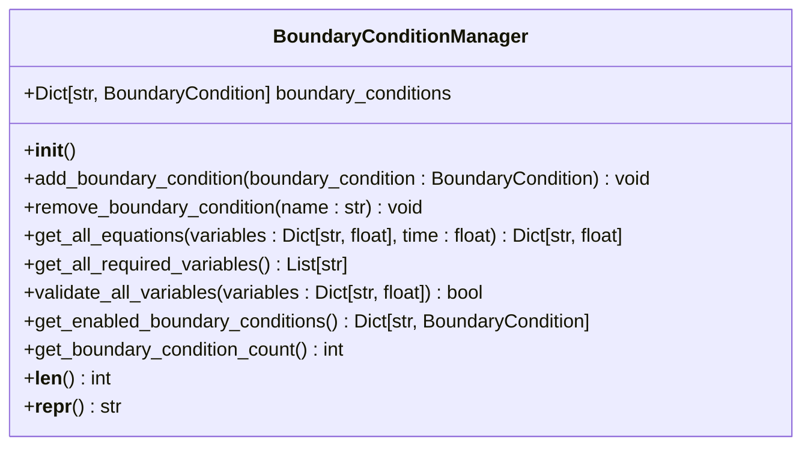
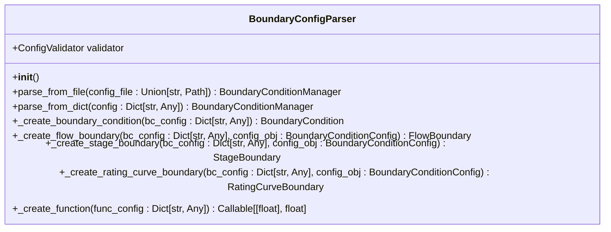
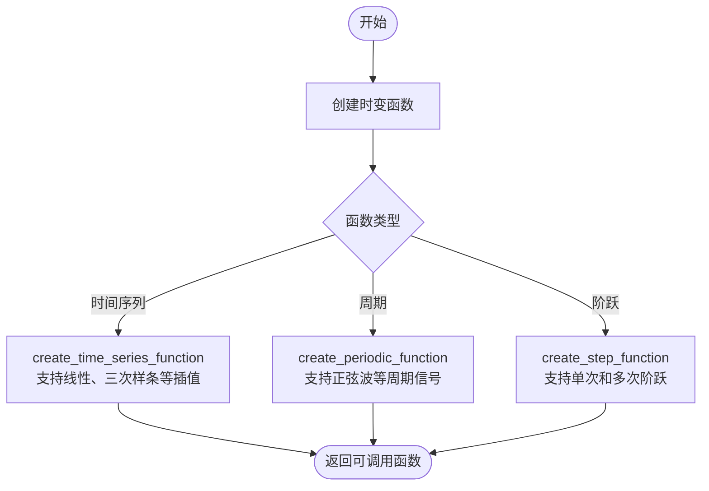
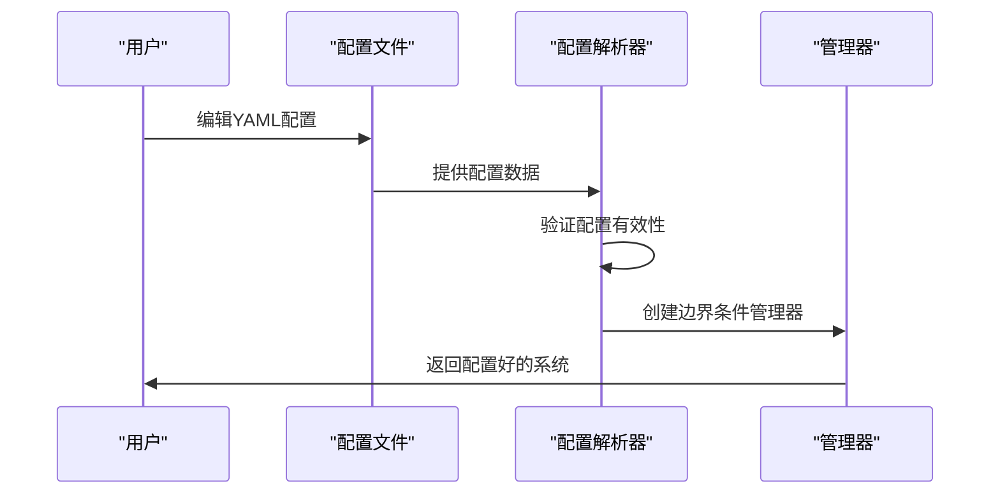
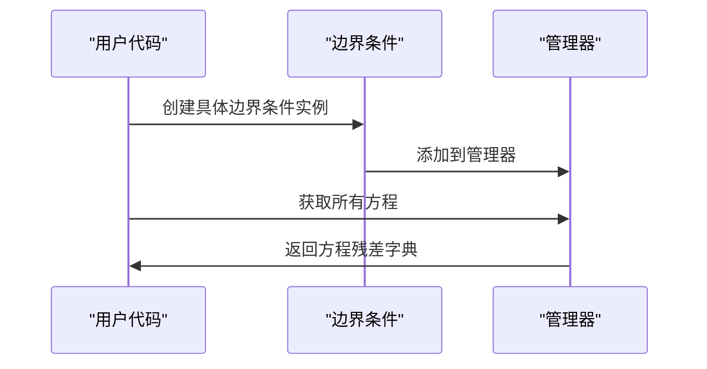
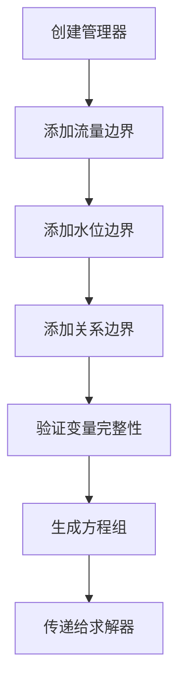
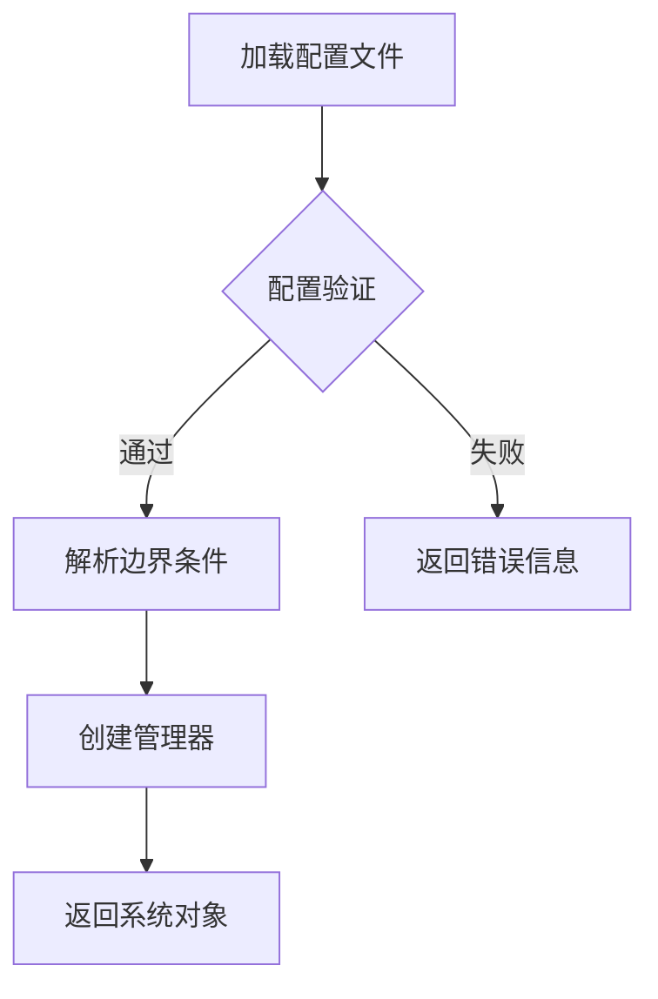

# 边界条件框架

<cite>
**本文档引用的文件**
- [boundary_conditions.py](file://waternet/models/boundary_conditions.py)
- [boundary_config.py](file://waternet/models/boundary_config.py)
- [boundary_conditions_example.yaml](file://configs/boundary_conditions_example.yaml)
- [boundary_framework_demo.py](file://examples/boundary_framework_demo.py)
- [test_boundary_framework.py](file://tests/test_boundary_framework.py)
</cite>

## 目录
1. [简介](#简介)
2. [核心组件](#核心组件)
3. [API接口](#api接口)
4. [集成模式](#集成模式)
5. [实践示例](#实践示例)
6. [故障排除指南](#故障排除指南)
7. [结论](#结论)

## 简介
边界条件框架是WaterNet水力模拟系统的核心组成部分，提供灵活可配置的边界条件管理功能。该框架支持多种边界条件类型和时变控制信号，通过抽象化设计实现统一管理和动态配置。

框架设计遵循以下原则：
- **统一接口**：所有边界条件使用相同的方法签名
- **类型安全**：明确的变量类型和返回值规范
- **动态性**：支持时变控制信号和外部调度
- **可扩展性**：支持自定义边界条件类型

框架主要由边界条件抽象基类、具体边界条件实现、边界条件管理器和配置解析器等组件构成，为复杂水力网络的模拟提供了强大的支持。

**Section sources**
- [boundary_conditions.py](file://waternet/models/boundary_conditions.py#L1-L50)

## 核心组件

### 边界条件抽象基类
`BoundaryCondition`是所有边界条件的抽象基类，定义了统一的接口和核心功能。它提供了方程生成、变量验证等基础方法，确保所有具体边界条件类遵循相同的设计规范。

**Section sources**
- [boundary_conditions.py](file://waternet/models/boundary_conditions.py#L40-L138)

### 具体边界条件实现
框架提供了多种具体的边界条件实现，包括流量边界、水位边界和水位流量关系边界。

#### 流量边界条件
`FlowBoundary`类用于指定节点的流量值约束，支持恒定流量和时变流量。其方程形式为 Q_node - flow_value(t) = 0，适用于上游流量边界、泵站出流指定等场景。

**Diagram sources**
- [boundary_conditions.py](file://waternet/models/boundary_conditions.py#L141-L201)

#### 水位边界条件
`StageBoundary`类用于指定节点的水位值约束，支持恒定水位和时变水位。其方程形式为 H_node - stage_value(t) = 0，适用于下游水位边界、水库水位控制等场景。

**Diagram sources**
- [boundary_conditions.py](file://waternet/models/boundary_conditions.py#L204-L264)

#### 水位流量关系边界条件
`RatingCurveBoundary`类基于水位流量关系曲线提供边界约束，支持多项式、堰流公式和自定义函数等多种曲线形式。其方程形式为 Q_node - f(H_node) = 0，适用于堰流关系、闸门特性曲线等场景。

**Diagram sources**
- [boundary_conditions.py](file://waternet/models/boundary_conditions.py#L267-L368)

### 边界条件管理器
`BoundaryConditionManager`类统一管理多个边界条件，提供集成的接口用于求解器调用。它支持动态添加/移除边界条件，以及批量验证和方程生成。

**Diagram sources**
- [boundary_conditions.py](file://waternet/models/boundary_conditions.py#L371-L493)

## API接口

### 边界条件配置解析器
`BoundaryConfigParser`类提供从YAML配置文件解析边界条件的功能，支持声明式配置管理。

**Diagram sources**
- [boundary_config.py](file://waternet/models/boundary_config.py#L221-L384)

### 工具函数
框架提供了一系列工具函数用于创建时变函数，包括时间序列函数、周期函数和阶跃函数。

**Diagram sources**
- [boundary_conditions.py](file://waternet/models/boundary_conditions.py#L500-L566)

## 集成模式

### 配置驱动模式
通过YAML配置文件驱动边界条件和控制信号的创建，实现声明式系统构建。

**Diagram sources**
- [boundary_config.py](file://waternet/models/boundary_config.py#L221-L384)

### 程序化构建模式
通过代码直接创建和管理边界条件，适用于动态系统构建。

**Diagram sources**
- [boundary_conditions.py](file://waternet/models/boundary_conditions.py#L371-L493)

## 实践示例

### 基础边界条件设置
演示如何创建和使用基本的边界条件。

**Section sources**
- [boundary_framework_demo.py](file://examples/boundary_framework_demo.py#L50-L150)

### 配置文件驱动系统
演示如何使用配置文件创建完整的边界条件系统。

**Section sources**
- [boundary_config.py](file://waternet/models/boundary_config.py#L450-L500)

## 故障排除指南

### 常见问题及解决方案
| 问题现象 | 可能原因 | 解决方案 |
|--------|--------|--------|
| 方程生成失败 | 变量缺失 | 检查`get_required_variables`返回的变量是否存在于输入字典中 |
| 配置解析错误 | YAML格式不正确 | 使用`ConfigValidator`验证配置文件格式 |
| 时变函数异常 | 时间点不匹配 | 确保时间序列的时间点按升序排列 |
| 残差过大 | 初始值不合理 | 调整初始变量值以接近预期解 |

**Section sources**
- [test_boundary_framework.py](file://tests/test_boundary_framework.py#L100-L200)

### 调试建议
1. 启用详细日志记录以跟踪边界条件的创建和方程生成过程
2. 使用`validate_all_variables`方法检查变量完整性
3. 逐步添加边界条件以定位问题来源
4. 验证配置文件的结构和数据类型

**Section sources**
- [boundary_conditions.py](file://waternet/models/boundary_conditions.py#L450-L493)

## 结论
边界条件框架为WaterNet系统提供了强大而灵活的边界条件管理能力。通过抽象基类设计和多种具体实现，框架能够满足各种复杂水力网络的模拟需求。配置驱动和程序化构建两种模式为用户提供了灵活的选择，而完善的API接口和工具函数则大大简化了开发和使用过程。

框架的模块化设计使其易于扩展和维护，为未来添加新的边界条件类型和功能奠定了良好基础。结合详细的文档和实践示例，用户可以快速掌握框架的使用方法，高效构建复杂的水力模拟系统。