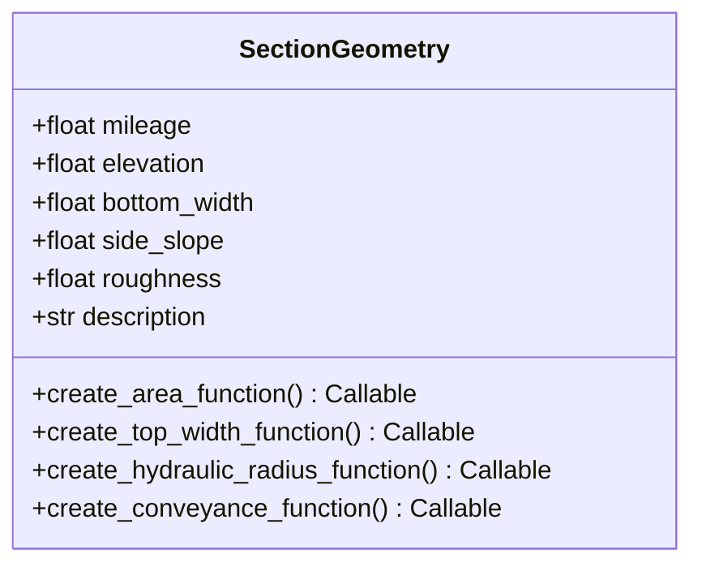
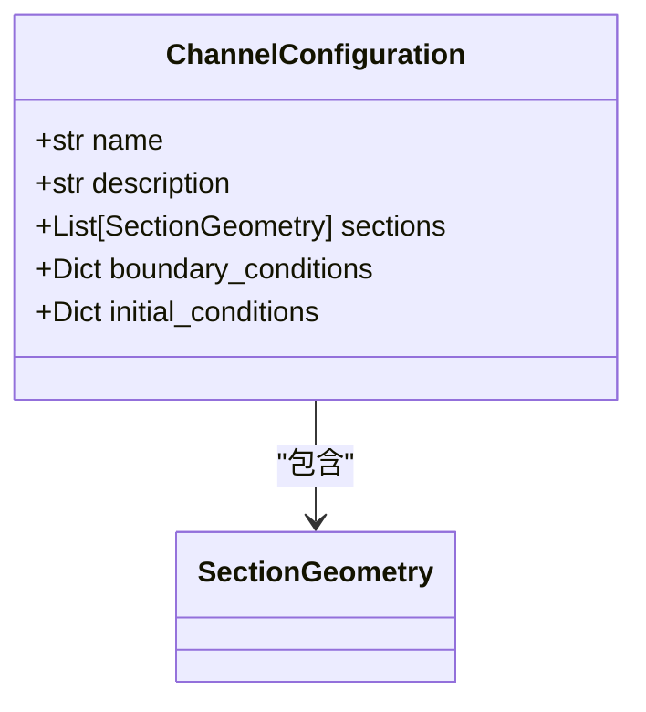
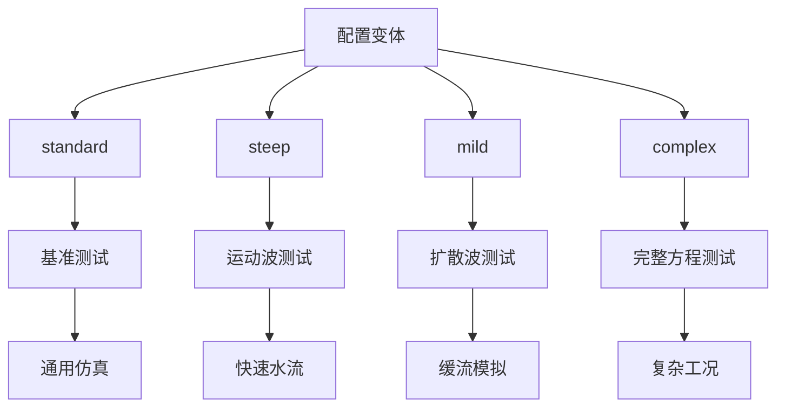
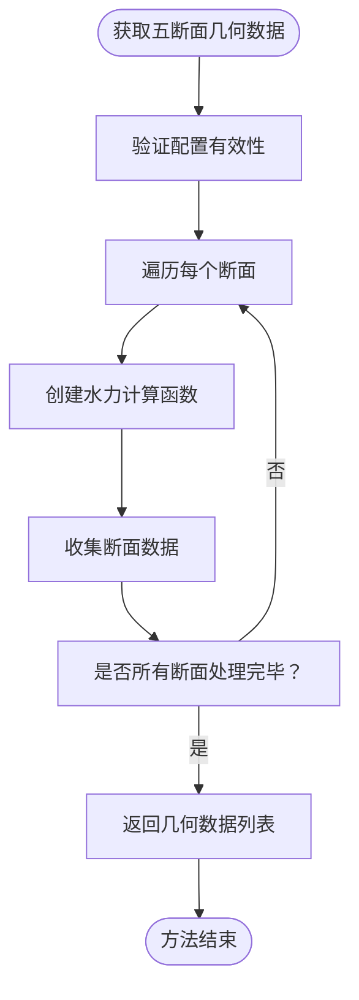
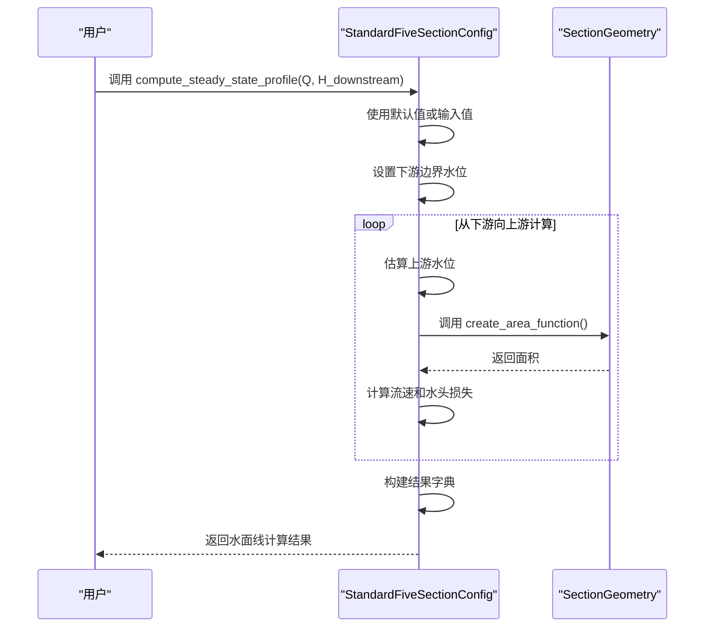
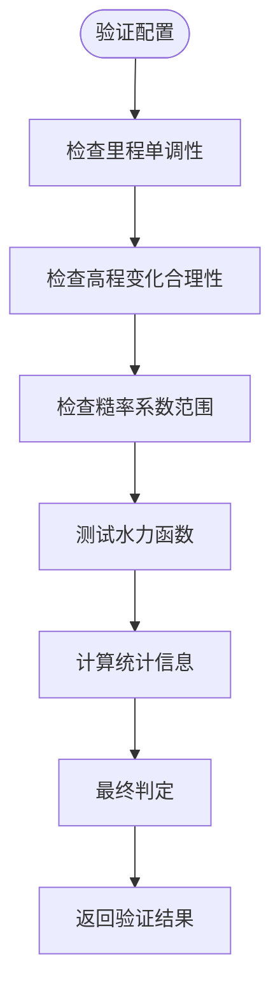

# 标准五断面配置

<cite>
**Referenced Files in This Document**   
- [standard_five_section.py](file://waternet/config/standard_five_section.py)
- [complex_channel.yaml](file://configs/example_configs/complex_channel.yaml)
- [profile_visualization.py](file://examples/basic/profile_visualization.py)
- [channel_configs.py](file://tests/fixtures/channel_configs.py)
</cite>

## 目录
1. [简介](#简介)
2. [核心数据类设计](#核心数据类设计)
3. [配置变体与水力特征](#配置变体与水力特征)
4. [核心方法详解](#核心方法详解)
5. [配置序列化与持久化](#配置序列化与持久化)
6. [配置验证与摘要](#配置验证与摘要)
7. [仿真集成示例](#仿真集成示例)
8. [结论](#结论)

## 简介

标准五断面配置（StandardFiveSectionConfig）是WaterNet项目中的核心水力配置管理器，旨在提供统一、权威的标准五断面配置，消除项目中多处存在的重复实现。该系统基于梯形断面几何，涵盖了典型的明渠水力特征，为水文仿真、模型测试和算法验证提供了标准化的渠道配置。

该配置系统通过`SectionGeometry`和`ChannelConfiguration`两个核心数据类，实现了断面几何参数与渠道整体配置的分层管理。系统支持四种预定义的配置变体，每种变体针对不同的水力条件和仿真需求进行了优化。通过提供`get_five_section_geometry()`、`compute_steady_state_profile()`等核心方法，该系统不仅能够输出完整的断面数据，还能进行恒定流水面线计算，为上层应用提供了丰富的水力计算功能。

**Section sources**
- [standard_five_section.py](file://waternet/config/standard_five_section.py#L1-L50)

## 核心数据类设计

### SectionGeometry 断面几何数据类

`SectionGeometry`类是描述单个断面几何特征的核心数据结构，采用Python的`dataclass`实现，确保了数据的不可变性和类型安全性。



**Diagram sources**
- [standard_five_section.py](file://waternet/config/standard_five_section.py#L31-L110)

**字段含义：**
- **mileage**: 里程桩号，表示断面在渠道中的位置，单位为米（m）
- **elevation**: 底高程，表示断面底部的高程，单位为米（m）
- **bottom_width**: 底宽，梯形断面的底部宽度，单位为米（m）
- **side_slope**: 边坡系数，表示边坡的垂直与水平投影比（如1.5:1）
- **roughness**: 曼宁糙率系数，反映渠道表面粗糙程度，影响水流阻力
- **description**: 断面描述，用于标识和说明断面的特征

该类在`__post_init__`方法中实现了严格的参数验证，确保底宽、边坡系数和糙率系数均为正值，保证了数据的物理合理性。

### ChannelConfiguration 渠道配置数据类

`ChannelConfiguration`类用于管理整个渠道的配置，将多个`SectionGeometry`实例组织成一个完整的渠道系统。



**Diagram sources**
- [standard_five_section.py](file://waternet/config/standard_five_section.py#L114-L146)

**字段含义：**
- **name**: 配置名称，用于标识该配置的唯一性
- **description**: 配置描述，提供配置的详细说明
- **sections**: 断面几何列表，按里程顺序排列的`SectionGeometry`对象列表
- **boundary_conditions**: 边界条件，定义上游和下游的边界类型（如流量或水位）及默认值
- **initial_conditions**: 初始条件，定义仿真的初始状态，如初始流量和是否为恒定流

该类在初始化时会自动验证配置的完整性，包括检查断面数量是否至少为2个，以及里程是否按升序排列。如果里程未排序，系统会自动进行排序，确保了数据的一致性。

**Section sources**
- [standard_five_section.py](file://waternet/config/standard_five_section.py#L31-L146)

## 配置变体与水力特征

`StandardFiveSectionConfig`系统支持四种预定义的配置变体，每种变体针对不同的水力条件和仿真需求进行了优化。

### 四种配置变体

| 变体 | 名称 | 适用场景 | 水力特征 |
|------|------|----------|----------|
| 'standard' | 标准五断面梯形明渠 | 基准测试、通用仿真 | 几何参数基于项目中使用最多的标准参数，具有典型的明渠特征 |
| 'steep' | 陡坡五断面明渠 | 运动波模式测试 | 坡度较大，底宽较小，糙率较低，适用于快速水流模拟 |
| 'mild' | 缓坡五断面明渠 | 扩散波模式测试 | 坡度很小，底宽较大，糙率较高，适用于缓流模拟 |
| 'complex' | 复杂五断面明渠 | 完整方程测试 | 几何和糙率变化复杂，包含急扩、糙率变化等特征，需要完整方程求解 |

### 水力特征分析

每种变体都通过其独特的几何参数组合来实现特定的水力行为：

- **标准变体**：作为基准配置，其参数在项目中被广泛使用，适用于大多数通用仿真场景。它包含了底宽、边坡和糙率的合理变化，能够代表典型的明渠特征。

- **陡坡变体**：通过较大的高程差和较小的底宽，创建了陡峭的坡度，使得水流速度较快，惯性力占主导地位，非常适合测试运动波模型的性能。

- **缓坡变体**：具有极小的坡度和较大的糙率，水流缓慢，摩擦力影响显著，是测试扩散波模型的理想选择，能够突出摩擦项的作用。

- **复杂变体**：模拟了实际工程中可能遇到的复杂情况，如断面尺寸的急剧变化和糙率的不连续变化，对数值求解器的稳定性和精度提出了更高要求。



**Diagram sources**
- [standard_five_section.py](file://waternet/config/standard_five_section.py#L149-L293)

**Section sources**
- [standard_five_section.py](file://waternet/config/standard_five_section.py#L149-L293)

## 核心方法详解

### get_five_section_geometry() 方法

该方法是系统与现有接口兼容的关键，用于获取包含水力函数的完整断面数据。



**Diagram sources**
- [standard_five_section.py](file://waternet/config/standard_five_section.py#L295-L321)

该方法返回一个字典列表，每个字典包含一个断面的所有几何参数和四个核心水力计算函数：
- `area_func`: 面积函数 A(H)，计算给定水位下的过水断面面积
- `top_width_func`: 水面宽度函数 T(H)，计算给定水位下的水面宽度
- `hydraulic_radius_func`: 水力半径函数 R(H)，计算给定水位下的水力半径
- `conveyance_func`: 输水能力函数 K(H)，计算给定水位下的输水能力

这些函数的返回值可以直接用于后续的水力计算，如恒定流水面线计算或非恒定流模拟。

### compute_steady_state_profile() 方法

该方法用于计算恒定流水面线，是水文仿真中的基础功能。



**Diagram sources**
- [standard_five_section.py](file://waternet/config/standard_five_section.py#L323-L396)

该方法采用简化的标准步进法，从下游向上游逐段计算水位。它首先设置下游边界条件，然后利用能量方程估算上游水位。对于每个断面，它计算水深、面积、流速等水力要素，并最终返回包含完整水面线信息的结果字典，包括各断面的水位、流速、过水面积和总蓄水量。

**Section sources**
- [standard_five_section.py](file://waternet/config/standard_five_section.py#L295-L396)

## 配置序列化与持久化

### export_to_yaml() 方法

该方法将当前配置导出为YAML文件，实现了配置的持久化存储。

```python
def export_to_yaml(self, file_path: str) -> bool:
    # 准备导出数据（不包含函数）
    export_data = {
        'name': self.config.name,
        'description': self.config.description,
        'variant': self.variant,
        'sections': [
            {
                'mileage': sec.mileage,
                'elevation': sec.elevation,
                'bottom_width': sec.bottom_width,
                'side_slope': sec.side_slope,
                'roughness': sec.roughness,
                'description': sec.description
            }
            for sec in self.config.sections
        ],
        'boundary_conditions': self.config.boundary_conditions,
        'initial_conditions': self.config.initial_conditions
    }
    
    with open(file_path, 'w', encoding='utf-8') as f:
        yaml.dump(export_data, f, default_flow_style=False, 
                 allow_unicode=True, indent=2)
```

**Section sources**
- [standard_five_section.py](file://waternet/config/standard_five_section.py#L477-L509)

该方法在导出时会排除水力计算函数（因为函数无法直接序列化），只保存原始的几何参数和配置信息。这确保了YAML文件的可读性和可移植性。

### load_from_yaml() 方法

该方法从YAML文件加载配置，实现了配置的反序列化。

```python
@classmethod
def load_from_yaml(cls, file_path: str) -> 'StandardFiveSectionConfig':
    with open(file_path, 'r', encoding='utf-8') as f:
        data = yaml.safe_load(f)
    
    # 重建SectionGeometry对象
    sections = []
    for sec_data in data['sections']:
        section = SectionGeometry(
            mileage=sec_data['mileage'],
            elevation=sec_data['elevation'],
            bottom_width=sec_data['bottom_width'],
            side_slope=sec_data['side_slope'],
            roughness=sec_data['roughness'],
            description=sec_data.get('description', '')
        )
        sections.append(section)
    
    # 创建配置对象
    config = ChannelConfiguration(
        name=data['name'],
        description=data['description'],
        sections=sections,
        boundary_conditions=data.get('boundary_conditions'),
        initial_conditions=data.get('initial_conditions')
    )
    
    # 创建配置管理器实例
    instance = cls.__new__(cls)
    instance.variant = data.get('variant', 'custom')
    instance.config = config
    
    return instance
```

**Section sources**
- [standard_five_section.py](file://waternet/config/standard_five_section.py#L512-L550)

该方法首先读取YAML文件，然后重建`SectionGeometry`和`ChannelConfiguration`对象，最后创建一个新的`StandardFiveSectionConfig`实例。这使得用户可以轻松地在不同会话之间共享和复用配置。

## 配置验证与摘要

### validate_configuration() 方法

该方法对配置进行完整性和合理性验证，确保其可用于仿真。



**Diagram sources**
- [standard_five_section.py](file://waternet/config/standard_five_section.py#L552-L614)

验证过程包括：
1. **几何检查**：确保里程按升序排列，高程变化合理
2. **参数范围检查**：验证糙率系数是否在合理范围内（0.01-0.1）
3. **函数测试**：调用每个断面的水力函数，确保其能返回有限值
4. **统计信息计算**：计算渠道总长度、平均坡度等关键指标

验证结果以字典形式返回，包含是否有效、警告、错误和统计信息，为用户提供全面的配置健康状况报告。

### get_configuration_summary() 方法

该方法生成配置的摘要信息，以格式化的文本形式展示关键参数。

```python
def get_configuration_summary(self) -> str:
    validation = self.validate_configuration()
    stats = validation['statistics']
    
    summary = f"""
📋 标准五断面配置摘要
{'='*50}
配置名称: {self.config.name}
配置变体: {self.variant}
描述: {self.config.description}

🏞️ 几何特征:
  断面数量: {len(self.config.sections)}
  渠道长度: {stats.get('total_length', 0):.1f} m
  平均坡度: {stats.get('average_slope', 0):.6f}
  高程变化: {stats.get('elevation_range', 0):.2f} m
  糙率范围: {stats.get('roughness_range', [0, 0])}

🔧 边界条件:
  上游类型: {self.config.boundary_conditions.get('upstream_type', 'N/A')}
  下游类型: {self.config.boundary_conditions.get('downstream_type', 'N/A')}
  默认流量: {self.config.boundary_conditions.get('default_upstream_Q', 0)} m³/s
  默认下游水位: {self.config.boundary_conditions.get('default_downstream_H', 0)} m

✅ 验证状态:
  配置有效: {'是' if validation['is_valid'] else '否'}
  警告数量: {len(validation['warnings'])}
  错误数量: {len(validation['errors'])}
"""
    return summary
```

**Section sources**
- [standard_five_section.py](file://waternet/config/standard_five_section.py#L616-L658)

该摘要信息包含了配置的名称、变体、几何特征、边界条件和验证状态，是快速了解配置概况的理想工具。

## 仿真集成示例

以下示例展示了如何在仿真中集成标准配置：

```python
# 创建标准配置实例
config = StandardFiveSectionConfig(variant="standard")

# 获取配置摘要
print(config.get_configuration_summary())

# 计算恒定流水面线
profile = config.compute_steady_state_profile(Q=60.0, H_downstream=101.5)

# 导出配置到文件
config.export_to_yaml("my_channel_config.yaml")

# 从文件加载配置
loaded_config = StandardFiveSectionConfig.load_from_yaml("my_channel_config.yaml")
```

在`profile_visualization.py`示例中，该配置被用于创建圣维南模型，进行精细化的恒定流仿真，并生成详细的纵剖面图，展示了水位、流量、流速等沿程分布情况。

**Section sources**
- [standard_five_section.py](file://waternet/config/standard_five_section.py#L149-L658)
- [profile_visualization.py](file://examples/basic/profile_visualization.py#L1-L293)

## 结论

`StandardFiveSectionConfig`系统为WaterNet项目提供了一个强大、灵活且易于使用的标准五断面配置管理器。通过精心设计的`SectionGeometry`和`ChannelConfiguration`数据类，系统实现了断面几何与渠道配置的清晰分离。四种预定义的配置变体覆盖了从简单到复杂的各种水力场景，满足了不同仿真需求。

其核心方法不仅提供了与现有接口的兼容性，还实现了配置的序列化、验证和摘要功能，极大地提高了配置管理的效率和可靠性。该系统的引入，有效消除了项目中的重复代码，确保了配置的一致性和权威性，为WaterNet项目的进一步发展奠定了坚实的基础。