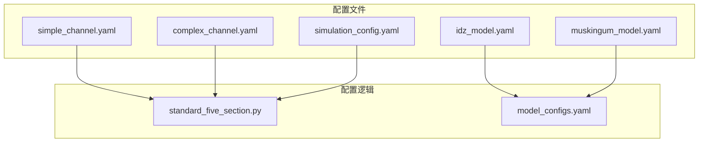
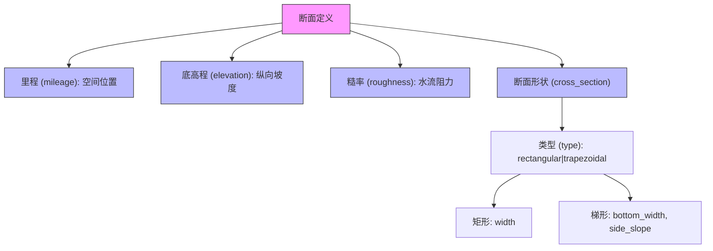
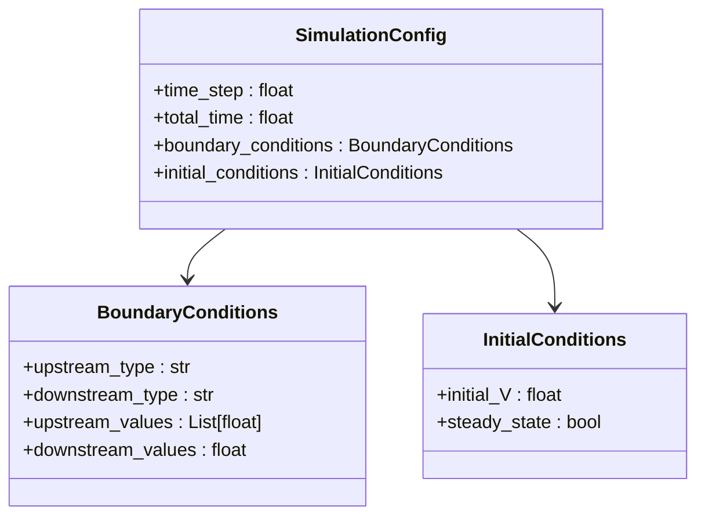
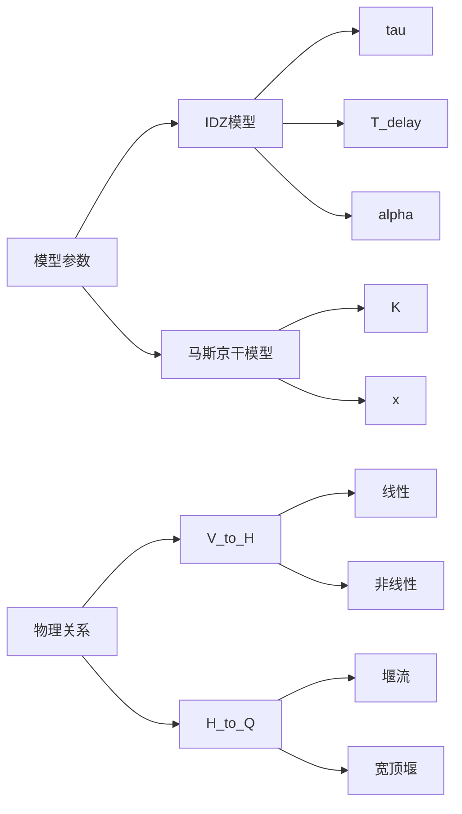
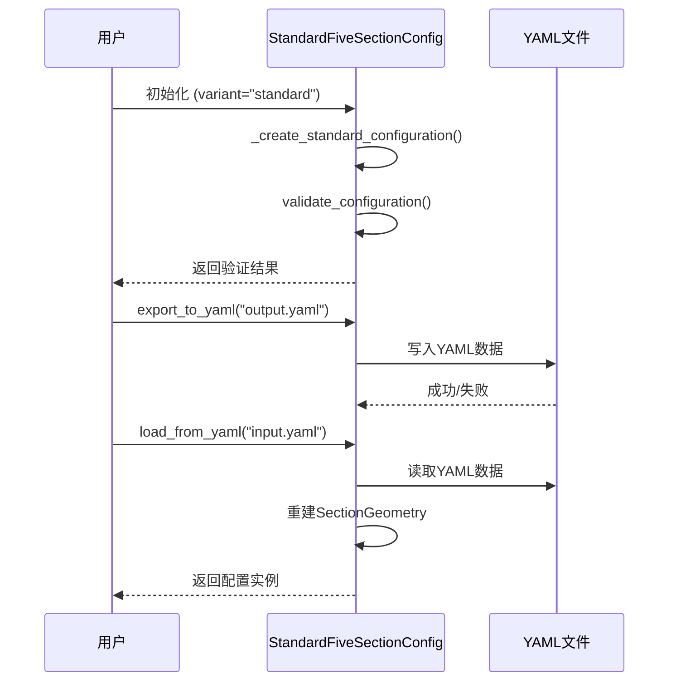

# 配置格式规范

<cite>
**Referenced Files in This Document**   
- [simple_channel.yaml](file://configs/example_configs/simple_channel.yaml)
- [complex_channel.yaml](file://configs/example_configs/complex_channel.yaml)
- [simulation_config.yaml](file://configs/example_configs/simulation_config.yaml)
- [idz_model.yaml](file://configs/example_configs/idz_model.yaml)
- [muskingum_model.yaml](file://configs/example_configs/muskingum_model.yaml)
- [standard_five_section.py](file://waternet/config/standard_five_section.py)
- [model_configs.yaml](file://examples/reduced_order_models_theory/model_configs.yaml)
</cite>

## 目录
1. [简介](#简介)
2. [项目结构](#项目结构)
3. [核心配置字段](#核心配置字段)
4. [渠道几何配置](#渠道几何配置)
5. [边界条件与初始条件](#边界条件与初始条件)
6. [模型参数配置](#模型参数配置)
7. [配置继承与复用](#配置继承与复用)
8. [完整配置示例](#完整配置示例)
9. [配置验证与导出](#配置验证与导出)

## 简介

WaterNet系统采用YAML格式作为其核心配置文件，用于定义水力模型的几何、边界、初始条件和物理关系。本规范系统化地文档化了WaterNet的YAML配置文件格式，详细说明了配置文件的顶层结构、核心字段的语义、数据类型及取值范围，并提供了典型配置示例。

YAML配置文件是WaterNet模型与仿真系统之间的桥梁，它将物理世界的渠道特征和运行条件以结构化的方式编码，为水文模拟、参数辨识和方案分析提供统一的数据源。通过标准化的配置格式，WaterNet实现了模型定义的可读性、可维护性和可复用性。

**Section sources**
- [simple_channel.yaml](file://configs/example_configs/simple_channel.yaml#L1-L21)
- [complex_channel.yaml](file://configs/example_configs/complex_channel.yaml#L1-L38)

## 项目结构

WaterNet的配置文件主要分布在两个目录中：`configs/example_configs` 和 `examples/configs`。这些目录包含了从简单到复杂的多种配置示例，用于演示和测试。

核心配置逻辑在 `waternet/config/standard_five_section.py` 中实现，该文件定义了标准五断面渠道的配置管理器，提供了权威的配置源和一致的API接口。此外，`examples/reduced_order_models_theory` 目录下的 `model_configs.yaml` 文件为降阶模型理论分析提供了统一的参数设置。



**Diagram sources**
- [simple_channel.yaml](file://configs/example_configs/simple_channel.yaml#L1-L21)
- [standard_five_section.py](file://waternet/config/standard_five_section.py#L1-L659)

**Section sources**
- [simple_channel.yaml](file://configs/example_configs/simple_channel.yaml#L1-L21)
- [standard_five_section.py](file://waternet/config/standard_five_section.py#L1-L659)

## 核心配置字段

WaterNet的YAML配置文件由多个核心字段构成，这些字段共同定义了水力模型的完整行为。顶层结构主要包括：

- **name**: 配置的名称，用于标识和区分不同的模型配置。
- **description**: 配置的描述信息，提供关于该配置的背景和用途的说明。
- **sections**: 渠道断面几何列表，定义了渠道的物理形态。
- **boundary_conditions**: 边界条件，定义了上游和下游的输入输出关系。
- **initial_conditions**: 初始条件，定义了仿真开始时的系统状态。
- **model_type**: 模型类型，指定使用的水力模型（如 `idz`, `muskingum`）。
- **parameters**: 模型特定的参数集合。
- **physical_relations**: 物理关系，定义了蓄量、水位和流量之间的转换关系。

这些字段构成了WaterNet配置的骨架，通过它们的组合可以描述从简单矩形渠道到复杂梯形渠道的各种水力场景。

**Section sources**
- [simple_channel.yaml](file://configs/example_configs/simple_channel.yaml#L1-L21)
- [idz_model.yaml](file://configs/example_configs/idz_model.yaml#L1-L23)

## 渠道几何配置

渠道几何配置通过 `sections` 字段定义，它是一个断面对象的列表，每个对象描述了渠道在特定里程处的几何特征。

### 断面字段详解

每个断面对象包含以下关键字段：

- **mileage (里程)**: `float` 类型，表示该断面距离渠道起点的水平距离，单位为米（m）。这是断面在渠道中的空间定位。
- **elevation (底高程)**: `float` 类型，表示该断面的渠底高程，单位为米（m）。它定义了渠道的纵向坡度。
- **roughness (糙率)**: `float` 类型，表示曼宁糙率系数（n值），用于计算水流阻力。典型值范围在0.012（光滑混凝土）到0.035（自然土渠）之间。
- **cross_section (断面形状)**: 一个嵌套对象，定义了断面的横截面几何。
  - **type**: 断面类型，目前支持 `rectangular`（矩形）和 `trapezoidal`（梯形）。
  - **width**: 仅用于矩形断面，表示渠道的恒定宽度（m）。
  - **bottom_width (底宽)**: 仅用于梯形断面，表示渠底的宽度（m）。
  - **side_slope (边坡系数)**: 仅用于梯形断面，表示边坡的水平投影与垂直投影之比（m/m）。例如，值为2.0表示水平方向每前进2米，垂直方向下降1米。

### 示例分析

在 `simple_channel.yaml` 中，定义了一个简单的矩形渠道，其底宽恒为10.0米，糙率为0.025，从里程0.0米到1000.0米，底高程从100.0米均匀下降到99.0米。

在 `complex_channel.yaml` 中，定义了一个复杂的梯形渠道。其底宽从8.0米逐渐增加到12.0米，边坡系数从2.0（较缓）逐渐变为1.0（较陡），糙率也从0.030（较粗糙）优化到0.025（较光滑），这模拟了渠道经过整治后的变化。



**Diagram sources**
- [simple_channel.yaml](file://configs/example_configs/simple_channel.yaml#L1-L21)
- [complex_channel.yaml](file://configs/example_configs/complex_channel.yaml#L1-L38)

**Section sources**
- [simple_channel.yaml](file://configs/example_configs/simple_channel.yaml#L1-L21)
- [complex_channel.yaml](file://configs/example_configs/complex_channel.yaml#L1-L38)
- [standard_five_section.py](file://waternet/config/standard_five_section.py#L1-L659)

## 边界条件与初始条件

边界条件和初始条件定义了模型的外部输入和起始状态，是驱动水力仿真过程的关键。

### 边界条件 (boundary_conditions)

边界条件通过 `boundary_conditions` 对象定义，主要包含：

- **upstream_type (上游类型)**: 定义上游边界条件的类型，可选值为 `flow`（流量）或 `level`（水位）。
- **downstream_type (下游类型)**: 定义下游边界条件的类型，可选值为 `level`（水位）或 `normal`（正常水深）。
- **upstream_values (上游值)**: 当 `upstream_type` 为 `flow` 时，这是一个流量值的列表，表示随时间变化的上游来流过程线。
- **downstream_values (下游值)**: 当 `downstream_type` 为 `level` 时，这是一个标量值，表示恒定的下游水位。

在 `simulation_config.yaml` 中，上游类型为 `flow`，其 `upstream_values` 定义了一个先增大后减小的流量过程，模拟了洪水过程。下游类型为 `level`，水位恒定在99.4米。

### 初始条件 (initial_conditions)

初始条件定义了仿真开始时系统的状态。在 `idz_model.yaml` 中，`initial_V` 字段定义了初始蓄水量为15000.0立方米。这为模型提供了一个合理的起始点，避免了从零开始的剧烈调整。



**Diagram sources**
- [simulation_config.yaml](file://configs/example_configs/simulation_config.yaml#L1-L15)
- [idz_model.yaml](file://configs/example_configs/idz_model.yaml#L1-L23)

**Section sources**
- [simulation_config.yaml](file://configs/example_configs/simulation_config.yaml#L1-L15)
- [idz_model.yaml](file://configs/example_configs/idz_model.yaml#L1-L23)

## 模型参数配置

不同类型的水力模型需要不同的参数集。WaterNet通过 `model_type` 字段区分模型，并在 `parameters` 字段中提供相应的参数。

### IDZ模型参数

在 `idz_model.yaml` 中，IDZ模型的参数包括：
- **tau**: 零点时间常数（秒），影响模型的快速响应能力。
- **T_delay**: 延迟时间（秒），模拟水流传播的时滞。
- **alpha**: 极点时间常数（秒），决定模型的衰减特性。
- **dt**: 仿真时间步长（秒）。
- **initial_V**: 初始蓄水量（立方米）。

### 马斯京干模型参数

在 `muskingum_model.yaml` 中，马斯京干模型的参数包括：
- **K**: 滞时常数（秒），代表水流通过河段所需的时间。
- **x**: 权重系数（无量纲），范围在0到0.5之间，反映河段的调蓄能力。
- **dt**: 仿真时间步长（秒）。
- **initial_V**: 初始蓄水量（立方米）。

### 物理关系配置

`physical_relations` 字段定义了状态变量之间的转换函数：
- **V_to_H**: 蓄量（V）到水位（H）的转换关系，如线性关系 `H = base_level + coefficient * V`。
- **H_to_Q**: 水位（H）到流量（Q）的转换关系，如堰流公式 `Q = coefficient * (H - threshold)^exponent`。

这些关系将抽象的蓄量变量与可测量的水位和流量联系起来，是模型物理意义的核心。



**Diagram sources**
- [idz_model.yaml](file://configs/example_configs/idz_model.yaml#L1-L23)
- [muskingum_model.yaml](file://configs/example_configs/muskingum_model.yaml#L1-L17)
- [model_configs.yaml](file://examples/reduced_order_models_theory/model_configs.yaml#L1-L166)

**Section sources**
- [idz_model.yaml](file://configs/example_configs/idz_model.yaml#L1-L23)
- [muskingum_model.yaml](file://configs/example_configs/muskingum_model.yaml#L1-L17)
- [model_configs.yaml](file://examples/reduced_order_models_theory/model_configs.yaml#L1-L166)

## 配置继承与复用

为了减少重复定义，WaterNet支持通过YAML的锚点（`&`）和引用（`*`）机制来复用配置片段。虽然在提供的示例文件中未直接展示，但 `standard_five_section.py` 中的 `StandardFiveSectionConfig` 类通过编程方式实现了配置的继承与变体。

该类定义了 `"standard"`, `"steep"`, `"mild"`, `"complex"` 四种配置变体，它们都继承自一个标准模板，并根据特定测试需求（如运动波、扩散波测试）进行参数调整。这种设计模式避免了在多个YAML文件中复制粘贴相似的断面定义。

通过 `export_to_yaml()` 和 `load_from_yaml()` 方法，可以在程序中动态生成和加载配置，实现了配置的版本化管理和自动化部署。

**Section sources**
- [standard_five_section.py](file://waternet/config/standard_five_section.py#L1-L659)

## 完整配置示例

以下是两个典型的配置文件示例：

### 简单渠道配置 (simple_channel.yaml)

```yaml
name: simple_rectangular_channel
description: 简单矩形明渠示例
sections:
  - mileage: 0.0
    elevation: 100.0
    roughness: 0.025
    cross_section:
      type: rectangular
      width: 10.0
  - mileage: 500.0
    elevation: 99.5
    roughness: 0.025
    cross_section:
      type: rectangular
      width: 10.0
  - mileage: 1000.0
    elevation: 99.0
    roughness: 0.025
    cross_section:
      type: rectangular
      width: 10.0
```

**关键参数物理意义**:
- `mileage`: 定义了渠道的长度和断面位置。
- `elevation`: 通过三个断面的高程差，定义了渠道的平均坡度为0.1%。
- `roughness`: 曼宁n=0.025，代表经过衬砌的土渠。
- `cross_section.width`: 恒定的10米宽，简化了水力计算。

### 复杂渠道配置 (complex_channel.yaml)

```yaml
name: complex_trapezoidal_channel
description: 复杂梯形断面明渠
sections:
  - mileage: 0.0
    elevation: 100.0
    roughness: 0.030
    cross_section:
      type: trapezoidal
      bottom_width: 8.0
      side_slope: 2.0
  - mileage: 250.0
    elevation: 99.75
    roughness: 0.028
    cross_section:
      type: trapezoidal
      bottom_width: 9.0
      side_slope: 1.8
  # ... 更多断面
```

**关键参数物理意义**:
- `bottom_width`: 从8米增加到12米，模拟了渠道的拓宽工程。
- `side_slope`: 从2.0变为1.0，表示边坡从平缓变为陡峭，可能反映了护坡结构的变化。
- `roughness`: 从0.030降低到0.025，代表渠道经过清淤或衬砌后糙率减小，水流能力增强。

**Section sources**
- [simple_channel.yaml](file://configs/example_configs/simple_channel.yaml#L1-L21)
- [complex_channel.yaml](file://configs/example_configs/complex_channel.yaml#L1-L38)

## 配置验证与导出

`standard_five_section.py` 文件中的 `StandardFiveSectionConfig` 类提供了强大的配置验证功能。`validate_configuration()` 方法会检查：
- 断面里程是否单调递增。
- 高程变化是否合理，避免异常跳跃。
- 糙率系数是否在物理合理范围内（通常0.01-0.1）。
- 水力函数（面积、湿周等）在测试水位下是否能返回有效值。

此外，该类支持将配置导出为YAML文件（`export_to_yaml()`），或将YAML文件加载为配置对象（`load_from_yaml()`），实现了配置的持久化和跨平台共享。



**Diagram sources**
- [standard_five_section.py](file://waternet/config/standard_five_section.py#L1-L659)

**Section sources**
- [standard_five_section.py](file://waternet/config/standard_five_section.py#L1-L659)