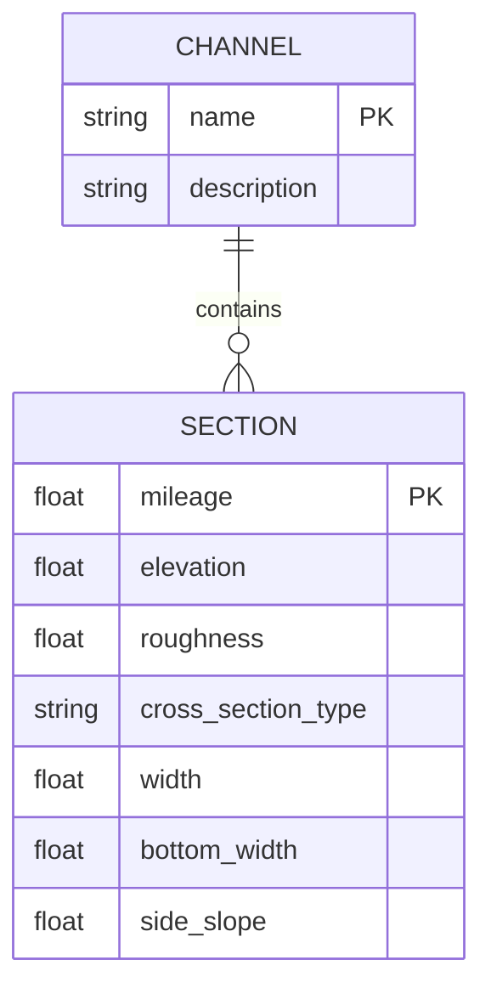
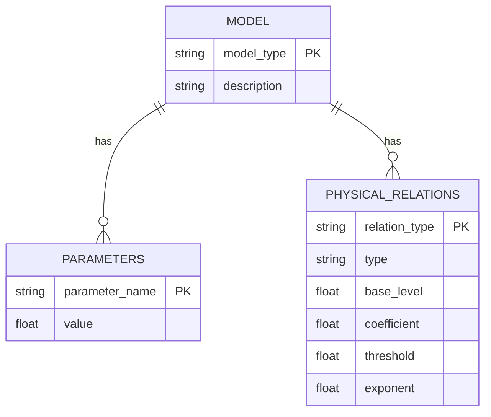
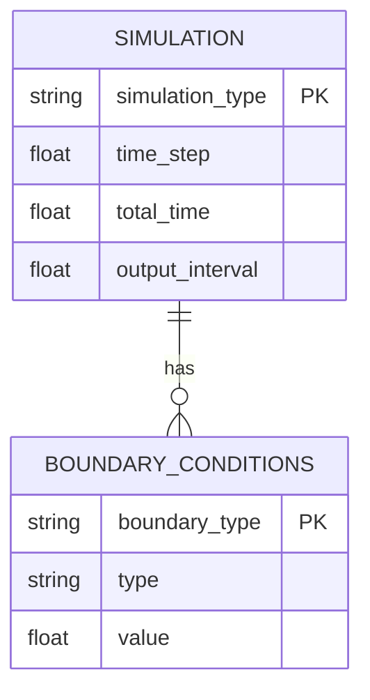
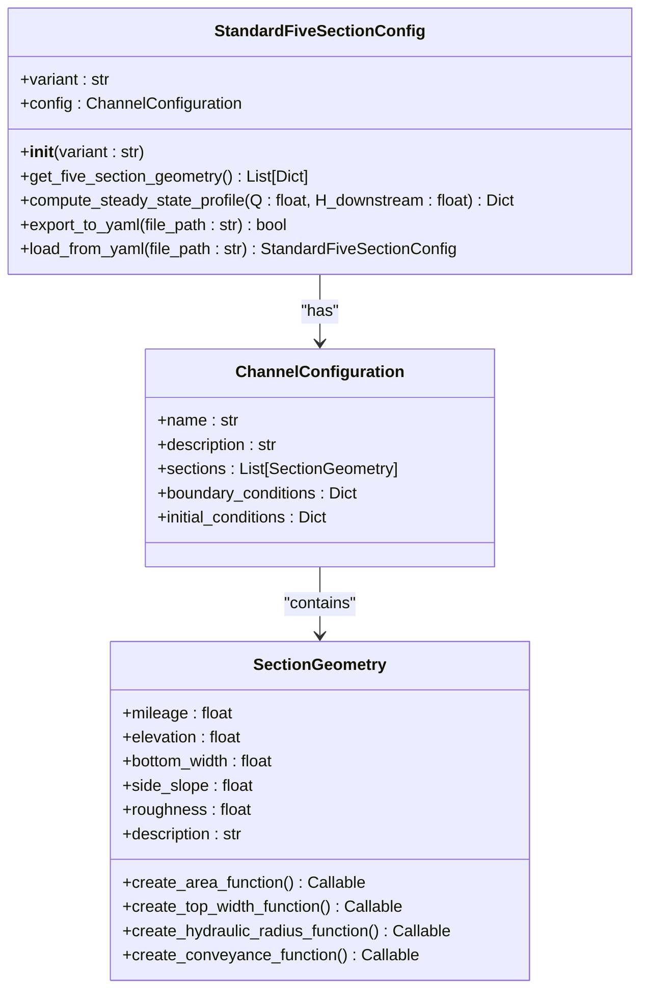
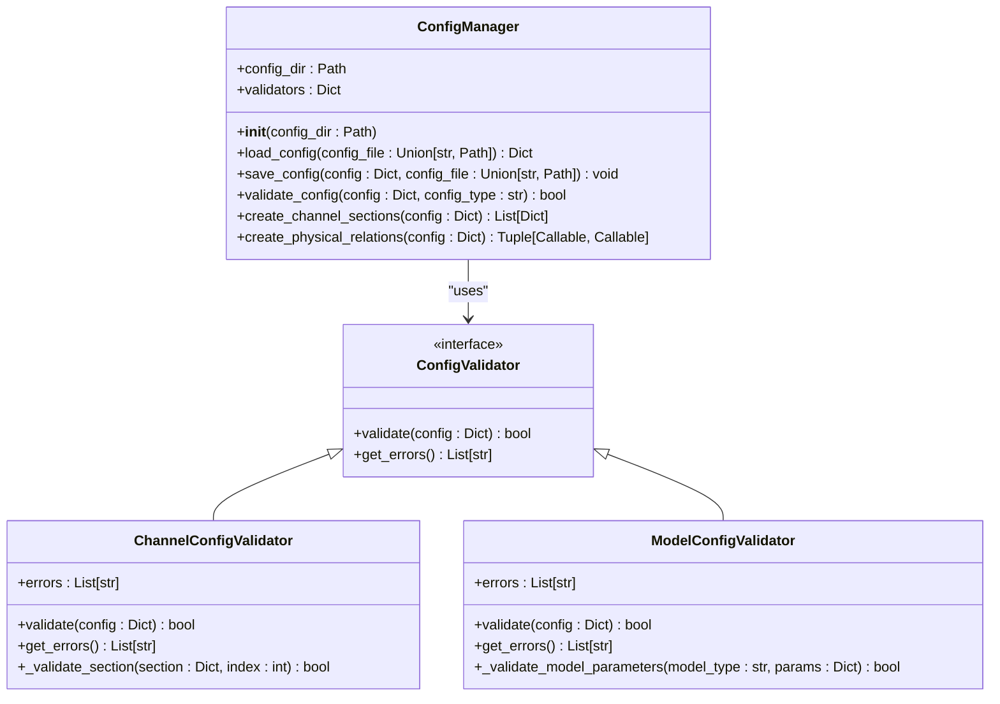

# 配置管理

<cite>
**本文档引用的文件**
- [standard_five_section.py](file://waternet/config/standard_five_section.py)
- [config_manager.py](file://scripts/config_manager.py)
- [__init__.py](file://waternet/config/__init__.py)
- [simple_channel.yaml](file://configs/example_configs/simple_channel.yaml)
- [complex_channel.yaml](file://configs/example_configs/complex_channel.yaml)
- [idz_model.yaml](file://configs/example_configs/idz_model.yaml)
- [muskingum_model.yaml](file://configs/example_configs/muskingum_model.yaml)
- [simulation_config.yaml](file://configs/example_configs/simulation_config.yaml)
</cite>

## 目录
1. [引言](#引言)
2. [YAML配置文件结构规范](#yaml配置文件结构规范)
3. [标准五断面配置](#标准五断面配置)
4. [配置管理器实现](#配置管理器实现)
5. [配置文件示例](#配置文件示例)
6. [配置继承与动态重载](#配置继承与动态重载)
7. [结论](#结论)

## 引言
WaterNet的配置管理系统为水力模型提供了统一的配置管理框架，支持YAML格式的配置文件，涵盖渠道几何、断面参数、模型选项等关键要素。系统通过`ConfigManager`类实现配置的加载、验证和管理，确保配置数据的完整性和一致性。本系统支持多种配置变体，包括标准、陡坡、缓坡和复杂配置，满足不同应用场景的需求。

## YAML配置文件结构规范

### 渠道几何配置
渠道几何配置文件定义了渠道的断面参数和几何特征，主要字段包括：

**核心字段**
- `name`: 配置名称，用于标识配置
- `description`: 配置描述，提供配置的详细说明
- `sections`: 断面列表，包含渠道各断面的详细参数

**断面参数**
每个断面包含以下参数：
- `mileage`: 里程桩号 (m)
- `elevation`: 底高程 (m)
- `roughness`: 曼宁糙率系数
- `cross_section`: 断面几何参数，包含类型和具体尺寸

**断面类型**
支持两种断面类型：
- `rectangular`: 矩形断面，包含`width`参数
- `trapezoidal`: 梯形断面，包含`bottom_width`和`side_slope`参数



**Diagram sources**
- [simple_channel.yaml](file://configs/example_configs/simple_channel.yaml)
- [complex_channel.yaml](file://configs/example_configs/complex_channel.yaml)

### 模型参数配置
模型参数配置文件定义了水力模型的类型和参数，主要字段包括：

**核心字段**
- `model_type`: 模型类型，支持'saint_venant'、'muskingum'、'storage_routing'、'idz'等
- `parameters`: 模型参数，根据模型类型不同而变化
- `physical_relations`: 物理关系参数，定义蓄量-水位和水位-出流关系

**模型参数**
不同模型的参数要求：
- `muskingum`: 需要`K`、`x`、`dt`、`initial_V`参数
- `idz`: 需要`tau`、`T_delay`、`alpha`、`dt`、`initial_V`参数

**物理关系**
- `V_to_H`: 蓄量-水位关系，支持`linear`类型
- `H_to_Q`: 水位-出流关系，支持`weir`类型



**Diagram sources**
- [idz_model.yaml](file://configs/example_configs/idz_model.yaml)
- [muskingum_model.yaml](file://configs/example_configs/muskingum_model.yaml)

### 仿真配置
仿真配置文件定义了仿真的类型和参数，主要字段包括：

**核心字段**
- `simulation_type`: 仿真类型，支持'steady'、'unsteady'、'parameter_estimation'、'digital_twin'
- `time_step`: 时间步长 (s)
- `total_time`: 总仿真时间 (s)
- `output_interval`: 输出间隔 (s)

**边界条件**
- `upstream_type`: 上游边界类型，'flow'或'level'
- `downstream_type`: 下游边界类型，'flow'或'level'
- `upstream_values`: 上游边界值
- `downstream_values`: 下游边界值



**Diagram sources**
- [simulation_config.yaml](file://configs/example_configs/simulation_config.yaml)

## 标准五断面配置

### 预设逻辑
`StandardFiveSectionConfig`类提供了标准五断面配置的预设逻辑，通过不同的变体支持多种应用场景：

**配置变体**
- `standard`: 标准配置，基于项目中使用最多的参数
- `steep`: 陡坡配置，适用于运动波模式测试
- `mild`: 缓坡配置，适用于扩散波模式测试
- `complex`: 复杂配置，适用于完整方程求解

**Section sources**
- [standard_five_section.py](file://waternet/config/standard_five_section.py#L295-L321)

### 使用方法
标准五断面配置的使用方法如下：

**初始化配置管理器**
```python
config_manager = StandardFiveSectionConfig(variant="standard")
```

**获取五断面几何数据**
```python
geometry_data = config_manager.get_five_section_geometry()
```

**计算恒定流水面线**
```python
result = config_manager.compute_steady_state_profile(Q=50.0, H_downstream=101.0)
```

**导出配置到YAML文件**
```python
config_manager.export_to_yaml("channel_config.yaml")
```

**从YAML文件加载配置**
```python
loaded_config = StandardFiveSectionConfig.load_from_yaml("channel_config.yaml")
```



**Diagram sources**
- [standard_five_section.py](file://waternet/config/standard_five_section.py)

## 配置管理器实现

### ConfigManager类
`ConfigManager`类是配置管理系统的核心，负责配置的加载、验证和管理：

**核心功能**
- `load_config`: 加载配置文件
- `save_config`: 保存配置文件
- `validate_config`: 验证配置完整性
- `create_channel_sections`: 创建渠道断面
- `create_physical_relations`: 创建物理关系函数

**Section sources**
- [__init__.py](file://waternet/config/__init__.py#L259-L282)

### 配置验证
系统提供了完整的配置验证机制，确保配置数据的正确性：

**验证器类型**
- `ChannelConfigValidator`: 渠道配置验证器
- `ModelConfigValidator`: 模型配置验证器

**验证规则**
- 检查必需字段是否存在
- 验证数值类型和范围
- 检查断面里程排序
- 验证模型参数范围



**Diagram sources**
- [__init__.py](file://waternet/config/__init__.py)

## 配置文件示例

### 简单渠道配置
`simple_channel.yaml`文件展示了简单矩形明渠的配置：

```yaml
name: simple_rectangular_channel
description: 简单矩形明渠示例
sections:
  - mileage: 0.0
    elevation: 100.0
    roughness: 0.025
    cross_section:
      type: rectangular
      width: 10.0
  - mileage: 500.0
    elevation: 99.5
    roughness: 0.025
    cross_section:
      type: rectangular
      width: 10.0
  - mileage: 1000.0
    elevation: 99.0
    roughness: 0.025
    cross_section:
      type: rectangular
      width: 10.0
```

**关键参数说明**
- `width: 10.0`: 断面宽度为10米
- `roughness: 0.025`: 曼宁糙率为0.025
- 三个断面构成1000米长的渠道

**Section sources**
- [simple_channel.yaml](file://configs/example_configs/simple_channel.yaml)

### 复杂渠道配置
`complex_channel.yaml`文件展示了复杂梯形断面明渠的配置：

```yaml
name: complex_trapezoidal_channel
description: 复杂梯形断面明渠
sections:
  - mileage: 0.0
    elevation: 100.0
    roughness: 0.030
    cross_section:
      type: trapezoidal
      bottom_width: 8.0
      side_slope: 2.0
  - mileage: 250.0
    elevation: 99.75
    roughness: 0.028
    cross_section:
      type: trapezoidal
      bottom_width: 9.0
      side_slope: 1.8
  - mileage: 500.0
    elevation: 99.5
    roughness: 0.027
    cross_section:
      type: trapezoidal
      bottom_width: 10.0
      side_slope: 1.5
  - mileage: 750.0
    elevation: 99.25
    roughness: 0.025
    cross_section:
      type: trapezoidal
      bottom_width: 11.0
      side_slope: 1.2
  - mileage: 1000.0
    elevation: 99.0
    roughness: 0.025
    cross_section:
      type: trapezoidal
      bottom_width: 12.0
      side_slope: 1.0
```

**关键参数说明**
- `bottom_width`: 底宽从8米逐渐增加到12米
- `side_slope`: 边坡系数从2.0逐渐减小到1.0
- `roughness`: 糙率从0.030逐渐减小到0.025
- 五个断面构成1000米长的渠道

**Section sources**
- [complex_channel.yaml](file://configs/example_configs/complex_channel.yaml)

## 配置继承与动态重载

### 配置继承
系统支持配置继承机制，允许基于现有配置创建新的配置：

**继承方式**
- 基于预定义配置创建自定义配置
- 复制基础配置的所有设置
- 修改特定参数以适应新需求

**使用示例**
```python
# 基于开发环境配置创建自定义配置
custom_config = manager.create_custom_config("my_config", "development")
custom_config.testing.min_coverage = 0.85
custom_config.performance.threshold_multiplier = 1.4
```

### 动态重载
系统支持配置的动态重载，允许在运行时更新配置：

**重载机制**
- 监听配置文件变化
- 自动重新加载配置
- 通知相关组件更新

**使用示例**
```python
# 监听配置变化并重新加载
while True:
    if config_file_modified():
        new_config = manager.load_config("config.yaml")
        update_system_with_new_config(new_config)
    time.sleep(1)
```

**Section sources**
- [config_manager.py](file://scripts/config_manager.py)

## 结论
WaterNet的配置管理系统提供了一套完整的配置管理解决方案，支持YAML格式的配置文件，涵盖了渠道几何、断面参数、模型选项等关键要素。系统通过`StandardFiveSectionConfig`类提供了标准五断面配置的预设逻辑，通过`ConfigManager`类实现了配置的解析、验证和加载。配置文件示例展示了简单和复杂渠道的配置方法，系统还支持配置继承和动态重载机制，为水力模型的配置管理提供了灵活可靠的解决方案。