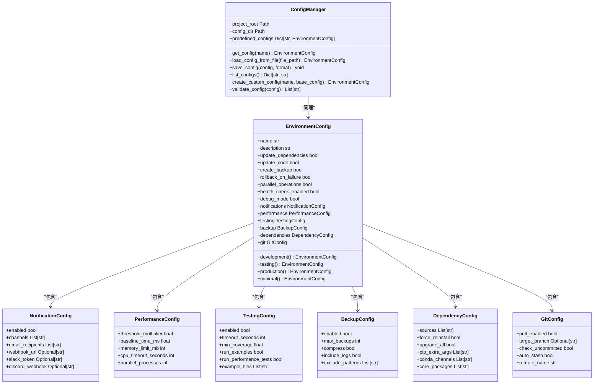

# 配置管理API

<cite>
**Referenced Files in This Document**   
- [config_manager.py](file://scripts/config_manager.py)
</cite>

## 目录
1. [简介](#简介)
2. [核心组件](#核心组件)
3. [ConfigManager类API](#configmanager类api)
4. [配置类结构](#配置类结构)
5. [使用示例](#使用示例)

## 简介

`ConfigManager`类是WaterNet系统中的核心配置管理组件，提供了一套完整的配置管理解决方案。该系统支持多环境配置管理，包括开发、测试、生产和用户自定义配置，确保系统在不同环境下的稳定运行和灵活配置。

**Section sources**
- [config_manager.py](file://scripts/config_manager.py#L1-L50)

## 核心组件

`ConfigManager`类与多个配置数据类协同工作，构成了一个完整的配置管理系统。系统采用分层设计，将复杂的配置分解为多个子配置模块，每个模块负责特定领域的配置管理。



**Diagram sources**
- [config_manager.py](file://scripts/config_manager.py#L20-L192)

**Section sources**
- [config_manager.py](file://scripts/config_manager.py#L20-L192)

## ConfigManager类API

`ConfigManager`类提供了完整的配置管理功能，包括配置的获取、加载、保存、创建和验证等操作。

### get_config()

获取指定名称的配置。首先检查预定义配置，如果不存在则尝试从YAML或JSON文件中加载。

**参数**
- `name` (str): 配置名称

**返回值**
- `EnvironmentConfig`: 配置对象

**异常**
- `ValueError`: 当指定的配置不存在时抛出

**Section sources**
- [config_manager.py](file://scripts/config_manager.py#L211-L226)

### load_config_from_file()

从文件加载配置。支持YAML和JSON格式的配置文件。

**参数**
- `file_path` (Path): 配置文件路径

**返回值**
- `EnvironmentConfig`: 配置对象

**异常**
- `ValueError`: 当无法加载配置文件时抛出

**Section sources**
- [config_manager.py](file://scripts/config_manager.py#L228-L240)

### save_config()

将配置保存到文件。支持YAML和JSON两种格式。

**参数**
- `config` (EnvironmentConfig): 要保存的配置对象
- `format` (str): 保存格式，可选'yaml'或'json'，默认为'yaml'

**异常**
- `ValueError`: 当无法保存配置文件时抛出

**Section sources**
- [config_manager.py](file://scripts/config_manager.py#L242-L260)

### list_configs()

列出所有可用的配置，包括预定义配置和用户自定义配置。

**返回值**
- `Dict[str, str]`: 配置名称到描述的映射

**Section sources**
- [config_manager.py](file://scripts/config_manager.py#L262-L281)

### create_custom_config()

基于现有配置创建新的自定义配置。

**参数**
- `name` (str): 新配置的名称
- `base_config` (str): 基础配置名称，默认为'development'

**返回值**
- `EnvironmentConfig`: 新创建的配置对象

**异常**
- `ValueError`: 当基础配置不存在时抛出

**Section sources**
- [config_manager.py](file://scripts/config_manager.py#L283-L311)

### validate_config()

验证配置的完整性，检查关键配置项是否合理。

**参数**
- `config` (EnvironmentConfig): 要验证的配置对象

**返回值**
- `List[str]`: 验证警告列表

**验证规则**
- 测试覆盖率不能超过100%
- 测试超时时间应至少60秒
- 至少应保留1个备份
- 性能阈值倍数应大于等于1.0
- 依赖源只能是'pip'或'conda'

**Section sources**
- [config_manager.py](file://scripts/config_manager.py#L336-L359)

## 配置类结构

### EnvironmentConfig

环境配置主类，包含所有配置项。

**属性**
- `name` (str): 配置名称
- `description` (str): 配置描述
- `update_dependencies` (bool): 是否更新依赖
- `update_code` (bool): 是否更新代码
- `create_backup` (bool): 是否创建备份
- `rollback_on_failure` (bool): 失败时是否回滚
- `parallel_operations` (bool): 是否启用并行操作
- `health_check_enabled` (bool): 是否启用健康检查
- `debug_mode` (bool): 是否启用调试模式

**预定义配置方法**
- `development()`: 开发环境配置
- `testing()`: 测试环境配置
- `production()`: 生产环境配置
- `minimal()`: 最小配置

**Section sources**
- [config_manager.py](file://scripts/config_manager.py#L94-L192)

### NotificationConfig

通知配置类。

**属性**
- `enabled` (bool): 是否启用通知
- `channels` (List[str]): 通知渠道列表
- `email_recipients` (List[str]): 邮件收件人列表
- `webhook_url` (Optional[str]): Webhook URL
- `slack_token` (Optional[str]): Slack令牌
- `discord_webhook` (Optional[str]): Discord Webhook

**Section sources**
- [config_manager.py](file://scripts/config_manager.py#L20-L27)

### PerformanceConfig

性能配置类。

**属性**
- `threshold_multiplier` (float): 性能阈值倍数
- `baseline_time_ms` (float): 基准时间(毫秒)
- `memory_limit_mb` (int): 内存限制(MB)
- `cpu_timeout_seconds` (int): CPU超时时间(秒)
- `parallel_processes` (int): 并行进程数

**Section sources**
- [config_manager.py](file://scripts/config_manager.py#L31-L37)

### TestingConfig

测试配置类。

**属性**
- `enabled` (bool): 是否启用测试
- `timeout_seconds` (int): 超时时间(秒)
- `min_coverage` (float): 最小覆盖率
- `run_examples` (bool): 是否运行示例
- `run_performance_tests` (bool): 是否运行性能测试
- `example_files` (List[str]): 示例文件列表

**Section sources**
- [config_manager.py](file://scripts/config_manager.py#L41-L51)

## 使用示例

以下示例展示了如何在自动化脚本中使用`ConfigManager`进行环境切换和配置管理。

```python
# 创建配置管理器
manager = ConfigManager()

# 列出所有可用配置
configs = manager.list_configs()
for name, desc in configs.items():
    print(f"{name}: {desc}")

# 获取开发环境配置
dev_config = manager.get_config('development')
print(f"开发环境描述: {dev_config.description}")

# 创建自定义配置
custom_config = manager.create_custom_config('my_custom', 'production')
custom_config.testing.min_coverage = 0.92
custom_config.performance.threshold_multiplier = 1.2

# 验证配置
warnings = manager.validate_config(custom_config)
if warnings:
    for warning in warnings:
        print(f"警告: {warning}")

# 保存配置
manager.save_config(custom_config, 'yaml')

# 从文件加载配置
loaded_config = manager.load_config_from_file(Path('my_config.yaml'))
```

**Section sources**
- [config_manager.py](file://scripts/config_manager.py#L377-L408)
- [demo_complete_system.py](file://scripts/demo_complete_system.py#L81-L111)