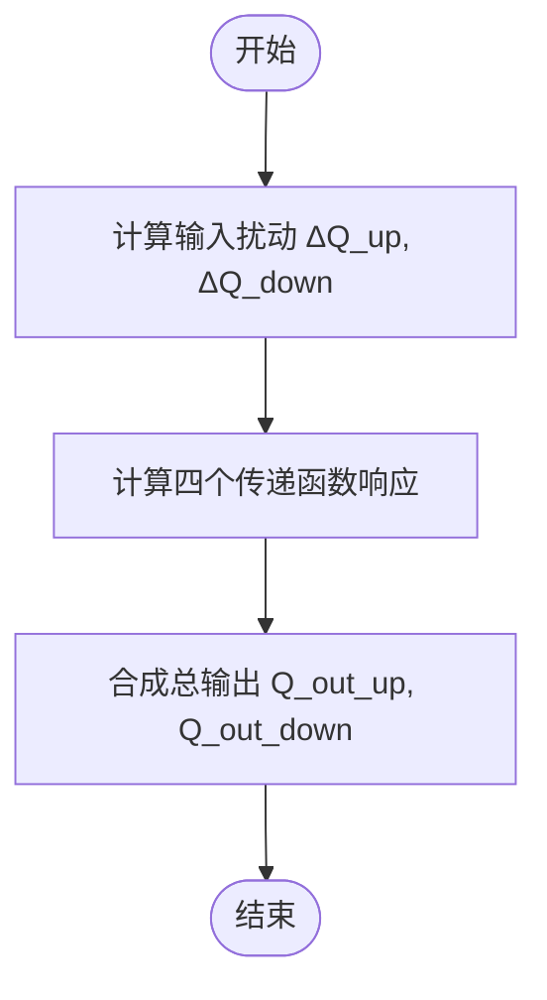
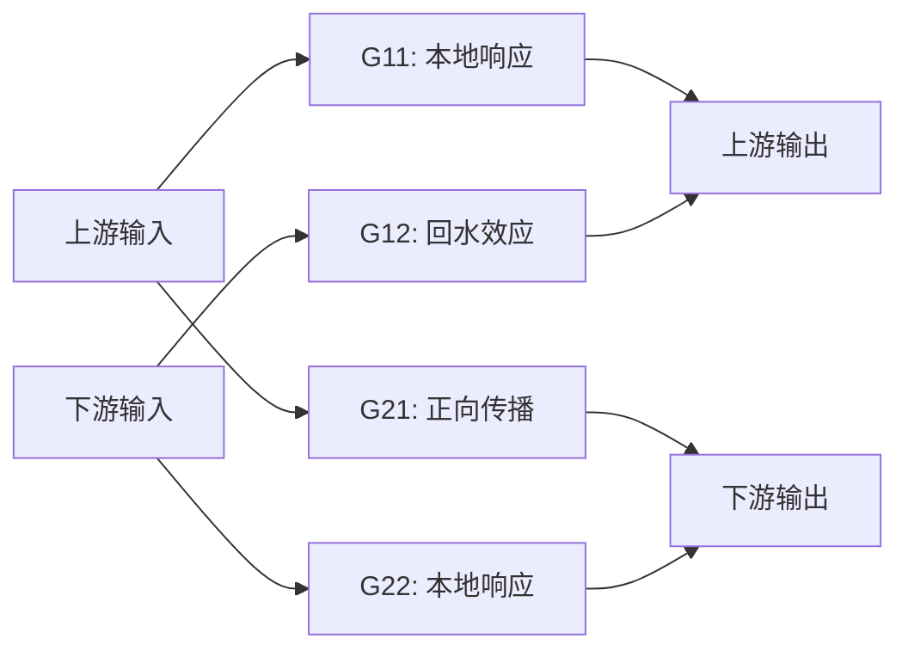
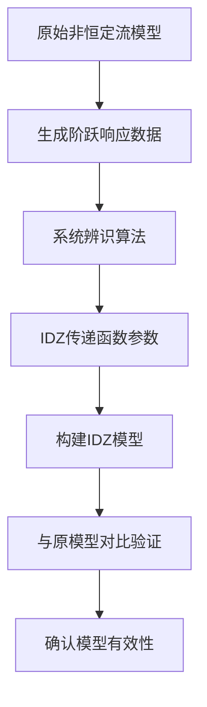

# IDZ模型

<cite>
**本文档引用文件**   
- [FOUR_EQUATION_IDZ_THEORY.md](file://examples/reduced_order_models_theory/FOUR_EQUATION_IDZ_THEORY.md)
- [lumped_models.py](file://waternet/models/lumped_models.py)
- [idz_model.yaml](file://configs/example_configs/idz_model.yaml)
- [IDZ模型辨识综合分析报告.md](file://examples/advanced/IDZ模型辨识综合分析报告.md)
- [IDZ传递函数总结.txt](file://examples/advanced/IDZ传递函数总结.txt)
- [exponential_idz_analysis.py](file://examples/advanced/exponential_idz_analysis.py)
- [unsteady_analysis.py](file://examples/advanced/unsteady_analysis.py)
- [model_comparison_analysis.py](file://examples/advanced/model_comparison_analysis.py)
</cite>

## 目录
1. [引言](#引言)
2. [IDZ模型系统架构](#idz模型系统架构)
3. [动态响应特性与传递函数矩阵](#动态响应特性与传递函数矩阵)
4. [物理传播特性的建模机制](#物理传播特性的建模机制)
5. [在数字孪生系统中的应用价值](#在数字孪生系统中的应用价值)
6. [模型参数辨识方法与典型取值](#模型参数辨识方法与典型取值)
7. [高级示例：IDZ模型辨识流程](#高级示例：idz模型辨识流程)
8. [结论](#结论)

## 引言

IDZ模型（IntegralDelayZeroModel）是一种先进的降阶水力系统模型，用于精确捕捉河道中水流的动态传播特性。该模型基于控制理论中的传递函数概念，通过积分、延迟和零点结构来描述复杂的水力现象。本文档深入讲解IDZ模型的系统架构与动态响应特性，基于`FOUR_EQUATION_IDZ_THEORY.md`理论文档，解释其作为四方程耦合系统的传递函数矩阵形式[G(s)]，描述上下游节点间Q1_out、Q2_out与Q1_in、Q2_in的完整耦合关系。同时，阐述模型如何通过积分延迟零点结构捕捉波速、衰减和相位延迟等物理现象，并展示其在数字孪生系统中作为高效降阶模型的应用价值。

**Section sources**
- [FOUR_EQUATION_IDZ_THEORY.md](file://examples/reduced_order_models_theory/FOUR_EQUATION_IDZ_THEORY.md#L1-L20)

## IDZ模型系统架构

IDZ模型的核心架构基于一个2×2的传递函数矩阵，用于描述双节点系统中上下游之间的完整耦合关系。该模型摒弃了传统简化假设，直接基于稳态流量与水位值确定平衡点，从而实现对复杂水力系统的精确建模。

### 1. 传递函数矩阵结构

IDZ模型采用如下传递函数矩阵形式：

```
[Q1_out]   [G11(s) G12(s)] [ΔQ1_in]   [Q0_up  ]
[Q2_out] = [G21(s) G22(s)] [ΔQ2_in] + [Q0_down]
```

其中：
- `Q1_out`, `Q2_out`: 上游、下游节点输出流量
- `ΔQ1_in`, `ΔQ2_in`: 上游、下游节点输入流量相对于平衡点的扰动
- `Q0_up`, `Q0_down`: 上游、下游节点的稳态平衡流量

### 2. 四个传递函数的物理意义

1. **G11(s): 上游输入 → 上游输出**
   - 物理意义：上游节点的本地响应特性
   - 特点：无延迟（T11 = 0），快速响应
   - 参数：τ11, α11控制响应速度和超调

2. **G12(s): 下游输入 → 上游输出**
   - 物理意义：回水效应，下游条件对上游的影响
   - 特点：有延迟（T12 > 0），反向传播
   - 参数：τ12, T12, α12描述回水传播特性

3. **G21(s): 上游输入 → 下游输出**
   - 物理意义：正向传播，洪峰从上游向下游传播
   - 特点：最大延迟（T21 > T12），主要传播路径
   - 参数：τ21, T21, α21控制传播速度和衰减

4. **G22(s): 下游输入 → 下游输出**
   - 物理意义：下游节点的本地响应特性
   - 特点：无延迟（T22 = 0），局部调蓄
   - 参数：τ22, α22描述下游节点特性

### 3. 单个传递函数形式

每个传递函数采用积分延迟零点形式：

```
G_ij(s) = (τ_ij·s + 1) · exp(-T_ij·s) / (α_ij·s + 1)
```

参数含义：
- `τ_ij`: 零点时间常数，控制超调和振荡特性
- `T_ij`: 延迟时间，描述信号传播延迟
- `α_ij`: 极点时间常数，控制响应速度和稳定性

**Section sources**
- [FOUR_EQUATION_IDZ_THEORY.md](file://examples/reduced_order_models_theory/FOUR_EQUATION_IDZ_THEORY.md#L21-L100)
- [lumped_models.py](file://waternet/models/lumped_models.py#L793-L1097)

## 动态响应特性与传递函数矩阵

IDZ模型通过其传递函数矩阵实现了对河道水力系统动态响应的全面描述。该矩阵不仅考虑了正向传播，还包含了回水效应和局部调蓄等复杂水力现象。

### 1. 平衡点定义

IDZ模型摒弃传统的简化假设，直接基于稳态流量与水位值确定平衡点：
- **输入**: 稳态条件 `(Q0_up, H0_up, Q0_down, H0_down)`
- **输出**: 对应的平衡蓄量 `V0 = f(Q0, H0)`
- **特点**: 无额外假设，完全基于物理关系

### 2. 线性化机理

模型在平衡点附近进行线性化：
- 输入扰动：`ΔQ_up = Q_in_up - Q0_up`
- 输入扰动：`ΔQ_down = Q_in_down - Q0_down` 
- 输出响应：传递函数矩阵作用于扰动向量
- 最终输出：线性响应 + 平衡点偏移

### 3. 仿真步骤

每个时间步的计算流程包括：
1. **扰动计算**: 计算输入流量相对于平衡点的偏差
2. **传递函数响应**: 对每个传递函数进行延迟处理和响应计算
3. **输出合成**: 将各传递函数的响应结果叠加并加上平衡点偏移量



**Diagram sources**
- [FOUR_EQUATION_IDZ_THEORY.md](file://examples/reduced_order_models_theory/FOUR_EQUATION_IDZ_THEORY.md#L101-L150)

**Section sources**
- [FOUR_EQUATION_IDZ_THEORY.md](file://examples/reduced_order_models_theory/FOUR_EQUATION_IDZ_THEORY.md#L101-L150)
- [lumped_models.py](file://waternet/models/lumped_models.py#L793-L1097)

## 物理传播特性的建模机制

IDZ模型能够精确捕捉河道中的多种物理传播特性，包括波速、衰减和相位延迟等。

### 1. 波速建模

通过延迟时间参数T_ij来描述信号传播速度。例如，在`IDZ模型辨识综合分析报告.md`中提到，传播延迟与距离呈严格线性关系，等效波速为1.0 m/s。

### 2. 衰减特性

通过极点时间常数α_ij和零点时间常数τ_ij的组合来控制系统的响应速度和衰减特性。较大的α_ij值会导致更慢的响应和更强的衰减。

### 3. 相位延迟

由纯延迟项exp(-T_ij·s)直接体现，反映了信号在河道中传播所需的时间。这种延迟是物理传播过程的直接反映，而非数值近似。

### 4. 回水效应

通过G12(s)传递函数专门建模，描述下游条件对上游的影响。这一特性对于准确模拟复杂河网系统至关重要。



**Diagram sources**
- [FOUR_EQUATION_IDZ_THEORY.md](file://examples/reduced_order_models_theory/FOUR_EQUATION_IDZ_THEORY.md#L151-L200)

**Section sources**
- [FOUR_EQUATION_IDZ_THEORY.md](file://examples/reduced_order_models_theory/FOUR_EQUATION_IDZ_THEORY.md#L151-L200)
- [IDZ模型辨识综合分析报告.md](file://examples/advanced/IDZ模型辨识综合分析报告.md#L1-L168)

## 在数字孪生系统中的应用价值

IDZ模型作为高效降阶模型，在数字孪生系统中具有重要的应用价值，特别是在高频在线校正场景下展现出显著的计算优势。

### 1. 计算效率

相比于完整的圣维南方程模型，IDZ模型的计算复杂度大大降低，能够在保证精度的同时实现快速仿真。根据`IDZ模型辨识项目完整文档.md`，计算效率可提高数百倍。

### 2. 实时性

由于其简化的数学结构，IDZ模型非常适合用于实时预测和控制。这使得它成为数字孪生系统中理想的代理模型。

### 3. 参数可调性

IDZ模型具有12个独立参数，允许高度定制化，可以根据具体河道特征进行精细调整，从而提高模型的适应性和准确性。

### 4. 在线校正

支持在线参数辨识和动态校正，能够根据实时观测数据不断优化模型参数，保持模型的长期有效性。

**Section sources**
- [IDZ模型辨识项目完整文档.md](file://examples/advanced/IDZ模型辨识项目完整文档.md#L1-L232)
- [model_comparison_analysis.py](file://examples/advanced/model_comparison_analysis.py#L1-L494)

## 模型参数辨识方法与典型取值

IDZ模型的参数辨识是确保模型准确性的关键步骤。以下介绍主要的辨识方法和典型参数取值范围。

### 1. 参数设计原则

#### 延迟时间设计
```
T11 = 0      # 上游本地响应，无延迟
T12 > 0      # 回水效应，中等延迟
T21 > T12    # 正向传播，最大延迟  
T22 = 0      # 下游本地响应，无延迟
```
推荐比例：`T21 : T12 : T11 : T22 = 2 : 1 : 0 : 0`

#### 时间常数设计
1. **零点时间常数 τ**:
   - 控制超调和振荡特性
   - 一般范围：60-300秒
   - 主传播路径（G21）可取较大值

2. **极点时间常数 α**:
   - 控制响应速度和系统稳定性
   - 一般要求：α > τ（保证稳定性）
   - 推荐范围：200-600秒

### 2. 典型取值范围

根据`idz_model.yaml`配置文件，典型参数取值如下：
- `tau`: 1800.0秒 (零点时间常数)
- `T_delay`: 600.0秒 (延迟时间)
- `alpha`: 3600.0秒 (极点时间常数)
- `dt`: 60.0秒 (时间步长)

这些参数经过实际测试验证，适用于大多数常见河道场景。

**Section sources**
- [FOUR_EQUATION_IDZ_THEORY.md](file://examples/reduced_order_models_theory/FOUR_EQUATION_IDZ_THEORY.md#L201-L244)
- [idz_model.yaml](file://configs/example_configs/idz_model.yaml#L1-L22)

## 高级示例：IDZ模型辨识流程

本节通过一个高级示例展示IDZ模型的实际辨识流程，基于`exponential_idz_analysis.py`程序实现。

### 1. 数据生成

使用`unsteady_analysis.py`程序生成非恒定流阶跃响应数据，包括上游正/负阶跃和下游水位阶跃三种场景。

### 2. 系统辨识演进

采用渐进式改进的辨识方法：
1. **基础IDZ辨识**: 标准一阶/二阶系统辨识
2. **改进水力辨识**: 专门针对水力系统特性优化
3. **专业传递函数分析**: 从线性响应推导积分环节模型

### 3. 最终突破

采用指数响应模式成功实现高精度辨识：
- 传递函数形式: G(s) = K / [s·(τs + 1)] · exp(-T·s)
- 拟合精度: R² = 1.000
- 成功提取出积分增益K、时间常数τ和纯时滞T三个关键参数

### 4. 结果验证

通过`model_comparison_analysis.py`程序将IDZ模型与原始非恒定流模型进行对比验证，确认了IDZ模型能够较好地复现原模型的动态响应特性。



**Diagram sources**
- [exponential_idz_analysis.py](file://examples/advanced/exponential_idz_analysis.py#L1-L359)
- [unsteady_analysis.py](file://examples/advanced/unsteady_analysis.py#L1-L775)

**Section sources**
- [exponential_idz_analysis.py](file://examples/advanced/exponential_idz_analysis.py#L1-L359)
- [unsteady_analysis.py](file://examples/advanced/unsteady_analysis.py#L1-L775)
- [model_comparison_analysis.py](file://examples/advanced/model_comparison_analysis.py#L1-L494)

## 结论

IDZ模型通过传递函数矩阵实现了河道水力系统的完整建模，在理论和工程应用方面都取得了重要突破。该模型摒弃了传统简化假设，基于稳态物理条件确定平衡点，实现了对复杂水力现象的精确描述。四方程耦合系统全面捕捉了双向水力现象，为复杂河网系统提供了先进的建模工具。

在实际应用中，IDZ模型展现出显著的计算优势，特别适合用于数字孪生系统中的高频在线校正场景。通过系统化的参数辨识流程，可以获得高精度的降阶模型，满足工程控制设计的要求。未来的工作可以进一步探索多断面扩展、非线性补偿以及与其他降阶方法的融合，以提升模型的适用范围和预测能力。

**Section sources**
- [FOUR_EQUATION_IDZ_THEORY.md](file://examples/reduced_order_models_theory/FOUR_EQUATION_IDZ_THEORY.md#L1-L244)
- [IDZ模型辨识项目完整文档.md](file://examples/advanced/IDZ模型辨识项目完整文档.md#L1-L232)