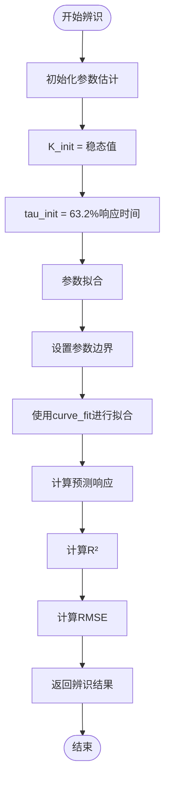
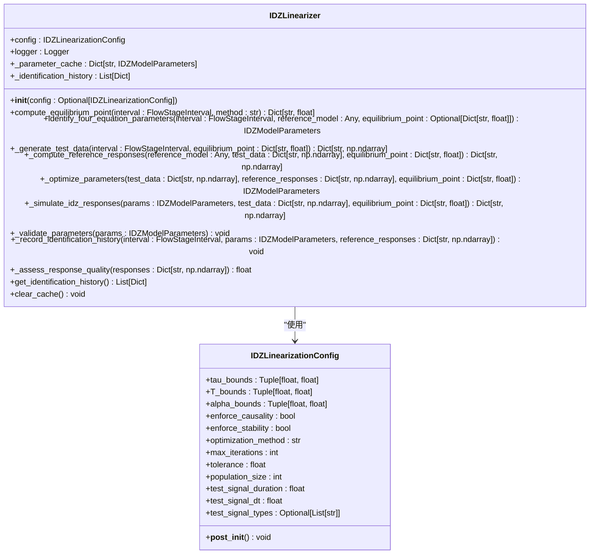
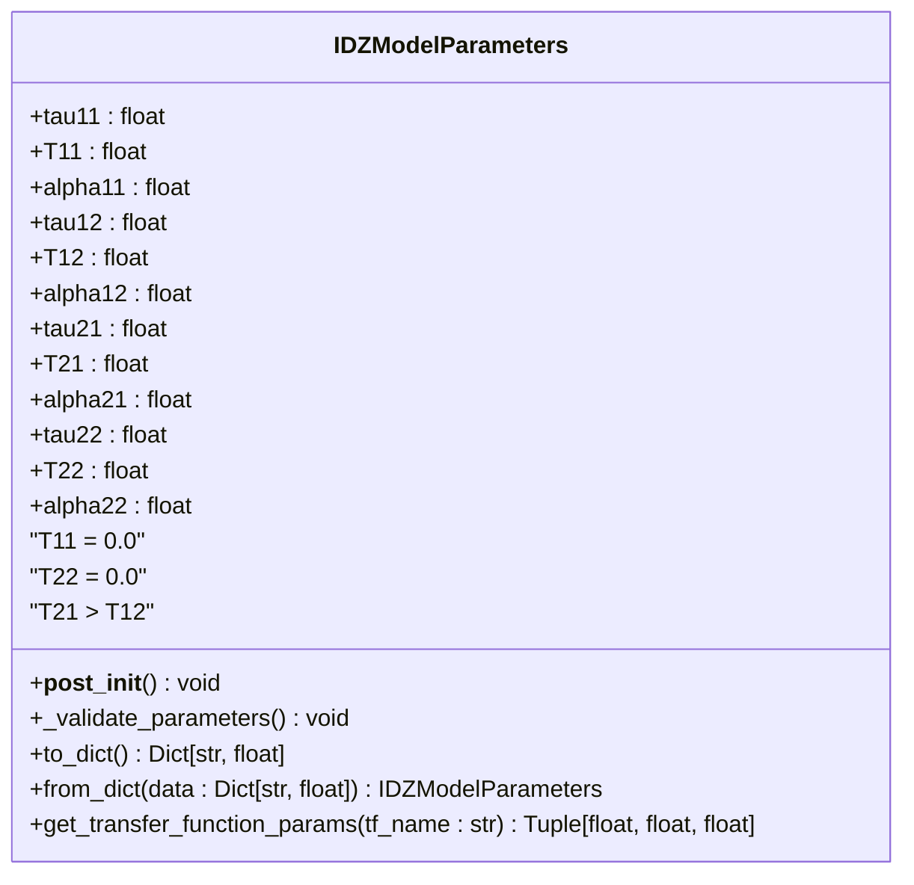
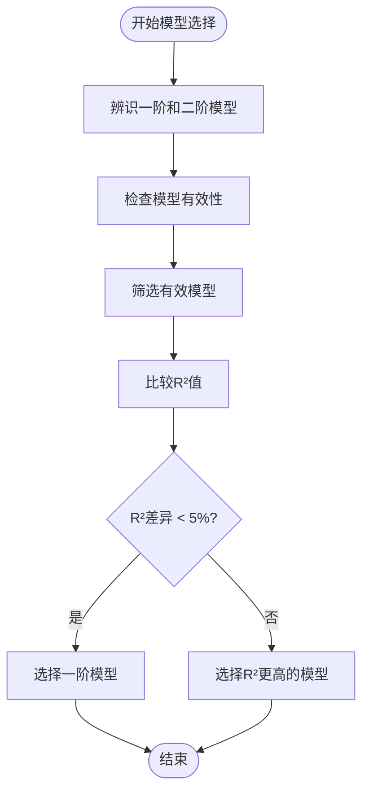

# 优化执行

<cite>
**Referenced Files in This Document**   
- [idz_model_identification.py](file://examples/advanced/idz_model_identification.py)
- [lumped_models.py](file://waternet/models/lumped_models.py)
- [idz_linearizer.py](file://waternet/models/idz_linearizer.py)
- [flow_stage_interval_system.py](file://waternet/models/flow_stage_interval_system.py)
</cite>

## 目录
1. [引言](#引言)
2. [核心组件分析](#核心组件分析)
3. [IDZ模型参数辨识优化算法](#idz模型参数辨识优化算法)
4. [物理约束与先验知识编码](#物理约束与先验知识编码)
5. [多模型选择逻辑](#多模型选择逻辑)
6. [结论](#结论)

## 引言

本文档深入讲解IDZ模型参数辨识的优化算法实现。基于`idz_model_identification.py`中的`identify_first_order`和`identify_second_order`方法，分析最小二乘拟合和非线性优化在参数估计中的应用。详细描述目标函数（如R²、RMSE）的构建方式、参数边界约束的设置策略以及多模型选择逻辑。结合`IntegralDelayZeroModel`的物理约束，说明如何在优化过程中编码这些先验知识，确保辨识结果的物理合理性。

## 核心组件分析

本文档的核心组件包括IDZ模型辨识器、四方程IDZ模型以及IDZ线性化器。这些组件共同构成了一个完整的IDZ模型参数辨识系统。

**Section sources**
- [idz_model_identification.py](file://examples/advanced/idz_model_identification.py#L1-L381)
- [lumped_models.py](file://waternet/models/lumped_models.py#L793-L1097)
- [idz_linearizer.py](file://waternet/models/idz_linearizer.py#L49-L509)

## IDZ模型参数辨识优化算法

IDZ模型参数辨识的核心是通过优化算法从输入输出数据中确定系统的传递函数。该过程主要依赖于最小二乘拟合和非线性优化技术。

### 一阶与二阶模型辨识

在`idz_model_identification.py`文件中，`IDZModelIdentifier`类实现了`identify_first_order`和`identify_second_order`方法，用于辨识一阶和二阶模型参数。

一阶模型的传递函数形式为：G(s) = K / (tau*s + 1) * exp(-td*s)，其中K为增益，tau为时间常数，td为纯延迟时间。二阶模型的传递函数形式为：G(s) = K / ((tau1*s + 1)*(tau2*s + 1)) * exp(-td*s)，其中tau1和tau2为两个时间常数。

**Diagram sources**
- [idz_model_identification.py](file://examples/advanced/idz_model_identification.py#L86-L116)
- [idz_model_identification.py](file://examples/advanced/idz_model_identification.py#L118-L146)

### 目标函数构建

目标函数的构建是参数辨识的关键。在`idz_model_identification.py`中，使用了R²（决定系数）和RMSE（均方根误差）作为拟合质量的评估指标。

R²的计算公式为：1 - (SS_res / SS_tot)，其中SS_res是残差平方和，SS_tot是总平方和。RMSE的计算公式为：sqrt(mean((y_true - y_pred)²))。

在`idz_linearizer.py`中，使用了更复杂的优化目标。`_optimize_parameters`方法定义了一个目标函数，该函数计算IDZ模型响应与参考模型响应之间的均方误差（MSE）。

**Diagram sources**
- [idz_linearizer.py](file://waternet/models/idz_linearizer.py#L49-L509)
- [idz_linearizer.py](file://waternet/models/idz_linearizer.py#L22-L46)

### 参数边界约束

参数边界约束的设置策略在`idz_linearizer.py`中得到了充分体现。`IDZLinearizationConfig`类定义了参数搜索边界，包括零点时间常数范围、延迟时间范围和极点时间常数范围。

在`_optimize_parameters`方法中，这些边界被用于约束优化算法的搜索空间。例如，零点时间常数的范围被设置为(50.0, 500.0)，延迟时间的范围被设置为(0.0, 1200.0)，极点时间常数的范围被设置为(200.0, 800.0)。

**Section sources**
- [idz_linearizer.py](file://waternet/models/idz_linearizer.py#L22-L46)
- [idz_linearizer.py](file://waternet/models/idz_linearizer.py#L306-L341)

## 物理约束与先验知识编码

在优化过程中，编码物理约束和先验知识是确保辨识结果物理合理性的关键。

### IntegralDelayZeroModel的物理约束

`IntegralDelayZeroModel`的物理约束包括T11=T22=0和T21>T12。这些约束在`IDZModelParameters`类的`_validate_parameters`方法中得到了体现。

**Diagram sources**
- [flow_stage_interval_system.py](file://waternet/models/flow_stage_interval_system.py#L279-L373)

### 先验知识编码

先验知识的编码主要通过参数验证和警告机制实现。在`_validate_parameters`方法中，如果T11或T22不等于0，会发出警告；如果T21小于或等于T12，也会发出警告。

此外，`IDZLinearizationConfig`类中的`enforce_causality`和`enforce_stability`参数也体现了先验知识的编码。`enforce_causality`确保延迟时间非负，`enforce_stability`确保极点时间常数为正。

**Section sources**
- [flow_stage_interval_system.py](file://waternet/models/flow_stage_interval_system.py#L279-L373)
- [idz_linearizer.py](file://waternet/models/idz_linearizer.py#L22-L46)

## 多模型选择逻辑

多模型选择逻辑在`idz_model_identification.py`中得到了实现。在`identify_models_for_scenario`方法中，首先辨识一阶和二阶模型，然后根据R²值选择最佳模型。

如果两个模型的R²差异小于5%，则优先选择一阶模型。这种策略基于奥卡姆剃刀原则，即在拟合效果相近的情况下，选择更简单的模型。

**Diagram sources**
- [idz_model_identification.py](file://examples/advanced/idz_model_identification.py#L201-L240)

**Section sources**
- [idz_model_identification.py](file://examples/advanced/idz_model_identification.py#L201-L240)

## 结论

本文档深入分析了IDZ模型参数辨识的优化算法实现。通过最小二乘拟合和非线性优化技术，结合物理约束和先验知识编码，实现了对IDZ模型参数的准确辨识。多模型选择逻辑确保了在拟合效果相近的情况下选择更简单的模型，提高了模型的实用性和可解释性。