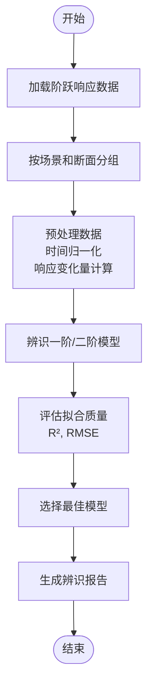
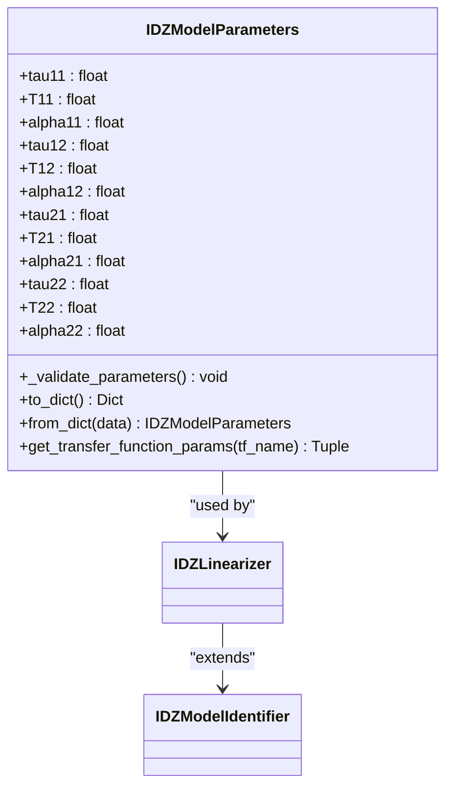
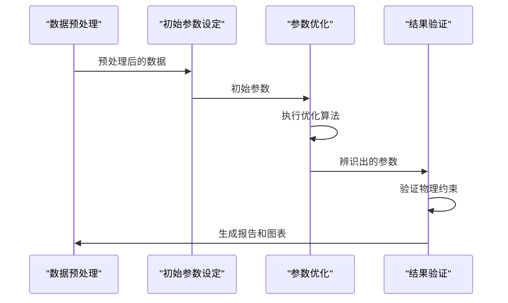

# 参数辨识方法

<cite>
**Referenced Files in This Document**   
- [idz_model_identification.py](file://examples/advanced/idz_model_identification.py)
- [improved_idz_identification.py](file://examples/advanced/improved_idz_identification.py)
- [professional_idz_analysis.py](file://examples/advanced/professional_idz_analysis.py)
- [IDZ模型辨识综合分析报告.md](file://examples/advanced/IDZ模型辨识综合分析报告.md)
- [idz_linearizer.py](file://waternet/models/idz_linearizer.py)
- [flow_stage_interval_system.py](file://waternet/models/flow_stage_interval_system.py)
</cite>

## 目录
1. [引言](#引言)
2. [IDZ模型参数辨识流程](#idz模型参数辨识流程)
3. [核心参数与物理约束](#核心参数与物理约束)
4. [优化算法与目标函数](#优化算法与目标函数)
5. [工作流与实现方法](#工作流与实现方法)
6. [参数取值范围与收敛性](#参数取值范围与收敛性)
7. [结论](#结论)

## 引言

IDZ模型参数辨识是水力系统建模与控制中的关键技术，旨在通过历史数据或高精度模型输出来估计系统的动态特性。本报告基于WaterNet项目中的实际代码示例和分析报告，系统讲解IDZ模型的参数辨识流程与实现方法。通过分析`idz_model_identification.py`等核心文件，详细阐述了从数据预处理、模型构建到结果验证的完整工作流，并解释了各传递函数参数的物理约束在辨识过程中的实现方式。

**Section sources**
- [IDZ模型辨识综合分析报告.md](file://examples/advanced/IDZ模型辨识综合分析报告.md)

## IDZ模型参数辨识流程

IDZ模型参数辨识是一个多阶段的系统工程，从基础的阶跃响应分析到复杂的分布参数建模，逐步深化对水力系统动态特性的理解。

### 基础辨识流程

基础辨识流程以`idz_model_identification.py`为核心，采用标准的系统辨识方法。该流程首先加载阶跃响应数据，按场景和断面进行分组，然后对每个断面的响应数据进行预处理，包括时间归一化和响应变化量计算。预处理后的数据用于辨识一阶或二阶传递函数模型。

一阶模型采用`G(s) = K / (tau*s + 1) * exp(-td*s)`的形式，通过`curve_fit`函数进行非线性最小二乘拟合。辨识过程包括初始参数估计（如利用63.2%响应时间估计时间常数tau）和参数优化，最终通过决定系数R²和均方根误差RMSE评估拟合质量。



**Diagram sources**
- [idz_model_identification.py](file://examples/advanced/idz_model_identification.py#L22-L294)

**Section sources**
- [idz_model_identification.py](file://examples/advanced/idz_model_identification.py#L22-L294)

### 改进的水力系统辨识

针对水力系统的特殊性，`improved_idz_identification.py`引入了更专业的辨识方法。该流程增加了波浪传播特性分析，通过计算各断面响应的50%变化点来估计波速。同时，采用了更复杂的水力系统响应模型，如Pade近似模型`G(s) = K * (1 - tau2*s) / (1 + tau1*s) * exp(-td*s)`，以更好地描述具有传输延迟的系统。

改进流程还实现了多层次的模型选择策略，同时拟合一阶模型、Pade近似模型和线性趋势模型，并选择R²最高的模型作为最佳结果。这种方法提高了对复杂水力响应的适应性。

### 专业传递函数分析

`professional_idz_analysis.py`代表了IDZ辨识的最高水平，实现了分布参数系统建模。该流程从线性响应特性出发，推导出积分环节加一阶滞后的传递函数`G(s) = K / (s * (τs + 1))`。通过分析斜坡响应的斜率，可以推导出时间常数τ ≈ K/slope。

该流程构建了完整的分布式传递函数模型，分析了增益K、时间常数τ和传播延迟td随距离的变化规律，并建立了空间传播特性模型。最终生成了详细的传递函数参数表和空间传播模型，为工程应用提供了坚实基础。

## 核心参数与物理约束

IDZ模型的核心参数包括增益K、时间常数τ、延迟时间T和衰减系数α，这些参数在辨识过程中受到严格的物理约束。

### 四方程IDZ模型参数

在`waternet/models/idz_linearizer.py`中定义的`IDZModelParameters`类，系统地组织了四方程IDZ模型的12个核心参数：

```python
class IDZModelParameters:
    # G11: 上游输入 → 上游输出 (本地响应)
    tau11: float = 120.0
    T11: float = 0.0
    alpha11: float = 300.0
    
    # G12: 下游输入 → 上游输出 (回水效应)
    tau12: float = 60.0
    T12: float = 600.0
    alpha12: float = 250.0
    
    # G21: 上游输入 → 下游输出 (正向传播)
    tau21: float = 200.0
    T21: float = 1200.0
    alpha21: float = 400.0
    
    # G22: 下游输入 → 下游输出 (本地响应)
    tau22: float = 100.0
    T22: float = 0.0
    alpha22: float = 280.0
```

### 物理约束的实现

这些参数在辨识过程中受到严格的物理约束，这些约束在代码中通过`_validate_parameters`方法实现：

- **因果性约束**：所有延迟时间（T11, T12, T21, T22）必须非负，否则会违反因果性。
- **稳定性约束**：所有极点时间常数（alpha11, alpha12, alpha21, alpha22）必须为正，以保证系统稳定性。
- **物理合理性**：本地响应（G11, G22）的延迟时间通常应为0，且正向传播延迟（T21）应大于回水延迟（T12）。



**Diagram sources**
- [flow_stage_interval_system.py](file://waternet/models/flow_stage_interval_system.py#L279-L373)
- [idz_linearizer.py](file://waternet/models/idz_linearizer.py#L49-L487)

**Section sources**
- [flow_stage_interval_system.py](file://waternet/models/flow_stage_interval_system.py#L279-L373)
- [idz_linearizer.py](file://waternet/models/idz_linearizer.py#L49-L487)

## 优化算法与目标函数

IDZ模型参数辨识采用了多种优化算法，以确保参数估计的准确性和鲁棒性。

### 最小二乘法

在基础辨识流程中，主要采用非线性最小二乘法（`scipy.optimize.curve_fit`）进行参数优化。目标函数是最小化模型预测响应与实际响应之间的均方误差（MSE）：

```
min Σ(y_actual - y_predicted)^2
```

该方法通过提供参数边界（bounds）来引导优化过程，例如时间常数τ的边界为[0.01, 100]，确保参数的物理合理性。

### 遗传算法

在更复杂的辨识场景中，如`IDZLinearizer`类中，采用了差分进化算法（`differential_evolution`），这是一种基于种群的全局优化算法，类似于遗传算法。该算法通过随机生成参数种群，并通过变异、交叉和选择操作逐步进化，最终找到全局最优解。

差分进化算法的优势在于其强大的全局搜索能力，能够有效避免陷入局部最优，特别适用于多峰、非凸的优化问题。

### 混合优化策略

系统采用了混合优化策略，根据配置选择不同的优化算法：

```python
if self.config.optimization_method == 'differential_evolution':
    result = differential_evolution(objective_function, bounds, ...)
else:
    result = minimize(objective_function, x0, bounds=bounds, method='L-BFGS-B')
```

这种策略结合了全局搜索和局部精化的优点，既保证了搜索的广度，又提高了收敛速度。

## 工作流与实现方法

完整的IDZ模型辨识工作流涵盖了从数据预处理到结果验证的全过程，体现了多层次、渐进式的分析思想。

### 数据预处理

数据预处理是辨识流程的第一步，主要包括：
- **数据加载**：从CSV文件读取阶跃响应数据。
- **数据分组**：按场景和断面对数据进行分组。
- **时间归一化**：将时间从0开始，便于分析。
- **响应计算**：计算响应变化量并进行归一化处理。

### 初始参数设定

初始参数设定对优化过程的收敛性至关重要。系统采用了多种启发式方法：
- **增益K**：用稳态响应值作为初始估计。
- **时间常数τ**：用63.2%响应时间作为初始估计。
- **延迟时间T**：基于距离和假设波速进行粗略估计。

### 结果验证

结果验证通过多种方式进行：
- **拟合质量评估**：使用R²和RMSE量化拟合精度。
- **物理合理性检查**：验证参数是否满足物理约束。
- **空间一致性分析**：检查参数沿程变化是否符合物理直觉。



**Diagram sources**
- [idz_model_identification.py](file://examples/advanced/idz_model_identification.py#L22-L294)
- [improved_idz_identification.py](file://examples/advanced/improved_idz_identification.py#L26-L518)
- [professional_idz_analysis.py](file://examples/advanced/professional_idz_analysis.py#L26-L320)

**Section sources**
- [idz_model_identification.py](file://examples/advanced/idz_model_identification.py#L22-L294)
- [improved_idz_identification.py](file://examples/advanced/improved_idz_identification.py#L26-L518)
- [professional_idz_analysis.py](file://examples/advanced/professional_idz_analysis.py#L26-L320)

## 参数取值范围与收敛性

### 典型参数取值范围

根据`IDZ模型辨识综合分析报告.md`中的案例，典型参数取值范围如下：

| 参数 | 典型范围 | 单位 | 物理意义 |
|------|--------|------|--------|
| 增益K | 0.0183 ~ 0.9997 | - | 稳态响应强度 |
| 时间常数τ | 2.0 ~ 4.0 | 分钟 | 系统惯性特征时间 |
| 传播延迟T | 0.00 ~ 0.02 | 分钟 | 信号传播时间 |
| 波速 | 1.0 | m/s | 洪水波传播速度 |

### 收敛性判断标准

系统采用多种标准判断辨识过程的收敛性：
- **优化算法收敛**：检查优化算法是否成功收敛（`result.success`）。
- **误差阈值**：最终误差（如MSE）低于预设阈值（`tolerance`）。
- **迭代次数**：达到最大迭代次数（`max_iterations`）。
- **质量评分**：区间质量评分（`quality_score`）高于阈值。

## 结论

IDZ模型参数辨识是一个系统而复杂的过程，涉及数据处理、模型构建、优化求解和结果验证等多个环节。通过分析WaterNet项目中的实现，我们可以看到一个从基础到专业的渐进式发展路径：从简单的一阶/二阶模型辨识，到考虑水力特性的改进模型，再到基于物理机理的分布参数系统建模。

该辨识方法不仅能够准确估计系统的动态参数，还能揭示系统的物理本质，如积分环节特性、空间传播延迟和响应衰减规律。这些成果为水力系统的预测控制、参数整定和数字孪生提供了坚实的技术基础，具有重要的工程应用价值。