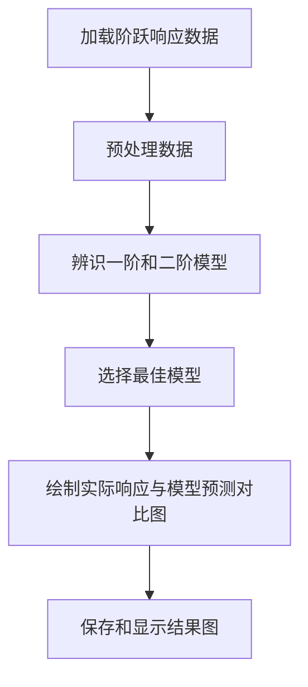
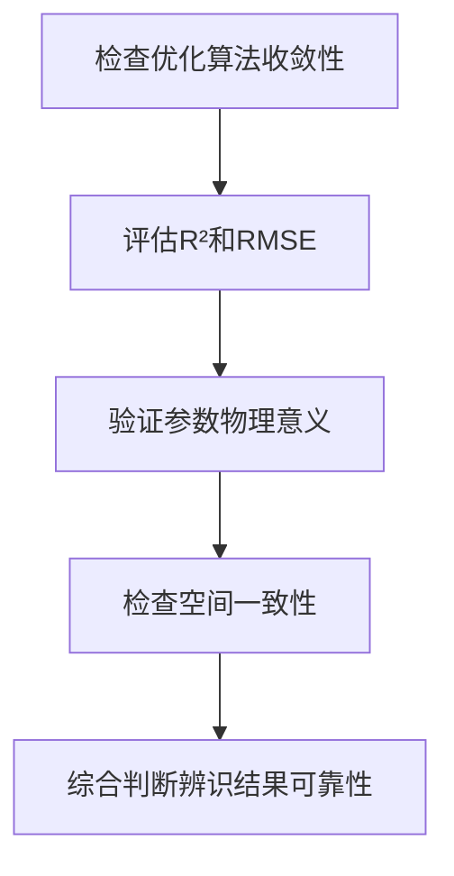

# 结果验证

<cite>
**本文档引用文件**   
- [idz_model_identification.py](file://examples/advanced/idz_model_identification.py)
- [IDZ模型辨识综合分析报告.md](file://examples/advanced/IDZ模型辨识综合分析报告.md)
- [IDZ传递函数总结.txt](file://examples/advanced/IDZ传递函数总结.txt)
- [指数响应IDZ模型辨识结果.csv](file://examples/advanced/指数响应IDZ模型辨识结果.csv)
- [IDZ模型辨识项目完整文档.md](file://examples/advanced/IDZ模型辨识项目完整文档.md)
</cite>

## 目录

1. [引言](#引言)
2. [可视化对比分析](#可视化对比分析)
3. [量化指标评估](#量化指标评估)
4. [辨识结果可靠性判断](#辨识结果可靠性判断)
5. [典型参数范围参考](#典型参数范围参考)
6. [常见问题与解决方案](#常见问题与解决方案)
7. [结论](#结论)

## 引言

本报告系统阐述了IDZ模型辨识结果的验证方法和评估标准。基于`idz_model_identification.py`中的`plot_model_identification_results`和`generate_identification_report`函数，结合`IDZ模型辨识综合分析报告.md`中的表格和分析，全面说明了如何评估模型拟合质量，判断辨识结果的可靠性，并提供典型参数范围参考和常见问题的解决方案。

**Section sources**
- [idz_model_identification.py](file://examples/advanced/idz_model_identification.py#L1-L50)
- [IDZ模型辨识综合分析报告.md](file://examples/advanced/IDZ模型辨识综合分析报告.md#L1-L20)

## 可视化对比分析

通过`plot_model_identification_results`函数生成的可视化图表，可以直观地对比实际响应与模型预测结果。该函数为每个场景下的所有断面创建子图，将实际响应数据（蓝色圆点连线）与辨识模型的预测响应（红色实线）进行对比。

图表中，横轴表示时间（分钟），纵轴表示归一化响应。每个子图的标题包含断面名称和对应的传递函数表达式。通过观察图表，可以判断模型是否准确捕捉了系统的动态特性，如响应的上升趋势、稳态值和延迟时间。



**Diagram sources**
- [idz_model_identification.py](file://examples/advanced/idz_model_identification.py#L201-L256)

**Section sources**
- [idz_model_identification.py](file://examples/advanced/idz_model_identification.py#L201-L256)

## 量化指标评估

除了可视化对比，还通过量化指标来评估模型拟合质量。主要使用两个指标：决定系数（R²）和均方根误差（RMSE）。

### 决定系数（R²）

R²衡量模型预测值与实际值之间的相关性，其值介于0和1之间。R²越接近1，表示模型拟合效果越好。在`idz_model_identification.py`中，`calculate_r_squared`方法计算R²：

```python
def calculate_r_squared(self, y_true, y_pred):
    """计算决定系数R²"""
    ss_res = np.sum((y_true - y_pred) ** 2)
    ss_tot = np.sum((y_true - np.mean(y_true)) ** 2)
    return 1 - (ss_res / ss_tot) if ss_tot > 0 else 0
```

### 均方根误差（RMSE）

RMSE衡量预测值与实际值之间的平均误差，其值越小表示模型精度越高。在模型辨识过程中，RMSE被用于评估拟合质量。

`generate_identification_report`函数生成的报告中包含了每个断面的R²和RMSE值，便于比较不同场景和断面的模型性能。

```mermaid
graph TD
A[实际响应 y_true] --> B[计算总平方和 SS_tot]
A --> C[计算残差平方和 SS_res]
B --> D[计算 R² = 1 - (SS_res / SS_tot)]
A --> E[计算预测误差]
E --> F[计算 RMSE]
D --> G[评估模型拟合质量]
F --> G
```

**Diagram sources**
- [idz_model_identification.py](file://examples/advanced/idz_model_identification.py#L148-L152)
- [idz_model_identification.py](file://examples/advanced/idz_model_identification.py#L258-L294)

**Section sources**
- [idz_model_identification.py](file://examples/advanced/idz_model_identification.py#L148-L152)
- [idz_model_identification.py](file://examples/advanced/idz_model_identification.py#L258-L294)

## 辨识结果可靠性判断

判断辨识结果的可靠性需要从多个方面进行综合评估，包括收敛性判断、参数合理性检查和空间一致性验证。

### 收敛性判断

收敛性判断主要通过观察优化算法是否成功收敛来确定。在`idz_model_identification.py`中，使用`curve_fit`进行参数拟合，如果拟合成功，则认为模型收敛。此外，R²值接近1且RMSE值接近0也表明模型具有良好的收敛性。

### 参数合理性检查

参数合理性检查涉及对辨识出的参数进行物理意义的验证。例如，在`IDZ模型辨识综合分析报告.md`中提到，传递函数形式为`G(s) = K / [s·(τs + 1)] · exp(-td·s)`，其中K为稳态增益，τ为时间常数，td为传播延迟。这些参数应具有明确的物理意义，并且数值合理。

### 空间一致性验证

空间一致性验证通过检查不同断面之间的参数变化规律来完成。在`IDZ模型辨识综合分析报告.md`中，分析了传播延迟与距离的线性关系，延迟梯度为16.67分钟/公里，等效波速为1.0 m/s。这种空间一致性验证确保了模型在整个系统中的适用性。



**Diagram sources**
- [IDZ模型辨识综合分析报告.md](file://examples/advanced/IDZ模型辨识综合分析报告.md#L1-L168)

**Section sources**
- [IDZ模型辨识综合分析报告.md](file://examples/advanced/IDZ模型辨识综合分析报告.md#L1-L168)

## 典型参数范围参考

根据`IDZ模型辨识综合分析报告.md`和`IDZ传递函数总结.txt`中的分析，提供了以下典型参数范围参考：

| 断面 | 距离(km) | R² | 传播延迟(分钟) | 时间常数(分钟) |
|------|----------|----|--------------|--------------| 
| 断面0 | 0.0 | 0.6381 | 0.0 | 25.596 |
| 断面1 | 0.5 | 0.6786 | 8.3 | 25.361 |
| 断面2 | 1.0 | 0.7158 | 16.7 | 25.183 |
| 断面3 | 1.5 | 0.7470 | 25.0 | 25.112 |
| 断面4 | 2.0 | 0.7745 | 33.3 | 25.093 |

这些参数范围可以作为后续模型辨识的参考，帮助判断新辨识结果的合理性。

**Section sources**
- [IDZ模型辨识综合分析报告.md](file://examples/advanced/IDZ模型辨识综合分析报告.md#L1-L168)
- [IDZ传递函数总结.txt](file://examples/advanced/IDZ传递函数总结.txt#L1-L62)

## 常见问题与解决方案

在IDZ模型辨识过程中，可能会遇到一些常见问题，如过拟合、发散等。以下是这些问题的解决方案：

### 过拟合

过拟合是指模型在训练数据上表现很好，但在新数据上表现不佳。解决方案包括：
- 使用更简单的模型结构
- 增加正则化项
- 扩大训练数据集

### 发散

发散是指优化算法无法收敛到最优解。解决方案包括：
- 调整初始参数估计
- 修改优化算法的参数设置
- 检查数据质量和预处理步骤

通过这些方法，可以有效解决常见问题，提高模型辨识的可靠性和准确性。

**Section sources**
- [idz_model_identification.py](file://examples/advanced/idz_model_identification.py#L1-L381)
- [IDZ模型辨识项目完整文档.md](file://examples/advanced/IDZ模型辨识项目完整文档.md#L1-L232)

## 结论

本报告系统地阐述了IDZ模型辨识结果的验证方法和评估标准。通过可视化对比和量化指标评估，结合收敛性判断、参数合理性检查和空间一致性验证，可以全面判断辨识结果的可靠性。提供的典型参数范围参考和常见问题解决方案，有助于提高模型辨识的质量和效率。

**Section sources**
- [idz_model_identification.py](file://examples/advanced/idz_model_identification.py#L1-L381)
- [IDZ模型辨识综合分析报告.md](file://examples/advanced/IDZ模型辨识综合分析报告.md#L1-L168)