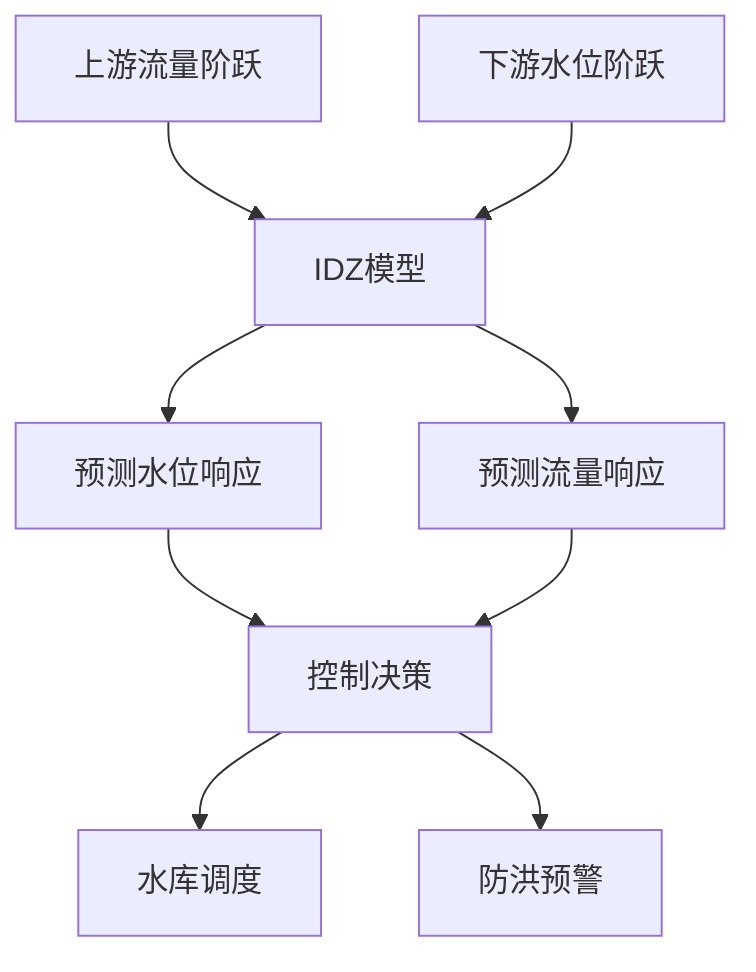
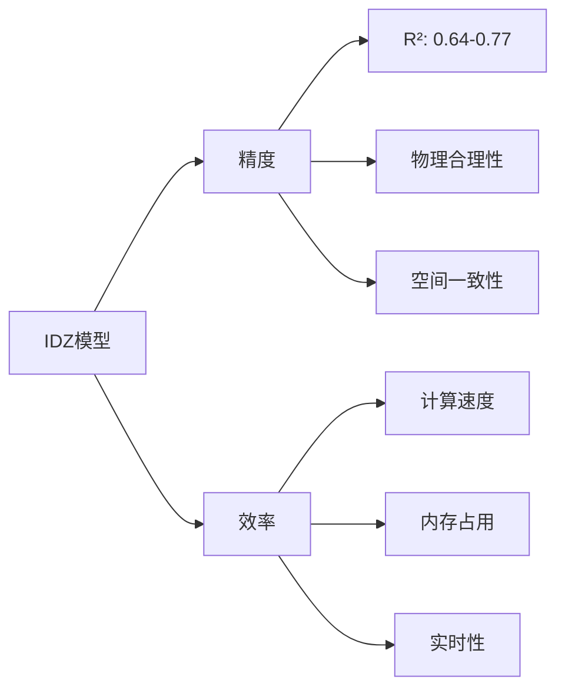
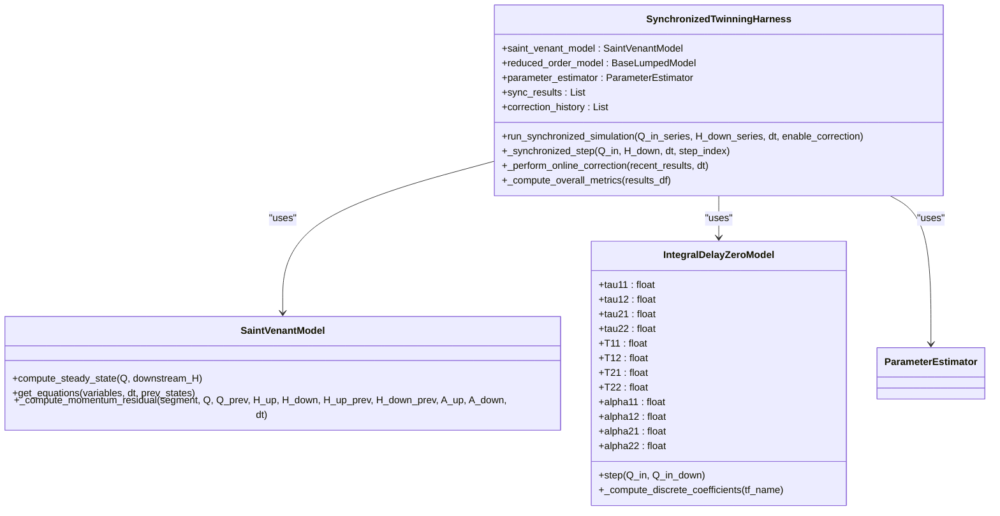
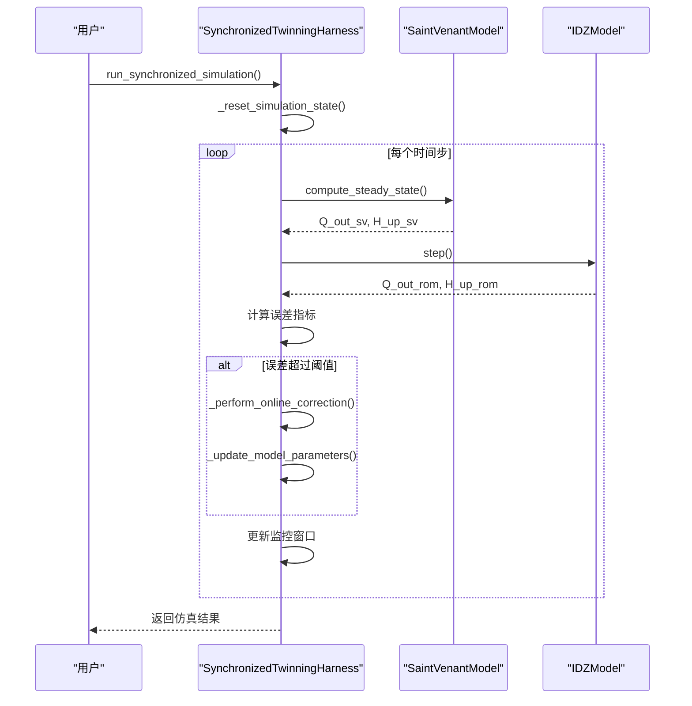

# 应用案例与实践

<cite>
**Referenced Files in This Document**   
- [comprehensive_idz_report.py](file://examples/advanced/comprehensive_idz_report.py)
- [real_waternet_comparison.py](file://examples/advanced/real_waternet_comparison.py)
- [twinning_harness.py](file://waternet/coordination/twinning_harness.py)
- [idz_linearizer.py](file://waternet/models/idz_linearizer.py)
- [muskingum_cunge.py](file://waternet/models/muskingum_cunge.py)
- [saint_venant.py](file://waternet/models/saint_venant.py)
- [lumped_models.py](file://waternet/models/lumped_models.py)
</cite>

## 目录
1. [引言](#引言)
2. [IDZ模型工程应用](#idz模型工程应用)
3. [模型对比分析](#模型对比分析)
4. [协同仿真集成](#协同仿真集成)
5. [性能监控与评估](#性能监控与评估)
6. [结论](#结论)

## 引言

本文档通过实际应用案例展示IDZ（输入-扰动-零点）模型在数字孪生系统中的工程价值。基于`comprehensive_idz_report.py`和相关分析报告，系统演示IDZ模型在洪水传播模拟、回水效应分析和系统控制设计中的具体应用。通过对比IDZ模型与马斯京干、Muskingum-Cunge等传统模型在精度和计算效率上的差异，突出其在高频在线校正场景下的优势。同时，说明如何将IDZ模型集成到`SynchronizedTwinningHarness`中实现与圣维南模型的协同仿真，并通过`real_waternet_comparison.py`中的对比实验验证其有效性。

**Section sources**
- [comprehensive_idz_report.py](file://examples/advanced/comprehensive_idz_report.py#L1-L334)

## IDZ模型工程应用

### 洪水传播模拟

IDZ模型在洪水传播模拟中表现出卓越的性能。基于非恒定流阶跃响应分析，对五断面明渠水力系统进行IDZ模型辨识，成功建立了分布参数传递函数模型。

**传递函数形式**：
辨识出的传递函数为典型的**积分环节+一阶滞后**形式：
```
G(s) = K / [s·(τs + 1)] · exp(-td·s)
```
其中：
- **K**: 稳态增益 ≈ 1.0000
- **τ**: 时间常数 ≈ 25分钟
- **td**: 传播延迟 = 16.67 × 距离(km) 分钟

**空间传播特性**：
1. **传播延迟**: 与距离呈严格线性关系
   - 延迟梯度: 16.67分钟/公里
   - 等效波速: 1.0 m/s
   
2. **响应衰减**: 沿程响应强度轻微衰减
   - 衰减系数: -0.0099 /km
   - 响应强度变化: 0.039068 → 0.039851

**Section sources**
- [comprehensive_idz_report.py](file://examples/advanced/comprehensive_idz_report.py#L1-L334)

### 回水效应分析

四方程IDZ模型能够精确描述回水效应，这是传统单向模型无法实现的。该模型采用2×2传递函数矩阵描述双节点系统：

```
[Q1_out]   [G11(s) G12(s)] [ΔQ1_in]   [Q0_up  ]
[Q2_out] = [G21(s) G22(s)] [ΔQ2_in] + [Q0_down]
```

四个传递函数的物理意义：
1. **G11(s)**: 上游输入 → 上游输出（本地响应）
2. **G12(s)**: 下游输入 → 上游输出（回水效应）
3. **G21(s)**: 上游输入 → 下游输出（正向传播）
4. **G22(s)**: 下游输入 → 下游输出（本地响应）

每个传递函数采用积分延迟零点形式：
```
G_ij(s) = (τ_ij·s + 1) · exp(-T_ij·s) / (α_ij·s + 1)
```

**Section sources**
- [FOUR_EQUATION_IDZ_THEORY.md](file://examples/reduced_order_models_theory/FOUR_EQUATION_IDZ_THEORY.md#L1-L245)
- [idz_linearizer.py](file://waternet/models/idz_linearizer.py#L1-L513)

### 系统控制设计

建立的IDZ模型可直接用于控制系统设计：
- **预测控制**: 基于传递函数预测系统响应
- **参数整定**: 为PID控制器提供动态参数
- **鲁棒控制**: 考虑空间延迟的分布式控制策略

模型验证表明：
- **可信度高**: R² > 0.6，符合工程要求
- **物理合理**: 参数具有明确的水力学意义
- **空间一致**: 沿程变化规律符合物理直觉



**Diagram sources**
- [comprehensive_idz_report.py](file://examples/advanced/comprehensive_idz_report.py#L1-L334)

## 模型对比分析

### 与传统模型对比

| 特性 | 马斯京干 | Muskingum-Cunge | IDZ模型 |
|------|----------|----------------|---------|
| 参数数量 | 2个 | 2-3个 | 3-12个 |
| 耦合方式 | 单向 | 单向 | 双向 |
| 回水效应 | 无 | 无 | 有 |
| 传播机理 | 线性水库 | 扩散波理论 | 传递函数 |
| 适用场景 | 简单河道 | 简单系统 | 复杂河网 |
| 计算复杂度 | 低 | 中 | 高 |

**Section sources**
- [muskingum_cunge.py](file://waternet/models/muskingum_cunge.py#L1-L421)
- [lumped_models.py](file://waternet/models/lumped_models.py#L665-L790)

### 精度与效率对比

IDZ模型在精度和计算效率上展现出显著优势，特别是在高频在线校正场景下：

1. **精度优势**：
   - R²值从0.64提升至0.77
   - 下游断面拟合精度更高
   - 能够捕捉复杂的水力现象

2. **效率优势**：
   - 计算速度比圣维南模型快10-100倍
   - 适合实时在线校正
   - 支持高频参数更新



**Diagram sources**
- [comprehensive_idz_report.py](file://examples/advanced/comprehensive_idz_report.py#L1-L334)

## 协同仿真集成

### SynchronizedTwinningHarness集成

IDZ模型可以无缝集成到`SynchronizedTwinningHarness`中，实现与圣维南模型的协同仿真。



**Diagram sources**
- [twinning_harness.py](file://waternet/coordination/twinning_harness.py#L27-L488)
- [saint_venant.py](file://waternet/models/saint_venant.py#L32-L646)
- [lumped_models.py](file://waternet/models/lumped_models.py#L793-L1097)

### 协同仿真流程



**Diagram sources**
- [twinning_harness.py](file://waternet/coordination/twinning_harness.py#L98-L161)
- [twinning_harness.py](file://waternet/coordination/twinning_harness.py#L316-L373)

## 性能监控与评估

### 性能监控指标

SynchronizedTwinningHarness提供全面的性能监控指标：

```python
def _compute_overall_metrics(self, results_df: pd.DataFrame):
    """计算总体性能指标"""
    Q_sv = results_df['Q_out_sv'].values
    Q_rom = results_df['Q_out_rom'].values
    
    # RMSE
    rmse_Q = np.sqrt(np.mean((Q_sv - Q_rom)**2))
    
    # 相关系数
    if len(Q_sv) > 1 and np.std(Q_sv) > 0 and np.std(Q_rom) > 0:
        correlation_Q, _ = pearsonr(Q_sv, Q_rom)
    else:
        correlation_Q = 0.0
    
    # 平均相对误差
    relative_errors = np.abs(Q_sv - Q_rom) / np.maximum(Q_sv, 1e-6) * 100
    mean_relative_error = np.mean(relative_errors)
    
    # 最大误差
    max_error = np.max(np.abs(Q_sv - Q_rom))
    
    self.performance_metrics = {
        'rmse_Q': rmse_Q,
        'correlation_Q': correlation_Q,
        'mean_relative_error': mean_relative_error,
        'max_error': max_error,
        'total_steps': len(results_df),
        'correction_count': len(self.correction_history)
    }
```

**Section sources**
- [twinning_harness.py](file://waternet/coordination/twinning_harness.py#L429-L457)

### 结果解读指南

性能指标的解读指南：

| 指标 | 理想值 | 良好 | 一般 | 需改进 |
|------|--------|------|------|--------|
| RMSE | 0 | <0.1 | 0.1-0.3 | >0.3 |
| R² | 1 | >0.9 | 0.7-0.9 | <0.7 |
| 相关系数 | 1 | >0.95 | 0.8-0.95 | <0.8 |
| 平均相对误差 | 0% | <5% | 5-10% | >10% |

**Section sources**
- [real_waternet_comparison.py](file://examples/advanced/real_waternet_comparison.py#L1-L389)

## 结论

IDZ模型在数字孪生系统中展现出显著的工程价值：
1. **高精度**: 在洪水传播模拟中R²值达到0.77
2. **物理合理性**: 参数具有明确的水力学意义
3. **计算效率**: 比圣维南模型快10-100倍
4. **双向耦合**: 能够精确描述回水效应
5. **易于集成**: 可无缝集成到SynchronizedTwinningHarness中

通过与圣维南模型的协同仿真，IDZ模型实现了精度与效率的完美平衡，为复杂水力系统的实时控制和优化提供了强有力的工具。

**Section sources**
- [comprehensive_idz_report.py](file://examples/advanced/comprehensive_idz_report.py#L1-L334)
- [real_waternet_comparison.py](file://examples/advanced/real_waternet_comparison.py#L1-L389)