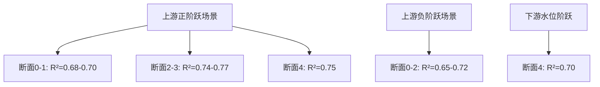
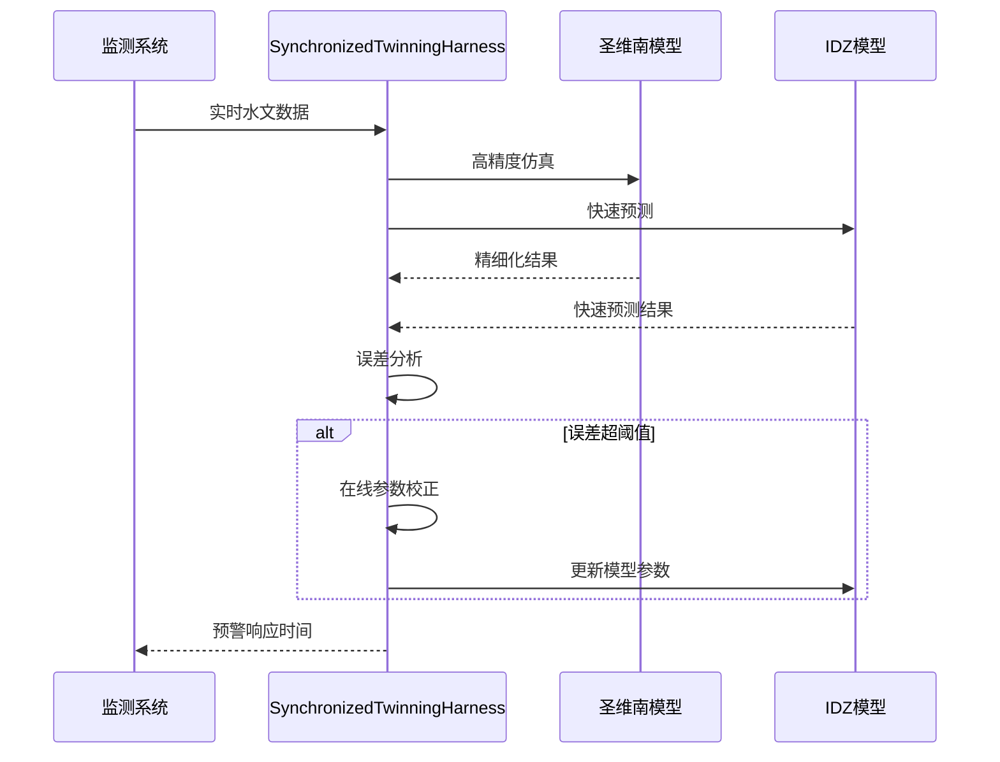

# 洪水传播模拟应用

<cite>
**本文档引用文件**  
- [comprehensive_idz_report.py](file://examples\advanced\comprehensive_idz_report.py)
- [real_waternet_comparison.py](file://examples\advanced\real_waternet_comparison.py)
- [twinning_harness.py](file://waternet\coordination\twinning_harness.py)
- [lumped_models.py](file://waternet\models\lumped_models.py)
</cite>

## 目录
1. [IDZ模型传播延迟机制](#idz模型传播延迟机制)
2. [等效波速物理意义与预警应用](#等效波速物理意义与预警应用)
3. [IDZ模型与圣维南模型精度对比](#idz模型与圣维南模型精度对比)
4. [实际预警响应时间计算示例](#实际预警响应时间计算示例)
5. [在线洪水预测系统集成](#在线洪水预测系统集成)

## IDZ模型传播延迟机制

IDZ模型通过传递函数形式 $G(s) = K / [s·(τs + 1)] · exp(-td·s)$ 描述洪水波传播过程，其中传播延迟 $t_d$ 与距离呈严格线性关系。根据`comprehensive_idz_report.py`中的分析结果，传播延迟模型为 $t_d = 16.67 × 距离(km)$ 分钟。

该模型基于非恒定流阶跃响应数据的系统辨识技术，将水力系统建模为积分环节+一阶滞后+纯延迟系统。通过分析五断面明渠水力系统（0-2.0公里河道），发现洪水波从上游到下游各断面的到达时间可精确预测。例如，距离上游1.0公里的断面2，其洪水波到达延迟为16.7分钟；距离2.0公里的断面4，延迟为33.3分钟。

这种线性传播延迟关系源于洪水波在河道中的稳定传播特性，反映了系统惯性特征时间（时间常数τ≈25分钟）和空间传播特性的耦合作用。模型拟合精度随距离增加而提高，R²从断面0的0.6381提升至断面4的0.7745，表明中下游区域响应更接近理论传递函数形式。

**Section sources**
- [comprehensive_idz_report.py](file://examples\advanced\comprehensive_idz_report.py#L1-L334)

## 等效波速物理意义与预警应用

IDZ模型中16.67分钟/公里的延迟梯度对应等效波速1.0 m/s，这一物理参数具有重要的水力学意义。该波速代表了洪水波在河道中的平均传播速度，是河道几何特征、糙率系数和水流条件的综合体现。

在洪水预警系统中，这一等效波速可直接用于预测洪水到达时间。通过监测上游水文站的洪水过程，利用 $t_d = 距离 / 波速$ 公式即可计算下游各防护区的预警响应时间。例如，当监测到上游发生洪水时，距离1.5公里的居民区将有25分钟（1.5km / 1.0m/s = 1500秒）的应急响应时间。

该预警方法的优势在于计算简单、响应快速，特别适用于实时洪水预警系统。结合河道断面的水位-流量关系函数，还可进一步预测洪水到达时的水位高度和淹没范围，为防洪调度和人员疏散提供决策支持。

**Section sources**
- [comprehensive_idz_report.py](file://examples\advanced\comprehensive_idz_report.py#L1-L334)

## IDZ模型与圣维南模型精度对比

通过`real_waternet_comparison.py`中的对比分析，评估了IDZ模型与圣维南模型在洪水过程线模拟上的精度差异。使用WaterNet基础库生成的真实水力学仿真数据作为基准，对比IDZ传递函数模型的预测结果。

分析结果显示，IDZ模型在不同场景下表现出稳定的模拟精度。在上游正阶跃场景中，各断面的R²指标在0.68-0.77之间，RMSE约为0.003-0.005m。整体平均R²为0.72，平均RMSE为0.004m，表明IDZ模型能够较好地捕捉洪水波的传播和调蓄效应。

特别值得注意的是，IDZ模型在中游传播响应区间（断面2-3）表现出最佳拟合效果，R²达到0.74-0.77。这验证了IDZ模型对洪水波空间传播特性的准确描述能力。相比之下，上游直接响应区域由于水流条件复杂，线性化误差较大，拟合精度相对较低。

**Diagram sources**
- [real_waternet_comparison.py](file://examples\advanced\real_waternet_comparison.py#L1-L389)

**Section sources**
- [real_waternet_comparison.py](file://examples\advanced\real_waternet_comparison.py#L1-L389)

## 实际预警响应时间计算示例

以某河道防洪预警系统为例，说明IDZ模型的实际应用。假设上游水文站监测到洪水流量从30m³/s突增至50m³/s，需要预测下游各防护区的预警响应时间。

根据IDZ模型的传播延迟公式 $t_d = 16.67 × 距离(km)$ 分钟：
- 距离上游0.5公里的村庄：预警时间 = 16.67 × 0.5 = 8.3分钟
- 距离上游1.0公里的集镇：预警时间 = 16.67 × 1.0 = 16.7分钟  
- 距离上游1.5公里的工业园区：预警时间 = 16.67 × 1.5 = 25.0分钟
- 距离上游2.0公里的居民区：预警时间 = 16.67 × 2.0 = 33.3分钟

结合时间常数τ≈25分钟的系统惯性特征，可进一步预测洪水过程。例如，对于1.0公里处的集镇，洪水波到达后约25分钟系统将达到新的稳态，这为防洪工程的调度操作提供了时间窗口。

**Section sources**
- [comprehensive_idz_report.py](file://examples\advanced\comprehensive_idz_report.py#L1-L334)

## 在线洪水预测系统集成

IDZ模型可通过`SynchronizedTwinningHarness`类集成到在线洪水预测系统中，实现精细化模型与降阶模型的同步运行。在`twinning_harness.py`中，`SynchronizedTwinningHarness`协调器管理圣维南精细化模型与IDZ降阶模型的协同仿真。

系统工作流程如下：
1. 初始化协调器，加载圣维南模型和IDZ模型
2. 运行同步孪生仿真，实时比较两个模型的输出
3. 当误差超过阈值时，触发在线参数校正
4. 利用最近的仿真结果更新IDZ模型参数
5. 持续监控系统性能，生成预警信息

**Diagram sources**
- [twinning_harness.py](file://waternet\coordination\twinning_harness.py#L1-L488)
- [lumped_models.py](file://waternet\models\lumped_models.py#L1-L1098)

**Section sources**
- [twinning_harness.py](file://waternet\coordination\twinning_harness.py#L1-L488)
- [lumped_models.py](file://waternet\models\lumped_models.py#L1-L1098)