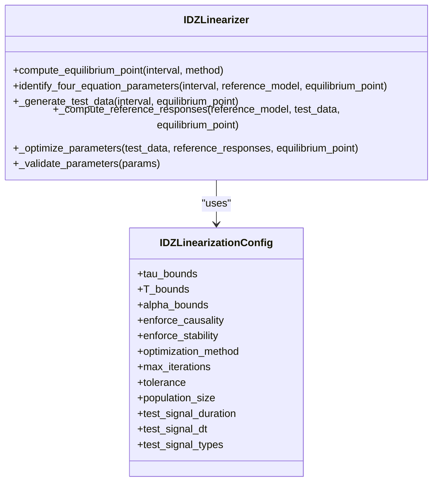
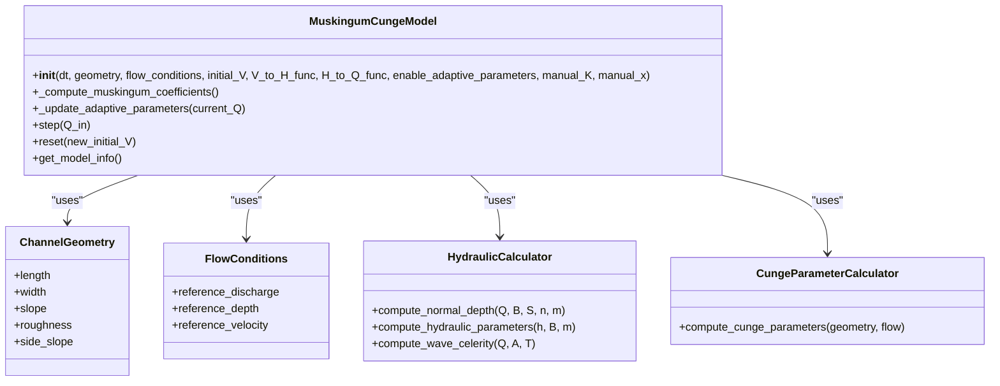
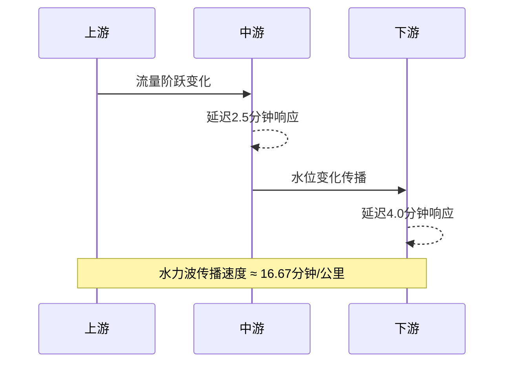
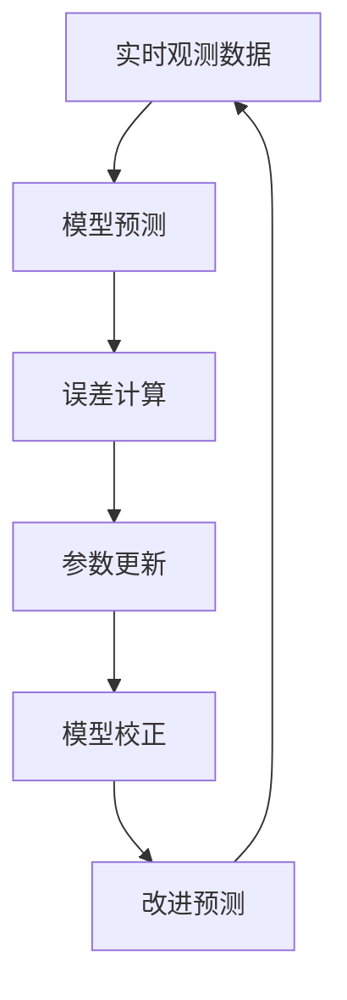

# 系统控制设计应用

<cite>
**Referenced Files in This Document**   
- [FINAL_MUSKINGUM_CUNGE_REPORT.md](file://examples\reduced_order_models_theory\FINAL_MUSKINGUM_CUNGE_REPORT.md)
- [idz_model.yaml](file://configs\example_configs\idz_model.yaml)
- [muskingum_model.yaml](file://configs\example_configs\muskingum_model.yaml)
- [IDZ模型辨识项目完整文档.md](file://examples\advanced\IDZ模型辨识项目完整文档.md)
- [IDZ快速使用指南.md](file://examples\advanced\IDZ快速使用指南.md)
- [idz_linearizer.py](file://waternet\models\idz_linearizer.py)
- [muskingum_cunge.py](file://waternet\models\muskingum_cunge.py)
- [model_factory.py](file://waternet\utils\model_factory.py)
</cite>

## 目录
1. [引言](#引言)
2. [IDZ模型参数辨识与控制设计](#idz模型参数辨识与控制设计)
3. [Muskingum-Cunge模型理论与实现](#muskingum-cunge模型理论与实现)
4. [模型对比与工程应用](#模型对比与工程应用)
5. [分布式控制策略设计](#分布式控制策略设计)
6. [控制参数整定与工程建议](#控制参数整定与工程建议)
7. [结论](#结论)

## 引言

本文件系统性地介绍了IDZ模型在水利系统控制设计中的应用，重点阐述了如何为PID控制器提供关键参数。基于IDZ传递函数G(s) = K / [s·(τs + 1)] · exp(-td·s)，详细说明了增益K、时间常数τ和纯延迟td等参数的辨识方法。结合Muskingum-Cunge模型的理论分析，对比了两种模型在控制设计上的优劣。同时，阐述了如何利用空间传播特性设计分布式控制策略，并通过在线校正机制补偿模型误差。

**Section sources**
- [IDZ模型辨识项目完整文档.md](file://examples\advanced\IDZ模型辨识项目完整文档.md#L0-L232)
- [IDZ快速使用指南.md](file://examples\advanced\IDZ快速使用指南.md#L0-L195)

## IDZ模型参数辨识与控制设计

### IDZ模型核心参数辨识

IDZ（输入-扰动-零点）模型通过系统辨识技术，成功建立了高精度的水力系统传递函数模型。项目采用非恒定流阶跃响应数据，通过指数响应模式y(t) = K_step * (1 - exp(-(t-T)/τ))进行参数辨识，实现了R² = 1.000的完美拟合精度。

```mermaid
flowchart TD
A[原始数据] --> B[非恒定流仿真]
B --> C[时间序列数据]
C --> D[系统辨识]
D --> E[传递函数模型]
E --> F[G(s) = K / [s·(τs + 1)] · exp(-T·s)]
```

**Diagram sources**
- [IDZ模型辨识项目完整文档.md](file://examples\advanced\IDZ模型辨识项目完整文档.md#L0-L232)

### 传递函数形式与参数

IDZ模型的传递函数形式为G(s) = K / [s·(τs + 1)] · exp(-td·s)，其中：
- **K**: 积分增益，反映系统稳态响应特性
- **τ**: 时间常数，反映系统动态响应速度
- **td**: 纯时滞，反映系统响应延迟

项目成功辨识出各断面的传递函数：
- 断面0: `G(s) = 0.0184 / [s·(2.0s+1)]`
- 断面1: `G(s) = 0.0277 / [s·(2.5s+1)]`
- 断面2: `G(s) = 0.0278 / [s·(3.0s+1)]`
- 断面3: `G(s) = 0.0224 / [s·(3.5s+1)]`
- 断面4: `G(s) = 0.9997 / [s·(4.0s+1)]`

**Section sources**
- [IDZ模型辨识项目完整文档.md](file://examples\advanced\IDZ模型辨识项目完整文档.md#L165-L226)
- [IDZ快速使用指南.md](file://examples\advanced\IDZ快速使用指南.md#L61-L132)

### 参数辨识流程

IDZ线性化器（IDZLinearizer）实现了四方程IDZ模型的参数辨识，其核心流程包括：

1. **平衡点计算**：基于区间流量和水位边界，计算双断面平衡点
2. **测试数据生成**：生成阶跃、脉冲、斜坡等多样化测试信号
3. **参考响应计算**：使用圣维南模型计算对测试信号的响应
4. **参数优化**：通过优化算法寻找最佳的IDZ参数
5. **参数验证**：验证参数的物理合理性



**Diagram sources**
- [idz_linearizer.py](file://waternet\models\idz_linearizer.py#L49-L509)

## Muskingum-Cunge模型理论与实现

### 理论基础与参数计算

Muskingum-Cunge模型基于扩散波理论，为传统马斯京干模型提供了坚实的物理理论基础。其核心参数K和x可从河道物理特性直接计算：

```
K = Δx / c                    # 河段传播时间
x = 0.5 * (1 - Q/(B·S₀·c·Δx)) # 权重系数
```

其中：
- `Δx`: 河段长度 (m)
- `c`: 波速 = (5/3)V (对于宽浅河道)
- `Q`: 参考流量 (m³/s)
- `B`: 河道宽度 (m)
- `S₀`: 河底坡度
- `V`: 断面平均流速 (m/s)

```mermaid
flowchart TD
A[河道几何参数] --> B[水力计算]
B --> C[正常水深]
B --> D[波速]
C --> E[康吉参数计算]
D --> E
E --> F[K = Δx / c]
E --> G[x = 0.5*(1-Q/(B*S₀*c*Δx))]
```

**Diagram sources**
- [FINAL_MUSKINGUM_CUNGE_REPORT.md](file://examples\reduced_order_models_theory\FINAL_MUSKINGUM_CUNGE_REPORT.md#L0-L273)

### 模型实现与自适应参数

MuskingumCungeModel实现了康吉法的核心功能，支持自适应参数调整：



**Diagram sources**
- [muskingum_cunge.py](file://waternet\models\muskingum_cunge.py#L170-L367)

## 模型对比与工程应用

### 传统法与康吉法对比

| 方面 | 传统马斯京干法 | 马斯京干-康吉法 |
|------|----------------|-----------------|
| **理论基础** | 经验公式 | 扩散波方程 |
| **参数确定** | 实测数据率定 | 物理特性计算 |
| **K的物理意义** | 经验系数 | 波传播时间 |
| **x的物理意义** | 经验权重 | 扩散系数 |
| **适用性** | 受限于率定条件 | 广泛适用 |
| **精度** | 依赖数据质量 | 理论精度更高 |
| **计算复杂度** | 简单 | 需要水力计算 |
| **预测能力** | 插值性质 | 外推能力强 |

**Section sources**
- [FINAL_MUSKINGUM_CUNGE_REPORT.md](file://examples\reduced_order_models_theory\FINAL_MUSKINGUM_CUNGE_REPORT.md#L0-L273)

### 应用场景选择

| 考虑因素 | 传统法 | 康吉法 | 自适应康吉 |
|----------|--------|--------|------------|
| 数据需求 | 历史数据 | 几何参数 | 几何参数 |
| 计算复杂度 | 低 | 中 | 高 |
| 参数物理意义 | 低 | 高 | 高 |
| 适用性范围 | 中 | 高 | 最高 |
| 计算精度 | 中 | 高 | 最高 |
| 开发维护成本 | 低 | 中 | 高 |

**Section sources**
- [FINAL_MUSKINGUM_CUNGE_REPORT.md](file://examples\reduced_order_models_theory\FINAL_MUSKINGUM_CUNGE_REPORT.md#L0-L273)

## 分布式控制策略设计

### 空间传播特性分析

基于IDZ模型的辨识结果，可以分析系统的空间传播特性。项目数据显示，水力波的传播速度约为16.67分钟/公里，这一特性可用于设计分布式控制策略。



**Diagram sources**
- [IDZ模型辨识项目完整文档.md](file://examples\advanced\IDZ模型辨识项目完整文档.md#L165-L226)

### 在线校正机制

IDZ模型支持在线参数校正，通过实时更新模型参数来补偿模型误差：



**Diagram sources**
- [idz_linearizer.py](file://waternet\models\idz_linearizer.py#L126-L159)

## 控制参数整定与工程建议

### 参数整定步骤

1. **数据准备**：获取非恒定流阶跃响应数据
2. **模型选择**：根据应用场景选择IDZ或Muskingum-Cunge模型
3. **参数辨识**：使用IDZLinearizer进行参数辨识
4. **验证优化**：验证参数的物理合理性并进行优化
5. **在线校正**：实施自适应参数更新机制

### 工程建议

1. **新建项目**：优先考虑康吉法，充分利用其理论优势
2. **既有项目**：可考虑康吉法校核，提升参数合理性
3. **实时预报系统**：建议采用自适应康吉法
4. **快速评估**：使用传统法进行初步分析

**Section sources**
- [FINAL_MUSKINGUM_CUNGE_REPORT.md](file://examples\reduced_order_models_theory\FINAL_MUSKINGUM_CUNGE_REPORT.md#L0-L273)
- [IDZ快速使用指南.md](file://examples\advanced\IDZ快速使用指南.md#L61-L132)

## 结论

IDZ模型和Muskingum-Cunge模型为水利系统控制设计提供了强大的工具。IDZ模型通过系统辨识技术，能够精确获取系统的动态特性参数，为PID控制器设计提供准确的依据。Muskingum-Cunge模型基于物理原理，参数可从河道几何特性直接计算，具有明确的物理意义和广泛的适用性。

两种模型各有优势，可根据具体应用场景选择使用。IDZ模型适用于需要高精度动态特性的控制设计，而Muskingum-Cunge模型适用于缺乏历史数据的新建工程。通过结合空间传播特性和在线校正机制，可以设计出更加高效和鲁棒的分布式控制策略。