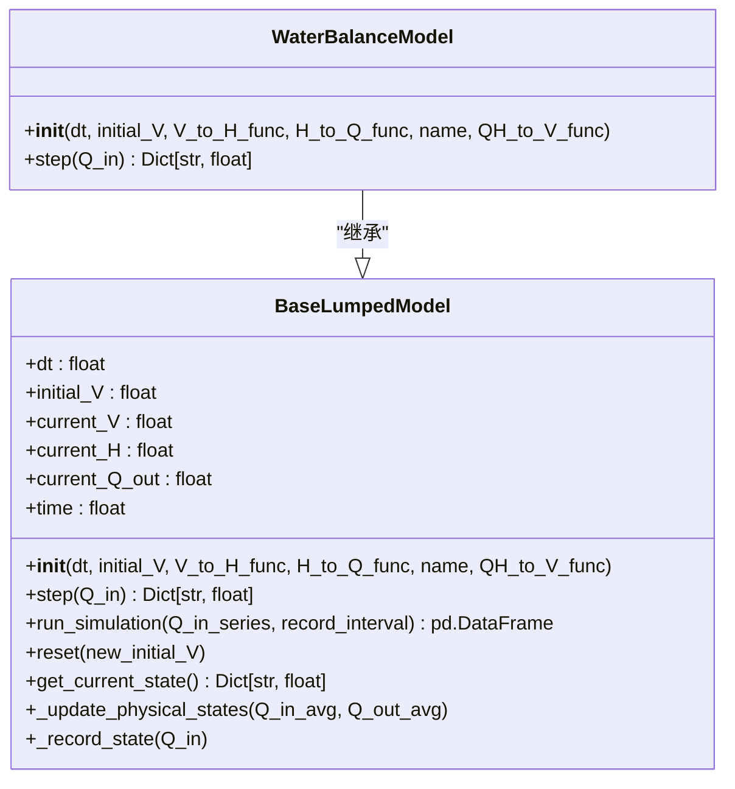

# 水量平衡模型

<cite>
**Referenced Files in This Document**  
- [lumped_models.py](file://waternet/models/lumped_models.py)
- [model_configs.yaml](file://examples/reduced_order_models_theory/model_configs.yaml)
</cite>

## 目录
1. [引言](#引言)
2. [核心实现原理](#核心实现原理)
3. [继承结构与基类特性](#继承结构与基类特性)
4. [配置参数详解](#配置参数详解)
5. [使用方法与代码示例](#使用方法与代码示例)
6. [典型应用场景](#典型应用场景)

## 引言

水量平衡模型（WaterBalanceModel）是WaterNet框架中最简化的降阶水文模型，专为快速估算和基准对比设计。该模型基于“入流等于出流”的基本假设，忽略滞后效应和调蓄作用，能够即时响应入流变化，适用于教学演示、性能基准测试及初步估算场景。

**Section sources**  
- [lumped_models.py](file://waternet/models/lumped_models.py#L518-L579)

## 核心实现原理

水量平衡模型的核心逻辑体现在其`step()`方法中，遵循最简化的水量守恒原则。模型假设在任意时间步长内，系统出流量（Q_out）严格等于入流量（Q_in），即：

```
Q_out = Q_in
```

这一假设意味着模型不考虑任何调蓄、延迟或能量损失，出流对入流的变化做出瞬时响应。尽管物理上过于简化，但其计算效率极高，且能为更复杂的模型提供一个理想的无损传输基准。

```mermaid
flowchart TD
Start([开始 step()]) --> CalcQout["Q_out = Q_in"]
CalcQout --> UpdateStates["调用 _update_physical_states()"]
UpdateStates --> UpdateQout["更新 current_Q_out"]
UpdateQout --> Record["调用 _record_state()"]
Record --> Return["返回结果字典"]
Return --> End([结束])
```

**Diagram sources**  
- [lumped_models.py](file://waternet/models/lumped_models.py#L550-L579)

**Section sources**  
- [lumped_models.py](file://waternet/models/lumped_models.py#L550-L579)

## 继承结构与基类特性

水量平衡模型通过继承`BaseLumpedModel`抽象基类构建，充分利用了基类提供的通用功能，确保了与框架内其他降阶模型（如马斯京干模型、蓄量演算模型）的接口一致性。

### 继承关系


**Diagram sources**  
- [lumped_models.py](file://waternet/models/lumped_models.py#L30-L515)
- [lumped_models.py](file://waternet/models/lumped_models.py#L518-L579)

### 关键基类方法调用

在`WaterBalanceModel`的`step()`方法中，关键调用了两个由`BaseLumpedModel`提供的核心方法：

1.  **`_update_physical_states(Q_in, Q_out)`**：此方法负责根据连续性方程 `dV/dt = Q_in - Q_out` 更新模型的内部状态（蓄水量V和水位H）。由于水量平衡模型中 `Q_in = Q_out`，因此理论上蓄水量 `V` 应保持不变。该方法还集成了数值保护机制，确保状态变量在物理合理范围内。
2.  **`_record_state(Q_in)`**：此方法将当前时间步的仿真结果（包括时间、入流、出流、水位、蓄水量等）追加到历史记录中，便于后续分析和可视化。

**Section sources**  
- [lumped_models.py](file://waternet/models/lumped_models.py#L236-L279)
- [lumped_models.py](file://waternet/models/lumped_models.py#L281-L298)

## 配置参数详解

`WaterBalanceModel`的构造函数接受多个关键参数，这些参数定义了模型的物理行为和初始条件。

| 参数名 | 类型 | 默认值 | 物理意义 |
| :--- | :--- | :--- | :--- |
| `dt` | float | 无 | **时间步长**，单位为秒。定义了仿真推进的最小时间单位，直接影响计算精度和效率。 |
| `initial_V` | float | 无 | **初始蓄水量**，单位为立方米（m³）。模型在仿真开始时的初始水量，必须为非负值。 |
| `V_to_H_func` | Callable[[float], float] | 无 | **蓄量-水位关系函数**。一个可调用对象（如函数或lambda表达式），输入蓄水量V，输出对应的水位H。例如，`lambda V: 100.0 + 1e-4 * V` 表示线性关系。 |
| `H_to_Q_func` | Callable[[float], float] | 无 | **水位-出流关系函数**。一个可调用对象，输入水位H，输出对应的出流量Q。例如，`lambda H: 25.0 * (H - 100.0)**1.5 if H > 100.0 else 0.0` 表示堰流公式。 |
| `name` | str | "WaterBalance" | **模型名称**。用于标识和调试的字符串。 |
| `QH_to_V_func` | Optional[Callable[[float, float], float]] | None | **Q-H耦合蓄量函数**。一个可选的可调用对象，输入流量Q和水位H，输出更精确的蓄水量V。如果提供，将优先使用此函数，否则使用传统的V-H关系。 |

**Section sources**  
- [lumped_models.py](file://waternet/models/lumped_models.py#L532-L548)

## 使用方法与代码示例

以下是一个实例化和运行水量平衡模型的代码示例。该示例使用了`model_configs.yaml`中定义的物理关系参数。

```python
import numpy as np
from waternet.models.lumped_models import WaterBalanceModel

# 从配置文件加载或直接定义物理关系函数
def V_to_H(V):
    """蓄量-水位关系: H = base_level + storage_coefficient * V"""
    base_level = 100.0
    storage_coefficient = 1.0e-4
    return base_level + storage_coefficient * V

def H_to_Q(H):
    """水位-出流关系: Q = coefficient * (H - threshold)^exponent"""
    threshold = 100.0
    flow_coefficient = 25.0
    exponent = 1.5
    return flow_coefficient * (H - threshold)**exponent if H > threshold else 0.0

# 实例化水量平衡模型
model = WaterBalanceModel(
    dt=60.0,              # 时间步长60秒
    initial_V=15000.0,    # 初始蓄水量15000 m³
    V_to_H_func=V_to_H,   # 蓄量-水位函数
    H_to_Q_func=H_to_Q,   # 水位-出流函数
    name="SimpleBalance"  # 模型名称
)

# 定义一个简单的阶跃入流序列
Q_in_series = np.concatenate([
    np.full(10, 10.0),  # 前10个时间步，入流10 m³/s
    np.full(20, 20.0)   # 后20个时间步，入流20 m³/s
])

# 运行仿真
results_df = model.run_simulation(Q_in_series)

# 输出结果
print(results_df.head())
```

**Section sources**  
- [lumped_models.py](file://waternet/models/lumped_models.py#L518-L579)
- [model_configs.yaml](file://examples/reduced_order_models_theory/model_configs.yaml#L0-L39)

## 典型应用场景

水量平衡模型因其极简的特性和零参数需求，在以下场景中具有重要价值：

1.  **性能基准测试**：作为“理想无损通道”的基准，用于评估更复杂模型（如马斯京干模型、IDZ模型）的性能。通过比较复杂模型与水量平衡模型的输出差异，可以量化模型的滞后、调蓄等效应。
2.  **教学与演示**：作为水文模型入门的绝佳示例，清晰地展示了降阶模型的基本框架（继承、`step()`方法、状态管理），同时突显了不同模型假设对结果的影响。
3.  **快速估算**：在对精度要求不高但需要快速获得结果的场景下，可用于估算系统在无调蓄情况下的理论响应。
4.  **系统集成测试**：在开发新功能或集成新模块时，可以使用水量平衡模型作为“占位符”模型，快速验证整个仿真流程的正确性，而无需处理复杂模型的参数标定问题。

**Section sources**  
- [lumped_models.py](file://waternet/models/lumped_models.py#L520-L526)