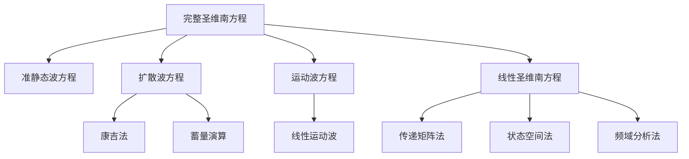
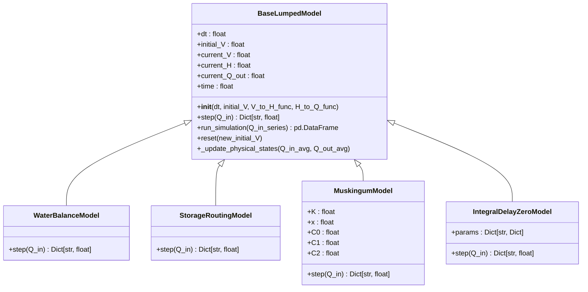
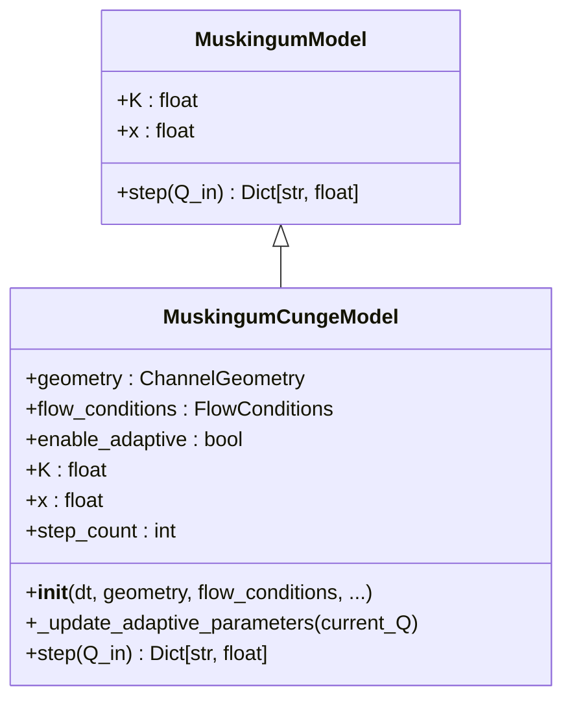

# 降阶模型

<cite>
**本文档引用文件**  
- [lumped_models.py](file://waternet/models/lumped_models.py)
- [muskingum_cunge.py](file://waternet/models/muskingum_cunge.py)
- [COMPREHENSIVE_REDUCED_ORDER_MODELS_THEORY.md](file://examples/reduced_order_models_theory/COMPREHENSIVE_REDUCED_ORDER_MODELS_THEORY.md)
- [FOUR_EQUATION_IDZ_THEORY.md](file://examples/reduced_order_models_theory/FOUR_EQUATION_IDZ_THEORY.md)
- [FINAL_MUSKINGUM_CUNGE_REPORT.md](file://examples/reduced_order_models_theory/FINAL_MUSKINGUM_CUNGE_REPORT.md)
- [idz_model.yaml](file://configs/example_configs/idz_model.yaml)
- [muskingum_model.yaml](file://configs/example_configs/muskingum_model.yaml)
</cite>

## 目录
1. [引言](#引言)
2. [降阶模型理论体系](#降阶模型理论体系)
3. [核心降阶模型详解](#核心降阶模型详解)
4. [基类与实现关系](#基类与实现关系)
5. [马斯京干-康吉模型扩展](#马斯京干-康吉模型扩展)
6. [配置参数与应用场景](#配置参数与应用场景)
7. [结论](#结论)

## 引言
WaterNet框架提供了一套完整的降阶水文模型，旨在以较低的计算成本实现对河道水力系统的有效模拟。这些模型在保持足够精度的同时，显著提升了计算效率，适用于实时预报、参数优化和大规模系统分析。本文档全面介绍WaterNet支持的四类核心降阶模型：马斯京干模型、蓄量演算模型、IDZ模型和水量平衡模型，阐述其数学原理、适用条件及计算优势，并深入解析其软件实现机制。

## 降阶模型理论体系
降阶模型是完整圣维南方程在不同物理假设下的近似形式，构成了一个从简单到复杂的理论谱系。



**图源**  
- [COMPREHENSIVE_REDUCED_ORDER_MODELS_THEORY.md](file://examples/reduced_order_models_theory/COMPREHENSIVE_REDUCED_ORDER_MODELS_THEORY.md)

降阶模型的复杂度遵循以下谱系：
```text
水量平衡 < 马斯京干 < 蓄量演算 < IDZ < 圣维南
```
其中，水量平衡模型最简单，计算复杂度为O(1)；而IDZ模型通过传递函数矩阵实现了对复杂河网的高精度描述，计算复杂度更高但物理机理更明确。

## 核心降阶模型详解

### 水量平衡模型
水量平衡模型是最简单的降阶模型，其核心假设为入流等于出流（Q_out = Q_in），无任何滞后或调蓄效应。该模型不涉及状态变量更新，计算速度极快，适用于快速估算或作为基准模型进行对比分析。

### 蓄量演算模型
蓄量演算模型基于蓄量连续性方程（dV/dt = Q_in - Q_out）和物理关系曲线（V-H和H-Q关系）。该模型物理意义明确，适用于具有明显蓄水特性的渠段或水库。其计算过程通过迭代求解，确保了在非线性关系下的数值稳定性。

### 马斯京干模型
马斯京干模型是经典的河道洪水演进模型，采用线性水库理论，其核心公式为：
Q_out = C0·Q_in + C1·Q_in_prev + C2·Q_out_prev
其中，C0、C1、C2为由滞时常数K和权重系数x计算得出的系数。该模型适用于天然河道和明渠的洪水传播计算，参数K和x通常需通过历史数据率定。

### IDZ模型
IDZ（积分延迟零点）模型是一种基于控制理论的先进降阶模型。传统IDZ模型使用单一传递函数，而WaterNet实现了**四方程IDZ模型**，采用2×2传递函数矩阵描述双节点系统的双向耦合关系：
```
[Q1_out]   [G11(s) G12(s)] [ΔQ1_in]   [Q0_up  ]
[Q2_out] = [G21(s) G22(s)] [ΔQ2_in] + [Q0_down]
```
其中，G12(s)和G21(s)分别显式地描述了回水效应和正向传播，突破了传统单向模型的局限，特别适用于复杂河网系统。

**图源**  
- [FOUR_EQUATION_IDZ_THEORY.md](file://examples/reduced_order_models_theory/FOUR_EQUATION_IDZ_THEORY.md)

## 基类与实现关系
所有降阶模型均继承自`BaseLumpedModel`基类，形成了清晰的面向对象架构。



**图源**  
- [lumped_models.py](file://waternet/models/lumped_models.py)

`BaseLumpedModel`定义了统一的接口和通用功能：
- **统一接口**：所有模型通过`step()`方法执行单步仿真，通过`run_simulation()`运行完整序列。
- **状态管理**：自动管理蓄水量(V)、水位(H)、出流量(Q_out)和时间(time)等状态变量。
- **物理关系**：支持V-H和H-Q关系函数，并创新性地支持Q-H耦合的蓄量函数`QH_to_V_func`，提升了物理真实性。
- **数值保护**：内置数值容差、边界检查和异常处理机制，确保仿真稳定性。
- **结果记录**：自动记录历史状态，便于后续分析。

各具体模型通过重写`step()`方法来实现各自的算法逻辑，同时复用基类的状态更新和记录功能，实现了代码的高内聚与低耦合。

## 马斯京干-康吉模型扩展
`MuskingumCungeModel`是`MuskingumModel`的扩展，它基于扩散波理论，为传统马斯京干模型提供了坚实的物理基础。



**图源**  
- [muskingum_cunge.py](file://waternet/models/muskingum_cunge.py)
- [lumped_models.py](file://waternet/models/lumped_models.py)

其核心扩展特性包括：

### 1. 物理参数自动计算
康吉法摒弃了经验参数率定，通过河道几何和水流条件自动计算K和x：
- **K = Δx / c**：波传播时间，其中c为波速。
- **x = 0.5 * (1 - Q/(B·S₀·c·Δx))**：扩散系数。
参数计算由`CungeParameterCalculator.compute_cunge_parameters()`完成，确保了参数的物理可解释性。

### 2. 自适应参数调整
模型支持`enable_adaptive_parameters`模式，可根据当前流量动态调整K和x参数。通过`_update_adaptive_parameters()`方法，参考流量随仿真过程更新，使模型能更好地适应流量变化，显著提升了在非稳态条件下的预测精度。

### 3. 兼容性与便捷性
模型设计具有良好的兼容性：
- **向后兼容**：可通过`manual_K`和`manual_x`参数手动指定，完全兼容传统马斯京干模型。
- **简化API**：提供了`create_cunge_model_from_geometry()`等便捷函数，极大降低了使用门槛。

## 配置参数与应用场景

### 配置参数说明
模型的配置通过YAML文件进行，主要分为三部分：

**1. 模型参数 (parameters)**
- **通用参数**：`dt`（时间步长）、`initial_V`（初始蓄水量）。
- **模型特定参数**：如马斯京干模型的`K`和`x`，IDZ模型的`tau`、`T_delay`和`alpha`。

**2. 物理关系 (physical_relations)**
- **V_to_H**：定义蓄量-水位关系，支持线性、多项式等类型。
- **H_to_Q**：定义水位-出流关系，支持堰流、闸孔出流等类型。

**3. 求解器配置 (solver_config)**
- 控制求解过程，如`enable_parameter_adaptation`（启用参数自适应）。

示例配置：
```yaml
# muskingum_model.yaml
model_type: muskingum
parameters:
  K: 3600.0
  x: 0.2
  dt: 60.0
  initial_V: 12000.0
```

```yaml
# idz_model.yaml
model_type: idz
parameters:
  tau: 1800.0
  T_delay: 600.0
  alpha: 3600.0
  dt: 60.0
  initial_V: 15000.0
```

### 典型应用场景
| 模型 | 适用场景 | 优势 |
| :--- | :--- | :--- |
| **水量平衡模型** | 快速工程估算、基准对比 | 计算极快，无需参数 |
| **马斯京干模型** | 有历史数据的河道预报 | 经验成熟，计算高效 |
| **马斯京干-康吉模型** | 无历史数据的新建工程、实时预报 | 物理基础坚实，外推能力强 |
| **蓄量演算模型** | 水库调洪演算 | 物理意义清晰，适用于非线性系统 |
| **IDZ模型** | 复杂河网系统、精细控制分析 | 支持双向耦合，精度最高 |

## 结论
WaterNet框架通过`BaseLumpedModel`基类构建了一个统一、可扩展的降阶模型体系。马斯京干-康吉模型的引入，标志着降阶模型从经验方法向物理方法的重要进步，其参数的物理可解释性和自适应能力显著提升了模型的科学性和实用性。四方程IDZ模型则代表了在复杂系统建模领域的最新成就，为河网系统的精细化模拟提供了强大工具。结合清晰的配置体系和丰富的应用场景，这套降阶模型为水文水资源领域的研究与应用提供了高效、可靠的解决方案。