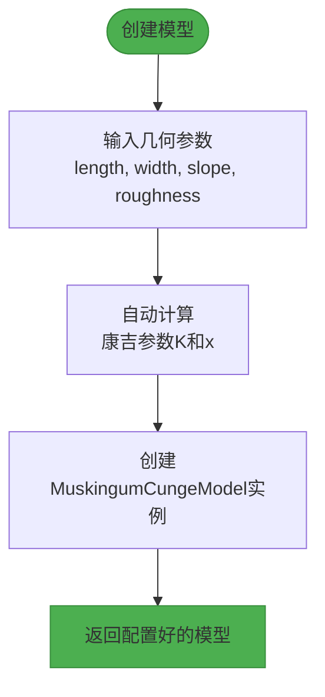
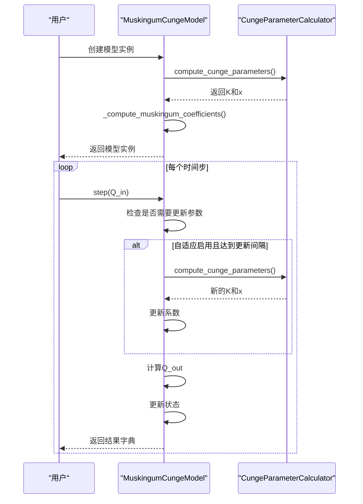
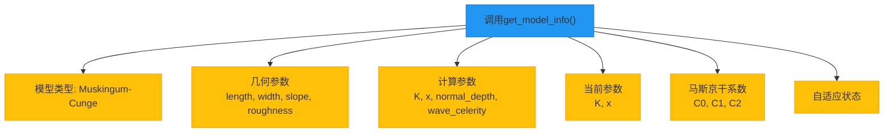

# API使用模式

<cite>
**本文档引用的文件**  
- [muskingum_cunge.py](file://waternet/models/muskingum_cunge.py)
- [muskingum_cunge_demo.py](file://examples/reduced_order_models_theory/muskingum_cunge_demo.py)
- [model_factory.py](file://waternet/utils/model_factory.py)
- [muskingum_model.yaml](file://configs/example_configs/muskingum_model.yaml)
</cite>

## 目录
1. [马斯京干-康吉模型构造函数详解](#马斯京干-康吉模型构造函数详解)
2. [便捷创建函数使用指南](#便捷创建函数使用指南)
3. [模型工作流演示](#模型工作流演示)
4. [参数配置模式对比](#参数配置模式对比)
5. [模型信息查询](#模型信息查询)

## 马斯京干-康吉模型构造函数详解

`MuskingumCungeModel` 构造函数提供了全面的参数配置选项，支持从物理特性自动计算参数或手动指定参数两种模式。

**Section sources**
- [muskingum_cunge.py](file://waternet/models/muskingum_cunge.py#L183-L246)

### 物理参数配置

物理参数是模型的核心输入，决定了康吉参数的计算基础：

- **dt**: 时间步长（秒），建议设置为60-300秒，需与模拟精度要求匹配
- **geometry**: `ChannelGeometry` 对象，包含河段长度、宽度、坡度和曼宁粗糙系数等几何参数
- **flow_conditions**: `FlowConditions` 对象，主要包含参考流量参数，用于计算正常水深和波速

这些参数共同构成了康吉法的物理基础，模型会基于这些参数自动计算出具有水力学理论意义的K和x值。

### 状态参数配置

状态参数定义了模型的初始运行状态：

- **initial_V**: 初始蓄水量（m³），应根据河段的初始水位和蓄量关系函数合理设置
- **V_to_H_func**: 蓄量-水位关系函数，将蓄水量转换为水位
- **H_to_Q_func**: 水位-出流关系函数，将水位转换为出流量

这两个函数是连接水力学状态与流量计算的关键桥梁，通常基于河段的断面特性构建。

### 功能开关与手动参数

- **enable_adaptive_parameters**: 自适应参数开关，启用后模型会根据实时流量动态调整K和x值
- **manual_K** 和 **manual_x**: 手动指定的K值和x值，当这两个参数均被指定时，模型将跳过自动计算，直接使用手动参数

这种设计实现了与传统马斯京干模型的完全兼容，同时保留了基于物理特性的自动计算能力。

## 便捷创建函数使用指南

`create_cunge_model_from_geometry` 函数提供了简化的接口，将复杂的参数封装为直观的几何参数。

**Diagram sources**
- [muskingum_cunge.py](file://waternet/models/muskingum_cunge.py#L371-L420)

该函数的设计目的包括：

1. **降低使用门槛**：用户无需理解康吉参数的计算过程，只需提供基本的河道几何信息
2. **提高配置效率**：将多个嵌套对象的创建过程简化为单一函数调用
3. **保证参数一致性**：通过统一的计算逻辑确保参数的物理合理性

使用场景主要适用于：
- 快速原型开发
- 教学演示
- 参数率定前的初步模拟

## 模型工作流演示

完整的模型使用工作流包括初始化、时步推进和结果解析三个阶段。

**Section sources**
- [muskingum_cunge_demo.py](file://examples/reduced_order_models_theory/muskingum_cunge_demo.py#L81-L118)

**Diagram sources**
- [muskingum_cunge.py](file://waternet/models/muskingum_cunge.py#L288-L337)
- [muskingum_cunge_demo.py](file://examples/reduced_order_models_theory/muskingum_cunge_demo.py#L114-L156)

工作流关键点：
1. 模型初始化时自动计算康吉参数
2. `step` 方法推进单个时间步，返回包含出流量、水位、蓄量等信息的结果字典
3. 结果字典还包含当前的K、x值和马斯京干系数，便于结果分析

## 参数配置模式对比

马斯京干-康吉模型支持两种参数配置模式，各有其适用场景。

**Section sources**
- [muskingum_cunge.py](file://waternet/models/muskingum_cunge.py#L183-L246)
- [muskingum_model.yaml](file://configs/example_configs/muskingum_model.yaml#L1-L16)

| 配置模式 | 手动指定参数 | 自动计算参数 |
|---------|-----------|-----------|
| **触发条件** | 提供 manual_K 和 manual_x | 未提供 manual_K 和 manual_x |
| **参数来源** | 用户直接指定 | 基于河道物理特性计算 |
| **理论基础** | 经验参数 | 扩散波理论 |
| **适用场景** | 与历史模型兼容 参数已率定完成 | 无率定数据 追求物理一致性 |
| **配置复杂度** | 简单 | 需要完整的几何和水力参数 |
| **灵活性** | 高，可任意调整 | 受物理规律约束 |

自动计算模式通过 `CungeParameterCalculator.compute_cunge_parameters` 方法实现，基于曼宁公式计算正常水深，再根据流量和断面特性计算波速，最终得到具有明确物理意义的K和x值。

## 模型信息查询

`get_model_info` 方法提供了全面的模型状态查询功能。

**Diagram sources**
- [muskingum_cunge.py](file://waternet/models/muskingum_cunge.py#L346-L367)

返回的信息字典包含：
- **model_type**: 模型类型标识
- **geometry**: 河道几何参数
- **computed_parameters**: 康吉法计算出的原始参数
- **current_parameters**: 当前使用的K和x值（可能因自适应而变化）
- **muskingum_coefficients**: 马斯京干系数C0、C1、C2
- **adaptive_enabled**: 自适应功能是否启用

这些信息对于模型验证、结果分析和调试都具有重要价值。