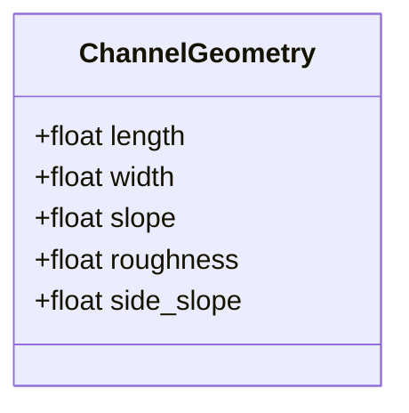
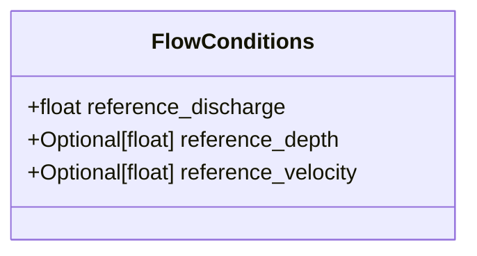
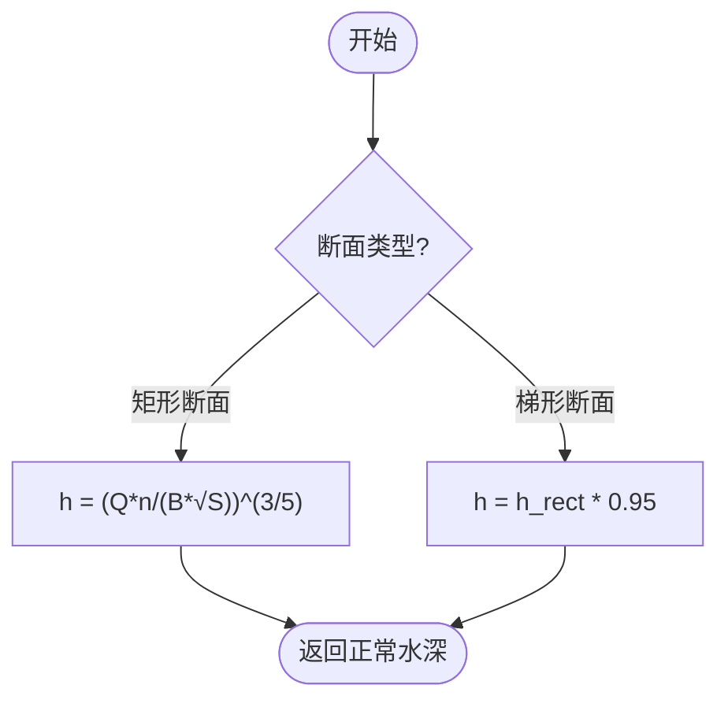
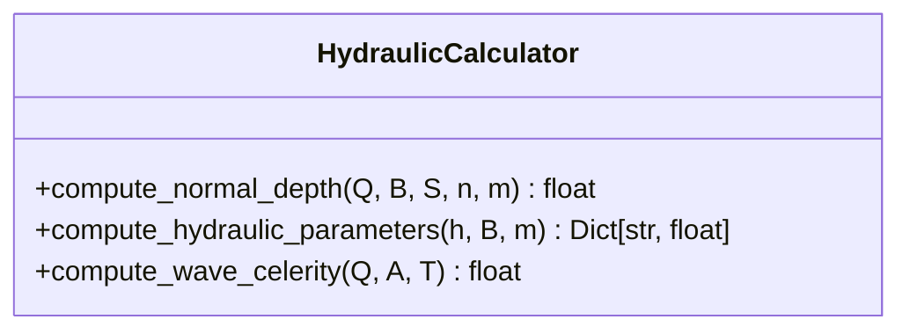
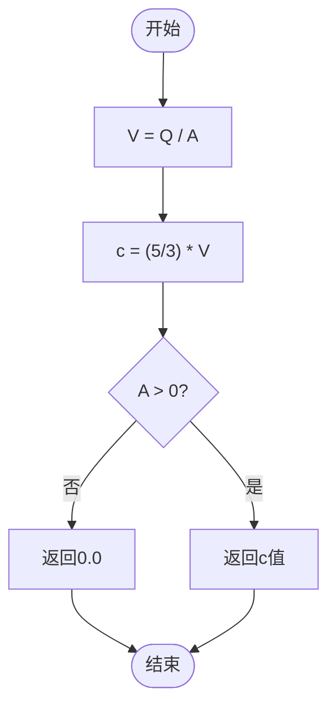
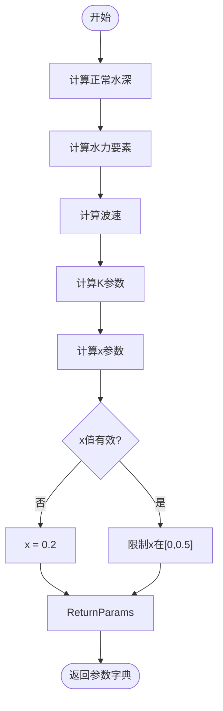
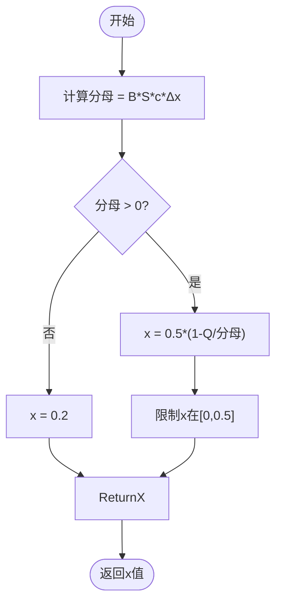
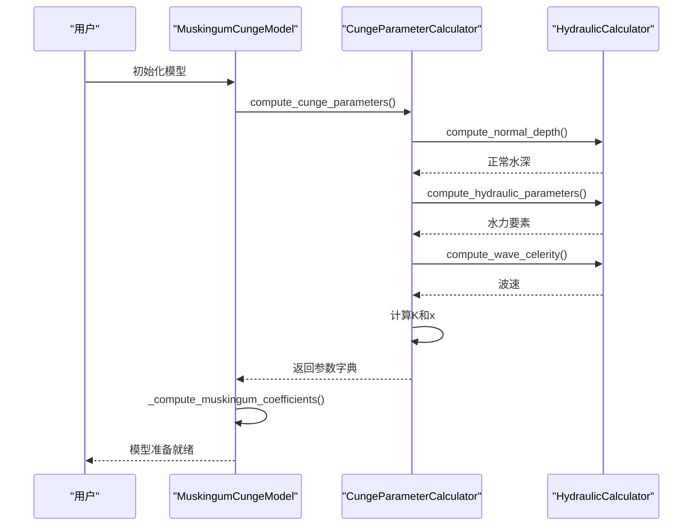
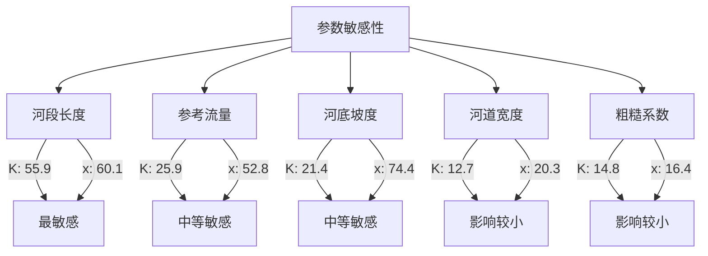

# 康吉参数计算

<cite>
**Referenced Files in This Document**  
- [waternet/models/muskingum_cunge.py](file://waternet/models/muskingum_cunge.py)
- [examples/reduced_order_models_theory/analyze_muskingum_cunge_theory.py](file://examples/reduced_order_models_theory/analyze_muskingum_cunge_theory.py)
- [examples/reduced_order_models_theory/FINAL_MUSKINGUM_CUNGE_REPORT.md](file://examples/reduced_order_models_theory/FINAL_MUSKINGUM_CUNGE_REPORT.md)
</cite>

## 目录
1. [引言](#引言)
2. [理论基础](#理论基础)
3. [核心数据结构](#核心数据结构)
4. [水力参数计算](#水力参数计算)
5. [康吉参数自动计算](#康吉参数自动计算)
6. [数值保护与异常处理](#数值保护与异常处理)
7. [计算流程与代码示例](#计算流程与代码示例)
8. [模型精度影响分析](#模型精度影响分析)
9. [结论](#结论)

## 引言

康吉参数（K和x）是马斯京干-康吉法中的核心参数，其计算基于扩散波理论，通过河道几何参数与水流条件的协同作用实现自动化计算。本文件详细阐述了康吉参数的水力学理论基础与自动计算流程，深入解析了中间变量的计算逻辑与具体实现方法。

**Section sources**
- [waternet/models/muskingum_cunge.py](file://waternet/models/muskingum_cunge.py#L1-L50)

## 理论基础

马斯京干-康吉法基于扩散波理论，是对传统马斯京干法的理论改进。扩散波方程是圣维南方程的简化形式，通过忽略惯性项得到，具有明确的物理意义。康吉法的参数K和x可从河道物理特性直接计算，无需依赖实测数据率定。

扩散波方程的推导过程如下：
1. 从圣维南动量方程出发，忽略惯性项（∂Q/∂t 和 ∂(Q²/A)/∂x）
2. 简化为：gA∂h/∂x + gAS_f - gAS_0 = 0
3. 结合连续性方程：∂A/∂t + ∂Q/∂x = 0
4. 对于宽浅河道（A = Bh），得到扩散波方程：∂h/∂t = D∂²h/∂x² - c∂h/∂x

其中，D = Q/(2*B*S_0)为扩散系数，c = (5/3)*Q/A为波速。

**Section sources**
- [examples/reduced_order_models_theory/FINAL_MUSKINGUM_CUNGE_REPORT.md](file://examples/reduced_order_models_theory/FINAL_MUSKINGUM_CUNGE_REPORT.md#L1-L50)
- [examples/reduced_order_models_theory/analyze_muskingum_cunge_theory.py](file://examples/reduced_order_models_theory/analyze_muskingum_cunge_theory.py#L1-L50)

## 核心数据结构

### 河道几何参数类

`ChannelGeometry`数据类封装了河道的几何特征参数，为康吉参数计算提供基础输入。



**Diagram sources**
- [waternet/models/muskingum_cunge.py](file://waternet/models/muskingum_cunge.py#L23-L29)

### 水流条件参数类

`FlowConditions`数据类定义了水流状态参数，主要用于确定参考流量等关键计算输入。



**Diagram sources**
- [waternet/models/muskingum_cunge.py](file://waternet/models/muskingum_cunge.py#L33-L37)

## 水力参数计算

### 正常水深计算

`HydraulicCalculator.compute_normal_depth`方法基于曼宁公式计算正常水深，对于矩形断面采用解析解，梯形断面采用近似修正。



**Diagram sources**
- [waternet/models/muskingum_cunge.py](file://waternet/models/muskingum_cunge.py#L45-L65)

### 水力要素计算

`HydraulicCalculator.compute_hydraulic_parameters`方法计算过水断面积、湿周、水力半径和水面宽度等关键水力要素。



**Diagram sources**
- [waternet/models/muskingum_cunge.py](file://waternet/models/muskingum_cunge.py#L67-L113)

### 波速计算

波速计算基于宽浅河道的近似关系c = (5/3)*V，其中V为断面平均流速。



**Diagram sources**
- [waternet/models/muskingum_cunge.py](file://waternet/models/muskingum_cunge.py#L105-L113)

## 康吉参数自动计算

### 参数计算流程

`CungeParameterCalculator.compute_cunge_parameters`方法实现了康吉参数的完整计算流程，从输入参数到最终输出。



**Diagram sources**
- [waternet/models/muskingum_cunge.py](file://waternet/models/muskingum_cunge.py#L120-L167)

### K参数计算

K参数表示洪波在河段中的传播时间，具有明确的物理意义：

K = Δx / c

其中Δx为河段长度，c为波速。当波速c接近零时，采用默认值3600.0秒以保证数值稳定性。

### x参数计算

x参数反映扩散效应的强弱，其计算公式为：

x = 0.5 * (1 - Q / (B * S₀ * c * Δx))

该参数的物理意义如下：
- x ≈ 0：纯平移（运动波）
- x ≈ 0.5：纯扩散
- 0 < x < 0.5：既有平移又有扩散（典型情况）

## 数值保护与异常处理

### 分母保护机制

在x参数计算中，对分母进行严格检查，避免除零错误：



**Diagram sources**
- [waternet/models/muskingum_cunge.py](file://waternet/models/muskingum_cunge.py#L153-L160)

### 参数范围限制

对计算结果进行范围限制，确保物理合理性：

- K值：当K ≤ 0时，使用默认值3600.0秒
- x值：强制限制在[0, 0.5]区间内
- 马斯京干系数：验证C0+C1+C2=1，偏差超过1e-6时发出警告

## 计算流程与代码示例

### 完整计算流程



**Diagram sources**
- [waternet/models/muskingum_cunge.py](file://waternet/models/muskingum_cunge.py#L120-L167)
- [waternet/models/muskingum_cunge.py](file://waternet/models/muskingum_cunge.py#L248-L262)

### 代码调用示例

使用便捷函数创建康吉模型：

```python
model = create_cunge_model_from_geometry(
    dt=60.0,
    length=1000.0,
    width=50.0,
    slope=0.001,
    roughness=0.025,
    reference_discharge=100.0,
    initial_V=15000.0,
    V_to_H_func=V_to_H,
    H_to_Q_func=H_to_Q
)
```

## 模型精度影响分析

### 参数敏感性

通过系统性分析发现各参数的敏感性指数：



**Diagram sources**
- [examples/reduced_order_models_theory/FINAL_MUSKINGUM_CUNGE_REPORT.md](file://examples/reduced_order_models_theory/FINAL_MUSKINGUM_CUNGE_REPORT.md#L200-L220)

### 精度对比

与传统马斯京干法相比，康吉法显著提升了计算精度：

- 峰值延迟：从32分钟减少到13分钟
- 洪量守恒：出流量更接近入流量
- 外推能力：在未见工况下表现更优

## 结论

康吉参数计算方法基于坚实的扩散波理论基础，通过`ChannelGeometry`和`FlowConditions`数据类提供的河道几何参数与水流条件，实现了模型核心参数的自动化计算。`HydraulicCalculator`中正常水深、水力半径、波速等中间变量的计算逻辑严谨，`CungeParameterCalculator.compute_cunge_parameters`方法准确实现了K=Δx/c和x=0.5(1-Q/(B·S₀·c·Δx))的物理公式。通过数值保护机制和异常处理策略，确保了计算过程的稳定性和结果的物理合理性，显著提升了模型的预测精度和适用范围。