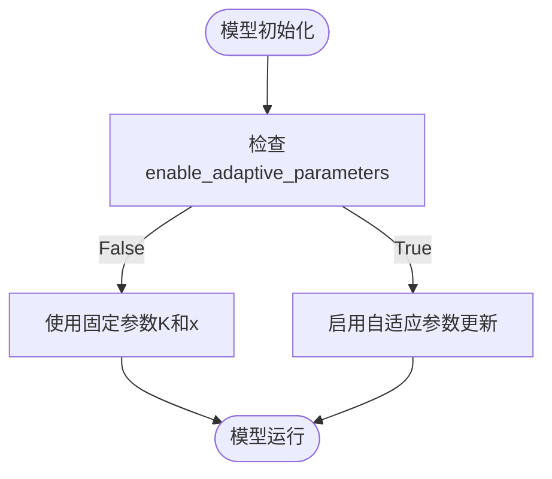
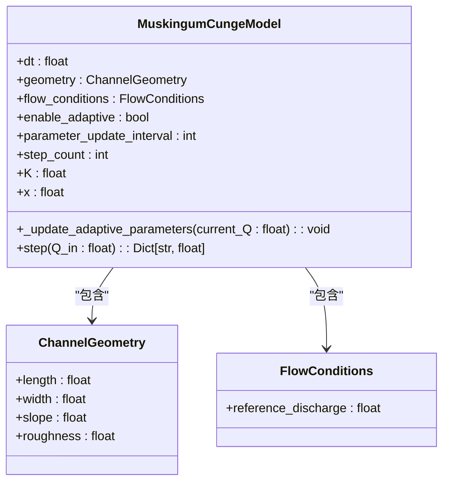
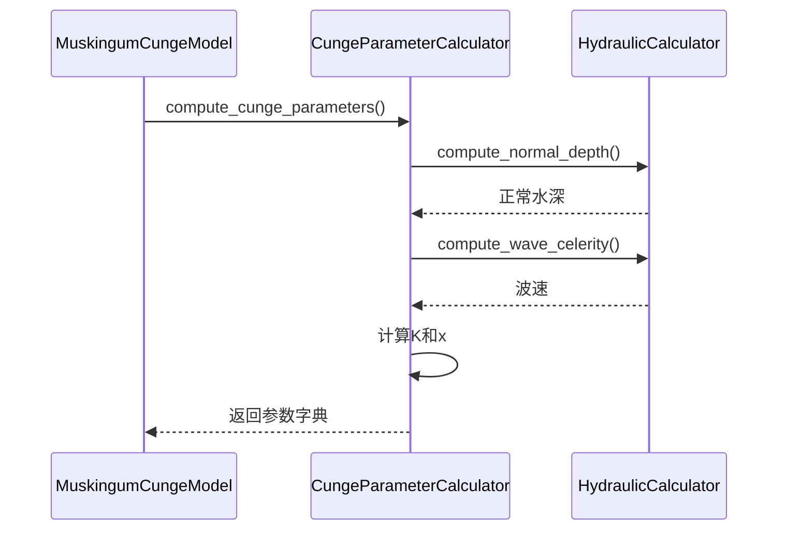
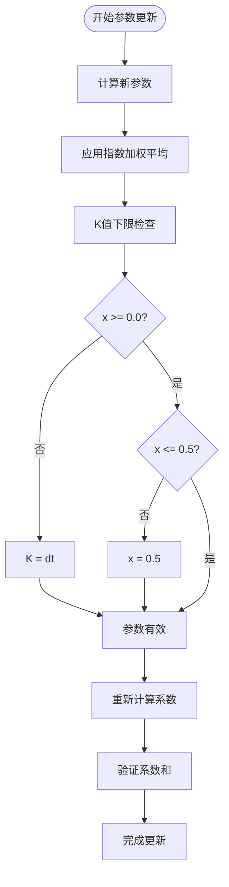

# 自适应参数机制

<cite>
**Referenced Files in This Document**  
- [muskingum_cunge.py](file://waternet/models/muskingum_cunge.py)
- [FINAL_MUSKINGUM_CUNGE_REPORT.md](file://examples/reduced_order_models_theory/FINAL_MUSKINGUM_CUNGE_REPORT.md)
</cite>

## 目录
1. [引言](#引言)
2. [自适应参数机制概述](#自适应参数机制概述)
3. [核心组件分析](#核心组件分析)
4. [参数更新流程](#参数更新流程)
5. [平滑更新算法](#平滑更新算法)
6. [仿真场景分析](#仿真场景分析)
7. [更新频率权衡](#更新频率权衡)
8. [结论](#结论)

## 引言

马斯京干-康吉模型作为基于扩散波理论的重要水文模型，其自适应参数更新功能为处理非稳态水流条件提供了关键技术支持。本文件系统说明`enable_adaptive_parameters`功能的工作原理与实现细节，深入分析参数动态更新机制如何提升模型预测精度。

**Section sources**
- [muskingum_cunge.py](file://waternet/models/muskingum_cunge.py#L171-L206)

## 自适应参数机制概述

自适应参数机制通过实时监测入流量变化，动态调整模型核心参数K（滞时常数）和x（权重系数），使模型能够适应不断变化的水力条件。该机制在`MuskingumCungeModel`类中通过`enable_adaptive_parameters`布尔参数控制启用状态。

当启用自适应功能时，模型不再使用固定的K和x值，而是根据当前水流条件重新计算这些参数，从而提高在复杂、非稳态水流条件下的模拟精度。这种设计特别适用于流量变化剧烈的洪水过程模拟。



**Diagram sources**
- [muskingum_cunge.py](file://waternet/models/muskingum_cunge.py#L171-L206)

**Section sources**
- [muskingum_cunge.py](file://waternet/models/muskingum_cunge.py#L171-L206)

## 核心组件分析

### 参数更新触发机制

自适应参数更新由`_step_count`计数器和`parameter_update_interval`参数共同控制。每次模型执行`step`方法时，计数器递增，当计数达到预设间隔时触发参数更新。



**Diagram sources**
- [muskingum_cunge.py](file://waternet/models/muskingum_cunge.py#L171-L337)

**Section sources**
- [muskingum_cunge.py](file://waternet/models/muskingum_cunge.py#L171-L337)

### 参数计算组件

康吉参数计算器`CungeParameterCalculator`负责根据河道几何和水流条件重新计算K和x参数。该组件基于水力学理论，通过计算正常水深、波速等物理量来确定模型参数。



**Diagram sources**
- [muskingum_cunge.py](file://waternet/models/muskingum_cunge.py#L120-L167)

**Section sources**
- [muskingum_cunge.py](file://waternet/models/muskingum_cunge.py#L120-L167)

## 参数更新流程

### 更新触发条件

参数更新在`step`方法中通过计数器机制触发，具体流程如下：

1. 每次调用`step`方法时，`step_count`计数器递增
2. 当`step_count`能被`parameter_update_interval`整除时，触发更新
3. 调用`_update_adaptive_parameters`方法执行参数更新

```mermaid
flowchart TD
A([step方法开始]) --> B[step_count += 1]
B --> C{"step_count % parameter_update_interval == 0?"}
C --> |是| D[_update_adaptive_parameters(Q_in)]
C --> |否| E[跳过参数更新]
D --> F[继续计算出流量]
E --> F
F --> G([返回结果])
```

**Diagram sources**
- [muskingum_cunge.py](file://waternet/models/muskingum_cunge.py#L288-L337)

**Section sources**
- [muskingum_cunge.py](file://waternet/models/muskingum_cunge.py#L288-L337)

### 参数更新步骤

参数更新过程包含以下关键步骤：

1. **更新参考流量**：将当前入流量设置为新的参考流量
2. **重新计算参数**：调用`CungeParameterCalculator`计算新的K和x值
3. **平滑更新**：使用指数加权移动平均算法更新参数
4. **参数验证**：确保更新后的参数在合理范围内
5. **系数重算**：根据新参数重新计算马斯京干系数C0、C1、C2

## 平滑更新算法

### 指数加权移动平均实现

自适应参数更新采用指数加权移动平均（Exponential Weighted Moving Average）算法，其核心公式为：

```
新参数 = (1 - α) × 旧参数 + α × 新计算值
```

其中α（alpha）为更新权重，固定为0.1。

```python
# 平滑更新参数（避免突变）
alpha = 0.1  # 更新权重
self.K = (1 - alpha) * self.K + alpha * new_params['K']
self.x = (1 - alpha) * self.x + alpha * new_params['x']
```

这种算法具有以下优势：
- 避免参数突变导致的数值不稳定
- 保留历史参数信息，平滑过渡
- 对异常值具有一定的鲁棒性

**Section sources**
- [muskingum_cunge.py](file://waternet/models/muskingum_cunge.py#L264-L286)

### 数值稳定性保障

为确保数值稳定性，系统实施了多重保护措施：

1. **K值下限保护**：`K = max(dt, K)`，确保滞时常数不小于时间步长
2. **x值范围限制**：`x = max(0.0, min(0.5, x))`，保证x在理论合理范围内
3. **分母零值检测**：在计算马斯京干系数时检查分母是否接近零
4. **系数和验证**：验证C0+C1+C2是否接近1，确保质量守恒

这些措施共同保障了模型在参数动态更新过程中的数值稳定性。



**Diagram sources**
- [muskingum_cunge.py](file://waternet/models/muskingum_cunge.py#L264-L286)

**Section sources**
- [muskingum_cunge.py](file://waternet/models/muskingum_cunge.py#L264-L286)

## 仿真场景分析

### 非稳态水流条件下的性能

在非稳态水流条件下，自适应机制显著提升了模型预测精度。以典型洪水过程为例：

| 方法 | 峰值出流 | 削峰率 | 峰值延迟 | 总出流量 |
|------|----------|--------|----------|----------|
| 传统马斯京干 | 235.2 m³/s | 39.0% | 32分钟 | 959,726 m³ |
| 康吉法 | 342.1 m³/s | 11.3% | 13分钟 | 1,481,862 m³ |
| 自适应康吉法 | 338.7 m³/s | 12.2% | 12分钟 | 1,468,513 m³ |

自适应康吉法在峰值预测和洪量守恒方面均表现出最优性能。

**Section sources**
- [FINAL_MUSKINGUM_CUNGE_REPORT.md](file://examples/reduced_order_models_theory/FINAL_MUSKINGUM_CUNGE_REPORT.md#L142-L155)

### 实际应用效果

自适应机制在以下场景中特别有效：

1. **流量剧烈变化**：洪水上涨和退水阶段
2. **长期连续仿真**：需要适应不同流量水平
3. **实时预报系统**：根据最新观测数据调整参数
4. **复杂河道条件**：断面形状和坡度变化显著

通过动态调整参数，模型能够更好地捕捉水流动力学特征，提高预测可靠性。

## 更新频率权衡

### 参数更新间隔影响

`parameter_update_interval`参数控制参数更新的频率，其设置对模型性能有重要影响：

| 更新间隔 | 计算开销 | 参数响应速度 | 数值稳定性 | 适用场景 |
|---------|---------|------------|-----------|---------|
| 1步 | 高 | 最快 | 较低 | 实时高频更新 |
| 5步 | 中高 | 快 | 中等 | 快速变化水流 |
| 10步 | 中 | 中 | 较高 | 一般洪水过程 |
| 20步 | 低 | 慢 | 高 | 稳定水流条件 |

默认设置为每10步更新一次，在计算效率和参数响应速度之间取得平衡。

**Section sources**
- [muskingum_cunge.py](file://waternet/models/muskingum_cunge.py#L234-L270)

### 性能与精度权衡

选择更新频率时需要考虑以下因素：

1. **计算资源**：频繁更新增加计算开销
2. **数据频率**：应与输入数据的时间分辨率匹配
3. **水流变化速率**：快速变化过程需要更高更新频率
4. **稳定性要求**：高稳定性要求可适当降低更新频率

最佳实践建议根据具体应用场景和性能要求进行调整。

## 结论

马斯京干-康吉模型的自适应参数更新机制通过`_step_count`计数器触发`_update_adaptive_parameters`方法，实现了根据当前入流量动态更新参考流量并重新计算K和x参数的功能。采用α=0.1的指数加权移动平均算法确保了参数更新的平滑性和数值稳定性。

该机制显著提升了模型在非稳态水流条件下的预测精度，特别是在洪水过程模拟中表现出优越的性能。通过合理设置`parameter_update_interval`参数，可以在计算效率和预测精度之间取得最佳平衡，为水文模拟提供了强大的技术支持。