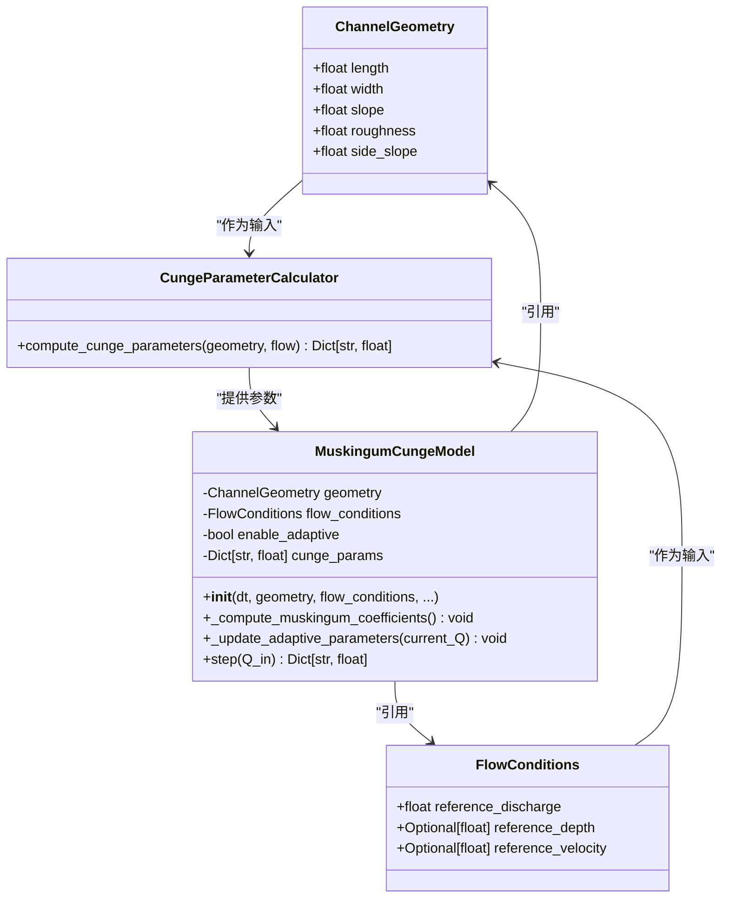
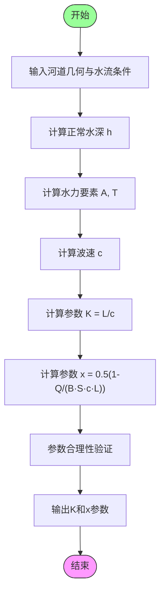
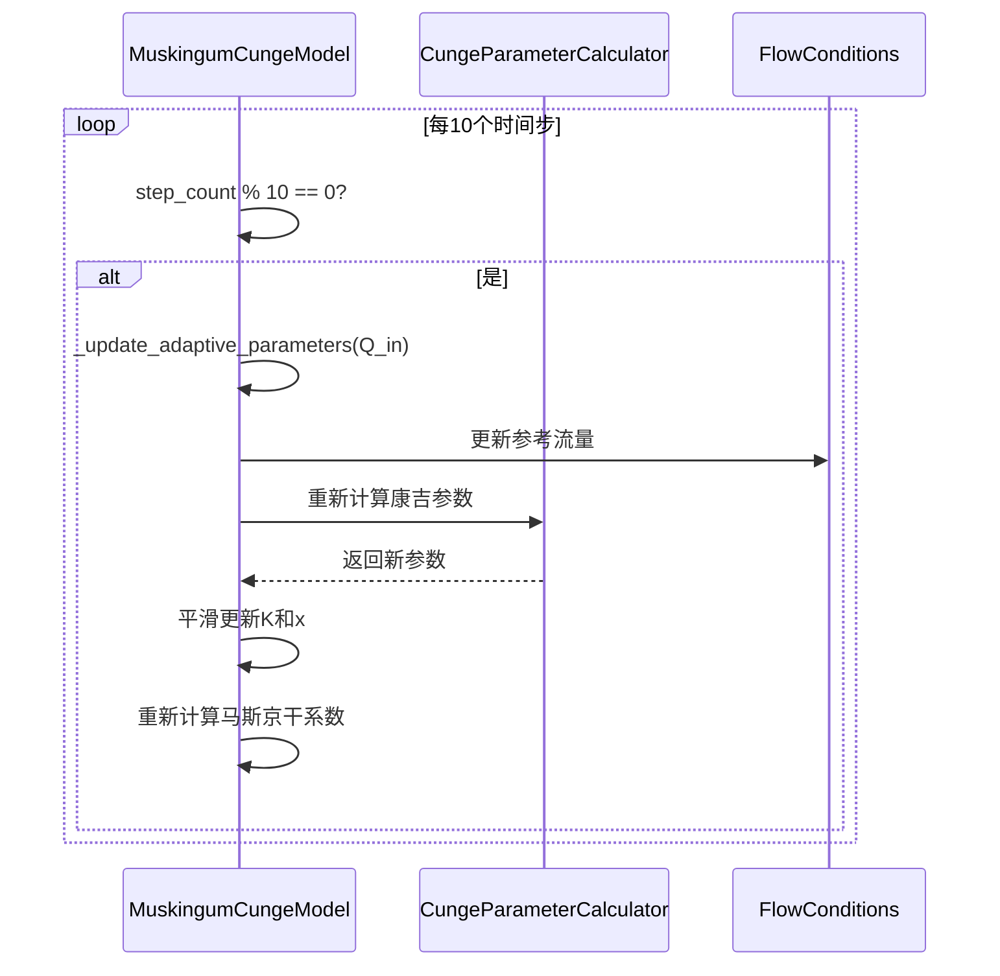
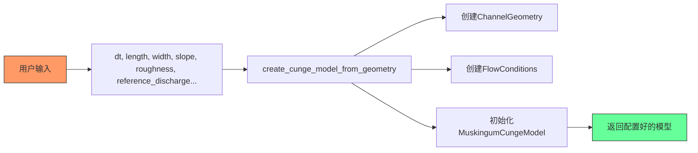

# 马斯京干-康吉模型

<cite>
**Referenced Files in This Document**   
- [muskingum_cunge.py](file://waternet/models/muskingum_cunge.py)
- [muskingum_cunge_demo.py](file://examples/reduced_order_models_theory/muskingum_cunge_demo.py)
</cite>

## 目录
1. [引言](#引言)
2. [理论基础与物理可解释性](#理论基础与物理可解释性)
3. [核心数据结构与协作机制](#核心数据结构与协作机制)
4. [康吉参数计算流程](#康吉参数计算流程)
5. [自适应参数更新机制](#自适应参数更新机制)
6. [便捷创建函数与实际应用](#便捷创建函数与实际应用)
7. [与传统模型的对比优势](#与传统模型的对比优势)
8. [结论](#结论)

## 引言

马斯京干-康吉模型（Muskingum-Cunge Model）是一种基于扩散波理论的改进型马斯京干模型，通过将河道的物理特性与水流条件相结合，实现了模型参数的物理可解释性。该模型不仅保留了传统马斯京干模型的简洁性，还通过康吉法（Cunge Method）实现了参数的自动计算和动态调整，显著提升了模型在复杂水文条件下的模拟精度。

**Section sources**
- [muskingum_cunge.py](file://waternet/models/muskingum_cunge.py#L1-L50)

## 理论基础与物理可解释性

马斯京干-康吉模型的核心理论基础是扩散波方程，它通过将圣维南方程组简化为扩散波形式，建立了河道几何参数、水流条件与模型参数之间的物理联系。与传统马斯京干模型依赖经验参数不同，康吉模型能够基于河道的物理特性自动计算关键参数K（波传播时间）和x（权重系数），从而赋予模型明确的水力学意义。

该模型的物理可解释性体现在其参数计算过程中：参数K与波速和河段长度直接相关，而参数x则反映了扩散效应的强度。这种基于物理机制的参数确定方法，避免了传统方法中参数率定的主观性和不确定性，使模型更具科学性和普适性。

**Section sources**
- [muskingum_cunge.py](file://waternet/models/muskingum_cunge.py#L170-L175)

## 核心数据结构与协作机制

马斯京干-康吉模型的实现依赖于三个核心组件的紧密协作：`ChannelGeometry`、`FlowConditions` 和 `CungeParameterCalculator`。这些组件共同构成了模型的物理参数体系，确保了参数计算的准确性和一致性。

**Diagram sources**
- [muskingum_cunge.py](file://waternet/models/muskingum_cunge.py#L23-L29)
- [muskingum_cunge.py](file://waternet/models/muskingum_cunge.py#L33-L37)
- [muskingum_cunge.py](file://waternet/models/muskingum_cunge.py#L116-L167)
- [muskingum_cunge.py](file://waternet/models/muskingum_cunge.py#L170-L367)

**Section sources**
- [muskingum_cunge.py](file://waternet/models/muskingum_cunge.py#L23-L37)
- [muskingum_cunge.py](file://waternet/models/muskingum_cunge.py#L116-L167)

### 数据结构说明

- **ChannelGeometry**：封装河道的几何参数，包括长度、宽度、坡度和曼宁粗糙系数，为水力计算提供基础数据。
- **FlowConditions**：描述水流状态，核心是参考流量，用于确定计算参数时的典型工况。
- **CungeParameterCalculator**：核心计算工具，负责将几何与水流参数转化为马斯京干模型的K和x参数。

## 康吉参数计算流程

康吉参数的计算是一个多步骤的水力学推导过程，它从基本的河道和水流参数出发，逐步推导出模型所需的K和x值。该流程严格遵循水力学原理，确保了参数的物理合理性。

**Diagram sources**
- [muskingum_cunge.py](file://waternet/models/muskingum_cunge.py#L120-L167)

**Section sources**
- [muskingum_cunge.py](file://waternet/models/muskingum_cunge.py#L116-L167)

### 计算步骤详解

1. **正常水深计算**：利用曼宁公式，根据参考流量、河宽、坡度和粗糙系数计算正常水深。
2. **水力要素计算**：基于正常水深，计算过水断面积（A）和水面宽度（T）。
3. **波速计算**：根据流量、断面积和水面宽度，计算洪水波的传播速度。
4. **参数K计算**：K值等于河段长度除以波速，表示波通过河段所需的时间。
5. **参数x计算**：x值由一个包含流量、河宽、坡度、波速和长度的复杂公式确定，反映了扩散效应的强度。

## 自适应参数更新机制

自适应参数更新功能（`enable_adaptive_parameters`）是马斯京干-康吉模型的一项重要创新。该功能允许模型根据实时流量动态调整K和x参数，从而更好地适应非恒定流条件下的复杂水文过程。

**Diagram sources**
- [muskingum_cunge.py](file://waternet/models/muskingum_cunge.py#L264-L286)
- [muskingum_cunge.py](file://waternet/models/muskingum_cunge.py#L120-L167)

**Section sources**
- [muskingum_cunge.py](file://waternet/models/muskingum_cunge.py#L264-L286)

### 机制特点

- **动态调整**：每10个时间步检查一次，根据当前流量更新参考流量。
- **平滑过渡**：采用加权平均（权重α=0.1）的方式更新参数，避免因参数突变导致的数值不稳定。
- **边界保护**：确保K值不小于时间步长，x值在[0, 0.5]的合理范围内。
- **实时性**：使模型能够响应流量的快速变化，提高对非恒定流的模拟能力。

## 便捷创建函数与实际应用

为了简化模型的创建过程，系统提供了`create_cunge_model_from_geometry`便捷函数。该函数将复杂的参数封装过程自动化，用户只需提供基本的河道和水流参数即可快速构建模型。

**Diagram sources**
- [muskingum_cunge.py](file://waternet/models/muskingum_cunge.py#L371-L420)

**Section sources**
- [muskingum_cunge.py](file://waternet/models/muskingum_cunge.py#L371-L420)

### 实际应用示例

在`muskingum_cunge_demo.py`演示脚本中，展示了该模型的完整应用流程：
1. 定义蓄量-水位和水位-出流的物理关系函数。
2. 创建河道几何和水流条件对象。
3. 调用便捷函数创建模型实例。
4. 运行仿真并分析结果。

该函数极大地降低了模型的使用门槛，使用户能够专注于水文问题本身，而非复杂的参数配置。

**Section sources**
- [muskingum_cunge_demo.py](file://examples/reduced_order_models_theory/muskingum_cunge_demo.py#L1-L50)

## 与传统模型的对比优势

马斯京干-康吉模型相较于传统马斯京干模型具有显著优势，主要体现在以下几个方面：

| 特性 | 传统马斯京干模型 | 马斯京干-康吉模型 |
| :--- | :--- | :--- |
| **参数来源** | 经验率定 | 物理计算 |
| **物理基础** | 经验公式 | 扩散波理论 |
| **参数更新** | 固定不变 | 可自适应调整 |
| **适用条件** | 恒定流假设 | 非恒定流适应 |
| **模型精度** | 依赖率定质量 | 物理机制保证 |
| **可解释性** | 较低 | 高 |

**Diagram sources**
- [muskingum_cunge_demo.py](file://examples/reduced_order_models_theory/muskingum_cunge_demo.py#L1-L275)

**Section sources**
- [muskingum_cunge_demo.py](file://examples/reduced_order_models_theory/muskingum_cunge_demo.py#L1-L275)

### 适用条件

马斯京干-康吉模型特别适用于以下场景：
- 河道几何参数已知且相对规则。
- 需要避免复杂参数率定过程。
- 流量变化剧烈，需要动态响应。
- 强调模型的物理可解释性和科学性。

## 结论

马斯京干-康吉模型通过将水力学理论与集总式模型相结合，成功解决了传统马斯京干模型参数物理意义不明确的问题。其基于河道几何和水流条件自动计算K和x参数的能力，以及支持自适应更新的特性，显著提升了模型的精度和实用性。`create_cunge_model_from_geometry`便捷函数的引入，进一步降低了模型的使用门槛。该模型在保持传统马斯京干模型计算效率的同时，增强了其物理基础和适应能力，是现代水文模拟中一个强大而实用的工具。