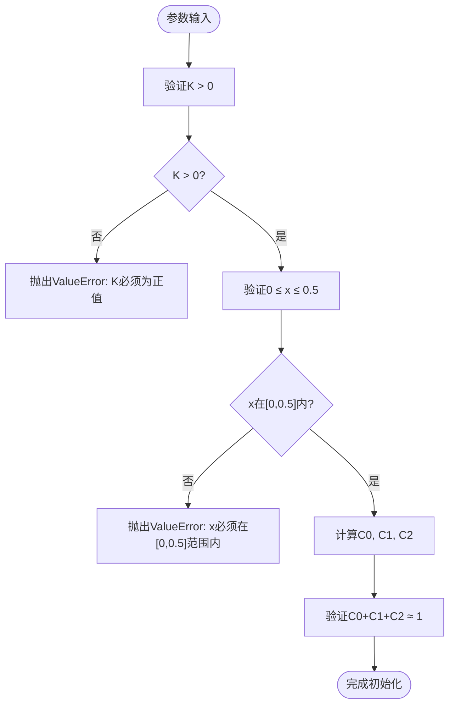
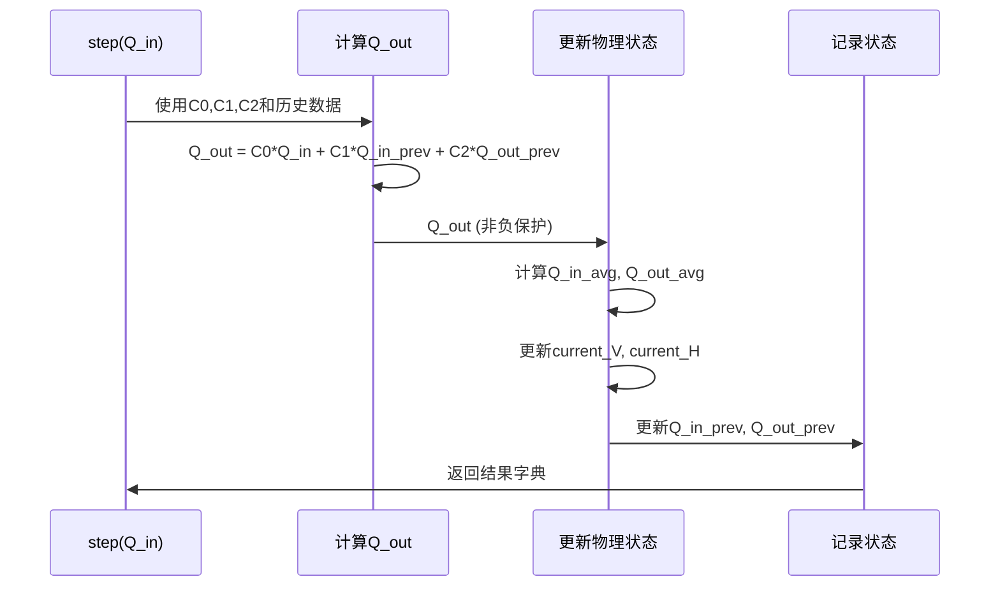

# 马斯京干模型

<cite>
**Referenced Files in This Document**   
- [lumped_models.py](file://waternet/models/lumped_models.py)
- [muskingum_model.yaml](file://configs/example_configs/muskingum_model.yaml)
- [model_factory.py](file://waternet/utils/model_factory.py)
- [analyze_muskingum_theory.py](file://examples/reduced_order_models_theory/analyze_muskingum_theory.py)
- [analyze_muskingum_equilibrium.py](file://examples/reduced_order_models_theory/analyze_muskingum_equilibrium.py)
</cite>

## 目录
1. [引言](#引言)
2. [数学基础与核心方程](#数学基础与核心方程)
3. [模型参数的物理意义与约束](#模型参数的物理意义与约束)
4. [初始化与系数预计算](#初始化与系数预计算)
5. [时间步进与状态更新](#时间步进与状态更新)
6. [参数配置示例](#参数配置示例)
7. [适用场景与工程意义](#适用场景与工程意义)

## 引言

马斯京干模型（Muskingum Model）是一种经典的河道洪水演进模型，基于线性水库理论，广泛应用于天然河道和明渠的洪水传播计算。该模型通过简化圣维南方程组，将复杂的水力过程降阶为一个线性常微分方程，从而实现高效、稳定的洪水演进模拟。本文档深入解析该模型的数学基础、代码实现及工程应用。

**Section sources**
- [lumped_models.py](file://waternet/models/lumped_models.py#L665-L675)

## 数学基础与核心方程

马斯京干模型的核心在于其线性化的洪水演进方程，该方程通过忽略圣维南方程组中的惯性项和对流项，将非线性偏微分方程简化为一个线性常微分方程。其基本方程如下：

$$ Q_{out} = C_0 \cdot Q_{in} + C_1 \cdot Q_{in\_prev} + C_2 \cdot Q_{out\_prev} $$

该方程描述了当前时刻的出流量 $ Q_{out} $ 与当前入流量 $ Q_{in} $、上一时刻入流量 $ Q_{in\_prev} $ 以及上一时刻出流量 $ Q_{out\_prev} $ 的线性关系。这种形式使得模型能够高效地进行时间步进计算，同时保持对洪水波传播过程的基本物理描述。

**Section sources**
- [lumped_models.py](file://waternet/models/lumped_models.py#L675-L679)

## 模型参数的物理意义与约束

马斯京干模型包含两个关键参数：滞时常数 $ K $ 和权重系数 $ x $，它们共同决定了模型的动态响应特性。

- **滞时常数 $ K $**：代表洪峰在河道中传播的时间，单位为秒。其物理意义是洪水波从上游传播到下游所需的时间，通常与河段长度和波速相关（$ K \approx L/c $）。在代码实现中，$ K $ 必须为正值，否则将引发参数验证错误。
- **权重系数 $ x $**：反映楔形蓄量对洪水演进的影响，取值范围严格限定在 $ 0 \leq x \leq 0.5 $。当 $ x = 0 $ 时，模型表现为纯水库效应；当 $ x = 0.5 $ 时，模型表现为纯传播效应。该约束确保了模型的数值稳定性和物理合理性。



**Diagram sources**
- [lumped_models.py](file://waternet/models/lumped_models.py#L690-L705)

**Section sources**
- [lumped_models.py](file://waternet/models/lumped_models.py#L690-L705)

## 初始化与系数预计算

在模型初始化（`__init__` 方法）阶段，系统首先对输入参数 $ K $ 和 $ x $ 进行严格的范围验证。验证通过后，模型会立即根据时间步长 $ dt $ 预计算出三个核心系数 $ C_0 $、$ C_1 $ 和 $ C_2 $，其计算公式如下：

$$
\begin{align*}
C_0 &= \frac{-Kx + 0.5 \cdot dt}{K - Kx + 0.5 \cdot dt} \\
C_1 &= \frac{Kx + 0.5 \cdot dt}{K - Kx + 0.5 \cdot dt} \\
C_2 &= \frac{K - Kx - 0.5 \cdot dt}{K - Kx + 0.5 \cdot dt}
\end{align*}
$$

这一预计算过程是模型高效运行的关键，避免了在每个时间步重复进行复杂的数学运算。同时，系统会检查分母是否接近零以防止数值溢出，并验证系数之和是否接近1（$ C_0 + C_1 + C_2 \approx 1 $），这是确保模型质量守恒和数值稳定的重要措施。

**Section sources**
- [lumped_models.py](file://waternet/models/lumped_models.py#L707-L720)

## 时间步进与状态更新

`step()` 方法是模型的核心执行单元，负责推进一个时间步长的仿真。其逻辑流程如下：
1. **计算出流量**：使用预计算的系数和历史流量数据，通过核心方程计算当前时刻的出流量 $ Q_{out} $。
2. **数值保护**：对计算出的 $ Q_{out} $ 进行非负性保护（`Q_out = max(0.0, Q_out)`），防止出现物理上不合理的负流量。
3. **更新物理状态**：利用平均入流和出流，通过连续性方程更新蓄水量 $ V $，并根据蓄量-水位（V-H）和水位-出流（H-Q）关系函数更新水位 $ H $。
4. **更新历史变量**：将当前的 $ Q_{in} $ 和 $ Q_{out} $ 更新为下一时刻的 $ Q_{in\_prev} $ 和 $ Q_{out\_prev} $，为下一个时间步做准备。



**Diagram sources**
- [lumped_models.py](file://waternet/models/lumped_models.py#L740-L779)

**Section sources**
- [lumped_models.py](file://waternet/models/lumped_models.py#L740-L779)

## 参数配置示例

马斯京干模型可以通过多种方式配置，最常见的是通过配置文件或编程接口。以下是一个典型的YAML配置文件示例：

```yaml
model_type: muskingum
parameters:
  K: 3600.0      # 滞时常数，1小时
  x: 0.2         # 权重系数
  dt: 60.0       # 时间步长，1分钟
  initial_V: 12000.0  # 初始蓄水量

physical_relations:
  V_to_H:
    type: linear
    base_level: 99.0
    coefficient: 0.000125
  H_to_Q:
    type: weir
    threshold: 99.0
    coefficient: 25.0
    exponent: 1.5
```

此外，`model_factory.py` 提供了简化的创建接口 `create_simple_muskingum()`，它使用基于理论分析的最佳实践默认参数（如 $ K=3600.0 $, $ x=0.2 $），允许用户以最少的配置快速启动模型。

**Section sources**
- [muskingum_model.yaml](file://configs/example_configs/muskingum_model.yaml#L0-L16)
- [model_factory.py](file://waternet/utils/model_factory.py#L78-L109)

## 适用场景与工程意义

马斯京干模型特别适用于坡度较缓（$ S_0 < 0.002 $）、弗劳德数较小（$ Fr < 0.5 $）且流量变化相对缓慢的明渠水力仿真。其工程意义在于：
- **计算效率高**：相比求解完整的圣维南方程组，计算速度大幅提升。
- **参数物理意义明确**：$ K $ 和 $ x $ 可通过恒定流法或历史洪水数据进行率定。
- **稳定性好**：线性结构和严格的参数约束保证了模型的数值稳定性。
- **工程实用性强**：作为洪水预报和水库调度的基础模型，已被广泛验证和应用。

**Section sources**
- [analyze_muskingum_theory.py](file://examples/reduced_order_models_theory/analyze_muskingum_theory.py#L150-L180)
- [analyze_muskingum_equilibrium.py](file://examples/reduced_order_models_theory/analyze_muskingum_equilibrium.py#L200-L250)