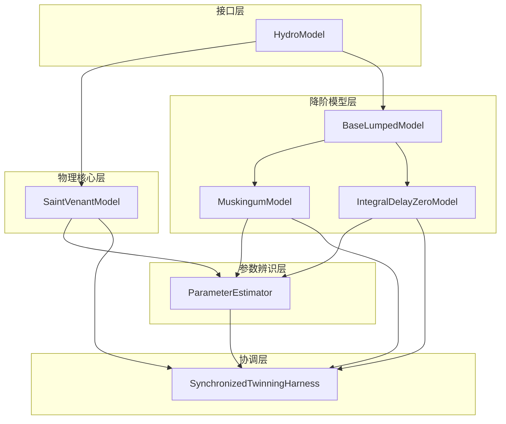

# 项目概述

<cite>
**本文档引用的文件**   
- [README.md](file://README.md)
- [waternet/__init__.py](file://waternet/__init__.py)
- [waternet/models/saint_venant.py](file://waternet/models/saint_venant.py)
- [waternet/models/muskingum_cunge.py](file://waternet/models/muskingum_cunge.py)
- [waternet/models/idz_linearizer.py](file://waternet/models/idz_linearizer.py)
- [waternet/coordination/twinning_harness.py](file://waternet/coordination/twinning_harness.py)
- [waternet/parameter_estimation/estimator.py](file://waternet/parameter_estimation/estimator.py)
- [configs/example_configs/simulation_config.yaml](file://configs/example_configs/simulation_config.yaml)
- [examples/reduced_order_models_theory/COMPREHENSIVE_REDUCED_ORDER_MODELS_THEORY.md](file://examples/reduced_order_models_theory/COMPREHENSIVE_REDUCED_ORDER_MODELS_THEORY.md)
</cite>

## 目录
1. [引言](#引言)
2. [核心目标与设计哲学](#核心目标与设计哲学)
3. [技术架构与模块关系](#技术架构与模块关系)
4. [关键能力详解](#关键能力详解)
5. [应用场景与实例](#应用场景与实例)
6. [配置驱动与模块化设计](#配置驱动与模块化设计)
7. [结论](#结论)

## 引言

WaterNet是一个基于圣维南方程组的明渠水力模型数字孪生建模框架，专为水利工程的数值仿真和参数估计而设计。该框架提供了一个从高精度物理模型到快速降阶模型的完整建模工具链，旨在为水力工程师、系统建模师和科研人员提供一个强大、灵活且易于使用的建模平台。WaterNet通过集成多种水力模型和先进的参数辨识技术，实现了对明渠水流的精确模拟和分析。

## 核心目标与设计哲学

WaterNet的核心目标是构建一个能够准确模拟明渠水力过程的数字孪生框架。该框架以圣维南方程组为基础，通过实现完整的物理方程，包括连续性方程和动量方程，来支持恒定流和非恒定流的计算。WaterNet的设计哲学强调物理真实性与计算效率的平衡，通过集成高精度物理模型与多种降阶模型，满足不同应用场景的需求。

**Section sources**
- [README.md](file://README.md#L1-L50)
- [waternet/models/saint_venant.py](file://waternet/models/saint_venant.py#L1-L50)

## 技术架构与模块关系

WaterNet的架构层次清晰，主要包括接口层、物理核心层、降阶模型层、参数辨识层和协调层。接口层基于HydroModel抽象基类，提供了标准化的模型接口。物理核心层实现了完整的圣维南方程组非恒定流计算。降阶模型层集成了水量平衡、蓄量演算、马斯京干、IDZ等经典算法。参数辨识层支持静态特征曲线拟合和动态参数优化。协调层实现了精细化模型与降阶模型的实时同步运行。

**Diagram sources **
- [waternet/__init__.py](file://waternet/__init__.py#L1-L50)
- [waternet/models/saint_venant.py](file://waternet/models/saint_venant.py#L1-L50)
- [waternet/models/lumped_models.py](file://waternet/models/lumped_models.py#L1-L50)

**Section sources**
- [README.md](file://README.md#L50-L100)
- [waternet/__init__.py](file://waternet/__init__.py#L1-L50)

## 关键能力详解

### 自动化参数辨识

WaterNet提供了强大的自动化参数辨识功能，支持静态特征曲线拟合和动态参数优化。通过ParameterEstimator类，用户可以基于圣维南模型的高精度计算结果，对降阶模型进行精确的参数标定。这不仅提高了模型的准确性，还大大减少了人工调参的工作量。

**Section sources**
- [waternet/parameter_estimation/estimator.py](file://waternet/parameter_estimation/estimator.py#L1-L50)

### 在线校正

在线校正功能允许模型在运行过程中根据实时数据自动调整参数。SynchronizedTwinningHarness类实现了精细化模型与降阶模型的同步运行，并在检测到显著误差时触发在线校正，从而确保模型的长期预测准确性。

**Section sources**
- [waternet/coordination/twinning_harness.py](file://waternet/coordination/twinning_harness.py#L1-L50)

### 多模型协同仿真

WaterNet支持多模型协同仿真，能够同时运行高精度物理模型和多种降阶模型，并进行结果对比分析。这种能力对于验证降阶模型的有效性、评估不同模型的适用范围以及进行模型选择具有重要意义。

**Section sources**
- [waternet/coordination/twinning_harness.py](file://waternet/coordination/twinning_harness.py#L1-L50)

## 应用场景与实例

WaterNet适用于多种水利工程仿真场景，如水库调洪演算、河道洪水预报、精细控制分析和快速工程估算。通过配置文件驱动的建模流程，用户可以轻松地设置和运行仿真。例如，在河道洪水预报中，可以使用马斯京干-康吉法，该方法基于扩散波理论，参数可从河道物理特性自动计算，无需历史数据，外推能力强。

**Section sources**
- [configs/example_configs/simulation_config.yaml](file://configs/example_configs/simulation_config.yaml#L1-L50)
- [examples/reduced_order_models_theory/COMPREHENSIVE_REDUCED_ORDER_MODELS_THEORY.md](file://examples/reduced_order_models_theory/COMPREHENSIVE_REDUCED_ORDER_MODELS_THEORY.md#L1-L50)

## 配置驱动与模块化设计

WaterNet采用配置驱动和模块化设计原则，使得模型的配置和管理更加灵活和高效。通过YAML配置文件，用户可以定义渠道几何、模型参数和边界条件等。模块化设计则使得各个功能组件可以独立开发和测试，提高了代码的可维护性和可扩展性。

**Section sources**
- [configs/example_configs/simulation_config.yaml](file://configs/example_configs/simulation_config.yaml#L1-L50)
- [README.md](file://README.md#L100-L150)

## 结论

WaterNet作为一个基于圣维南方程组的明渠水力模型数字孪生框架，通过集成高精度物理模型与多种降阶模型，提供了强大的建模和仿真能力。其自动化参数辨识、在线校正和多模型协同仿真等关键能力，使其成为水力工程师、系统建模师和科研人员的理想工具。未来，WaterNet将继续发展，集成更多先进的建模技术和算法，为水利工程的数字化转型做出贡献。