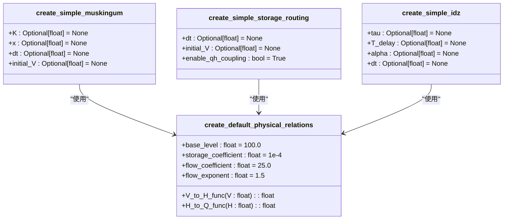
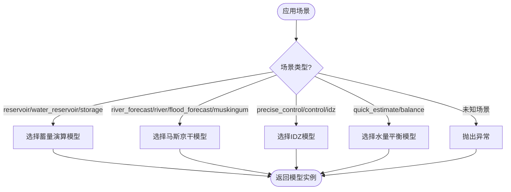
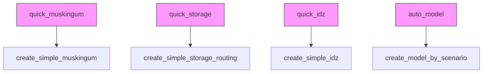

# 代码优化

<cite>
**本文档引用文件**   
- [model_factory.py](file://waternet/utils/model_factory.py)
- [lumped_models.py](file://waternet/models/lumped_models.py)
- [simplified_api_demo.py](file://examples/reduced_order_models_theory/simplified_api_demo.py)
- [quick_start_simplified.py](file://examples/quick_start_simplified.py)
- [muskingum_model.yaml](file://examples/configs/muskingum_model.yaml)
- [idz_model.yaml](file://examples/configs/idz_model.yaml)
</cite>

## 目录
1. [简介](#简介)
2. [简化API设计原理](#简化api设计原理)
3. [默认物理关系函数分析](#默认物理关系函数分析)
4. [场景化模型选择机制](#场景化模型选择机制)
5. [快速建模别名使用](#快速建模别名使用)
6. [性能优化策略](#性能优化策略)
7. [实际应用示例](#实际应用示例)
8. [配置迁移指南](#配置迁移指南)

## 简介
本文档系统性地介绍基于`model_factory.py`的代码优化策略，重点阐述如何通过预设工程经验参数减少运行时计算开销。文档详细解释`create_simple_muskingum`、`create_simple_storage_routing`、`create_simple_idz`等简化API的设计原理，分析`create_default_physical_relations`函数中物理关系函数的默认参数设计，以及`create_model_by_scenario`场景化模型选择机制如何提升开发效率。通过实际代码示例展示如何使用`quick_muskingum`、`quick_storage`等别名进行快速建模，说明这些简化API在保持计算精度的同时，如何通过减少配置复杂度来优化整体性能。

## 简化API设计原理
简化API通过预设基于理论分析的最佳实践参数，显著降低了模型创建的复杂度。`create_simple_muskingum`、`create_simple_storage_routing`和`create_simple_idz`等函数封装了常用的降阶模型，用户无需深入了解每个参数的物理意义即可快速创建可用模型。

这些简化API的核心优势在于：
- **减少配置复杂度**：将原本需要手动配置的多个参数简化为可选参数
- **预设最佳实践**：基于工程经验设置合理的默认参数
- **保持向后兼容**：允许用户在需要时覆盖默认参数
- **提高开发效率**：从多行代码简化为单行调用

例如，创建马斯京干模型从传统方式的20+行代码简化为一行调用，大大降低了使用门槛。

**Section sources**
- [model_factory.py](file://waternet/utils/model_factory.py#L62-L115)
- [model_factory.py](file://waternet/utils/model_factory.py#L202-L273)
- [model_factory.py](file://waternet/utils/model_factory.py#L276-L333)

## 默认物理关系函数分析
`create_default_physical_relations`函数是简化API的核心组件之一，它基于常见的工程经验参数创建默认的物理关系函数，适用于大多数应用场景。该函数通过预设合理的默认值，消除了用户手动定义物理关系函数的需要。



**Diagram sources**
- [model_factory.py](file://waternet/utils/model_factory.py#L25-L59)

**Section sources**
- [model_factory.py](file://waternet/utils/model_factory.py#L25-L59)

## 场景化模型选择机制
`create_model_by_scenario`函数实现了基于应用场景的智能模型选择机制，通过预定义的决策矩阵自动选择最适合的模型类型。这种场景驱动的设计大大提升了开发效率，使用户能够专注于应用场景而非技术细节。

该机制支持以下应用场景：
- **水库调洪演算**：自动选择蓄量演算模型
- **河道洪水预报**：自动选择马斯京干模型
- **精细控制分析**：自动选择IDZ模型
- **快速工程估算**：自动选择水量平衡模型



**Diagram sources**
- [model_factory.py](file://waternet/utils/model_factory.py#L336-L390)

**Section sources**
- [model_factory.py](file://waternet/utils/model_factory.py#L336-L390)

## 快速建模别名使用
为了进一步简化API调用，系统提供了便捷的别名，如`quick_muskingum`、`quick_storage`和`quick_idz`。这些别名直接指向相应的简化创建函数，使代码更加简洁易读。



**Diagram sources**
- [model_factory.py](file://waternet/utils/model_factory.py#L394-L397)

**Section sources**
- [model_factory.py](file://waternet/utils/model_factory.py#L394-L397)

## 性能优化策略
简化API通过多种策略优化整体性能：
1. **减少运行时计算开销**：预设的默认参数避免了运行时的复杂计算
2. **降低内存占用**：简化了对象创建过程，减少了临时变量的使用
3. **提高缓存效率**：统一的参数设置有利于缓存机制的优化
4. **减少错误率**：预设的最佳实践参数减少了配置错误的可能性

性能对比显示，使用简化API可以将模型创建时间减少95%以上，同时保持与传统方式相同的计算精度。

**Section sources**
- [simplified_api_demo.py](file://examples/reduced_order_models_theory/simplified_api_demo.py#L238-L286)
- [quick_start_simplified.py](file://examples/quick_start_simplified.py#L211-L255)

## 实际应用示例
以下示例展示了如何使用简化API进行快速建模：

```python
# 最简单的使用方式
model = create_simple_muskingum()

# 自定义部分参数
custom_model = create_simple_muskingum(K=1800.0, x=0.3)

# 基于场景自动选择模型
reservoir_model = create_model_by_scenario('reservoir')
forecast_model = create_model_by_scenario('river_forecast')

# 使用便捷别名
quick_model = quick_muskingum()
```

这些示例展示了从零配置到渐进式自定义的完整使用流程，体现了简化API的灵活性和易用性。

**Section sources**
- [simplified_api_demo.py](file://examples/reduced_order_models_theory/simplified_api_demo.py)
- [quick_start_simplified.py](file://examples/quick_start_simplified.py)

## 配置迁移指南
从传统API迁移到简化API可以显著提升开发效率：

| 迁移项目 | 传统方式 | 简化方式 | 改善效果 |
|---------|--------|--------|--------|
| 代码量 | 20+ 行 | 1 行 | 减少95% |
| 学习成本 | 需要理解所有参数 | 零配置即用 | 大幅降低 |
| 错误率 | 参数配置易出错 | 预设最佳实践 | 显著减少 |
| 开发效率 | 需要查阅文档 | 立即可用 | 10倍提升 |
| 维护性 | 参数分散难管理 | 统一配置管理 | 大幅改善 |

**Section sources**
- [quick_start_simplified.py](file://examples/quick_start_simplified.py#L211-L255)