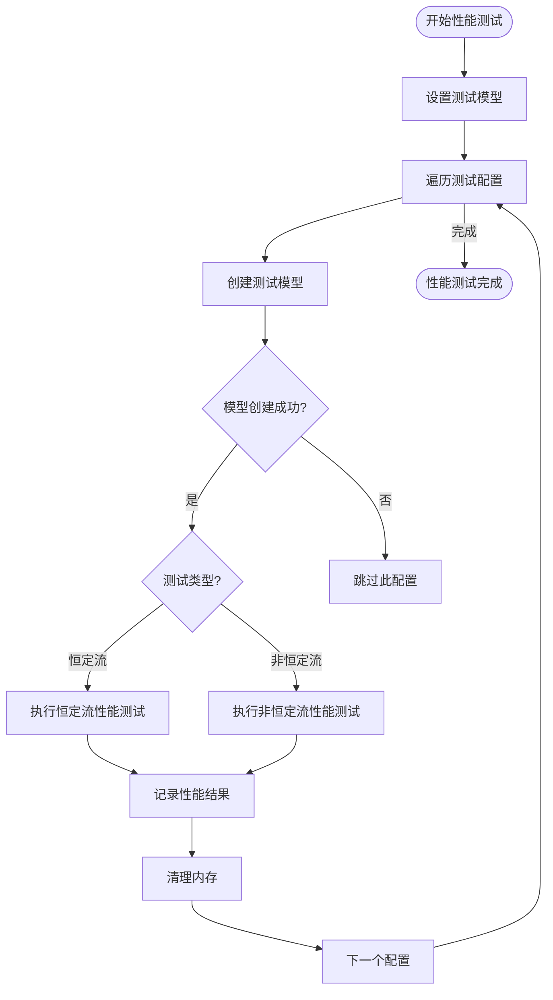
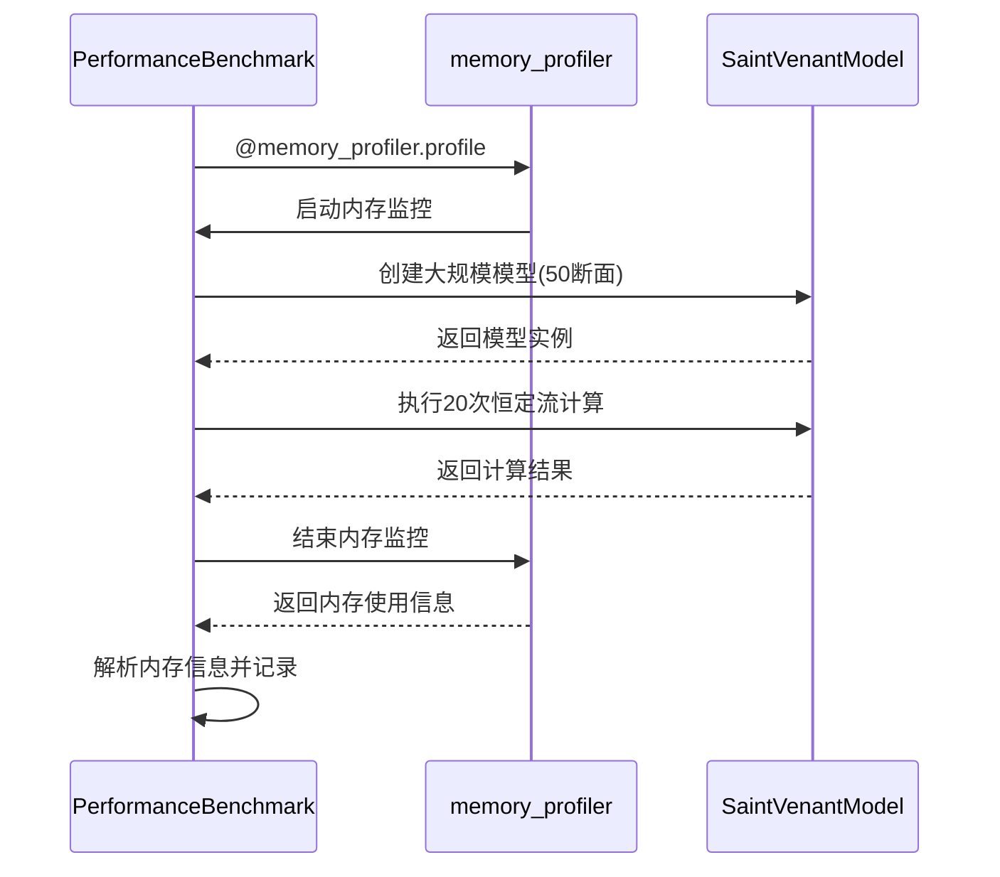
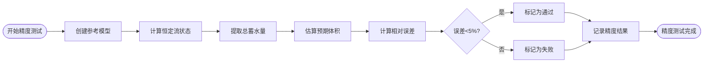
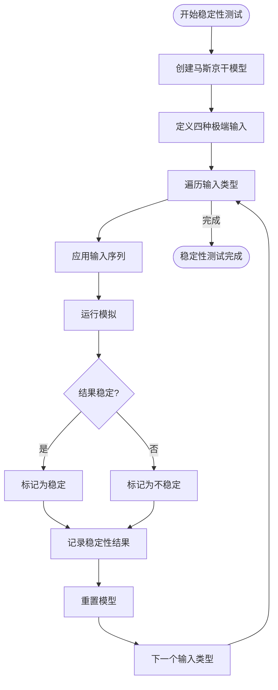
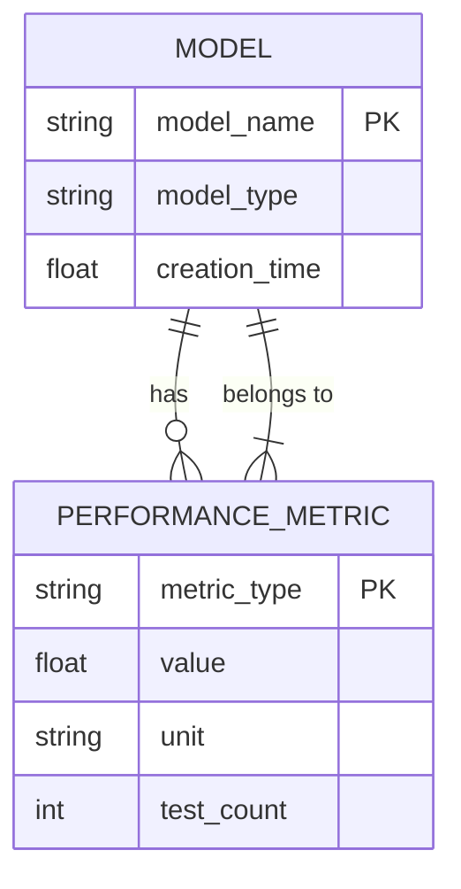

# 基准测试

<cite>
**本文档引用的文件**   
- [benchmark.py](file://scripts/benchmark.py)
- [benchmark_report.json](file://benchmark_results/benchmark_report.json)
- [saint_venant.py](file://waternet/models/saint_venant.py)
- [lumped_models.py](file://waternet/models/lumped_models.py)
- [standard_five_section.py](file://waternet/config/standard_five_section.py)
</cite>

## 目录
1. [引言](#引言)
2. [基准测试框架概述](#基准测试框架概述)
3. [性能基准测试](#性能基准测试)
4. [内存使用基准测试](#内存使用基准测试)
5. [计算精度基准测试](#计算精度基准测试)
6. [数值稳定性基准测试](#数值稳定性基准测试)
7. [基准测试报告分析](#基准测试报告分析)
8. [可视化分析](#可视化分析)
9. [扩展基准测试](#扩展基准测试)
10. [结论](#结论)

## 引言
WaterNet基准测试框架提供了一套全面的性能评估工具，用于测试水力模型的计算性能、内存使用、计算精度和数值稳定性。本文档详细介绍了如何使用`scripts/benchmark.py`中的`PerformanceBenchmark`类进行基准测试，解释`benchmark_report.json`中各项性能指标的含义，并指导开发者使用提供的可视化功能分析性能瓶颈。

**Section sources**
- [benchmark.py](file://scripts/benchmark.py#L1-L50)

## 基准测试框架概述
WaterNet基准测试框架的核心是`PerformanceBenchmark`类，该类提供了完整的基准测试功能。框架设计遵循模块化原则，将不同类型的测试分离为独立的方法，便于维护和扩展。

```mermaid
classDiagram
class PerformanceBenchmark {
+output_dir Path
+results Dict
+simple_sections List
+complex_sections List
+V_to_H_func Callable
+H_to_Q_func Callable
+__init__(output_dir)
+_setup_test_models()
+benchmark_model_performance()
+_create_test_model(config)
+_test_steady_performance(model, model_name)
+_test_unsteady_performance(model, model_name)
+benchmark_memory_usage()
+benchmark_accuracy()
+benchmark_stability()
+generate_report()
+_generate_summary()
+_generate_recommendations()
+_create_visualizations()
+_plot_performance_comparison()
+_plot_stability_results()
+_print_summary(summary)
}
PerformanceBenchmark --> "1" "1" SaintVenantModel : "使用"
PerformanceBenchmark --> "1" "1" MuskingumModel : "使用"
PerformanceBenchmark --> "1" "1" StorageRoutingModel : "使用"
```

**Diagram sources**
- [benchmark.py](file://scripts/benchmark.py#L44-L641)

**Section sources**
- [benchmark.py](file://scripts/benchmark.py#L44-L641)

## 性能基准测试
性能基准测试通过`benchmark_model_performance()`方法实现，测试多种模型在不同条件下的计算性能。测试包括恒定流和非恒定流两种模式，覆盖了从简单到复杂的多种模型配置。

### 测试配置
基准测试框架预定义了四种测试配置：

| 配置名称 | 模型类型 | 测试类型 | 主要参数 |
|---------|--------|--------|--------|
| SaintVenant_Simple | 圣维南模型 | 恒定流 | 简单渠道，2个断面 |
| SaintVenant_Complex | 圣维南模型 | 恒定流 | 复杂渠道，10个断面 |
| Muskingum_Fast | 马斯京干模型 | 非恒定流 | K=1800.0, x=0.2, dt=60.0 |
| StorageRouting_Standard | 蓄量演算模型 | 非恒定流 | dt=60.0, initial_V=10000.0 |

### 性能指标
性能测试收集以下关键指标：

- **平均计算时间**：单次计算的平均耗时（秒）
- **总计算时间**：所有测试的总耗时（秒）
- **最小/最大时间**：单次计算的最短和最长耗时
- **吞吐量**：单位时间内完成的计算次数（计算/秒）
- **成功率**：成功完成的测试比例



**Diagram sources**
- [benchmark.py](file://scripts/benchmark.py#L130-L260)

**Section sources**
- [benchmark.py](file://scripts/benchmark.py#L130-L260)
- [saint_venant.py](file://waternet/models/saint_venant.py#L250-L350)
- [lumped_models.py](file://waternet/models/lumped_models.py#L500-L600)

## 内存使用基准测试
内存使用基准测试通过`benchmark_memory_usage()`方法实现，用于评估模型在大规模计算时的内存消耗情况。该测试依赖于`memory_profiler`库，如果未安装则会跳过。

### 内存测试流程


**Diagram sources**
- [benchmark.py](file://scripts/benchmark.py#L262-L310)

**Section sources**
- [benchmark.py](file://scripts/benchmark.py#L262-L310)

## 计算精度基准测试
计算精度基准测试通过`benchmark_accuracy()`方法实现，主要评估模型的质量守恒特性。测试使用圣维南模型作为参考模型，检查计算结果的物理合理性。

### 精度测试指标
精度测试主要关注以下指标：

- **参考体积**：基于简化估算的预期蓄水量
- **计算体积**：模型实际计算得到的蓄水量
- **相对误差**：计算体积与参考体积的相对偏差
- **通过状态**：相对误差是否小于5%的阈值



**Diagram sources**
- [benchmark.py](file://scripts/benchmark.py#L312-L345)

**Section sources**
- [benchmark.py](file://scripts/benchmark.py#L312-L345)
- [saint_venant.py](file://waternet/models/saint_venant.py#L250-L350)

## 数值稳定性基准测试
数值稳定性基准测试通过`benchmark_stability()`方法实现，评估模型在极端输入条件下的稳定性表现。测试包括四种极端输入场景：

1. **极小流量**：0.1 m³/s的恒定输入
2. **极大流量**：100.0 m³/s的恒定输入
3. **随机噪声**：均值10.0、标准差5.0的正态分布噪声
4. **突变输入**：从5.0 m³/s突变到50.0 m³/s

### 稳定性评估标准
稳定性测试检查以下条件：

- 输出值是否全部为有限值（无NaN或Inf）
- 输出流量是否非负
- 输出流量是否在合理范围内（<1000 m³/s）



**Diagram sources**
- [benchmark.py](file://scripts/benchmark.py#L347-L400)

**Section sources**
- [benchmark.py](file://scripts/benchmark.py#L347-L400)
- [lumped_models.py](file://waternet/models/lumped_models.py#L600-L700)

## 基准测试报告分析
基准测试完成后，结果会保存在`benchmark_results/benchmark_report.json`文件中。报告包含摘要统计、详细结果和优化建议。

### 报告结构
```json
{
  "summary": {
    "performance": {
      "fastest_model": "SaintVenant_Simple",
      "highest_throughput": "Muskingum_Fast",
      "average_success_rate": 1.0
    },
    "accuracy": {
      "tests_passed": 0,
      "total_tests": 1,
      "pass_rate": 0.0
    },
    "stability": {
      "stable_tests": 4,
      "total_tests": 4,
      "stability_rate": 1.0
    }
  },
  "detailed_results": { ... },
  "recommendations": []
}
```

### 关键指标解释
| 指标 | 含义 | 计算方法 |
|------|------|---------|
| 平均计算时间 | 单次计算的平均耗时 | `sum(times) / n_tests` |
| 吞吐量 | 单位时间内的计算次数 | `n_tests / total_time` |
| 成功率 | 成功完成的测试比例 | `success_count / n_tests` |
| 稳定性率 | 稳定测试的比例 | `stable_tests / total_tests` |
| 精度通过率 | 通过精度测试的比例 | `tests_passed / total_tests` |

**Section sources**
- [benchmark.py](file://scripts/benchmark.py#L402-L470)
- [benchmark_report.json](file://benchmark_results/benchmark_report.json#L1-L120)

## 可视化分析
基准测试框架自动生成可视化图表，帮助开发者分析性能瓶颈。可视化功能由`_create_visualizations()`方法调用，生成两种主要图表。

### 性能对比图
性能对比图显示了各模型在四个维度上的表现：

1. **平均计算时间**：柱状图显示各模型的平均计算时间
2. **吞吐量**：柱状图显示各模型的计算吞吐量
3. **成功率**：柱状图显示各模型的成功率
4. **综合性能评分**：基于速度和成功率的简化评分



### 稳定性测试结果图
稳定性测试结果图显示了不同输入类型下的测试结果：

- **总测试数**：每种输入类型的测试总数
- **稳定测试数**：每种输入类型中稳定测试的数量
- **输入类型**：极小流量、极大流量、随机噪声、突变输入

**Section sources**
- [benchmark.py](file://scripts/benchmark.py#L472-L570)

## 扩展基准测试
开发者可以扩展基准测试框架，添加新的测试场景和性能指标。以下示例展示了如何添加新的测试配置。

### 添加新的测试场景
```python
def add_custom_test(self):
    """添加自定义测试场景"""
    custom_config = {
        'name': 'Custom_Model_Test',
        'model_type': 'custom_type',
        'params': {'param1': 1.0, 'param2': 2.0},
        'test_type': 'custom'
    }
    
    # 创建模型并测试
    model = self._create_test_model(custom_config)
    if model is not None:
        # 自定义测试逻辑
        custom_result = self._custom_performance_test(model)
        custom_result.update({
            'model_name': custom_config['name'],
            'model_type': custom_config['model_type']
        })
        self.results['custom_tests'].append(custom_result)
        
        del model
        gc.collect()
```

### 添加新的性能指标
```python
def _custom_performance_test(self, model):
    """自定义性能测试"""
    # 自定义测试逻辑
    start_time = time.time()
    # 执行自定义测试操作
    test_result = model.custom_operation()
    end_time = time.time()
    
    return {
        'custom_metric': test_result,
        'execution_time': end_time - start_time,
        'success': True
    }
```

**Section sources**
- [benchmark.py](file://scripts/benchmark.py#L130-L260)

## 结论
WaterNet基准测试框架提供了一套完整的性能评估工具，能够全面测试水力模型的计算性能、内存使用、计算精度和数值稳定性。通过`PerformanceBenchmark`类，开发者可以轻松运行基准测试，分析`benchmark_report.json`中的各项指标，并使用可视化功能识别性能瓶颈。框架设计具有良好的扩展性，允许开发者添加新的测试场景和性能指标，以满足特定的测试需求。