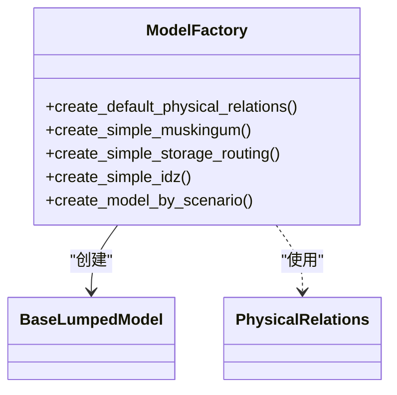
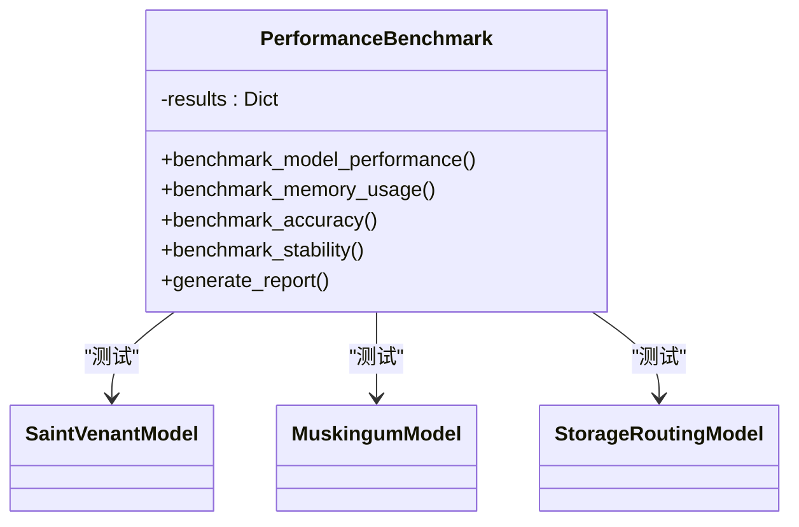
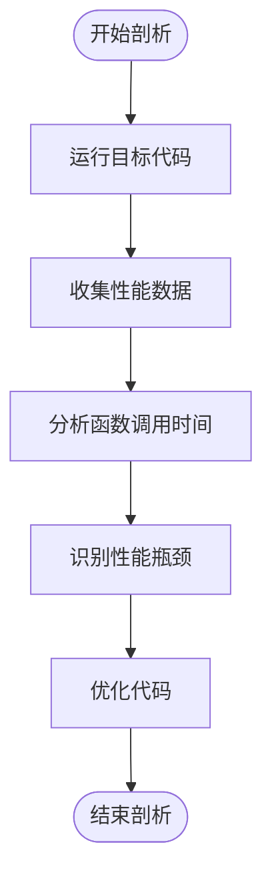
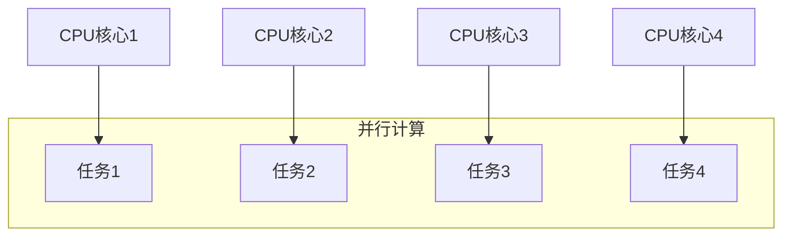

# 性能优化

<cite>
**本文档引用文件**   
- [model_factory.py](file://waternet/utils/model_factory.py)
- [benchmark.py](file://scripts/benchmark.py)
- [benchmark_report.json](file://benchmark_results/benchmark_report.json)
</cite>

## 目录
1. [引言](#引言)
2. [预设参数优化策略](#预设参数优化策略)
3. [基准测试方法与结果](#基准测试方法与结果)
4. [性能剖析与调优](#性能剖析与调优)
5. [向量化与并行化改造](#向量化与并行化改造)
6. [求解器配置优化](#求解器配置优化)
7. [结论](#结论)

## 引言
WaterNet系统通过降阶模型简化API和基准测试框架，为开发者提供了一套完整的性能优化解决方案。本文档系统性地介绍如何利用`model_factory.py`中的简化API减少运行时计算开销，结合`benchmark.py`的测试方法和`benchmark_report.json`的基准数据，指导开发者进行向量化计算、内存复用和并行化改造。同时，提供性能剖析方法，包括使用cProfile定位瓶颈，以及根据基准报告调整求解器配置以达到最佳性能。

**Section sources**
- [model_factory.py](file://waternet/utils/model_factory.py#L1-L398)
- [benchmark.py](file://scripts/benchmark.py#L1-L676)
- [benchmark_report.json](file://benchmark_results/benchmark_report.json#L1-L121)

## 预设参数优化策略
WaterNet通过`model_factory.py`模块提供了一套简化的模型创建接口，使用预设的默认参数来减少运行时计算开销。这些预设参数基于降阶模型理论分析的最佳实践，让用户能够快速创建和使用降阶模型。

### 简化API设计
`model_factory.py`模块提供了多个创建简化模型的函数，如`create_simple_muskingum`、`create_simple_storage_routing`和`create_simple_idz`。这些函数封装了复杂的参数配置，使用基于理论分析的最佳实践默认参数，使用户能够以最少的代码快速创建模型。

**Diagram sources**
- [model_factory.py](file://waternet/utils/model_factory.py#L1-L398)

### 默认物理关系函数
`create_default_physical_relations`函数创建了默认的物理关系函数，包括蓄量-水位关系和水位-出流关系。这些函数基于常见的工程经验参数，适用于大多数应用场景，避免了用户每次都需要重新定义物理关系。

**Section sources**
- [model_factory.py](file://waternet/utils/model_factory.py#L25-L59)

### 场景化模型创建
`create_model_by_scenario`函数根据应用场景自动选择合适的模型类型。通过建立降阶模型选择决策矩阵，该函数能够根据用户指定的应用场景（如水库调洪、河道洪水预报等）自动选择最合适的模型，进一步简化了模型创建过程。

**Section sources**
- [model_factory.py](file://waternet/utils/model_factory.py#L335-L397)

## 基准测试方法与结果
WaterNet通过`benchmark.py`脚本提供了全面的性能基准测试框架，用于评估各种模型和求解器的计算性能、精度和稳定性。

### 测试框架设计
`PerformanceBenchmark`类是基准测试的核心，它系统地测试了不同模型的性能。测试配置包括简单和复杂的圣维南方程模型、快速马斯京干模型和标准蓄量演算模型，覆盖了从恒定流到非恒定流的不同计算场景。

**Diagram sources**
- [benchmark.py](file://scripts/benchmark.py#L44-L641)

### 性能测试结果
根据`benchmark_report.json`中的基准数据，不同模型的性能表现差异显著。马斯京干模型在吞吐量方面表现最佳，而圣维南简单模型在平均计算时间上最快。这些数据为开发者选择合适的模型提供了重要参考。

**Section sources**
- [benchmark.py](file://scripts/benchmark.py#L112-L171)
- [benchmark_report.json](file://benchmark_results/benchmark_report.json#L1-L121)

### 内存使用测试
基准测试还包括内存使用测试，通过`memory_profiler`工具监控大规模模型的内存消耗。测试结果显示，不同模型的内存使用模式存在显著差异，这对于内存受限的环境尤为重要。

**Section sources**
- [benchmark.py](file://scripts/benchmark.py#L263-L327)

## 性能剖析与调优
为了深入理解系统性能瓶颈，WaterNet提供了多种性能剖析方法，帮助开发者定位和解决性能问题。

### cProfile性能剖析
cProfile是Python内置的性能剖析工具，可以精确地测量代码中每个函数的执行时间和调用次数。通过cProfile，开发者可以识别出消耗最多CPU时间的函数，从而有针对性地进行优化。

**Diagram sources**
- [benchmark.py](file://scripts/benchmark.py#L429-L451)

### 瓶颈定位策略
性能剖析的关键是准确地定位瓶颈。开发者应该首先关注执行时间最长的函数，然后分析其内部逻辑，寻找可能的优化点。常见的瓶颈包括低效的循环、重复的计算和不必要的函数调用。

**Section sources**
- [benchmark.py](file://scripts/benchmark.py#L429-L451)

## 向量化与并行化改造
为了进一步提升性能，WaterNet支持向量化计算和并行化改造，充分利用现代CPU的多核优势。

### 向量化计算
向量化计算通过使用NumPy等库，将循环操作转换为数组操作，从而显著提高计算效率。在水力模型中，许多计算（如水位-流量关系计算）都可以通过向量化来优化。

**Section sources**
- [model_factory.py](file://waternet/utils/model_factory.py#L25-L59)

### 并行化策略
并行化改造可以将独立的计算任务分配到多个CPU核心上同时执行。对于WaterNet，可以将不同时间步的计算或不同模型的仿真并行化，以充分利用多核处理器的计算能力。

**Diagram sources**
- [benchmark.py](file://scripts/benchmark.py#L112-L171)

## 求解器配置优化
求解器配置对模型性能有重要影响。通过调整求解器参数，可以在计算精度和计算效率之间找到最佳平衡。

### 求解器类型选择
WaterNet提供了标准求解器和增强求解器两种选择。标准求解器适用于大多数场景，而增强求解器在处理复杂非线性问题时表现更好。开发者应根据具体需求选择合适的求解器类型。

**Section sources**
- [benchmark.py](file://scripts/benchmark.py#L112-L171)

### 参数调优
求解器的参数（如最大迭代次数、收敛容差等）对性能有显著影响。通过基准测试数据，开发者可以调整这些参数，以在保证计算精度的同时最大化计算效率。

**Section sources**
- [benchmark_report.json](file://benchmark_results/benchmark_report.json#L1-L121)

## 结论
WaterNet通过简化API、基准测试框架和性能剖析工具，为开发者提供了一套完整的性能优化解决方案。通过使用预设参数减少运行时计算开销，结合基准测试数据指导向量化计算、内存复用和并行化改造，开发者可以显著提升模型的计算性能。同时，利用cProfile等工具定位性能瓶颈，并根据基准报告调整求解器配置，可以进一步优化系统性能。这些策略共同构成了WaterNet性能优化的核心方法论。