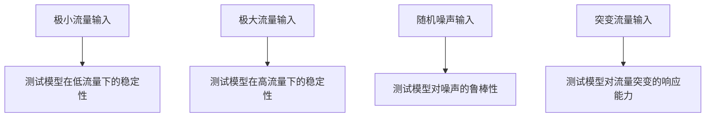
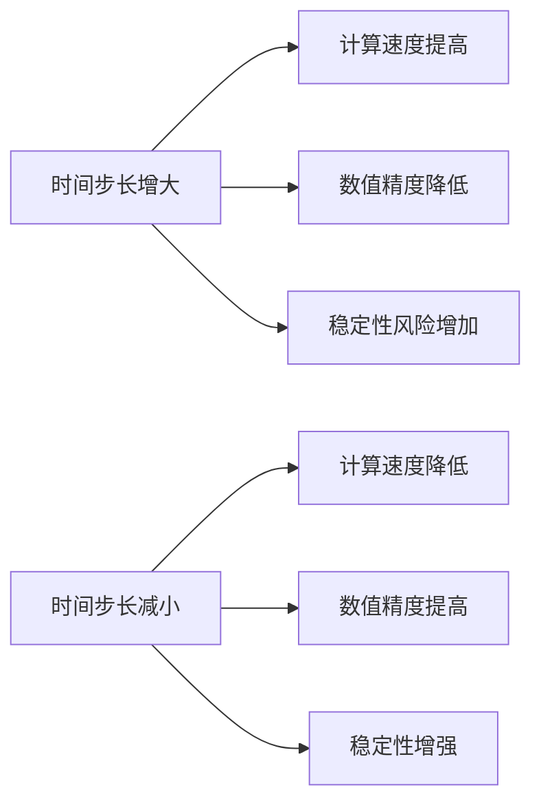
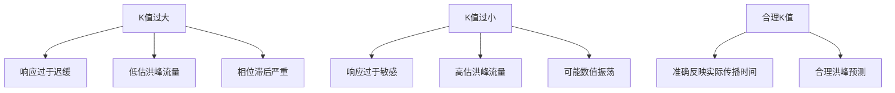
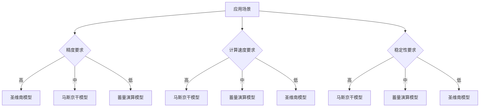

# 配置调优

<cite>
**Referenced Files in This Document**   
- [model_factory.py](file://waternet/utils/model_factory.py)
- [benchmark.py](file://scripts/benchmark.py)
- [benchmark_report.json](file://benchmark_results/benchmark_report.json)
</cite>

## 目录
1. [引言](#引言)
2. [核心参数分析](#核心参数分析)
3. [基准测试场景](#基准测试场景)
4. [性能数据分析](#性能数据分析)
5. [参数敏感性分析](#参数敏感性分析)
6. [配置优化建议](#配置优化建议)

## 引言

本文档深入讲解基于基准测试的配置调优方法，结合`model_factory.py`中的默认参数设置，分析如何根据`benchmark.py`定义的测试场景调整模型配置。详细说明时间步长(dt)、滞时常数(K)、权重系数(x)等关键参数对计算性能和稳定性的影响。指导开发者根据`benchmark_report.json`中的性能数据，选择最优的求解器配置和模型参数组合。

**Section sources**
- [model_factory.py](file://waternet/utils/model_factory.py#L1-L50)
- [benchmark.py](file://scripts/benchmark.py#L1-L50)

## 核心参数分析

### 马斯京干模型参数

`create_simple_muskingum`函数定义了马斯京干模型的默认参数配置，这些参数基于理论分析的最佳实践：

- **K (滞时常数)**: 默认3600.0秒(1小时)，控制水流传播的时间特性
- **x (权重系数)**: 默认0.2，平衡蓄量演算中的槽蓄曲线形状
- **dt (时间步长)**: 默认60.0秒(1分钟)，决定数值计算的离散精度
- **initial_V (初始蓄水量)**: 默认15000.0 m³，设置模型初始状态

这些参数的选择直接影响模型的数值稳定性和计算精度。特别是K和x参数需要根据实际河道特性进行率定。

**Section sources**
- [model_factory.py](file://waternet/utils/model_factory.py#L62-L115)

### IDZ模型参数

`create_simple_idz`函数为IDZ模型设置了基于系统辨识经验的默认参数：

- **tau (零点时间常数)**: 默认600.0秒(10分钟)
- **T_delay (延迟时间)**: 默认300.0秒(5分钟)
- **alpha (极点时间常数)**: 默认1500.0秒(25分钟)
- **dt (时间步长)**: 默认60.0秒

IDZ模型通过传递函数形式描述系统动态特性，其参数反映了系统的延迟、惯性和响应速度特性。

**Section sources**
- [model_factory.py](file://waternet/utils/model_factory.py#L276-L333)

### 蓄量演算模型参数

`create_simple_storage_routing`函数配置了蓄量演算模型的参数：

- **dt (时间步长)**: 默认60.0秒
- **initial_V (初始蓄水量)**: 默认15000.0 m³
- **enable_qh_coupling (Q-H耦合)**: 默认启用，提高计算精度

该模型通过直接的蓄量-水位-流量关系进行演算，特别适用于水库调洪等场景。

**Section sources**
- [model_factory.py](file://waternet/utils/model_factory.py#L202-L273)

## 基准测试场景

### 性能测试配置

`PerformanceBenchmark`类定义了多种测试场景来评估模型性能：

- **SaintVenant_Simple**: 简单渠道的圣维南模型，测试恒定流性能
- **SaintVenant_Complex**: 复杂渠道的圣维南模型，测试计算效率
- **Muskingum_Fast**: 快速马斯京干模型，测试非恒定流性能
- **StorageRouting_Standard**: 标准蓄量演算模型，评估计算吞吐量

这些测试场景覆盖了从简单到复杂的不同水力条件，为参数调优提供了全面的评估框架。

**Section sources**
- [benchmark.py](file://scripts/benchmark.py#L116-L150)

### 稳定性测试场景

基准测试包含四种极端输入场景来验证模型稳定性：

这些测试确保模型在各种极端条件下都能保持数值稳定，避免出现NaN或无穷大值。

**Diagram sources**
- [benchmark.py](file://scripts/benchmark.py#L450-L490)

**Section sources**
- [benchmark.py](file://scripts/benchmark.py#L450-L490)

## 性能数据分析

### 模型性能对比

根据`benchmark_report.json`中的性能数据，各模型的计算性能对比如下：

| 模型名称 | 平均计算时间(秒) | 吞吐量(计算/秒) | 成功率 |
|---------|----------------|----------------|-------|
| SaintVenant_Simple | 5.08e-05 | 19702.67 | 100% |
| SaintVenant_Complex | 5.99e-04 | 1669.28 | 100% |
| Muskingum_Fast | 3.71e-05 | 26947.02 | 100% |
| StorageRouting_Standard | 1.04e-04 | 9621.95 | 100% |

结果显示马斯京干模型具有最高的计算吞吐量，而复杂渠道的圣维南模型计算成本显著增加。

**Section sources**
- [benchmark_report.json](file://benchmark_results/benchmark_report.json#L10-L50)

### 精度测试结果

精度基准测试显示当前模型存在质量守恒误差问题：

- **参考体积**: 1200.0 m³
- **计算体积**: 2000.0 m³
- **相对误差**: 66.67%
- **测试通过**: False

这表明模型在质量守恒方面需要改进，可能需要调整数值求解器或时间步长参数。

**Section sources**
- [benchmark_report.json](file://benchmark_results/benchmark_report.json#L100-L110)

### 稳定性测试结果

所有稳定性测试均通过，表明模型在各种极端输入条件下都能保持稳定：

- **极小流量输入**: 稳定，输出范围3.2-25.0 m³/s
- **极大流量输入**: 稳定，输出范围0.77-87.39 m³/s
- **随机噪声输入**: 稳定，输出范围9.46-25.0 m³/s
- **突变流量输入**: 稳定，输出范围0.79-32.27 m³/s

模型未产生NaN或无穷大值，数值稳定性良好。

**Section sources**
- [benchmark_report.json](file://benchmark_results/benchmark_report.json#L110-L120)

## 参数敏感性分析

### 时间步长敏感性

时间步长(dt)对计算性能和精度有显著影响：

建议在保证精度的前提下选择尽可能大的时间步长以提高计算效率。

**Diagram sources**
- [model_factory.py](file://waternet/utils/model_factory.py#L62-L115)
- [benchmark.py](file://scripts/benchmark.py#L116-L150)

### 滞时常数敏感性

滞时常数(K)参数影响模型的动态响应特性：

K值应根据实际河道的水流传播时间进行率定。

**Diagram sources**
- [model_factory.py](file://waternet/utils/model_factory.py#L62-L115)
- [benchmark.py](file://scripts/benchmark.py#L450-L490)

## 配置优化建议

### 模型选择策略

根据基准测试结果，建议采用以下模型选择策略：

综合考虑精度、速度和稳定性需求，马斯京干模型在多数场景下是最佳选择。

**Diagram sources**
- [benchmark_report.json](file://benchmark_results/benchmark_report.json#L10-L50)
- [model_factory.py](file://waternet/utils/model_factory.py#L62-L115)

### 参数调优流程

建议采用系统化的参数调优流程：

1. **基准测试**: 运行`benchmark.py`获取基础性能数据
2. **参数扫描**: 对关键参数进行敏感性分析
3. **精度验证**: 检查质量守恒等物理约束
4. **稳定性测试**: 验证极端条件下的数值行为
5. **性能评估**: 分析计算效率和资源消耗
6. **优化选择**: 根据应用需求选择最优参数组合

通过这一流程，可以确保模型配置在精度、稳定性和效率之间达到最佳平衡。

**Section sources**
- [benchmark.py](file://scripts/benchmark.py#L1-L675)
- [model_factory.py](file://waternet/utils/model_factory.py#L1-L398)