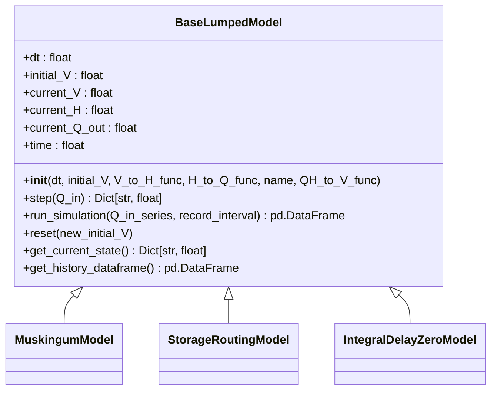
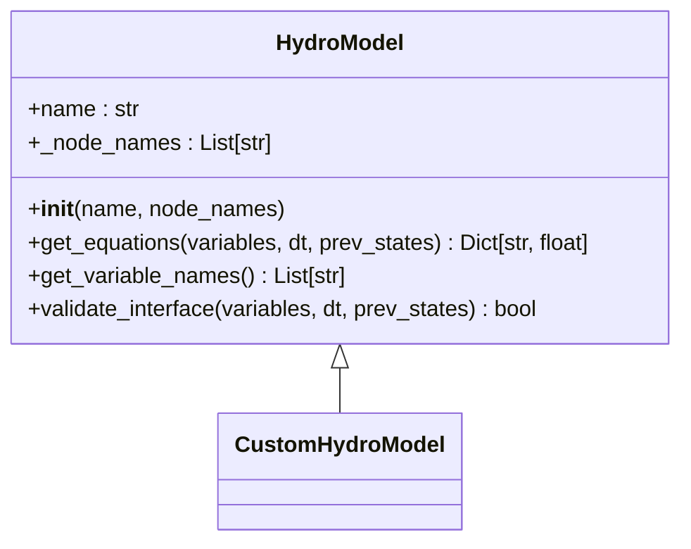
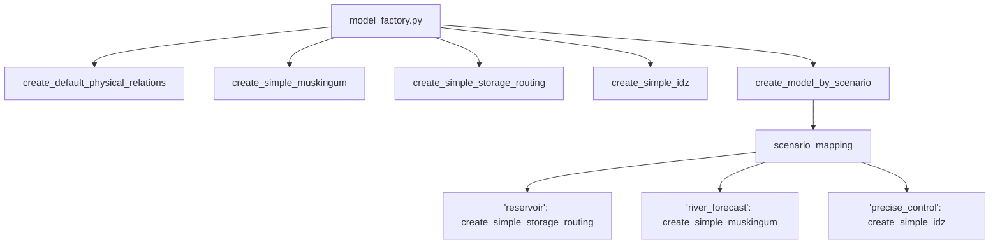
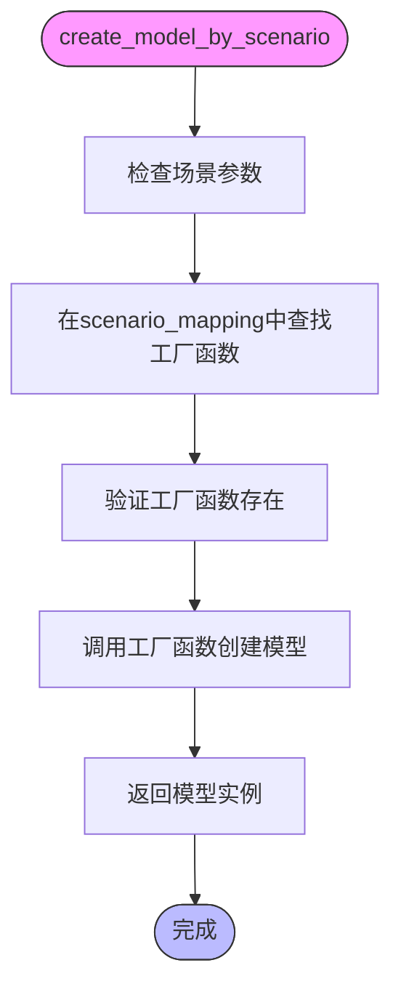

# 模型扩展

<cite>
**Referenced Files in This Document**  
- [lumped_models.py](file://waternet/models/lumped_models.py)
- [model_factory.py](file://waternet/utils/model_factory.py)
</cite>

## 目录
1. [引言](#引言)
2. [核心基类设计](#核心基类设计)
3. [自定义水力模型创建](#自定义水力模型创建)
4. [工厂模式集成](#工厂模式集成)
5. [场景化模型调用](#场景化模型调用)
6. [完整代码示例](#完整代码示例)
7. [结论](#结论)

## 引言

本文档详细阐述了如何通过继承 `BaseLumpedModel` 或 `HydroModel` 抽象基类来创建自定义水力模型。WaterNet 框架提供了灵活的扩展机制，允许开发者实现特定的水力算法，并通过工厂模式无缝集成到系统中。文档将结合 `lumped_models.py` 中的抽象基类设计，说明子类必须实现的核心方法，指导开发者如何在 `model_factory.py` 中注册新模型，并提供完整的代码示例。

## 核心基类设计

WaterNet 框架通过抽象基类为水力模型提供了统一的接口和规范。主要包含两个核心基类：`BaseLumpedModel` 用于集总参数降阶模型，`HydroModel` 用于紧耦合水力模型。

### BaseLumpedModel 基类

`BaseLumpedModel` 是所有集总参数降阶模型的抽象基类，定义了统一的仿真接口和通用功能。



**Diagram sources**  
- [lumped_models.py](file://waternet/models/lumped_models.py#L30-L515)

**Section sources**  
- [lumped_models.py](file://waternet/models/lumped_models.py#L30-L515)

### HydroModel 基类

`HydroModel` 是所有紧耦合水力模型的基础接口，定义了联合求解场景下的统一交互规范。



**Diagram sources**  
- [hydro_model.py](file://waternet/interfaces/hydro_model.py#L25-L198)

**Section sources**  
- [hydro_model.py](file://waternet/interfaces/hydro_model.py#L25-L198)

## 自定义水力模型创建

要创建自定义水力模型，开发者需要继承相应的基类并实现其抽象方法。

### 继承 BaseLumpedModel

当创建集总参数模型时，应继承 `BaseLumpedModel` 并实现 `step()` 方法。

```mermaid
flowchart TD
Start([开始 step()]) --> ValidateInput["验证输入参数"]
ValidateInput --> CalculateNewState["计算新状态"]
CalculateNewState --> UpdateStates["调用_update_physical_states()"]
UpdateStates --> RecordState["调用_record_state()"]
RecordState --> ReturnResult["返回结果字典"]
ReturnResult --> End([结束])
```

**Diagram sources**  
- [lumped_models.py](file://waternet/models/lumped_models.py#L211-L234)

**Section sources**  
- [lumped_models.py](file://waternet/models/lumped_models.py#L211-L234)

#### 必须实现的 step() 方法

`step()` 方法是模型的核心仿真逻辑，每个子类必须实现：

- **参数**: `Q_in` (float) - 当前时步的入流量（m³/s）
- **返回值**: `Dict[str, float]` - 仿真结果字典，至少包含：
  - `'Q_out'`: 出流量（m³/s）
  - `'H_out'`: 出口水位（m）
  - `'V'`: 蓄水量（m³）
  - `'time'`: 当前时间（s）
- **要求**: 子类实现时应调用 `_update_physical_states()` 来更新物理状态

### 继承 HydroModel

当创建需要联合求解的紧耦合模型时，应继承 `HydroModel` 并实现 `get_equations()` 方法。

#### 必须实现的 get_equations() 方法

`get_equations()` 方法用于计算模型在当前变量值下的方程残差：

- **参数**:
  - `variables`: 当前时步的所有变量值
  - `dt`: 时间步长（秒）
  - `prev_states`: 上一时步的状态值
- **返回值**: `Dict[str, float]` - 方程残差字典
- **要求**: 残差的数量应等于模型引入的未知变量数量

**Section sources**  
- [hydro_model.py](file://waternet/interfaces/hydro_model.py#L77-L116)

## 工厂模式集成

WaterNet 框架通过工厂模式实现了模型的无缝集成。开发者可以在 `model_factory.py` 中注册新模型，使其能够被系统统一管理和调用。

### model_factory.py 结构

`model_factory.py` 文件提供了简化的模型创建接口和工厂函数。



**Diagram sources**  
- [model_factory.py](file://waternet/utils/model_factory.py#L0-L397)

**Section sources**  
- [model_factory.py](file://waternet/utils/model_factory.py#L0-L397)

### 注册新模型

要将新模型集成到工厂模式中，需要在 `scenario_mapping` 字典中添加新的场景映射：

```python
scenario_mapping = {
    'reservoir': create_simple_storage_routing,
    'river_forecast': create_simple_muskingum,
    'precise_control': create_simple_idz,
    # 添加新模型映射
    'custom_scenario': create_custom_model_function
}
```

## 场景化模型调用

框架提供了 `create_model_by_scenario()` 函数，可以根据应用场景自动创建合适的模型。

### create_model_by_scenario 实现

该函数基于降阶模型选择决策矩阵自动选择模型类型。



**Diagram sources**  
- [model_factory.py](file://waternet/utils/model_factory.py#L350-L387)

**Section sources**  
- [model_factory.py](file://waternet/utils/model_factory.py#L350-L387)

### 支持的场景

目前支持的场景包括：
- `'reservoir'`: 水库调洪演算 → 蓄量演算模型
- `'river_forecast'`: 河道洪水预报 → 马斯京干模型
- `'precise_control'`: 精细控制分析 → IDZ模型
- `'quick_estimate'`: 快速工程估算 → 水量平衡模型

## 完整代码示例

以下是一个完整的自定义水力模型实现示例：

```python
from abc import ABC, abstractmethod
from typing import Dict, Callable
from waternet.models.lumped_models import BaseLumpedModel

class CustomHydroModel(BaseLumpedModel):
    """
    自定义水力模型示例
    """
    
    def __init__(self, dt: float, initial_V: float,
                 V_to_H_func: Callable[[float], float],
                 H_to_Q_func: Callable[[float], float],
                 custom_param: float = 1.0,
                 name: str = "CustomModel"):
        """
        初始化自定义模型
        """
        super().__init__(dt, initial_V, V_to_H_func, H_to_Q_func, name)
        self.custom_param = custom_param
    
    def step(self, Q_in: float) -> Dict[str, float]:
        """
        实现核心仿真逻辑
        """
        # 自定义算法逻辑
        Q_out = Q_in * self.custom_param
        
        # 更新物理状态
        self._update_physical_states(Q_in, Q_out)
        self.current_Q_out = Q_out
        
        # 记录状态
        self._record_state(Q_in)
        
        return {
            'Q_out': Q_out,
            'H_out': self.current_H,
            'V': self.current_V,
            'time': self.time,
            'custom_param': self.custom_param
        }
```

**Section sources**  
- [lumped_models.py](file://waternet/models/lumped_models.py#L30-L515)

## 结论

通过继承 `BaseLumpedModel` 或 `HydroModel` 抽象基类，开发者可以轻松创建自定义水力模型。框架提供的工厂模式和场景化调用机制使得新模型能够无缝集成到系统中。开发者只需实现核心的 `step()` 或 `get_equations()` 方法，并在 `model_factory.py` 中注册新模型，即可完成扩展。这种设计模式保证了代码的可维护性和扩展性，为水力模型的开发提供了强大的支持。