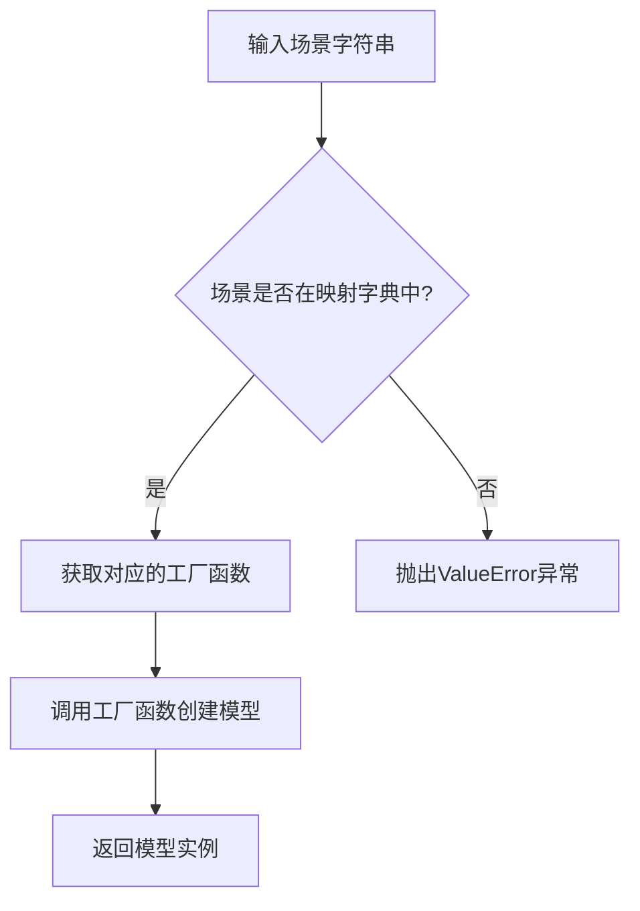
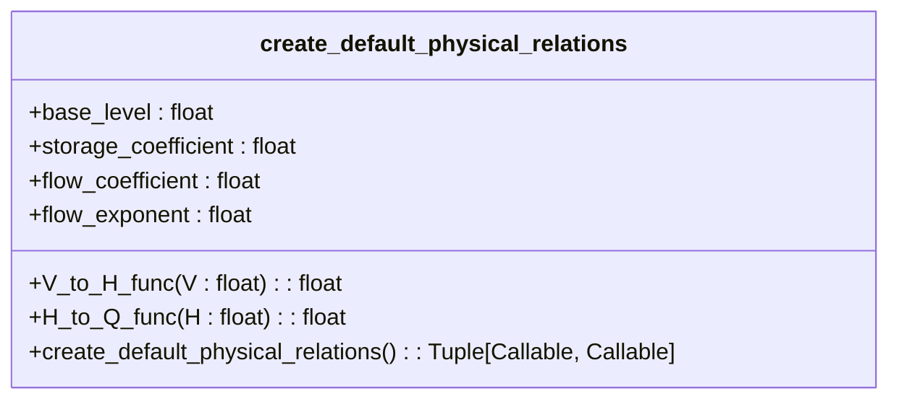

# 模型注册

<cite>
**Referenced Files in This Document**   
- [model_factory.py](file://waternet/utils/model_factory.py)
- [lumped_models.py](file://waternet/models/lumped_models.py)
- [quick_start_simplified.py](file://examples/quick_start_simplified.py)
</cite>

## 目录
1. [简介](#简介)
2. [核心组件](#核心组件)
3. [工厂模式集成](#工厂模式集成)
4. [场景映射机制](#场景映射机制)
5. [辅助函数使用](#辅助函数使用)
6. [完整代码示例](#完整代码示例)
7. [参数传递最佳实践](#参数传递最佳实践)

## 简介

本指南详细说明了如何在WaterNet系统中通过`model_factory.py`文件注册和使用自定义模型。文档重点介绍了工厂模式的实现机制，包括`create_model_by_scenario()`函数的场景映射逻辑、`create_default_physical_relations()`等辅助函数的使用方式，以及如何为新模型设计默认参数和物理关系函数。

WaterNet系统采用工厂模式来简化模型创建过程，通过预设的默认参数和便捷的API接口，使开发者能够快速创建和使用各种降阶水力模型。该模式不仅提高了开发效率，还确保了模型配置的一致性和可靠性。

## 核心组件

`model_factory.py`文件是WaterNet系统中模型创建的核心组件，它提供了多个工厂函数来简化模型的实例化过程。这些函数基于降阶模型理论分析的最佳实践参数，让用户能够快速创建和使用各种水力模型。

该模块通过一系列`create_simple_xxx`函数（如`create_simple_muskingum`、`create_simple_storage_routing`等）为不同类型的模型提供简化的创建接口。每个函数都封装了模型创建所需的复杂参数，并提供了合理的默认值，大大降低了使用门槛。

**Section sources**
- [model_factory.py](file://waternet/utils/model_factory.py#L1-L397)

## 工厂模式集成

### 注册新模型

要在`model_factory.py`中注册新创建的自定义模型，需要遵循以下步骤：

1. **定义工厂函数**：创建一个新的工厂函数，该函数封装了自定义模型的创建逻辑。
2. **设置默认参数**：为新模型定义合理的默认参数，这些参数应基于领域知识和最佳实践。
3. **集成到工厂**：将新工厂函数添加到模块的公共接口中。

例如，要注册一个新的自定义模型，可以按照以下模式：

```python
def create_simple_custom_model(
    custom_param: Optional[float] = None,
    dt: Optional[float] = None,
    initial_V: Optional[float] = None,
    V_to_H_func: Optional[Callable[[float], float]] = None,
    H_to_Q_func: Optional[Callable[[float], float]] = None,
    name: str = "SimpleCustomModel"
) -> CustomModel:
    """
    创建简化的自定义模型
    
    使用基于领域知识的最佳实践默认参数。
    
    Args:
        custom_param (Optional[float]): 自定义参数，默认值
        dt (Optional[float]): 时间步长 (秒)，默认60.0
        initial_V (Optional[float]): 初始蓄水量 (m³)，默认15000.0
        V_to_H_func (Optional[Callable]): 蓄量-水位函数
        H_to_Q_func (Optional[Callable]): 水位-出流函数
        name (str): 模型名称
        
    Returns:
        CustomModel: 配置好的自定义模型
    """
    # 使用默认参数
    custom_param = custom_param if custom_param is not None else 1.0
    dt = dt if dt is not None else 60.0
    initial_V = initial_V if initial_V is not None else 15000.0
    
    # 创建默认物理关系函数
    if V_to_H_func is None or H_to_Q_func is None:
        default_V_to_H, default_H_to_Q = create_default_physical_relations()
        V_to_H_func = V_to_H_func or default_V_to_H
        H_to_Q_func = H_to_Q_func or default_H_to_Q
    
    return CustomModel(
        dt=dt,
        custom_param=custom_param,
        initial_V=initial_V,
        V_to_H_func=V_to_H_func,
        H_to_Q_func=H_to_Q_func,
        name=name
    )
```

4. **更新模块接口**：在文件末尾添加便捷别名，以便用户快速访问：

```python
# 便捷别名
quick_custom = create_simple_custom_model
```

这种设计模式确保了新模型能够无缝集成到现有的工厂模式中，同时保持了API的一致性和易用性。

**Section sources**
- [model_factory.py](file://waternet/utils/model_factory.py#L62-L397)

## 场景映射机制

### create_model_by_scenario() 函数

`create_model_by_scenario()`函数是WaterNet系统中基于应用场景自动选择模型的核心机制。该函数通过一个预定义的场景映射字典`scenario_mapping`，将不同的应用场景映射到相应的模型创建函数。



**Diagram sources**
- [model_factory.py](file://waternet/utils/model_factory.py#L336-L390)

### 扩展 scenario_mapping 字典

要支持新的模型类型，可以通过扩展`scenario_mapping`字典来实现。该字典将场景字符串映射到相应的工厂函数。

```python
scenario_mapping = {
    'reservoir': create_simple_storage_routing,
    'water_reservoir': create_simple_storage_routing,
    'storage': create_simple_storage_routing,
    
    'river_forecast': create_simple_muskingum,
    'river': create_simple_muskingum,
    'flood_forecast': create_simple_muskingum,
    'muskingum': create_simple_muskingum,
    
    'precise_control': create_simple_idz,
    'control': create_simple_idz,
    'idz': create_simple_idz,
    
    'quick_estimate': lambda **kw: None,
    'balance': lambda **kw: None,
    
    # 新增自定义模型场景
    'custom_scenario': create_simple_custom_model,
    'special_case': create_simple_custom_model
}
```

当调用`create_model_by_scenario('custom_scenario')`时，系统会自动选择`create_simple_custom_model`工厂函数来创建模型。这种设计使得模型选择逻辑与模型创建逻辑分离，提高了代码的可维护性和扩展性。

**Section sources**
- [model_factory.py](file://waternet/utils/model_factory.py#L336-L390)

## 辅助函数使用

### create_default_physical_relations() 函数

`create_default_physical_relations()`函数用于创建默认的物理关系函数，这些函数基于常见的工程经验参数，适用于大多数应用场景。



**Diagram sources**
- [model_factory.py](file://waternet/utils/model_factory.py#L25-L59)

该函数返回两个嵌套函数：
- `V_to_H_func`: 蓄量-水位关系函数，计算公式为 `H = base_level + V * storage_coefficient`
- `H_to_Q_func`: 水位-出流关系函数，计算公式为 `Q = flow_coefficient * (H - base_level)^flow_exponent`

这些默认的物理关系函数可以在各种模型创建函数中复用，确保了物理关系的一致性。

### 为新模型设计默认参数

为新模型设计默认参数时，应考虑以下最佳实践：

1. **基于领域知识**：参数值应基于实际工程经验和理论分析。
2. **提供合理默认值**：为所有关键参数提供合理的默认值，减少用户配置负担。
3. **保持一致性**：与其他模型的默认参数保持一致，便于用户理解和使用。

例如，在创建新模型时，可以参考现有模型的参数设计：

```python
def create_simple_custom_model(
    # ... 其他参数
):
    # 使用与现有模型一致的默认时间步长和初始蓄水量
    dt = dt if dt is not None else 60.0         # 1分钟时间步长
    initial_V = initial_V if initial_V is not None else 15000.0  # 设计工况蓄量
    
    # 创建默认物理关系函数
    if V_to_H_func is None or H_to_Q_func is None:
        default_V_to_H, default_H_to_Q = create_default_physical_relations()
        V_to_H_func = V_to_H_func or default_V_to_H
        H_to_Q_func = H_to_Q_func or default_H_to_Q
```

**Section sources**
- [model_factory.py](file://waternet/utils/model_factory.py#L25-L59)

## 完整代码示例

以下是一个完整的代码示例，展示了从定义工厂函数到注册便捷别名的全过程：

```python
def create_simple_custom_model(
    custom_param: Optional[float] = None,
    dt: Optional[float] = None,
    initial_V: Optional[float] = None,
    V_to_H_func: Optional[Callable[[float], float]] = None,
    H_to_Q_func: Optional[Callable[[float], float]] = None,
    name: str = "SimpleCustomModel"
) -> CustomModel:
    """
    创建简化的自定义模型
    
    使用基于领域知识的最佳实践默认参数。
    
    Args:
        custom_param (Optional[float]): 自定义参数，默认1.0
        dt (Optional[float]): 时间步长 (秒)，默认60.0
        initial_V (Optional[float]): 初始蓄水量 (m³)，默认15000.0
        V_to_H_func (Optional[Callable]): 蓄量-水位函数
        H_to_Q_func (Optional[Callable]): 水位-出流函数
        name (str): 模型名称
        
    Returns:
        CustomModel: 配置好的自定义模型
    """
    # 使用默认参数
    custom_param = custom_param if custom_param is not None else 1.0
    dt = dt if dt is not None else 60.0
    initial_V = initial_V if initial_V is not None else 15000.0
    
    # 创建默认物理关系函数
    if V_to_H_func is None or H_to_Q_func is None:
        default_V_to_H, default_H_to_Q = create_default_physical_relations()
        V_to_H_func = V_to_H_func or default_V_to_H
        H_to_Q_func = H_to_Q_func or default_H_to_Q
    
    return CustomModel(
        dt=dt,
        custom_param=custom_param,
        initial_V=initial_V,
        V_to_H_func=V_to_H_func,
        H_to_Q_func=H_to_Q_func,
        name=name
    )

# 扩展场景映射字典以支持新模型
scenario_mapping = {
    # ... 现有映射
    'custom_scenario': create_simple_custom_model,
    'special_case': create_simple_custom_model
}

# 注册便捷别名
quick_custom = create_simple_custom_model
auto_model = create_model_by_scenario
```

这个示例展示了如何将新模型无缝集成到现有的工厂模式中，同时保持了API的一致性和易用性。

**Section sources**
- [model_factory.py](file://waternet/utils/model_factory.py#L1-L397)

## 参数传递最佳实践

在使用工厂模式时，应遵循以下参数传递和默认值处理的最佳实践：

### 1. 参数验证

在工厂函数中进行充分的参数验证，确保输入参数的合理性和有效性：

```python
def create_simple_custom_model(
    custom_param: Optional[float] = None,
    # ... 其他参数
):
    # 参数验证
    if custom_param is not None and custom_param <= 0:
        raise ValueError(f"自定义参数必须为正值，得到: {custom_param}")
    
    # ... 其他验证逻辑
```

### 2. 默认值处理

采用Python中常见的`None`检查模式来处理可选参数的默认值：

```python
# 正确的做法
custom_param = custom_param if custom_param is not None else 1.0
dt = dt if dt is not None else 60.0

# 避免使用这种模式（可能导致意外行为）
# custom_param = custom_param or 1.0
```

### 3. 参数继承

当新模型基于现有模型构建时，应继承其参数设计模式，保持API的一致性：

```python
# 继承现有模型的参数命名和默认值
def create_simple_custom_model(
    dt: Optional[float] = None,           # 与现有模型一致
    initial_V: Optional[float] = None,    # 与现有模型一致
    # ... 新增特定参数
):
    dt = dt if dt is not None else 60.0
    initial_V = initial_V if initial_V is not None else 15000.0
```

### 4. 文档化

为每个工厂函数提供详细的文档字符串，说明参数含义、默认值和使用示例：

```python
def create_simple_custom_model(
    custom_param: Optional[float] = None,
    dt: Optional[float] = None,
    initial_V: Optional[float] = None,
    V_to_H_func: Optional[Callable[[float], float]] = None,
    H_to_Q_func: Optional[Callable[[float], float]] = None,
    name: str = "SimpleCustomModel"
) -> CustomModel:
    """
    创建简化的自定义模型
    
    使用基于领域知识的最佳实践默认参数。
    
    Args:
        custom_param (Optional[float]): 自定义参数，默认1.0
        dt (Optional[float]): 时间步长 (秒)，默认60.0
        initial_V (Optional[float]): 初始蓄水量 (m³)，默认15000.0
        V_to_H_func (Optional[Callable]): 蓄量-水位函数
        H_to_Q_func (Optional[Callable]): 水位-出流函数
        name (str): 模型名称
        
    Returns:
        CustomModel: 配置好的自定义模型
        
    Example:
        >>> # 最简单的使用方式
        >>> model = create_simple_custom_model()
        >>> 
        >>> # 自定义部分参数
        >>> model = create_simple_custom_model(custom_param=2.0)
    """
    # 函数实现
```

这些最佳实践确保了工厂模式的健壮性、一致性和易用性，使开发者能够轻松地创建和使用各种水力模型。

**Section sources**
- [model_factory.py](file://waternet/utils/model_factory.py#L1-L397)