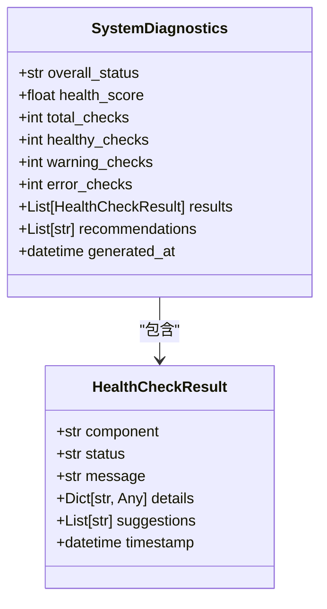
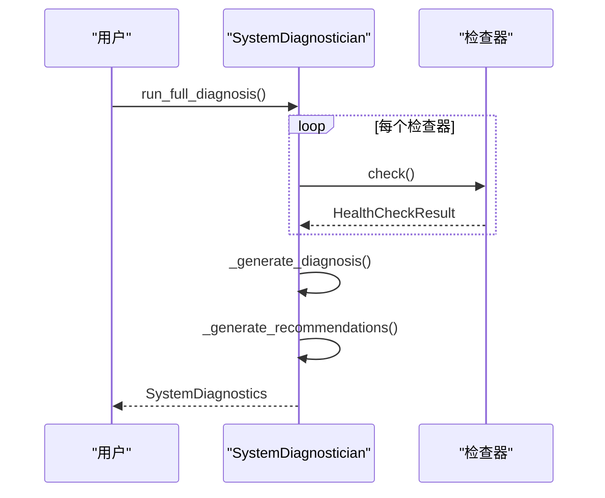

# 生产环境部署

<cite>
**本文档引用文件**  
- [health_checker.py](file://scripts/health_checker.py)
- [requirements.txt](file://requirements.txt)
</cite>

## 目录
1. [引言](#引言)
2. [核心数据结构](#核心数据结构)
3. [检查器实现分析](#检查器实现分析)
4. [系统诊断协调机制](#系统诊断协调机制)
5. [报告生成与保存](#报告生成与保存)
6. [实际应用场景](#实际应用场景)

## 引言
`health_checker.py` 是 WaterNet 系统的健康检查和诊断工具，作为生产环境部署的关键保障。该工具提供全方位的系统诊断功能，包括 Python 环境检查、依赖包完整性验证、项目结构检查、性能基准测试、系统资源监控以及自动问题诊断和修复建议。通过运行健康检查，用户可以在部署前验证系统环境的完整性，根据诊断报告的建议进行环境修复，并通过 JSON 输出实现自动化集成。

**Section sources**
- [health_checker.py](file://scripts/health_checker.py#L0-L49)

## 核心数据结构
`HealthCheckResult` 和 `SystemDiagnostics` 是健康检查系统的核心数据类，用于结构化地表示检查结果和诊断报告。

### HealthCheckResult 数据类
`HealthCheckResult` 类用于表示单个健康检查项的结果，包含以下字段：
- `component`: 检查项名称
- `status`: 检查状态，可取值为 'healthy'（健康）、'warning'（警告）、'error'（错误）
- `message`: 检查结果的简要描述
- `details`: 包含详细信息的字典
- `suggestions`: 修复建议列表
- `timestamp`: 检查时间戳

### SystemDiagnostics 数据类
`SystemDiagnostics` 类用于表示完整的系统诊断报告，包含以下字段：
- `overall_status`: 整体状态，可取值为 'unknown'、'critical'、'warning'、'healthy'
- `health_score`: 健康评分，基于健康和警告检查项计算得出
- `total_checks`: 总检查项数
- `healthy_checks`: 健康检查项数
- `warning_checks`: 警告检查项数
- `error_checks`: 错误检查项数
- `results`: `HealthCheckResult` 对象列表
- `recommendations`: 综合修复建议列表
- `generated_at`: 报告生成时间戳

**Diagram sources**
- [health_checker.py](file://scripts/health_checker.py#L28-L49)

## 检查器实现分析
`health_checker.py` 实现了多个具体的检查器类，每个检查器负责检查系统的一个特定方面。

### PythonEnvironmentChecker
`PythonEnvironmentChecker` 负责检查 Python 环境的兼容性。它获取 Python 版本信息，并根据版本号判断环境状态：
- 如果版本低于 3.7，则返回 'error' 状态，并建议升级到 Python 3.7 或更高版本
- 如果版本为 3.7 或 3.8，但低于 3.8，则返回 'warning' 状态，并建议升级到 Python 3.8 或更高版本以获得更好的性能
- 如果版本为 3.8 或更高，则返回 'healthy' 状态

**Section sources**
- [health_checker.py](file://scripts/health_checker.py#L75-L122)

### DependencyChecker
`DependencyChecker` 负责检查项目依赖包的完整性。它检查以下核心包是否已安装：`numpy`、`pandas`、`matplotlib`、`scipy`。检查逻辑如下：
- 遍历 `required_packages` 列表，尝试导入每个包，记录已安装和缺失的包
- 使用 `pip check` 命令检查包冲突
- 如果有缺失的包，则返回 'error' 状态，并提供安装缺失包的命令建议
- 如果有包冲突，则返回 'warning' 状态，并建议解决包冲突
- 如果所有包都正常，则返回 'healthy' 状态

**Section sources**
- [health_checker.py](file://scripts/health_checker.py#L125-L191)
- [requirements.txt](file://requirements.txt#L1-L8)

### ProjectStructureChecker
`ProjectStructureChecker` 负责检查项目结构的完整性。它检查以下必需路径是否存在：`waternet/__init__.py`、`waternet/models/__init__.py`、`examples/interval_optimization/`、`setup.py`、`README.md`，以及以下重要文件是否存在：`examples/interval_optimization/application_examples.py`、`examples/interval_optimization/correct_workflow_comparison.py`。检查逻辑如下：
- 如果有必需路径缺失，则返回 'error' 状态，并建议恢复缺失的核心文件和目录
- 如果有重要文件缺失，则返回 'warning' 状态，并建议恢复重要的示例文件
- 如果所有必需路径和重要文件都存在，则返回 'healthy' 状态

**Section sources**
- [health_checker.py](file://scripts/health_checker.py#L194-L268)

### WaterNetModuleChecker
`WaterNetModuleChecker` 负责检查 WaterNet 模块的导入情况。它测试以下模块的导入：`waternet`、`waternet.models`、`waternet.models.SolverFactory`。检查逻辑如下：
- 如果基础模块 `waternet` 无法导入，则返回 'error' 状态，并建议重新安装 WaterNet
- 如果部分核心模块导入失败，则返回 'warning' 状态，并列出失败的模块
- 如果所有核心模块导入正常，则返回 'healthy' 状态

**Section sources**
- [health_checker.py](file://scripts/health_checker.py#L271-L353)

### PerformanceChecker
`PerformanceChecker` 负责检查系统性能。它执行以下性能测试：
- 测试 `waternet` 模块的导入时间，如果超过 1000 毫秒，则返回 'warning' 状态
- 使用 `psutil` 库检查 CPU 使用率、内存使用率和磁盘可用空间，如果内存使用率超过 80% 或磁盘可用空间少于 0.5GB，则返回 'warning' 状态
- 执行一个简单的计算性能测试（计算 0 到 9999 的平方和）

**Section sources**
- [health_checker.py](file://scripts/health_checker.py#L356-L433)

## 系统诊断协调机制
`SystemDiagnostician` 类负责协调各个检查器运行完整诊断，并根据检查结果生成健康评分和修复建议。

### 检查器初始化
`SystemDiagnostician` 在初始化时创建并存储以下检查器实例：
- `PythonEnvironmentChecker`
- `DependencyChecker`
- `ProjectStructureChecker`
- `WaterNetModuleChecker`
- `PerformanceChecker`

### 运行完整诊断
`run_full_diagnosis` 方法按顺序执行所有检查器的 `check` 方法，并收集检查结果。对于每个检查器，它会打印检查进度和结果。如果某个检查器在执行过程中抛出异常，则会创建一个 'error' 状态的 `HealthCheckResult`。

### 生成诊断报告
`_generate_diagnosis` 方法根据检查结果生成 `SystemDiagnostics` 对象。它计算健康评分的公式为：`(healthy_checks * 100 + warning_checks * 60) / total_checks`。整体状态的确定规则如下：
- 如果有错误检查项，则整体状态为 'critical'
- 如果没有错误检查项但有警告检查项，则整体状态为 'warning'
- 如果没有错误和警告检查项，则整体状态为 'healthy'

### 生成修复建议
`_generate_recommendations` 方法收集所有检查结果中的建议，并按优先级排序。优先级顺序为：升级 Python 环境、安装依赖包、修复安装问题、检查系统配置。剩余的建议归类为“其他建议”。

**Diagram sources**
- [health_checker.py](file://scripts/health_checker.py#L436-L557)

## 报告生成与保存
`SystemDiagnostician` 提供了 `generate_report` 和 `save_report` 方法，用于生成和保存诊断报告。

### generate_report
`generate_report` 方法将 `SystemDiagnostics` 对象格式化为一个详细的文本报告，包含以下部分：
- 生成时间和项目路径
- 总体评估（健康评分、整体状态、检查项统计）
- 详细结果（每个检查项的状态、消息和建议）
- 修复建议（按类别组织的综合建议）

### save_report
`save_report` 方法将生成的报告保存到文件。如果未指定输出文件，则默认保存到 `reports` 目录下的 `health_check_YYYYMMDD_HHMMSS.txt` 文件中。该方法会自动创建 `reports` 目录（如果不存在）。

**Section sources**
- [health_checker.py](file://scripts/health_checker.py#L559-L611)

## 实际应用场景
`health_checker.py` 可以在多种实际场景中使用，以确保生产环境的稳定性和可靠性。

### 部署前健康检查
在部署 WaterNet 系统之前，可以运行健康检查以验证环境的完整性。用户可以通过命令行运行 `python scripts/health_checker.py` 来执行检查。如果检查结果中有错误或警告，用户可以根据报告中的建议进行修复，然后重新运行检查，直到所有检查项都通过。

### 自动化集成
`health_checker.py` 支持 JSON 格式的输出，可以通过 `--json` 参数启用。这使得诊断结果可以被其他系统或脚本解析和处理。例如，在 CI/CD 流水线中，可以将健康检查作为部署前的一步，如果健康评分低于某个阈值，则中断部署流程。

### 静默模式
`health_checker.py` 支持静默模式，可以通过 `--quiet` 参数启用。在静默模式下，不会打印检查进度，只输出最终结果。这适用于自动化脚本中，以减少输出的冗余信息。

**Section sources**
- [health_checker.py](file://scripts/health_checker.py#L614-L689)
- [demo_complete_system.py](file://scripts/demo_complete_system.py#L45-L78)