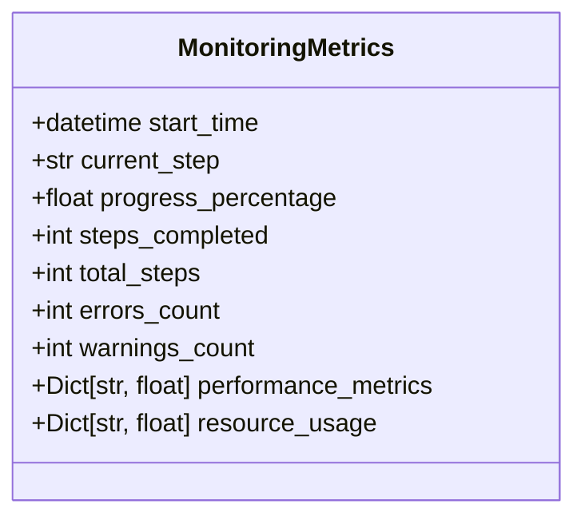
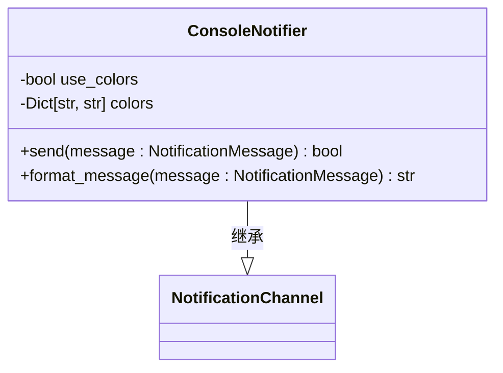
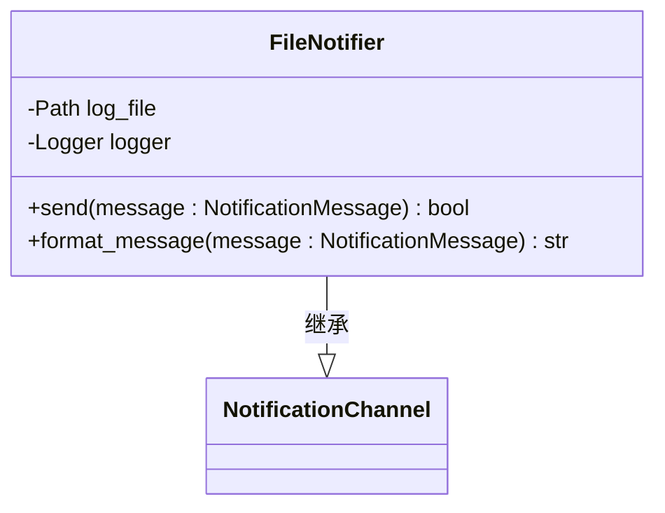
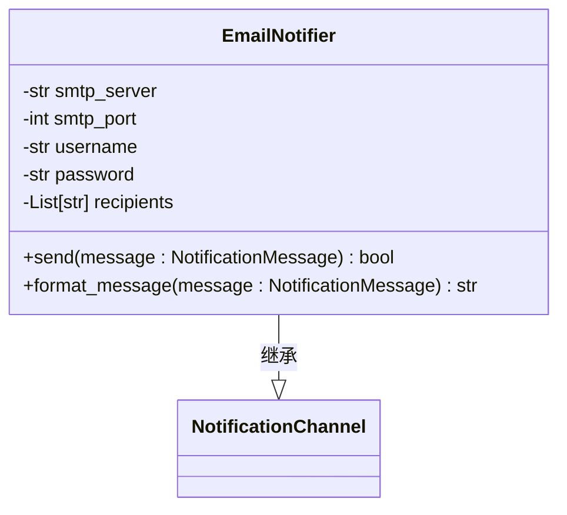
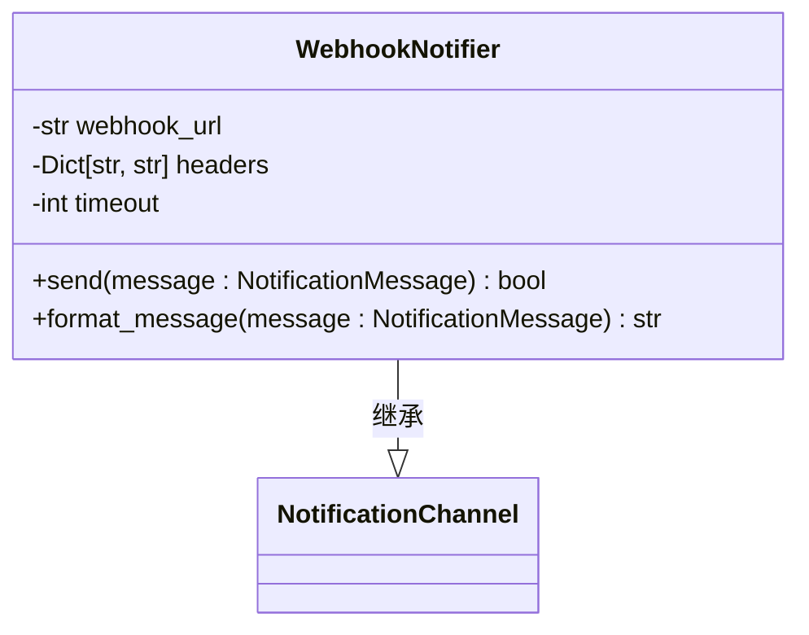
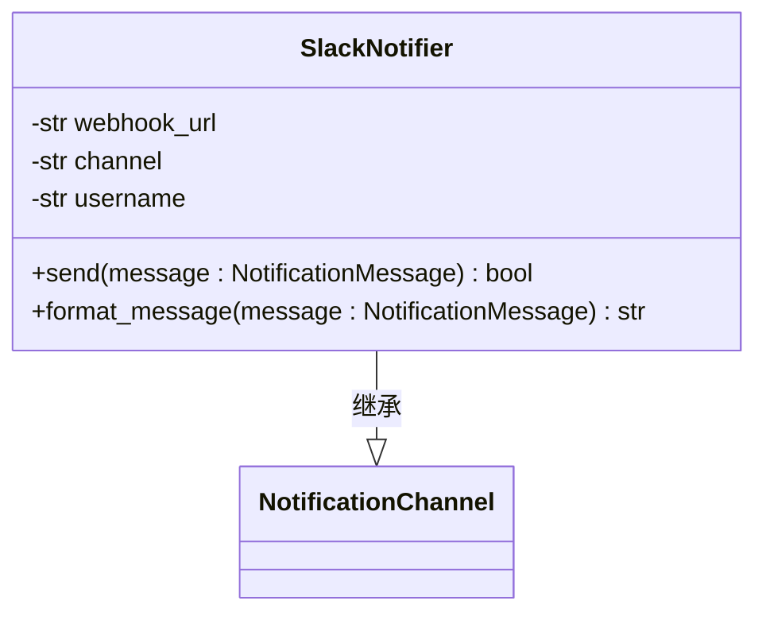
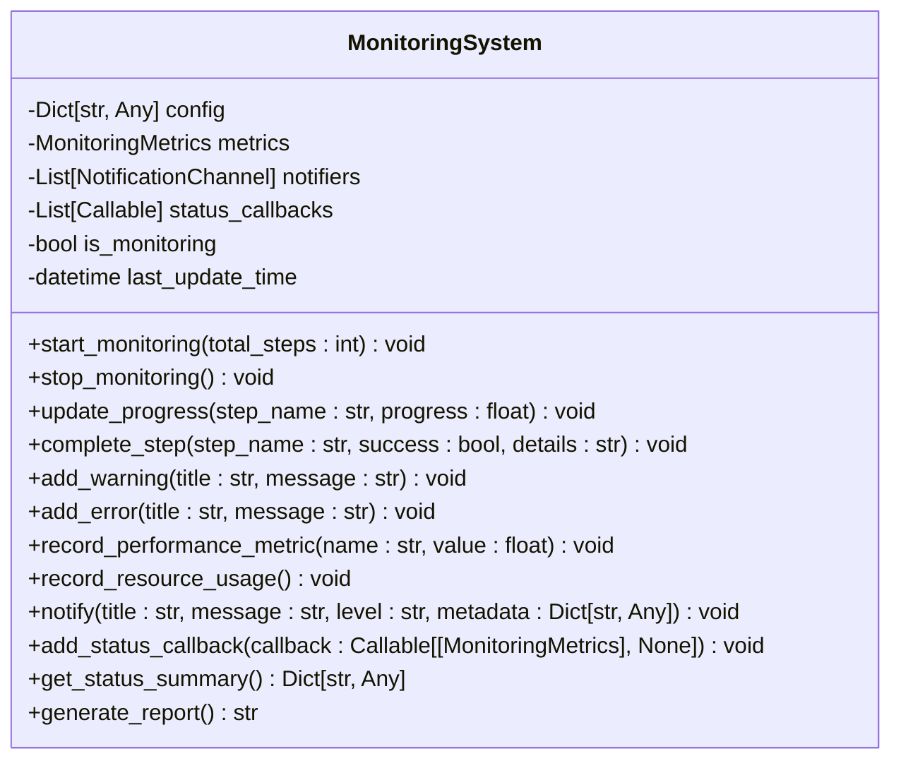
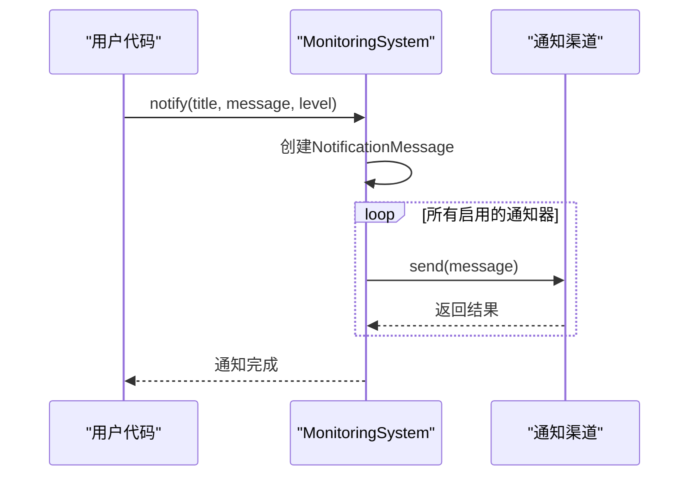
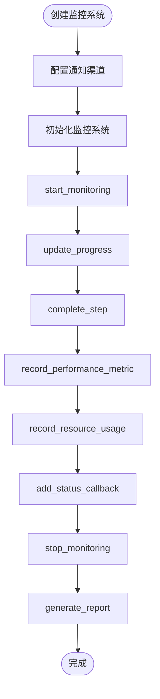

# 监控与告警

<cite>
**Referenced Files in This Document**   
- [monitoring_system.py](file://scripts/monitoring_system.py)
</cite>

## 目录
1. [简介](#简介)
2. [核心数据结构](#核心数据结构)
3. [通知渠道体系](#通知渠道体系)
4. [监控系统核心类](#监控系统核心类)
5. [通知分发机制](#通知分发机制)
6. [状态汇总与报告生成](#状态汇总与报告生成)
7. [使用示例](#使用示例)

## 简介

WaterNet智能通知和监控系统为自动化更新流程提供实时状态反馈和多渠道通知功能。该系统通过结构化的监控指标和灵活的通知机制，确保用户能够及时了解系统运行状态、进度信息和潜在问题。系统支持控制台输出、文件日志、邮件、Webhook和Slack等多种通知渠道，满足不同场景下的监控需求。

**Section sources**
- [monitoring_system.py](file://scripts/monitoring_system.py#L1-L50)

## 核心数据结构

### NotificationMessage 数据类

`NotificationMessage` 数据类用于封装通知消息的核心信息，确保消息格式的统一和可扩展性。该类包含标题、消息内容、消息级别、时间戳和元数据等关键属性。

**Section sources**
- [monitoring_system.py](file://scripts/monitoring_system.py#L29-L35)

### MonitoringMetrics 数据类

`MonitoringMetrics` 数据类用于存储监控过程中的各项关键指标，包括执行时间、进度百分比、步骤统计、错误和警告计数、性能指标以及资源使用情况。这些指标为系统状态的全面评估提供了数据基础。

**Diagram sources**
- [monitoring_system.py](file://scripts/monitoring_system.py#L39-L49)

## 通知渠道体系

### NotificationChannel 基类

`NotificationChannel` 是所有通知渠道的抽象基类，定义了统一的接口和基础功能。它提供了消息发送和格式化的核心方法，确保所有具体通知实现遵循一致的设计模式。

**Section sources**
- [monitoring_system.py](file://scripts/monitoring_system.py#L52-L74)

### 具体通知渠道实现

#### ConsoleNotifier (控制台通知器)

控制台通知器将消息输出到标准输出，支持ANSI颜色代码，使不同级别的消息以不同颜色显示，便于快速识别问题严重性。

**Diagram sources**
- [monitoring_system.py](file://scripts/monitoring_system.py#L77-L111)

#### FileNotifier (文件日志通知器)

文件日志通知器使用Python标准库的logging模块，将通知消息写入指定的日志文件。它支持UTF-8编码和标准日志格式，便于长期存储和后续分析。

**Diagram sources**
- [monitoring_system.py](file://scripts/monitoring_system.py#L114-L155)

#### EmailNotifier (邮件通知器)

邮件通知器通过SMTP协议发送电子邮件通知，支持HTML和纯文本格式。它需要配置SMTP服务器、认证信息和收件人列表，适用于需要远程通知的场景。

**Diagram sources**
- [monitoring_system.py](file://scripts/monitoring_system.py#L158-L198)

#### WebhookNotifier (Webhook通知器)

Webhook通知器通过HTTP POST请求将JSON格式的消息发送到指定的Webhook URL，便于与各种第三方服务（如CI/CD系统、监控平台）集成。

**Diagram sources**
- [monitoring_system.py](file://scripts/monitoring_system.py#L201-L239)

#### SlackNotifier (Slack通知器)

Slack通知器专门用于向Slack工作区发送消息，支持消息附件和颜色编码，能够创建美观且信息丰富的通知。

**Diagram sources**
- [monitoring_system.py](file://scripts/monitoring_system.py#L242-L284)

## 监控系统核心类

`MonitoringSystem` 是整个监控系统的中枢，负责协调各个组件的工作。它通过一系列方法实现对更新流程的实时监控。

**Diagram sources**
- [monitoring_system.py](file://scripts/monitoring_system.py#L287-L505)

### 核心监控方法

#### start_monitoring 方法

`start_monitoring` 方法初始化监控过程，创建 `MonitoringMetrics` 实例并记录开始时间。它还发送"监控开始"的通知，标志着监控会话的启动。

**Section sources**
- [monitoring_system.py](file://scripts/monitoring_system.py#L328-L337)

#### update_progress 方法

`update_progress` 方法用于更新当前执行步骤和进度百分比。它可以接受显式的进度值，或根据已完成步骤和总步骤数自动计算进度。

**Section sources**
- [monitoring_system.py](file://scripts/monitoring_system.py#L358-L377)

#### complete_step 方法

`complete_step` 方法标记一个步骤的完成状态，根据成功或失败更新相应的计数器，并发送相应的通知。这是监控流程中最重要的状态更新方法之一。

**Section sources**
- [monitoring_system.py](file://scripts/monitoring_system.py#L379-L398)

## 通知分发机制

系统的通知分发机制通过 `notify` 方法实现，采用发布-订阅模式将消息广播到所有启用的通知渠道。这种设计确保了通知的可靠性和可扩展性。

**Diagram sources**
- [monitoring_system.py](file://scripts/monitoring_system.py#L475-L491)

## 状态汇总与报告生成

### get_status_summary 方法

`get_status_summary` 方法收集当前监控状态的所有关键信息，返回一个包含执行状态、进度、性能指标和资源使用情况的字典。这个方法为外部系统提供了标准化的状态查询接口。

**Section sources**
- [monitoring_system.py](file://scripts/monitoring_system.py#L493-L505)

### generate_report 方法

`generate_report` 方法生成格式化的监控报告，以人类可读的方式呈现所有监控数据。报告包含执行时间、进度统计、问题统计、性能指标和资源使用情况等详细信息。

**Section sources**
- [monitoring_system.py](file://scripts/monitoring_system.py#L507-L567)

## 使用示例

以下代码展示了如何创建监控系统实例、添加状态回调，并生成详细的监控报告：

**Diagram sources**
- [monitoring_system.py](file://scripts/monitoring_system.py#L509-L567)