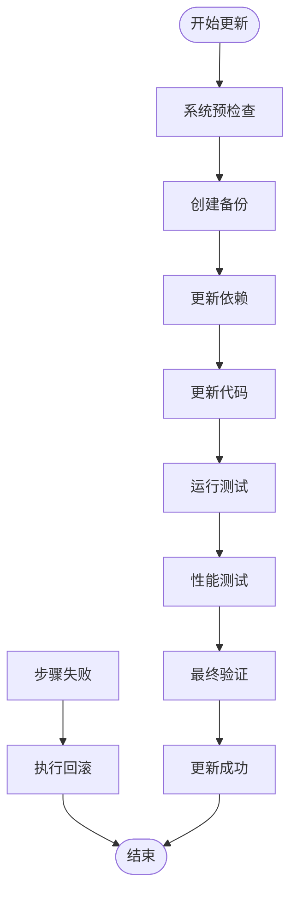
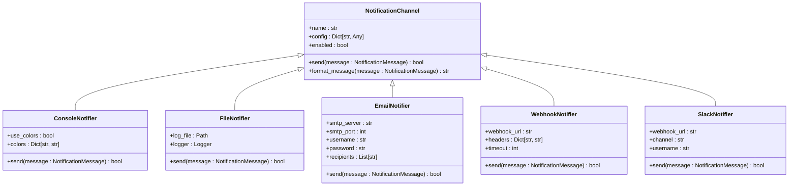
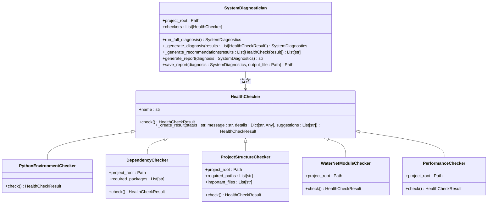
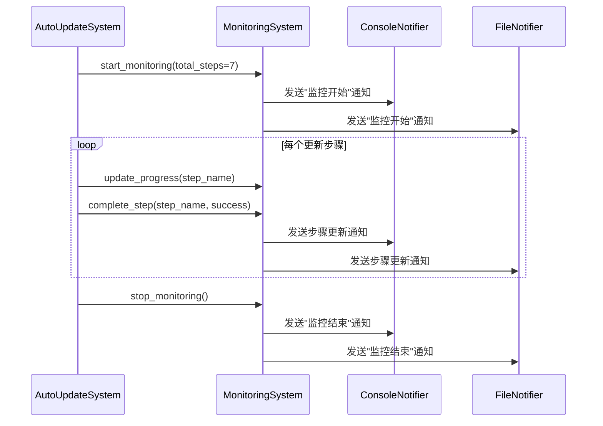

# 系统集成

<cite>
**本文档中引用的文件**  
- [auto_update_system.py](file://scripts/auto_update_system.py)
- [monitoring_system.py](file://scripts/monitoring_system.py)
- [health_checker.py](file://scripts/health_checker.py)
</cite>

## 目录
1. [引言](#引言)
2. [自动化更新机制](#自动化更新机制)
3. [系统监控方案](#系统监控方案)
4. [健康检查与诊断](#健康检查与诊断)
5. [CI/CD流水线集成](#cicd流水线集成)
6. [生产环境稳定性保障](#生产环境稳定性保障)
7. [总结](#总结)

## 引言
WaterNet系统提供了一套完整的自动化运维解决方案，涵盖自动化更新、实时监控和健康诊断三大核心功能。本文档深入解析`auto_update_system.py`所实现的生产级自动化更新机制，结合`monitoring_system.py`和`health_checker.py`，介绍完整的系统监控方案，确保WaterNet在生产环境中的稳定运行。

## 自动化更新机制

### 依赖管理
自动化更新系统实现了智能依赖管理功能，确保项目依赖的完整性和一致性。系统首先在可编辑模式下安装项目本身，然后升级核心依赖包（numpy、pandas、matplotlib、scipy），最后验证WaterNet模块的导入完整性。该机制通过配置参数控制是否强制重装和升级所有依赖，支持灵活的依赖管理策略。

**Section sources**
- [auto_update_system.py](file://scripts/auto_update_system.py#L450-L485)

### 代码同步
系统通过Git实现代码同步功能，支持自动拉取远程更新。在更新过程中，系统会检查当前分支状态，根据配置决定是否切换分支，并执行`git pull`操作获取最新代码。系统能够检测是否存在未提交的更改，并在配置允许的情况下发出警告，确保代码更新过程的可追溯性和安全性。

**Section sources**
- [auto_update_system.py](file://scripts/auto_update_system.py#L522-L565)

### 备份回滚
自动化更新系统实现了全面的备份与回滚机制。在更新前，系统会创建项目关键目录和文件的备份，并支持压缩存储以节省空间。当更新失败时，系统能够自动执行回滚操作，将项目恢复到更新前的状态。备份文件按时间戳命名，并保留指定数量的历史备份，防止磁盘空间被过度占用。

**Section sources**
- [auto_update_system.py](file://scripts/auto_update_system.py#L402-L448)

### 更新流程
系统采用分步执行的更新流程，确保每个环节的可验证性。完整更新流程包括系统预检查、创建备份、更新依赖、更新代码、运行测试、性能测试和最终验证七个步骤。每个步骤独立执行并记录结果，系统通过`_execute_step`方法统一处理步骤执行、时间记录和异常捕获，确保流程的健壮性。

**Diagram sources**
- [auto_update_system.py](file://scripts/auto_update_system.py#L213-L242)
- [auto_update_system.py](file://scripts/auto_update_system.py#L154-L211)

## 系统监控方案

### 性能指标采集
监控系统能够采集多种性能指标，包括步骤执行时间、资源使用情况和自定义性能度量。系统通过`record_performance_metric`方法记录关键性能数据，并通过`record_resource_usage`方法监控CPU、内存和磁盘使用率。这些指标被整合到监控报告中，为性能分析和优化提供数据支持。

**Section sources**
- [monitoring_system.py](file://scripts/monitoring_system.py#L435-L447)

### 健康状态检查
系统实现了全面的健康状态检查机制，通过`MonitoringSystem`类的`add_warning`和`add_error`方法记录系统状态。监控系统能够实时跟踪更新流程的进度，记录错误和警告数量，并在控制台、文件、邮件等多种渠道发送状态通知。这种多维度的状态监控确保了更新过程的透明性和可追溯性。

**Section sources**
- [monitoring_system.py](file://scripts/monitoring_system.py#L414-L433)

### 异常告警机制
监控系统支持多渠道异常告警，包括控制台、文件日志、电子邮件、Webhook和Slack。每种通知渠道都实现了统一的`NotificationChannel`接口，确保通知机制的可扩展性。当系统检测到错误或警告时，会通过所有启用的渠道发送告警信息，确保相关人员能够及时获知系统状态。

**Diagram sources**
- [monitoring_system.py](file://scripts/monitoring_system.py#L98-L285)

## 健康检查与诊断

### 系统诊断框架
健康检查系统采用模块化的诊断框架，通过`HealthChecker`基类定义统一的检查接口。系统实现了多个具体的检查器，包括Python环境检查器、依赖包检查器、项目结构检查器、WaterNet模块检查器和系统性能检查器。这种设计模式确保了诊断功能的可扩展性和可维护性。

**Diagram sources**
- [health_checker.py](file://scripts/health_checker.py#L52-L72)
- [health_checker.py](file://scripts/health_checker.py#L451-L490)

### 健康评分系统
系统诊断专家`SystemDiagnostician`实现了科学的健康评分机制。系统根据检查结果计算健康评分，其中健康检查项得100分，警告检查项得60分，错误检查项得0分。整体状态根据错误和警告数量确定，分为"critical"、"warning"和"healthy"三个级别。这种量化评估方法为系统健康状况提供了直观的衡量标准。

**Section sources**
- [health_checker.py](file://scripts/health_checker.py#L492-L522)

### 修复建议生成
健康检查系统不仅诊断问题，还提供具体的修复建议。系统通过`_generate_recommendations`方法收集所有检查器的建议，去重后按优先级排序。建议按类别分组，如"升级Python环境"、"安装依赖包"、"修复安装问题"等，确保用户能够快速定位和解决问题。生成的建议既包括具体命令，也包括一般性指导。

**Section sources**
- [health_checker.py](file://scripts/health_checker.py#L524-L557)

## CI/CD流水线集成

### 无人值守更新
自动化更新系统可无缝集成到CI/CD流水线中，实现无人值守的版本更新。通过配置生产环境配置（`UpdateConfig.production()`），系统执行最严格的验证流程，包括完整的测试套件、性能基准测试和最终验证。更新过程完全自动化，从代码拉取到部署验证，无需人工干预。

**Section sources**
- [auto_update_system.py](file://scripts/auto_update_system.py#L85-L104)

### 配置策略
系统提供多种预定义配置策略，包括最小化配置、安全配置、开发配置和生产配置。这些配置策略针对不同环境的需求，平衡了更新速度和安全性。在CI/CD环境中，可以根据部署阶段选择合适的配置策略，如在预发布环境使用开发配置，在生产环境使用生产配置。

**Section sources**
- [auto_update_system.py](file://scripts/auto_update_system.py#L55-L83)

### 报告生成
更新系统和监控系统都实现了详细的报告生成功能。自动化更新系统生成JSON格式的更新报告，包含每个步骤的执行状态、耗时和错误信息。健康检查系统生成文本格式的诊断报告，包含健康评分、详细结果和修复建议。这些报告可作为CI/CD流水线的输出，便于审计和问题追踪。

**Section sources**
- [auto_update_system.py](file://scripts/auto_update_system.py#L730-L761)
- [health_checker.py](file://scripts/health_checker.py#L559-L620)

## 生产环境稳定性保障

### 预检查机制
在更新开始前，系统执行全面的预检查，确保更新环境的适宜性。预检查包括Python版本验证（要求≥3.7）、项目结构完整性检查、Git状态检查和磁盘空间检查（要求≥1GB）。任何预检查失败都会中止更新过程，防止在不适宜的环境中执行更新操作。

**Section sources**
- [auto_update_system.py](file://scripts/auto_update_system.py#L244-L296)

### 多层验证
系统采用多层验证机制确保更新质量。在代码更新后，系统运行测试套件验证功能正确性，执行性能测试确保性能不退化，并进行最终验证确认项目结构完整性。测试通过率必须达到配置的最低阈值（默认80%），性能比率不能超过阈值（默认1.5倍），否则更新将被视为失败。

**Section sources**
- [auto_update_system.py](file://scripts/auto_update_system.py#L607-L645)

### 实时监控
监控系统提供实时的更新进度监控，通过`update_progress`和`complete_step`方法跟踪每个步骤的执行情况。系统能够计算完成进度百分比，记录当前步骤，并在控制台实时显示进度。这种实时监控使运维人员能够及时了解更新状态，快速响应异常情况。

**Diagram sources**
- [monitoring_system.py](file://scripts/monitoring_system.py#L327-L336)
- [monitoring_system.py](file://scripts/monitoring_system.py#L350-L369)
- [monitoring_system.py](file://scripts/monitoring_system.py#L371-L390)

## 总结
WaterNet的自动化运维系统通过`auto_update_system.py`、`monitoring_system.py`和`health_checker.py`三个核心组件，构建了一个完整的生产级更新和监控解决方案。系统实现了智能依赖管理、安全的代码同步、可靠的备份回滚、全面的测试验证和实时的监控告警，确保了在生产环境中的稳定运行。通过与CI/CD流水线的集成，该系统能够实现无人值守的版本更新，大大提高了运维效率和系统可靠性。