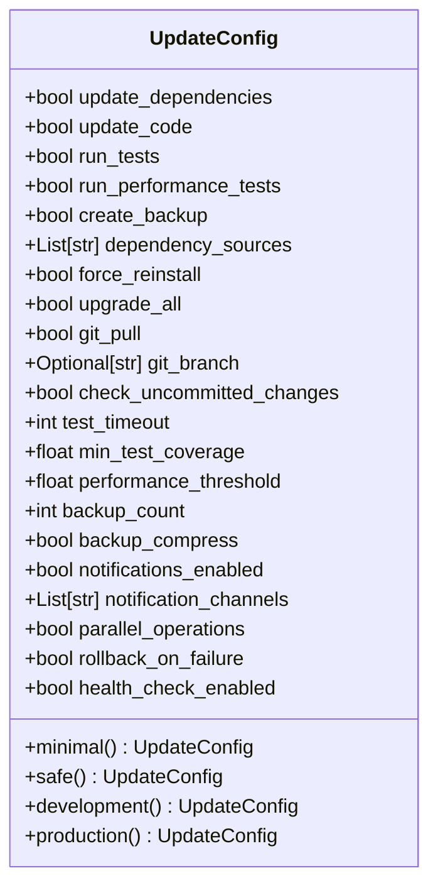
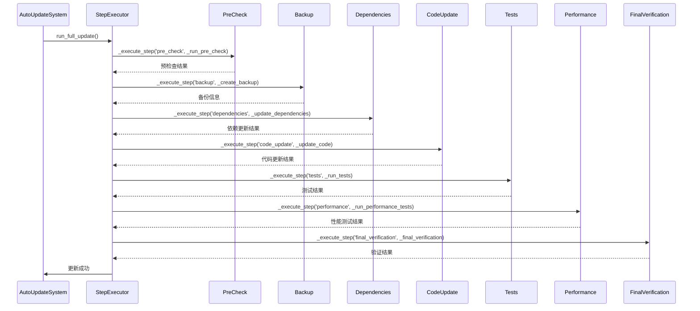
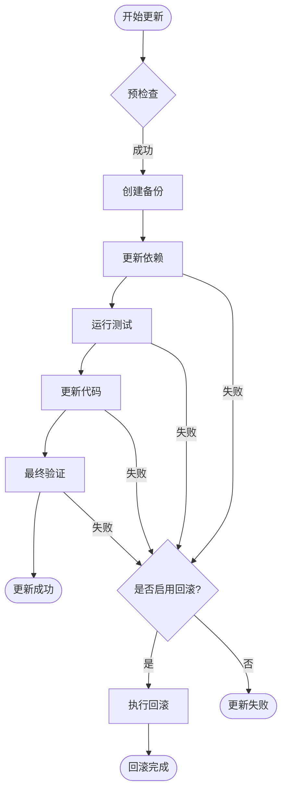
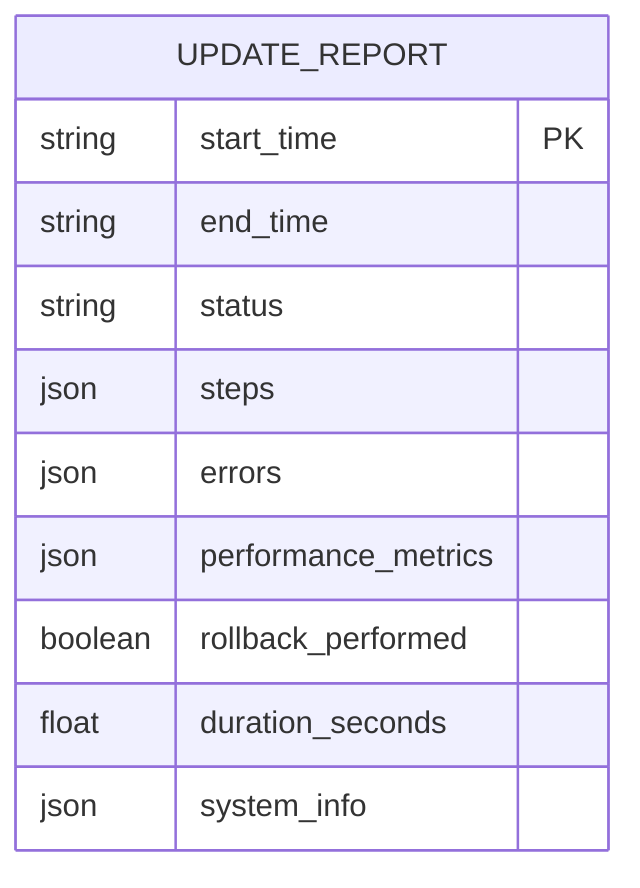

# 自动化更新

<cite>
**Referenced Files in This Document**   
- [auto_update_system.py](file://scripts/auto_update_system.py)
- [quick_update.py](file://scripts/quick_update.py)
- [update_report_20251004_173135.json](file://reports/update_report_20251004_173135.json)
- [COMPLETE_AUTO_UPDATE_SYSTEM.md](file://COMPLETE_AUTO_UPDATE_SYSTEM.md)
</cite>

## 目录
1. [简介](#简介)
2. [核心组件](#核心组件)
3. [配置类详解](#配置类详解)
4. [核心更新流程](#核心更新流程)
5. [错误处理与回滚机制](#错误处理与回滚机制)
6. [编程调用示例](#编程调用示例)
7. [更新报告解析](#更新报告解析)

## 简介
WaterNet自动化更新系统是一个生产级的全方位解决方案，旨在确保代码库的可靠、安全和高效更新。该系统集成了智能依赖管理、代码同步、全面测试验证、性能基准测试、智能备份与回滚等关键功能。通过模块化设计和严格的预检查机制，系统能够在更新失败时自动执行回滚，最大限度地减少对生产环境的影响。本文档将深入解析该系统的架构、配置、执行流程和错误处理机制。

**Section sources**
- [auto_update_system.py](file://scripts/auto_update_system.py#L1-L50)
- [COMPLETE_AUTO_UPDATE_SYSTEM.md](file://COMPLETE_AUTO_UPDATE_SYSTEM.md#L1-L50)

## 核心组件
自动化更新系统由两个核心组件构成：`UpdateConfig`配置类和`AutoUpdateSystem`核心类。`UpdateConfig`类定义了更新过程中的所有可配置参数，允许用户根据不同的环境需求（如开发、生产）定制更新策略。`AutoUpdateSystem`类则封装了完整的更新流程，包括预检查、备份创建、依赖更新、代码拉取、测试执行、性能测试和最终验证等步骤。这两个组件协同工作，确保更新过程既灵活又可靠。

**Section sources**
- [auto_update_system.py](file://scripts/auto_update_system.py#L30-L103)
- [auto_update_system.py](file://scripts/auto_update_system.py#L106-L150)

## 配置类详解
`UpdateConfig`类是自动化更新系统的配置中心，它通过一系列字段定义了更新过程的行为。这些字段涵盖了基础配置、依赖管理、代码管理、测试配置、备份配置、通知配置和高级选项等多个方面。

### 基础配置
基础配置字段控制更新流程的主要开关：
- `update_dependencies`: 是否更新项目依赖
- `update_code`: 是否更新代码
- `run_tests`: 是否运行测试
- `run_performance_tests`: 是否运行性能测试
- `create_backup`: 是否创建备份

### 依赖管理
依赖管理字段确保依赖更新的灵活性和可靠性：
- `dependency_sources`: 指定依赖源（如pip、conda）
- `force_reinstall`: 是否强制重新安装
- `upgrade_all`: 是否升级所有包

### 测试与备份配置
测试和备份配置保障更新的安全性：
- `test_timeout`: 测试超时时间
- `min_test_coverage`: 最低测试覆盖率
- `performance_threshold`: 性能阈值倍数
- `backup_count`: 保留的备份数量
- `backup_compress`: 是否压缩备份

### 预设配置
`UpdateConfig`提供了四个预设配置类方法，适用于不同场景：
- `minimal()`: 最小化配置，仅更新依赖
- `safe()`: 安全配置，包含备份和测试
- `development()`: 开发配置，快速迭代
- `production()`: 生产配置，最严格验证



**Diagram sources**
- [auto_update_system.py](file://scripts/auto_update_system.py#L30-L103)

**Section sources**
- [auto_update_system.py](file://scripts/auto_update_system.py#L30-L103)

## 核心更新流程
`AutoUpdateSystem`类的`run_full_update`方法定义了完整的更新流程。该流程是一个有序的步骤序列，每个步骤都通过`_execute_step`方法执行，确保了错误的捕获和报告。

### 更新流程步骤
1. **系统预检查** (`_run_pre_check`): 检查Python环境、项目结构、Git状态和磁盘空间。
2. **创建备份** (`_create_backup`): 创建项目备份，包括关键目录和文件。
3. **更新依赖** (`_update_dependencies`): 更新项目依赖，确保在可编辑模式下安装。
4. **更新代码** (`_update_code`): 通过Git拉取最新代码。
5. **运行测试** (`_run_tests`): 执行测试套件，验证功能完整性。
6. **性能测试** (`_run_performance_tests`): 运行性能基准测试，确保性能达标。
7. **最终验证** (`_final_verification`): 验证项目结构和模块导入。



**Diagram sources**
- [auto_update_system.py](file://scripts/auto_update_system.py#L154-L211)

**Section sources**
- [auto_update_system.py](file://scripts/auto_update_system.py#L154-L211)

## 错误处理与回滚机制
系统具备强大的错误处理和回滚能力，确保更新过程的可靠性。

### 错误处理
`_execute_step`方法是错误处理的核心。它捕获每个步骤的异常，记录错误信息，并将步骤状态标记为失败。这确保了即使某个步骤失败，系统也能继续执行后续的清理和报告工作。

### 回滚策略
`_execute_rollback`方法实现了智能回滚策略。当更新失败且配置了`rollback_on_failure`时，系统会：
1. 检查备份是否存在
2. 如果备份是压缩的，先解压
3. 恢复关键目录（如`waternet`和`examples`）
4. 记录回滚操作

回滚过程确保了系统能够快速恢复到更新前的稳定状态。



**Diagram sources**
- [auto_update_system.py](file://scripts/auto_update_system.py#L213-L242)
- [auto_update_system.py](file://scripts/auto_update_system.py#L728-L764)

**Section sources**
- [auto_update_system.py](file://scripts/auto_update_system.py#L213-L242)
- [auto_update_system.py](file://scripts/auto_update_system.py#L728-L764)

## 编程调用示例
可以通过编程方式调用自动化更新系统。以下是一个使用`QuickUpdateLauncher`的示例：

```python
from scripts.quick_update import QuickUpdateLauncher

# 创建启动器
launcher = QuickUpdateLauncher()

# 使用安全配置运行更新
result = launcher.run_update('safe')

# 仅更新依赖
result = launcher.run_deps_only_update()

# 仅运行测试
result = launcher.run_test_only()

# 回滚到最新备份
result = launcher.rollback_to_latest()
```

此外，也可以直接使用`AutoUpdateSystem`类进行更精细的控制。

**Section sources**
- [quick_update.py](file://scripts/quick_update.py#L1-L286)

## 更新报告解析
系统生成的JSON格式更新报告包含了更新过程的完整审计信息。报告结构包括：
- `start_time` 和 `end_time`: 更新的开始和结束时间
- `status`: 更新状态（成功或失败）
- `steps`: 各步骤的执行情况和耗时
- `errors`: 错误信息列表
- `performance_metrics`: 性能指标
- `rollback_performed`: 是否执行了回滚
- `duration_seconds`: 总耗时
- `system_info`: 系统信息

通过分析报告，可以深入了解更新过程的详细情况，识别潜在问题，并进行持续改进。



**Diagram sources**
- [update_report_20251004_173135.json](file://reports/update_report_20251004_173135.json#L1-L105)

**Section sources**
- [update_report_20251004_173135.json](file://reports/update_report_20251004_173135.json#L1-L105)