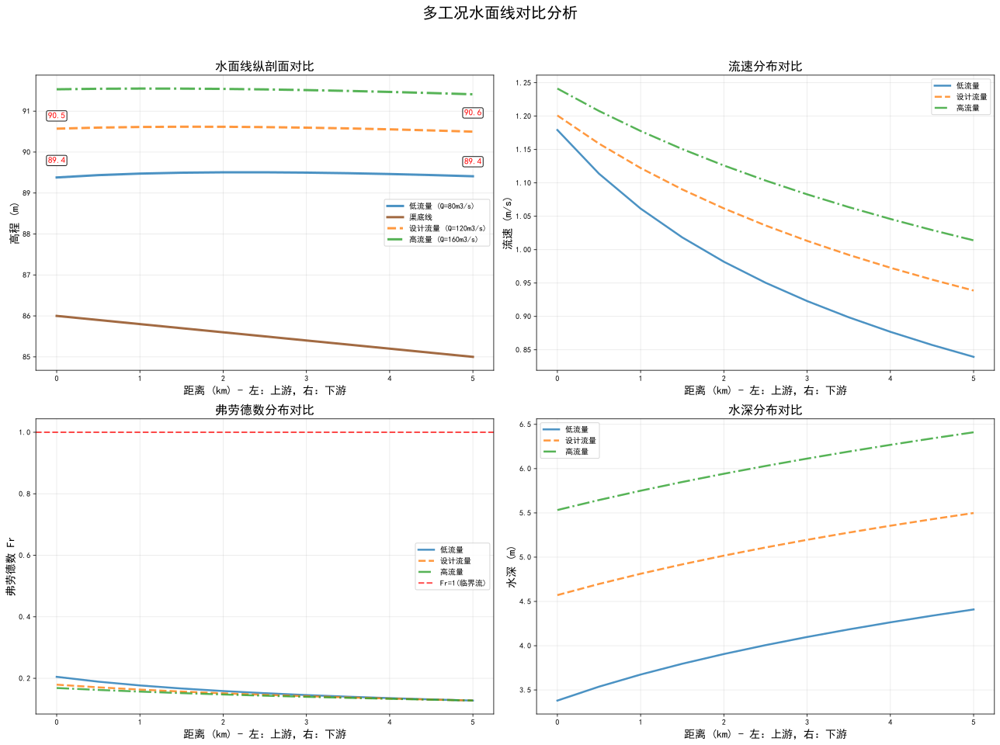

# 渠道水面线分析报告

生成时间: 2025-10-07 16:20:40
渠道配置: demo_channel_流量对比
渠道长度: 5000m
计算工况数量: 3个

## 水面线纵剖面对比图 📊

**恒定流水面线可视化结果**：

*图表说明：*
- 左上图：各工况水面线纵剖面对比，包含渠底高程线
- 右上图：流速分布对比分析
- 左下图：弗劳德数分布对比分析
- 右下图：水深分布对比分析
- 水位数字标注：红色数字显示关键断面水位（单位：m）
- 流态分析：Fr<1为亚临界流，Fr≥1为临界或超临界流

## 各工况结果汇总

| 工况 | 流量(m3/s) | 最大水深(m) | 最大流速(m/s) | 最大Fr数 | 水头损失(m) | 流态 |
| --- | --- | --- | --- | --- | --- | --- |
| 低流量 | 80.0 | 4.41 | 1.18 | 0.205 | 0.03 | subcritical |
| 设计流量 | 120.0 | 5.50 | 1.20 | 0.179 | -0.07 | subcritical |
| 高流量 | 160.0 | 6.41 | 1.24 | 0.168 | -0.12 | subcritical |

## 水力学特性分析

### 流态特征
✅ **全部工况均为亚临界流**：流动稳定，水面平缓

### 参数敏感性
- 流量变化范围: 80.0 - 160.0 m3/s
- 水头损失变化范围: -0.12 - 0.03 m
- 敏感性系数: 0.002 m/(m3/s)
- **结论**: 流量每增加1 m3/s，水头损失约增加0.002 m

## 工程建议

### 设计参考
✅ **推荐设计流量**: 当前最大流量工况下流态良好，可作为设计流量

### 计算方法
- **水面线计算**: 基于曼宁公式和逐步推算法
- **弗劳德数**: Fr = V/√(gD)，其中V为流速，D为水深
- **流态判断**: Fr<1亚临界流，Fr=1临界流，Fr>1超临界流